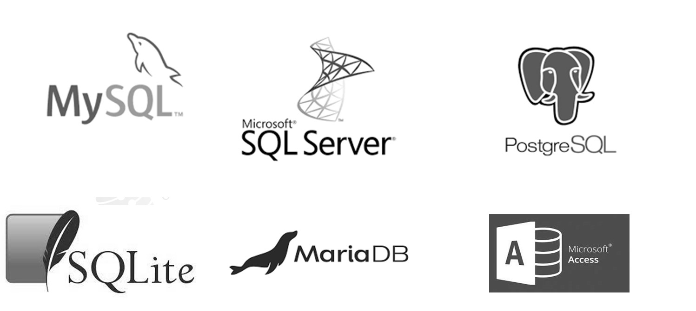
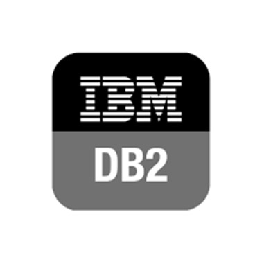
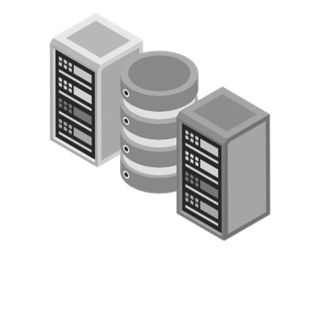
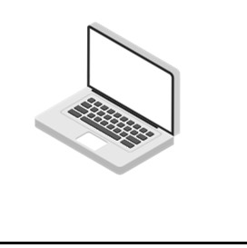
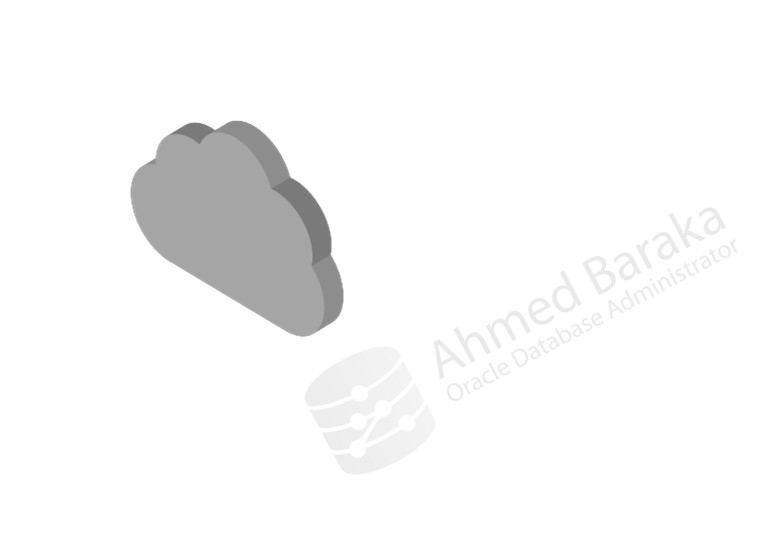
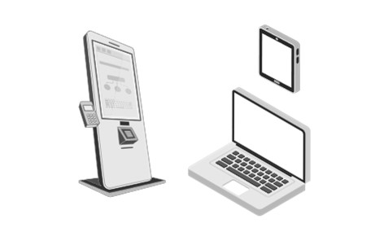
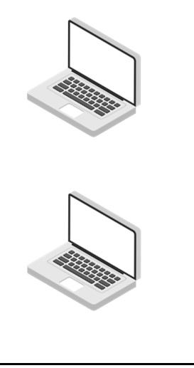

# Bài 01: Tổng quan về Hệ quản trị Cơ sở dữ liệu Quan hệ (RDBMS)

Chào mừng bạn đến với bài học đầu tiên trong khóa học **Oracle Database Administration từ Zero đến Hero**. Bài học này sẽ đặt nền móng kiến thức cơ bản nhất về cơ sở dữ liệu quan hệ, giúp bạn hiểu rõ hệ thống mà chúng ta sẽ làm việc và quản trị trong suốt khóa học.

---

## 🎯 Mục tiêu bài học
Sau khi hoàn thành bài này, bạn sẽ có thể:
1. Hiểu được khái niệm RDBMS là gì và tại sao chúng ta lại cần nó.
2. Nắm bắt được các tính năng cốt lõi của một hệ thống RDBMS.
3. Phân biệt được các loại câu lệnh SQL cơ bản.
4. Hiểu rõ về kiến trúc Client-Server (2-tier, 3-tier).
5. Phân biệt được các loại ứng dụng (OLTP vs Data Warehouse/DSS).

---

## 1. RDBMS là gì? (Relational Database Management System)

**RDBMS** viết tắt của *Relational Database Management System* (Hệ quản trị cơ sở dữ liệu quan hệ). Đây là một phần mềm cho phép bạn tạo, quản lý, cập nhật và quản trị một cơ sở dữ liệu quan hệ (dữ liệu được lưu trữ dưới dạng các bảng có liên kết với nhau).

### 💡 So sánh RDBMS với File Excel và File Text (Ví von đời thường)
Đối với người mới bắt đầu, bạn có thể thắc mắc: *"Tại sao không lưu dữ liệu vào Excel hay file Text cho đơn giản?"*

Hãy tưởng tượng bạn đang mở một cửa hàng tạp hóa:
- **File Text (.txt, .csv):** Giống như một cuốn sổ ghi chép nháp. Bạn ghi mọi thứ vào đó không theo hàng lối nhất định. Việc tìm kiếm một giao dịch cũ sẽ giống như mò kim đáy biển. Rất khó để chia sẻ cho nhiều nhân viên cùng đọc và ghi cùng lúc mà không làm hỏng file.
- **File Excel (.xlsx):** Giống như một cuốn sổ cái có kẻ ô lưới rõ ràng (hàng và cột). Nó rất tốt cho tính toán cá nhân hoặc lưu trữ quy mô nhỏ. Tuy nhiên, nếu bạn có 1 triệu mặt hàng và hàng ngàn khách hàng truy cập mua hàng cùng lúc, Excel sẽ bị "treo" hoặc báo lỗi file đang bị khóa bởi người khác. Hơn nữa, Excel khó kiểm soát việc nhân viên A vô tình xóa mất dữ liệu của nhân viên B.
- **RDBMS (Oracle, MySQL):** Giống như một **trung tâm lưu trữ hiện đại với người thủ thư cực kỳ thông minh**. Người thủ thư này (RDBMS) không chỉ sắp xếp hàng hóa (dữ liệu) vào các ngăn tủ (bảng) gọn gàng, mà còn có khả năng xử lý hàng ngàn yêu cầu tìm kiếm, lấy hàng, thêm hàng của hàng ngàn nhân viên cùng lúc chỉ trong chớp mắt mà không bao giờ nhầm lẫn hay thất thoát.


---

## 2. Các đặc điểm quan trọng của RDBMS

Một RDBMS không chỉ là nơi chứa dữ liệu, nó cung cấp một loạt các tính năng mạnh mẽ:

1. **Lưu trữ có cấu trúc (Storing structured data):** Dữ liệu được lưu gọn gàng vào các bảng (Table) gồm cột (Column) và hàng (Row).
2. **Sử dụng ngôn ngữ SQL (Supports SQL):** Cung cấp công cụ chuẩn hóa để truy vấn và thao tác dữ liệu.
3. **Quan hệ giữa các bảng (Table relationships):** Dữ liệu không bị lặp lại vô ích. Ví dụ: Bảng `Khách_hàng` liên kết với bảng `Đơn_hàng` thông qua Mã Khách Hàng.
4. **Hỗ trợ đa người dùng (Multiple users):** Hàng ngàn, thậm chí hàng triệu người dùng có thể kết nối và sử dụng hệ thống cùng lúc.
5. **Giao dịch đồng thời (Concurrent transactions):** Đảm bảo nhiều hành động xảy ra cùng lúc không phá hỏng dữ liệu của nhau.
6. **Toàn vẹn dữ liệu (Data integrity):** Đảm bảo dữ liệu luôn hợp lệ (ví dụ: tuổi phải lớn hơn 0, mã nhân viên không được trùng lặp).
7. **Cơ chế khóa (Locking mechanisms):** Khi bạn đang cập nhật thông tin một tài khoản ngân hàng, hệ thống sẽ "khóa" dòng dữ liệu đó lại để người khác không thể sửa cho đến khi bạn làm xong, tránh mất tiền oan.
8. **Bảo mật dữ liệu (Data Security):** Cấp quyền chi tiết (ai được xem, ai được sửa, ai được xóa).

> ⚠️ **Tầm quan trọng đối với DBA:** Là một Quản trị viên cơ sở dữ liệu (DBA), nhiệm vụ hàng ngày của bạn chính là bảo vệ sự toàn vẹn, hiệu suất và bảo mật của các hệ thống này. Nếu cơ chế khóa hoạt động không tốt hoặc dữ liệu bị mất tính toàn vẹn, hệ thống của công ty sẽ sụp đổ.



---

## 3. Tổng quan về SQL (Structured Query Language)

SQL là ngôn ngữ giao tiếp chuẩn với cơ sở dữ liệu. Giống như bạn dùng tiếng Việt để nói chuyện với người Việt, bạn dùng SQL để ra lệnh cho RDBMS.

SQL được chia thành 3 nhóm chính:

*   **Truy vấn (Query):** 
    *   `SELECT`: Dùng để đọc và lấy dữ liệu ra xem (Không làm thay đổi dữ liệu gốc).
*   **DML (Data Manipulation Language - Ngôn ngữ thao tác dữ liệu):** Dùng để thay đổi nội dung dữ liệu bên trong các bảng.
    *   `INSERT`: Thêm dữ liệu mới.
    *   `UPDATE`: Sửa dữ liệu đã có.
    *   `DELETE`: Xóa dữ liệu.
    *   `MERGE`: Kết hợp giữa INSERT và UPDATE.
*   **DDL (Data Definition Language - Ngôn ngữ định nghĩa dữ liệu):** Dùng để tạo ra hoặc cấu trúc lại các thành phần của cơ sở dữ liệu (tạo bảng, tạo view...).
    *   `CREATE`: Tạo đối tượng mới.
    *   `ALTER`: Sửa đổi cấu trúc đối tượng.
    *   `DROP`: Xóa bỏ hoàn toàn một đối tượng.

**Các giao diện kết nối phổ biến vào Oracle Database:**
- SQL*Plus (Giao diện dòng lệnh - CLI)
- SQL Developer (Giao diện đồ họa - GUI)
- ODBC, JDBC (Kết nối cho ứng dụng)
- Programming Language APIs



---

## 4. Các hệ quản trị CSDL phổ biến (Known RDBMS Products)

Thị trường có rất nhiều RDBMS khác nhau, phục vụ cho các quy mô từ nhỏ đến siêu lớn:
- **Oracle Database:** RDBMS hàng đầu thế giới dành cho doanh nghiệp lớn (Enterprise), mạnh mẽ, bảo mật cao và chi phí cũng cao. Đích đến của khóa học này!
- **Microsoft SQL Server:** Phổ biến trong hệ sinh thái Windows.
- **MySQL & PostgreSQL:** Hệ quản trị CSDL mã nguồn mở miễn phí, rất phổ biến cho các ứng dụng web và startup.



---

## 5. Kiến trúc Client-Server

Hệ thống cơ sở dữ liệu thường hoạt động theo mô hình Máy khách - Máy chủ. 

### Kiến trúc 2-Tier (2 lớp)
Trong kiến trúc này, ứng dụng (chạy trên máy người dùng/Client) kết nối **trực tiếp** vào Database Server qua mạng LAN/WAN.
- **Tầng Client (Presentation):** Giao diện người dùng.
- **Tầng Database (Data - back end):** Lưu trữ dữ liệu.
*(Kiến trúc này thường dùng cho các ứng dụng nội bộ nhỏ, ví dụ phần mềm kế toán cài trên máy tính kết nối thẳng vào server nội bộ).*



### Kiến trúc 3-Tier / n-Tier (3 lớp / n lớp)
Đây là tiêu chuẩn của các ứng dụng Web hiện đại. Client KHÔNG kết nối thẳng vào Database.
- **Tầng Client (Presentation):** Trình duyệt web hoặc app mobile.
- **Tầng Application Server (Business Logic):** Máy chủ ứng dụng (Web Server) xử lý logic nghiệp vụ, nằm ở giữa.
- **Tầng Database (Data - back end):** Máy chủ cơ sở dữ liệu nằm an toàn đằng sau Application Server.
*(Cách này giúp bảo mật tốt hơn, dễ mở rộng và quản lý lượng kết nối lớn).*



---

## 6. Phân loại ứng dụng: OLTP và DSS (Data Warehouse)

RDBMS có thể được thiết kế để phục vụ hai mục đích hoàn toàn khác biệt. Là một DBA, việc hiểu rõ hệ thống đang phục vụ cho loại ứng dụng nào quyết định cách bạn cấu hình và tối ưu hóa Oracle Database.

1. **OLTP (Online Transaction Processing):** Hệ thống xử lý giao dịch trực tuyến.
   - Thường xuyên thêm, sửa, đọc các mẩu dữ liệu nhỏ một cách cực nhanh.
   - *Ví dụ:* Cây ATM rút tiền, hệ thống bán hàng siêu thị, đặt vé máy bay.
2. **DSS (Decision Support Systems) / Data Warehouse / OLAP:** Hệ thống hỗ trợ ra quyết định.
   - Thường dùng để đọc lượng dữ liệu khổng lồ (vài triệu dòng) để làm báo cáo thống kê, không mấy khi sửa dữ liệu.
   - *Ví dụ:* Hệ thống phân tích doanh thu cuối năm của công ty (Business Intelligence - BI).
3. **Hybrid:** Kết hợp cả hai loại trên.

### Bảng so sánh chi tiết: OLTP vs Data Warehouse

| Đặc điểm (Characteristics) | OLTP (Hệ thống giao dịch) | Data Warehouse (Kho dữ liệu) |
| :--- | :--- | :--- |
| **Mục đích truy vấn** | Các thao tác được định nghĩa sẵn (Predefined operations) | Truy vấn linh hoạt, phân tích sâu (Ad hoc queries) |
| **Thay đổi dữ liệu** | Xảy ra liên tục qua các lệnh DML (INSERT, UPDATE) | Chủ yếu nạp dữ liệu định kỳ bằng công cụ ETL (Extract, Transform, Load) |
| **Thiết kế cấu trúc** | Chuẩn hóa cao (Normalized) để tránh trùng lặp | Khử chuẩn hóa (Denormalized) để đọc báo cáo nhanh hơn |
| **Khối lượng dữ liệu truy xuất** | Chỉ vài chục dòng (A dozen of rows) - *ví dụ: xem thông tin 1 đơn hàng* | Hàng ngàn hoặc hàng triệu dòng - *ví dụ: tổng kết doanh thu năm* |
| **Thời gian lưu trữ dữ liệu** | Vài tuần hoặc vài tháng (Dữ liệu cũ thường được archive) | Nhiều năm (Phục vụ so sánh lịch sử) |
| **Mức độ đồng thời (Concurrency)**| Rất cao (Hàng ngàn người mua hàng cùng lúc) | Thấp (Chỉ có vài nhà phân tích hoặc giám đốc chạy báo cáo) |



---

## 7. Oracle Database có phải là NoSQL không?

> 💡 **Oracle Database KHÔNG PHẢI là cơ sở dữ liệu NoSQL.** 
Nó là một hệ quản trị cơ sở dữ liệu quan hệ (RDBMS) truyền thống, sử dụng ngôn ngữ SQL. 

Tuy nhiên, do nhu cầu của thị trường về lưu trữ dữ liệu phi cấu trúc và Big Data tăng cao, hãng Oracle có phát triển một sản phẩm **riêng biệt** mang tên **"Oracle NoSQL Database"**. Hãy nhớ phân biệt rõ hai sản phẩm này nhé!



---

## 📝 Tóm tắt bài học

Qua bài học này, bạn đã nắm được:
- **RDBMS** là hệ thống mạnh mẽ lưu trữ dữ liệu dạng bảng có cấu trúc và quan hệ, vượt trội hoàn toàn so với việc lưu trữ bằng file tĩnh như Excel.
- RDBMS đảm bảo **tính toàn vẹn**, **an toàn đồng thời** cho hàng ngàn người dùng thông qua cơ chế khóa và giao dịch.
- **SQL** là ngôn ngữ chính, được chia làm các nhóm: Query (SELECT), DML (thao tác dữ liệu) và DDL (cấu trúc dữ liệu).
- Hiểu được sự khác biệt giữa mô hình mạng **2-tier** và **3-tier**.
- Biết cách phân biệt hệ thống giao dịch **OLTP** (nhanh, nhỏ, đồng thời cao) và **Data Warehouse** (chậm, lớn, phân tích).

## ❓ Câu hỏi ôn tập

**1. Sự khác biệt lớn nhất giữa RDBMS và một bảng tính Excel là gì?**
> **Trả lời:**
> - **Khả năng đồng thời và Khóa (Concurrency & Locking):** RDBMS cho phép hàng nghìn người dùng đọc/ghi đồng thời mà không xung đột hay mất mát dữ liệu nhờ cơ chế transaction và lock. Excel chỉ tối ưu cho ít người dùng cục bộ.
> - **Tính toàn vẹn dữ liệu (Data Integrity):** RDBMS ép buộc các ràng buộc toàn vẹn chặt chẽ (Primary Key, Foreign Key, Check, Unique). Excel cho phép gõ bất kỳ kiểu dữ liệu nào vào ô.
> - **Quy mô và Hiệu năng:** RDBMS quản lý hàng triệu đến hàng tỷ bản ghi với index tối ưu, trong khi Excel bị giới hạn số dòng (1,048,576 dòng) và chậm khi dữ liệu lớn.
> - **Bảo mật và Phân quyền:** RDBMS cung cấp hệ thống phân quyền chi tiết tới từng bảng, cột, dòng; có audit log đầy đủ.

**2. Nếu bạn cần thêm một cột mới vào bảng, bạn sẽ dùng lệnh thuộc nhóm nào (DML, DDL hay SELECT)?**
> **Trả lời:**
> Bạn dùng nhóm lệnh **DDL (Data Definition Language)**, cụ thể là lệnh:
> ```sql
> ALTER TABLE <ten_bang> ADD (<ten_cot> <kieu_du_lieu>);
> ```
> Vì lệnh này thay đổi cấu trúc/metadata của database, không phải thao tác trên dữ liệu (DML).

**3. Hệ thống đặt vé xem phim của CGV thuộc loại ứng dụng OLTP hay Data Warehouse? Tại sao?**
> **Trả lời:**
> Đây là ứng dụng **OLTP (Online Transaction Processing)** vì:
> - Phục vụ người dùng cuối đặt chỗ theo thời gian thực (real-time).
> - Mỗi giao dịch thao tác trên lượng dữ liệu rất nhỏ (chọn ghế, thanh toán, xuất vé), diễn ra trong vài mili-giây.
> - Yêu cầu tính toàn vẹn cao, tránh trùng ghế (concurrency, locking).
> - Tỉ lệ câu lệnh INSERT, UPDATE (cập nhật trạng thái vé/ghế) diễn ra liên tục, tần suất cao.

**4. Trong mô hình 3-tier, người dùng có thể trực tiếp kết nối và chạy lệnh SQL trên Database Server không?**
> **Trả lời:**
> **Không.** Trong mô hình 3-tier (Client - Application Server - Database Server), Client (trình duyệt, mobile app) chỉ giao tiếp với Application Server qua HTTP/REST/API. Application Server mới là nơi giữ kết nối (Connection Pool) và gửi lệnh SQL đến Database Server. Điều này giúp giấu Database khỏi mạng công cộng, tăng tính bảo mật và kiểm soát truy cập tập trung.

---

*Chúc mừng bạn đã hoàn thành bài học đầu tiên! Hẹn gặp lại bạn ở các bài học thực hành tiếp theo.*


---

!!! info "Nguồn gốc"
    `Oracle-Database-Administration-from-Zero-to-Hero/VN/01-tong-quan-ve-rdbms.md`
