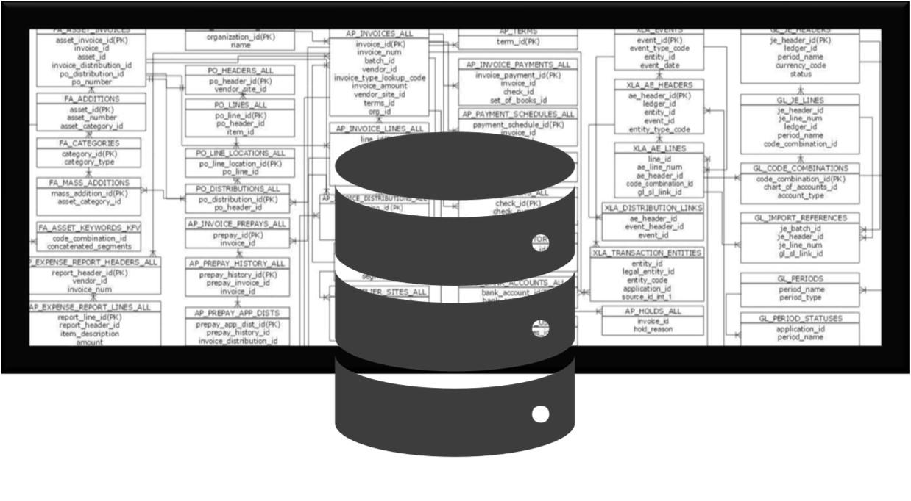
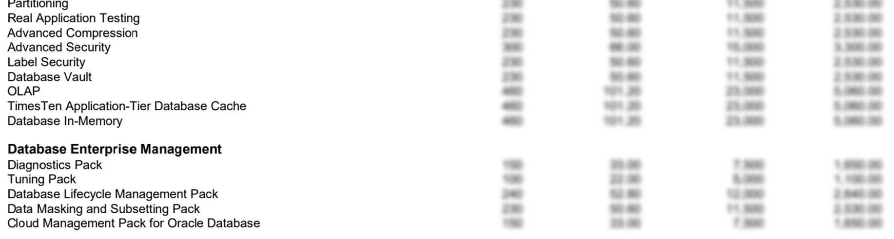
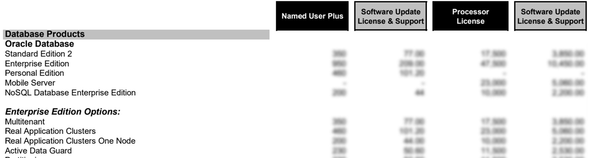

# Bài 02: Tổng quan về Oracle Database (Overview on Oracle Database)

**Mục tiêu bài học:**
- Hiểu được lịch sử phát triển của Oracle Database và các dấu mốc quan trọng.
- Phân biệt được các loại Release (Long Term Support vs Innovation).
- Nắm rõ các ấn bản (Editions) của Oracle để tư vấn và lựa chọn phù hợp.
- Hiểu về các mô hình triển khai trên Oracle Cloud.
- Nắm bắt cơ bản về chính sách Support và Licensing (bản quyền) của Oracle.

> 💡 **Tại sao DBA cần biết những điều này?**
> Là một Quản trị viên Cơ sở dữ liệu (DBA), bạn không chỉ gõ lệnh mà còn đóng vai trò "kiến trúc sư". Bạn phải là người tư vấn cho công ty nên mua phiên bản nào, nâng cấp lên bản nào để tối ưu chi phí (vì bản quyền rất đắt) và đảm bảo hệ thống chạy ổn định nhất.

---

## 1. Lịch sử phát triển của Oracle Database

Oracle Database không phải được xây dựng trong một sớm một chiều. Nó đã trải qua một quá trình tiến hóa dài từ năm 1979 (phiên bản V2 - RDBMS thương mại đầu tiên). Tuy nhiên, chúng ta hãy điểm qua những cột mốc định hình nên Oracle của ngày hôm nay:

- **V6 (1988) - Row locking & B&R:** Hỗ trợ khóa cấp độ dòng (Row-level locking) và Backup & Recovery. Tính năng này vô cùng quan trọng, giúp nhiều người dùng có thể cập nhật các dòng dữ liệu khác nhau cùng lúc mà không bị treo bảng.
- **V7 (1992) - PL/SQL Stored Programs:** Lần đầu tiên Oracle cho phép viết các hàm, thủ tục (procedure) bằng ngôn ngữ PL/SQL và lưu trực tiếp trong database.
- **V8 & 8i (1997-1999) - Internet & Objects:** Cập nhật để hỗ trợ các ứng dụng Web (chữ 'i' trong 8i là Internet) và hỗ trợ mô hình hướng đối tượng, phân vùng dữ liệu (Partitioning).
- **9i (2001) - Oracle RAC:** Giới thiệu công nghệ Real Application Clusters (RAC), cho phép nhiều server vật lý chạy chung một database. *(Ví von: Giống như nhiều động cơ cùng kéo một đoàn tàu, một động cơ hỏng thì tàu vẫn chạy)*.
- **10g (2004) - Grid Computing:** Chữ 'g' là Grid. Khái niệm gom nhóm tài nguyên máy tính thành lưới để dễ dàng phân bổ, tận dụng tối đa năng lực phần cứng.
- **11g (2007) - Diagnosability and availability:** Tập trung vào khả năng tự chẩn đoán lỗi, tăng cường độ sẵn sàng.
- **12c (2013) - Multitenancy & Cloud computing:** Cột mốc vĩ đại! Chữ 'c' là Cloud. Oracle giới thiệu kiến trúc Container Database (CDB) và Pluggable Database (PDB) - hiểu nôm na là chứa nhiều DB con độc lập bên trong 1 DB mẹ để dễ dàng di chuyển lên Cloud.
- **18c & 19c (2018-2019) - Enhanced Multitenancy & Automatic indexing:** Oracle bắt đầu đổi cách đánh số phiên bản theo năm phát hành. 19c được đánh giá là phiên bản cực kỳ ổn định và được dùng phổ biến nhất hiện nay.
- **21c (2021) - Innovation:** Thêm vô vàn tính năng hiện đại như Blockchain tables, máy học (Machine learning) ngay trong DB.

---

## 2. Phân loại Release: LTS vs Innovation

Khi bạn chuẩn bị cài đặt Oracle cho công ty, câu hỏi đầu tiên là: "Nên cài bản nào?". Từ phiên bản 18c trở đi, Oracle chia thành 2 loại Release chính:

### Long Term Support (LTS) Release
- **Đặc điểm:** Được hỗ trợ vòng đời cực lâu (5 năm Premier Support + 3 năm Extended Support).
- **Mục đích:** Dành cho môi trường **PRODUCTION** (Hệ thống thật, chạy thực tế).
- **Ví dụ:** **19c** (được hỗ trợ tới tận năm 2024 - 2027) và phiên bản tiếp theo là **23c**.
- **Tại sao nên chọn?** Vì doanh nghiệp cần sự **ổn định**. Bạn không thể mỗi năm lại đập hệ thống đi cài lại chỉ vì có tính năng mới.

### Innovation Release
- **Đặc điểm:** Chỉ hỗ trợ 2 năm Premier Support, KHÔNG có Extended Support.
- **Mục đích:** Dành cho môi trường **DEVELOPMENT / TESTING** để dùng thử các tính năng mới nhất từ Oracle.
- **Ví dụ:** 12c, 18c, và **21c**.
- **Lưu ý:** Không dùng bản này cho Production vì vòng đời hỗ trợ quá ngắn. Khi hết hạn, nếu gặp lỗi bảo mật nghiêm trọng, bạn sẽ không được Oracle cung cấp bản vá lỗi.

> ⚠️ **Lời khuyên DBA:** Luôn luôn tư vấn sếp / khách hàng cài đặt **LTS Release (như 19c)** cho hệ thống Production để đảm bảo "ăn ngon ngủ yên"!

---

## 3. Các ấn bản (Editions) của Oracle Database

Oracle Database có nhiều "gói" phần mềm khác nhau. Tùy thuộc vào ngân sách và quy mô hệ thống, công ty sẽ mua ấn bản phù hợp.

1. **Enterprise Edition (EE):** 
   - **Đặc điểm:** Bản cao cấp nhất, "full đồ", có tất cả mọi tính năng, KHÔNG bị giới hạn phần cứng. Hỗ trợ đầy đủ các tính năng nâng cao (RAC, Data Guard, In-Memory...).
   - **Đối tượng:** Các tập đoàn, ngân hàng lớn với ngân sách khổng lồ và hệ thống lõi quan trọng.

2. **Standard Edition 2 (SE2):**
   - **Đặc điểm:** Dành cho phòng ban hoặc công ty vừa và nhỏ. Bị giới hạn phần cứng (Tối đa 2 CPU sockets và 16 CPU threads mỗi database). Có hỗ trợ Oracle RAC nhưng là bản giới hạn.
   - **Ví von:** Giống như mua xe ô tô bản "tiêu chuẩn", rẻ hơn khá nhiều nhưng thiếu các option cao cấp.

3. **Personal Edition (PE):**
   - **Đặc điểm:** Dành cho 1 người dùng (cá nhân). Có đầy đủ tính năng của SE2 và EE nhưng KHÔNG có RAC, chỉ cài được trên Linux hoặc Windows.

4. **Express Edition (XE):**
   - **Đặc điểm:** **MIỄN PHÍ!** Tuy nhiên bị giới hạn ngặt nghèo: tối đa 12GB dữ liệu người dùng, sử dụng tối đa 2GB RAM và 2 CPU threads.
   - **Đối tượng:** Sinh viên, lập trình viên muốn học tập, nghiên cứu và vọc vạch mà không cần bỏ tiền.

---

## 4. Oracle Database Cloud Services (Dịch vụ Đám mây)

Ngày nay, hệ thống không nhất thiết phải nằm trên máy chủ vật lý ở văn phòng (On-premises). Bạn có thể thuê Database trên nền tảng Oracle Cloud. Có 3 mức độ (mô hình) triển khai chính:

1. **User Managed (Khách hàng tự quản lý):**
   - Giống như bạn thuê một căn nhà trống hoàn toàn. Oracle Cloud chỉ cấp cho bạn máy ảo (Compute) và Ổ cứng (Storage) qua dịch vụ IaaS.
   - **Nhiệm vụ của DBA:** Bạn phải tự cài hệ điều hành, cài phần mềm Oracle, tự lên lịch patch lỗi, tự cấu hình backup. Cực khổ nhất nhưng đổi lại bạn có quyền kiểm soát hệ thống 100%.

2. **Co-Managed - DB Systems (Đồng quản lý):**
   - Giống như thuê căn hộ đã có sẵn nội thất cơ bản. 
   - **Nhiệm vụ:** Hệ điều hành và Oracle Database đã được Oracle cài đặt sẵn. Nền tảng Cloud cung cấp sẵn các công cụ (Tool) giao diện web để bạn thao tác. Bạn chỉ cần "click chuột" là hệ thống tự backup, tự vá lỗi, tự thiết lập thảm họa (Disaster Recovery). Tuy nhiên, DBA vẫn là người quyết định **KHI NÀO** thì thực hiện các nút bấm đó.

3. **Autonomous (Tự trị):**
   - Giống như thuê phòng khách sạn VIP 5 sao có quản gia phục vụ từ A-Z.
   - **Nhiệm vụ:** Đây là dịch vụ cao cấp nhất, ứng dụng Machine Learning. Cơ sở dữ liệu sẽ **tự động** tuning (tối ưu hóa), tự động mở rộng (scale) khi có lượng truy cập tăng đột biến, và tự động patch lỗi bảo mật. DBA gần như không phải làm các tác vụ vận hành tẻ nhạt hàng ngày nữa, mà chuyển sang tập trung thiết kế kiến trúc hoặc tối ưu mã nguồn ứng dụng.

---

## 5. Oracle Support & Licensing (Hỗ trợ kỹ thuật và Bản quyền)

### Oracle Support (Dịch vụ hỗ trợ)
Khi một công ty bỏ hàng tỷ đồng mua phần mềm cốt lõi, họ cần một "đội ngũ bảo kê" khi hệ thống gặp sự cố bất ngờ.
- **Quyền lợi của Support:** 
  - Gọi điện trực tiếp nhờ chuyên gia của Oracle giải quyết lỗi kỹ thuật (kể cả lỗi nghiêm trọng khiến hệ thống sập).
  - Tải các bản vá (patch) bảo mật mới nhất để vá lỗ hổng.
  - Được quyền nâng cấp miễn phí lên phiên bản Database mới nhất (Ví dụ từ 12c nâng lên 19c).
- **Cách tính phí:** Miễn phí trong năm đầu tiên mua bản quyền. Từ năm thứ 2 trở đi, công ty phải trả phí gia hạn hàng năm (thường bằng khoảng 22% giá gốc license).
- **Phân loại:**
  - *Premier Support:* Hỗ trợ toàn diện thông thường (thường kéo dài 5 năm đầu).
  - *Extended Support:* Gia hạn thêm thời gian hỗ trợ với mức phí đắt hơn khi vòng đời Premier đã hết, giúp công ty có thêm thời gian chuẩn bị chuyển đổi lên phiên bản mới.

### Licensing (Bản quyền Oracle)
Bản quyền Oracle nổi tiếng là đắt đỏ và có luật lệ phức tạp, nhưng về cơ bản được tính theo 2 hình thức:
- **Named User Plus (NUP):** Tính theo số lượng người dùng cuối (hoặc thiết bị) có kết nối vào cơ sở dữ liệu. Phù hợp cho công ty có số lượng user xác định rõ và ít (Ví dụ: Phần mềm nội bộ dành riêng cho 100 nhân viên phòng Hành chính Nhân sự).
- **Processor:** Tính tiền dựa trên sức mạnh phần cứng máy chủ (Số lõi CPU - Cores - thực tế chạy Database, nhân với hệ số Core Factor). Phù hợp cho các ứng dụng Web mở ra cho hàng triệu người dùng bên ngoài Internet (Vì không thể đếm được số lượng user cụ thể).

---

## Tóm tắt bài học
- Oracle có lịch sử dài từ V6 đến 21c, với tính năng bước ngoặt Multitenancy ở bản 12c.
- Nếu cài đặt cho khách hàng thật để chạy ứng dụng, hãy chọn bản **Long Term Support (19c)**.
- Khi cần môi trường học tập cá nhân: Dùng ấn bản **XE (Express Edition)** vì nó miễn phí.
- Dịch vụ Cloud của Oracle chia làm 3 cấp độ: Tự quản (User Managed), Quản lý chung (Co-Managed) và Tự động hoàn toàn (Autonomous).
- Mua phần mềm Database phải đóng phí Support hằng năm để hệ thống nhận được bản vá lỗi bảo mật và sự trợ giúp kỹ thuật từ hãng khi sập hệ thống.

---

## ❓ Câu hỏi ôn tập
 
-1. Bạn đang tư vấn cho công ty XYZ cài đặt Oracle Database để chạy phần mềm lõi Kế toán, bạn sẽ khuyên họ cài phiên bản **19c** hay **21c**? Vì sao?
-2. Bản quyền **Enterprise Edition (EE)** khác biệt cơ bản như thế nào so với **Standard Edition 2 (SE2)**? 
-3. Hãy mô tả bằng lời văn của bạn: Sự khác nhau giữa dịch vụ **Co-Managed** và **Autonomous** trên Oracle Cloud là gì?
+**1. Bạn đang tư vấn cho công ty XYZ cài đặt Oracle Database để chạy phần mềm lõi Kế toán, bạn sẽ khuyên họ cài phiên bản **19c** hay **21c**? Vì sao?**
+> **Trả lời:**
+> Khuyên họ cài phiên bản **19c**. Vì:
+> - Oracle 19c là bản **Long-Term Support (LTS)** với chu kỳ hỗ trợ ổn định kéo dài nhiều năm (Premier và Extended Support), rất phù hợp cho các hệ thống lõi (Core/Mission-Critical) như Kế toán đòi hỏi tính ổn định tối đa.
+> - Bản 21c chỉ là bản **Innovation Release**, vòng đời hỗ trợ ngắn (khoảng 2 năm), chủ yếu dành cho thử nghiệm tính năng mới, không được khuyến khích dùng cho production quan trọng dài hạn.
+
+**2. Bản quyền Enterprise Edition (EE) khác biệt cơ bản như thế nào so với Standard Edition 2 (SE2)?**
+> **Trả lời:**
+> - **Giới hạn phần cứng:** SE2 bị giới hạn tối đa 2 socket CPU trên server (hoặc tối đa 16 CPU threads chạy đồng thời). EE không bị giới hạn socket hay CPU threads.
+> - **Tính năng cao cấp:** EE hỗ trợ đầy đủ các tùy chọn cao cấp (Options/Packs) như RAC (nhiều node), Active Data Guard, Partitioning, Advanced Compression, In-Memory, Diagnostics & Tuning Pack... mà SE2 không có hoặc bị hạn chế rất nhiều.
+> - **Chi phí:** EE có giá bản quyền và phí duy trì hàng năm cao hơn nhiều so với SE2.
+
+**3. Hãy mô tả bằng lời văn của bạn: Sự khác nhau giữa dịch vụ Co-Managed và Autonomous trên Oracle Cloud là gì?**
+> **Trả lời:**
+> - **Co-Managed (Quản lý chung):** Oracle quản lý phần cứng, hạ tầng mạng, máy ảo (VM) và lưu trữ. Nhưng DBA vẫn có toàn quyền truy cập OS (root/oracle) và Database (SYSDBA) để tự tay cấu hình, sao lưu, chỉnh sửa tham số, vá lỗi (patching).
+> - **Autonomous (Tự động hoàn toàn):** Oracle tự động hóa toàn diện từ provisioning, tuning, sao lưu định kỳ, cập nhật bảo mật, scale tài nguyên mà không cần con người can thiệp. Người dùng không có quyền truy cập OS, chỉ nhận database endpoint để kết nối và đẩy dữ liệu/ứng dụng vào chạy.

---

!!! info "Nguồn gốc"
    `Oracle-Database-Administration-from-Zero-to-Hero/VN/02-tong-quan-ve-oracle-database.md`
