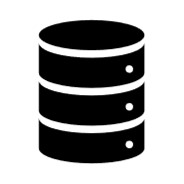
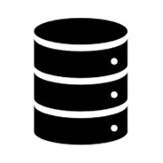
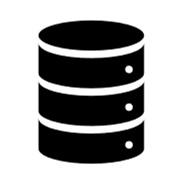
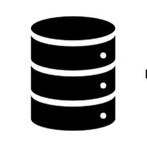
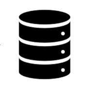
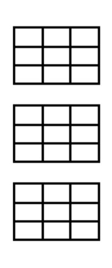
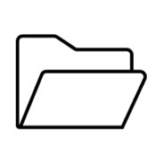

# Bài 03: Tổng quan các công nghệ Oracle Database

## Mục tiêu bài học
Chào mừng bạn đến với Bài 03! Trong bài học này, chúng ta sẽ không đi sâu vào gõ lệnh mà sẽ tìm hiểu "bức tranh toàn cảnh" về các công nghệ, tùy chọn và công cụ quản trị của Oracle Database. Mục tiêu là giúp bạn hiểu rõ:
- Khi nào dùng công nghệ nào (ví dụ: máy chủ sập thì làm sao? Trung tâm dữ liệu cháy thì làm sao?)
- Phân biệt được các khái niệm cốt lõi: RAC, Data Guard, GoldenGate, ASM.
- Các tùy chọn nâng cao giúp Oracle trở thành hệ quản trị CSDL hàng đầu thế giới.

---

## 1. Các kiến trúc triển khai Oracle Database

### 1.1 Single Instance (Một phiên bản duy nhất)
Đây là kiến trúc cơ bản nhất. Bạn có 1 máy chủ (Server), trên đó cài đặt 1 Oracle Database và chạy 1 Instance (phiên bản bộ nhớ & tiến trình) để phục vụ người dùng.

> 💡 **Ví dụ thực tế**: Tưởng tượng một cửa hàng chỉ có **1 quầy thu ngân (Instance)** phục vụ tất cả khách hàng và tiền được cất vào **1 két sắt (Database)**. Nếu thu ngân đi vệ sinh (sập Instance) hoặc két sắt kẹt (hỏng Database), toàn bộ cửa hàng phải ngừng hoạt động.

**Ưu điểm**: Đơn giản, dễ cài đặt, chi phí thấp.
**Nhược điểm**: Không có tính sẵn sàng cao (High Availability). Máy chủ chết là hệ thống dừng.

### 1.2 Real Application Cluster (RAC)
Để giải quyết bài toán "sập máy chủ", Oracle tạo ra công nghệ RAC. Với RAC, bạn có **nhiều máy chủ (Node)**, mỗi máy chủ chạy một Instance riêng, nhưng tất cả cùng kết nối vào **một Database chung** (cùng đọc/ghi vào một bộ lưu trữ chung).

> 💡 **Ví dụ thực tế**: Cửa hàng giờ đây có **nhiều quầy thu ngân (Nhiều Instances)** nhưng tất cả vẫn cất tiền vào chung **1 két sắt lớn (Database chung)**. Nếu một thu ngân nghỉ ốm, các quầy khác vẫn hoạt động bình thường, khách hàng không bị gián đoạn. Đây gọi là cơ chế **Active-Active** (tất cả cùng hoạt động).

**Ứng dụng DBA**: Chống chịu lỗi phần cứng (Hardware failure tolerance). Đảm bảo hệ thống vận hành 24/7.

### 1.3 RAC One Node
Đây là phiên bản "tiết kiệm" của RAC. Nó cũng chạy trên cụm nhiều máy chủ, nhưng tại một thời điểm **chỉ có 1 Instance hoạt động**. Nếu máy chủ này sập, Instance sẽ tự động "nhảy" sang máy chủ khác và khởi động lại cực nhanh.

> 💡 **Ví dụ thực tế**: Có 2 quầy thu ngân, nhưng cửa hàng chỉ thuê 1 nhân viên. Nhân viên ngồi ở quầy 1. Nếu quầy 1 hỏng máy tính, nhân viên ngay lập tức chạy sang quầy 2 để làm việc tiếp. Đây gọi là cơ chế **Active-Passive**.

---

## 2. Giải pháp khắc phục thảm họa (Disaster Recovery)

RAC giúp bạn chống lại việc hỏng máy chủ, nhưng nếu **toàn bộ trung tâm dữ liệu (Data Center) bị cháy hoặc ngập lụt** thì sao? (Két sắt bị phá hủy!). Lúc này, bạn cần Data Guard.

### 2.1 Oracle Data Guard
Data Guard cho phép bạn duy trì một (hoặc nhiều) bản sao của Database ở một nơi khác (ví dụ: một cái ở Hà Nội, một cái ở TP.HCM).
- **Primary DB**: Hệ thống chính đang chạy ở Hà Nội.
- **Standby DB**: Hệ thống dự phòng ở TP.HCM.

Khi có thay đổi dữ liệu ở Primary, Oracle sẽ đóng gói các thay đổi đó (Redo data) và gửi (Redo shipping) sang Standby để áp dụng, giúp 2 bên đồng bộ.

> ⚠️ **Lưu ý**: Trong Data Guard thông thường, hệ thống Standby chỉ dùng để nhận dữ liệu và **không thể mở cho người dùng truy cập** cùng lúc (trạng thái Mount).

### 2.2 Active Data Guard
Đây là bản nâng cấp có trả phí của Data Guard. Nó cho phép Standby DB **vừa nhận dữ liệu đồng bộ, vừa mở ở chế độ Read-Only (chỉ đọc)**.

**Tại sao DBA cần cái này?**
Rất nhiều hệ thống cần chạy các báo cáo (Report) nặng. Nếu chạy trên Primary DB sẽ làm chậm hệ thống chính. Với Active Data Guard, ta đẩy toàn bộ người dùng chạy báo cáo sang Standby DB, vừa tận dụng được tài nguyên máy chủ dự phòng, vừa giảm tải cho hệ thống chính.

---

## 3. Đồng bộ dữ liệu với Oracle GoldenGate

**GoldenGate** là một phần mềm riêng biệt (không đi kèm sẵn trong bộ cài Database). Nó chuyên dùng để **sao chép dữ liệu theo thời gian thực (real-time)** ở mức logic (mức dòng dữ liệu).

**Điểm mạnh cực lớn của GoldenGate:**
Nó hỗ trợ **dị thể (Heterogeneous)**. Nghĩa là bạn có thể đồng bộ dữ liệu từ Oracle Database sang SQL Server, MySQL, hoặc ngược lại. Nó thường dùng để:
- Nâng cấp hệ thống không gián đoạn (Zero-downtime migration).
- Đẩy dữ liệu sang các kho dữ liệu (Data Warehouse).

---

## 4. Quản lý lưu trữ: ASM vs Non-ASM

Làm sao để lưu trữ các file dữ liệu (Datafiles) của Oracle một cách an toàn và hiệu quả nhất?

### 4.1 Non-ASM (Sử dụng File System / LVM thông thường)
Bạn dùng ổ đĩa của hệ điều hành (ví dụ: `D:\oradata\` trên Windows hoặc `/u02/oradata/` trên Linux).
Cách này dễ nhìn thấy file, nhưng quản lý I/O (tốc độ đọc/ghi) kém khi dữ liệu phình to.

### 4.2 ASM (Automatic Storage Management)
ASM là công nghệ quản lý ổ đĩa "thần thánh" do chính Oracle viết riêng cho Oracle Database.
Thay vì quản lý từng file, bạn đưa cho Oracle các ổ đĩa thô (Raw disks), Oracle sẽ gom chúng lại thành các **Disk Group** (ví dụ: `+DATA`).

**Lợi ích của ASM:**
- **Striping**: Chia nhỏ dữ liệu rải đều lên nhiều ổ đĩa, giúp đọc/ghi cực nhanh.
- **Mirroring**: Tự động nhân bản dữ liệu. Nếu 1 ổ đĩa cứng bị hỏng, dữ liệu vẫn không mất.
- Bắt buộc phải có ASM nếu bạn muốn cài đặt RAC.

---

## 5. Các Tùy Chọn (Options) Nổi Bật Của Oracle

Oracle Database có nhiều "đồ chơi" trả phí thêm (Options) để tăng cường sức mạnh:

1. **Oracle Multitenant**: Kiến trúc "Căn hộ chung cư" (Container DB & Pluggable DB). Một Server chạy nhiều DB con, tiết kiệm tài nguyên.
2. **Oracle Database In-Memory**: Đưa dữ liệu lên thẳng RAM để xử lý, tốc độ truy vấn phân tích (Analytics) nhanh gấp hàng trăm lần.
3. **Oracle Database Vault**: Siêu bảo mật. Chặn cả DBA (người quản trị) xem trộm dữ liệu nhạy cảm (như lương, thẻ tín dụng).
4. **Oracle Partitioning**: Phân vùng dữ liệu. Cắt một bảng khổng lồ (vài tỷ dòng) thành nhiều mảnh nhỏ để dễ quản lý và truy vấn nhanh hơn.

---

## 6. Các Gói Quản Trị (Management Packs)

Giúp DBA chẩn đoán bệnh và tối ưu hóa hệ thống:
- **Oracle Diagnostics Pack**: Giúp theo dõi "sức khỏe" Database, phát hiện nút thắt cổ chai (AWR, ADDM).
- **Oracle Tuning Pack**: Tự động đề xuất cách sửa lỗi chậm, ví dụ: khuyên DBA tạo thêm Index hoặc sửa lại câu lệnh SQL cho nhanh (SQL Tuning Advisor).

---

## 7. Bảng Tổng Hợp: Nhu cầu và Giải pháp

Trong công việc, sếp sẽ đưa ra yêu cầu, nhiệm vụ của DBA là chọn công nghệ phù hợp:

| Yêu cầu của Doanh nghiệp (Nhu cầu) | Công nghệ Oracle tương ứng | Cơ chế hoạt động |
| :--- | :--- | :--- |
| Chống lỗi phần cứng máy chủ (Không được sập) | **RAC** (Real Application Cluster) | Active - Active |
| Chống lỗi phần cứng nhưng chi phí thấp | **RAC One Node** | Active - Passive |
| Dự phòng thảm họa (Cháy Data Center) | **Data Guard** | Primary - Standby |
| Dự phòng thảm họa + Chạy báo cáo | **Active Data Guard** | Standby (Read-Only) |
| Đồng bộ dữ liệu sang DB khác loại (MySQL...) | **Oracle GoldenGate** | Real-time logical replication |
| Chống hỏng ổ cứng, tăng tốc độ đọc ghi | **ASM** | Striping & Mirroring |

---

## 8. Tóm tắt bài học
Trong bài này, chúng ta đã nắm được bộ vũ khí của Oracle DBA:
- Kiến trúc chạy: Single, RAC, RAC One Node.
- Đồng bộ và dự phòng: Data Guard, GoldenGate.
- Lưu trữ: ASM.
- Các tính năng xịn xò (In-Memory, Multitenant) và công cụ hỗ trợ (Diagnostics/Tuning Pack).

Những kiến trúc như RAC và Data Guard là "nồi cơm" của các DBA cấp cao, giúp hệ thống ngân hàng, viễn thông chạy xuyên suốt không bao giờ dừng.

## 9. Câu hỏi ôn tập

**1. Sự khác biệt lớn nhất giữa RAC và RAC One Node là gì?**
> **Trả lời:**
> - **RAC (Real Application Clusters):** Nhiều instance (tối thiểu 2) chạy đồng thời trên nhiều node máy chủ vật lý khác nhau, cùng chia sẻ chung một storage. Cung cấp cả tính sẵn sàng cao (High Availability) lẫn cân bằng tải (Load Balancing) active-active.
> - **RAC One Node:** Chỉ có **1 instance duy nhất** chạy tại một thời điểm trên một node. Khi cần bảo trì phần cứng hoặc node gặp sự cố, instance được di chuyển trực tuyến (Online Relocation) sang node khác với thời gian gián đoạn gần như bằng 0 (failover/switchover nhanh chóng), giúp tiết kiệm chi phí bản quyền so với Full RAC.

**2. Nếu sếp yêu cầu chuyển dữ liệu liên tục từ Oracle sang SQL Server, bạn sẽ dùng công cụ gì?**
> **Trả lời:**
> Sử dụng **Oracle GoldenGate**. Đây là giải pháp nhân bản dữ liệu (Replication) thời gian thực hàng đầu của Oracle, hỗ trợ môi trường không đồng nhất (Heterogeneous - giữa Oracle, MS SQL Server, PostgreSQL, MySQL, Kafka, Big Data...) với độ trễ tính bằng mili-giây.

**3. Tại sao doanh nghiệp lại sẵn sàng bỏ thêm tiền mua Active Data Guard thay vì dùng Data Guard cơ bản?**
> **Trả lời:**
> - Trong **Data Guard cơ bản**, Standby database chỉ có thể ở trạng thái MOUNT để apply redo log liên tục (DR thuần túy), hoặc phải ngắt apply log mới mở được Read-Only để đọc báo cáo.
> - Trong **Active Data Guard**, Standby database có thể **mở ở chế độ READ-ONLY đồng thời vẫn tiếp tục apply redo log** theo thời gian thực. Doanh nghiệp có thể tận dụng máy chủ Standby này để chạy các báo cáo nặng (Reporting), sao lưu (RMAN Backup Offloading), giúp giảm tải triệt để cho máy chủ Production chính.

**4. ASM giúp bảo vệ dữ liệu khỏi hỏng ổ cứng nhờ tính năng nào?**
> **Trả lời:**
> Nhờ tính năng **Mirroring (Software Mirroring) thông qua Redundancy level của Diskgroup**:
> - **Normal Redundancy (2-way mirroring):** Mỗi block dữ liệu được ghi vào 2 Failure Groups (ổ cứng) độc lập, chịu được hỏng 1 ổ.
> - **High Redundancy (3-way mirroring):** Mỗi block dữ liệu được ghi vào 3 Failure Groups độc lập, chịu được hỏng cùng lúc 2 ổ.
> Ngoài ra, ASM còn tự động **Rebalance** lại dữ liệu khi thêm hoặc bớt đĩa mà không làm gián đoạn database.

---

!!! info "Nguồn gốc"
    `Oracle-Database-Administration-from-Zero-to-Hero/VN/03-cong-nghe-oracle-database.md`
