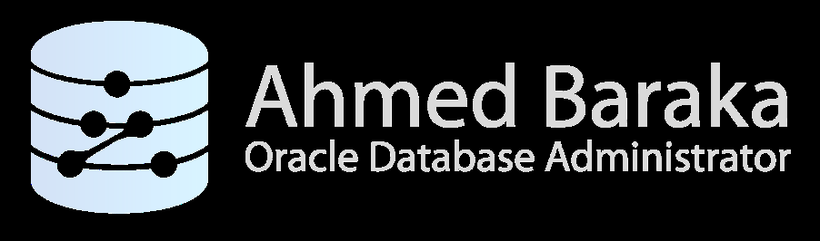
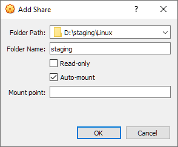
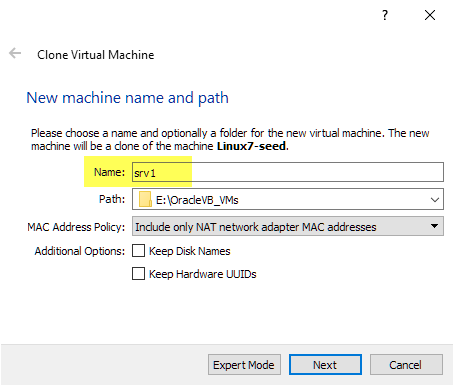
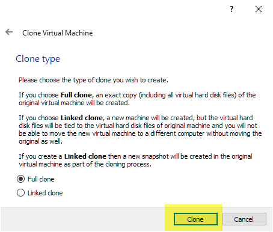
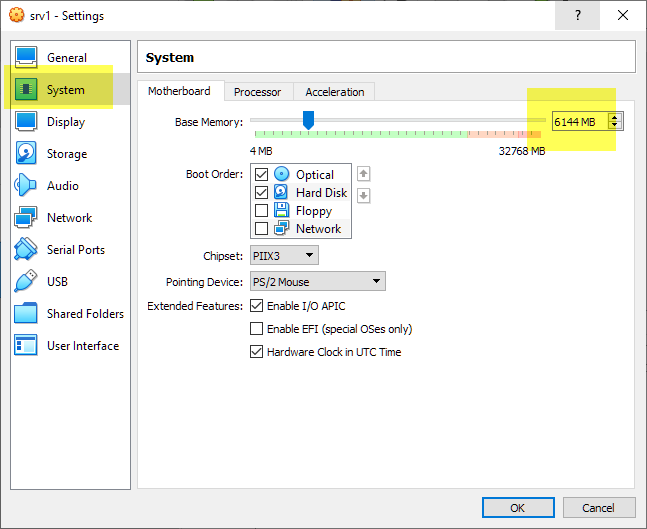

# Bài 05: Thực hành - Chuẩn bị môi trường thực hành

Mục tiêu học tập:
- Hiểu được tầm quan trọng của việc xây dựng môi trường lab cho việc học Oracle DBA.
- Cài đặt và cấu hình thành công các công cụ ảo hóa (VirtualBox, PuTTY).
- Xây dựng hệ thống máy ảo (Linux và Windows) mô phỏng môi trường doanh nghiệp thực tế.
- Nắm được cách thiết lập mạng (Network) và chia sẻ dữ liệu (Shared Folder) giữa máy thật và máy ảo.

> 💡 **Tại sao bước này quan trọng?** 
> Giống như việc học lái xe cần có sa hình, học quản trị CSDL Oracle cần một môi trường an toàn để bạn thoải mái "phá" và thực hành mà không ảnh hưởng đến hệ thống thật. Máy ảo chính là "sa hình" của bạn.

---

## Phần 1: Yêu cầu máy tính (Hosting PC)

Để chạy được môi trường thực hành mượt mà, máy tính thật của bạn (gọi là **Hosting PC**) cần đáp ứng các tiêu chuẩn sau:

- **Hệ điều hành**: Windows 10 hoặc Windows 11 bản 64-bit.
- **RAM**: Tối thiểu 16GB (để chạy cùng lúc nhiều máy ảo).
- **Ổ cứng**: Còn trống ít nhất 150GB.

### Các phần mềm cần chuẩn bị:

Bạn cần tải và cài đặt các phần mềm sau trên Hosting PC:
1. **Oracle VirtualBox (bản 6.1.32 trở lên)**: Phần mềm tạo máy ảo. (Có thể hiểu nó giống như việc bạn chia một căn nhà lớn thành nhiều phòng nhỏ độc lập).
2. **PuTTY**: Công cụ giúp kết nối từ xa (SSH) vào máy ảo Linux chỉ bằng dòng lệnh, mô phỏng cách DBA làm việc thực tế với server đặt ở Data Center.
3. **Java Runtime (JRE) 1.8 cho Windows 64-bit**: Môi trường chạy Java (chọn bản *Windows Offline (64-bit)*).

> ⚠️ **Lưu ý**: Hãy cài đặt tất cả các phần mềm này trước khi chuyển sang bước tiếp theo.

---

## Phần 2: Tạo máy ảo Linux (Linux7-seed)

Máy ảo đầu tiên chúng ta tạo gọi là **Seed VM** (máy ảo hạt giống). Tưởng tượng nó như một "bản gốc" hay "khuôn đúc" hoàn hảo, từ đó bạn có thể nhân bản ra bao nhiêu máy ảo Linux tùy thích mà không cần cài lại hệ điều hành từ đầu.

### Bước 1: Import file OVA

1. Tải file OVA (Oracle Linux 7 x86-64) đã được chuẩn bị sẵn cho khóa học.
2. Mở **Oracle VM VirtualBox Manager**.
3. Chọn **File** > **Import Appliance**.
4. Trỏ tới file OVA vừa tải và bấm **Next**.
5. Đổi tên (Name) máy ảo thành `Linux7-seed`.
6. Ở phần **Mac Address Policy**, chọn `Generate new MAC Addresses for all network adapters` (tạo địa chỉ MAC mới để không bị trùng lặp mạng).
7. Bấm **Import**.



### Bước 2: Cấu hình Network và Shared Folder

1. **Network (Mạng)**: Chuột phải vào máy ảo `Linux7-seed` > **Settings** > **Network**. Sửa tên Adapter để khớp với card mạng trên máy tính thật của bạn.
2. **Shared Folder (Thư mục chia sẻ)**: Thư mục này giúp bạn dễ dàng copy file (như bộ cài Oracle) từ máy thật vào máy ảo.
   - Chọn tab **Shared Folders** > bấm biểu tượng **Add** (thêm).
   - **Folder Path**: Chọn một thư mục trên máy thật (VD: D:\staging).
   - **Folder Name**: Phải đặt là `staging`.
   - Tick chọn **Auto-mount** (tự động kết nối).



### Bước 3: Cài Guest Additions và Cấp quyền

1. Bật máy ảo lên và đăng nhập bằng tài khoản `root` (chọn "not listed" và gõ `root`).
2. Trên menu cửa sổ VirtualBox, chọn **Devices** > **Insert Guest Additions CD Image** > Bấm **Run** trong máy ảo. Việc này giúp máy ảo chạy mượt hơn và nhận được Shared Folder.
3. Khởi động lại máy ảo (Restart).

Sau khi máy khởi động lại, mở Terminal và chạy lệnh sau để cấp quyền cho user `oracle` được truy cập vào thư mục shared:

```bash
# Lệnh usermod dùng để sửa đổi thông tin user
# -a: append (thêm vào)
# -G vboxsf: thêm vào group có tên là vboxsf (group của VirtualBox shared folder)
# oracle: tên user cần thêm
usermod -a -G vboxsf oracle
```

> 💡 Kiểm tra IP của máy ảo bằng cách vào **Settings > Network** của hệ điều hành Linux. Từ máy thật (Windows), mở CMD và `ping <IP máy ảo>` để đảm bảo hai máy thấy nhau. Tắt máy ảo sau khi xong.

---

## Phần 3: Clone máy ảo srv1

Bây giờ chúng ta sẽ tạo máy chủ tên là **srv1** để sau này cài CSDL Oracle bằng cách "nhân bản" (clone) từ máy hạt giống.

### Bước 1: Clone máy ảo

1. Chuột phải vào `Linux7-seed` (đang tắt) > Chọn **Clone**.
2. Đặt tên là `srv1`.
3. Bấm **Clone**.



### Bước 2: Nâng cấp RAM và Cấu hình IP tĩnh

1. Vào **Settings** của `srv1`, tăng **Base Memory** lên **6 GB** (6144 MB) để Oracle chạy mượt.
2. Khởi động `srv1` và đăng nhập bằng `root`.
3. Đặt IP tĩnh:
   - Vào **Settings > Network** (biểu tượng bánh răng mạng).
   - Chuyển **IPv4** sang **Manual** (Thủ công).
   - Nhập IP hiện tại của máy (Ví dụ: 192.168.1.50).
   - Netmask: `255.255.255.0`, Gateway: `192.168.1.1` (Tùy mạng nhà bạn).
   - Khởi động lại card mạng (tắt đi bật lại).



### Bước 3: Cấu hình file `/etc/hosts`

File `/etc/hosts` giống như một danh bạ điện thoại nội bộ của Linux, giúp phân giải tên miền sang IP.

Mở file bằng trình soạn thảo `vi`:
```bash
vi /etc/hosts
```
Thêm dòng sau vào cuối file (Thay `<ip address>` bằng IP thực tế của srv1):
```text
<ip address> srv1 srv1.localdomain
```
Lưu lại (`Esc`, gõ `:wq`, `Enter`) và kiểm tra bằng lệnh `ping -c 3 srv1`.

---

## Phần 4: Cấu hình kết nối PuTTY

DBA chuyên nghiệp hiếm khi dùng giao diện đồ họa của server, mà thường dùng công cụ như PuTTY để kết nối từ xa.

1. Mở PuTTY trên máy thật.
2. Nhập IP của `srv1` vào mục **Host Name (or IP address)**.
3. Ở mục **Saved Sessions**, gõ tên `srv1` và bấm **Save**.
4. Bấm **Open** để kết nối và đăng nhập bằng user `root`.



> 💡 **Tip PuTTY**: Để copy text trong PuTTY, bạn chỉ cần bôi đen đoạn text đó (nó tự động copy). Để paste, chỉ cần click chuột phải.

---

## Phần 5: Tạo Máy ảo Windows (winsrv)

Chúng ta cần thêm một máy chủ Windows Server để thực hành cài Oracle trên môi trường Windows.

### Bước 1: Import OVA và cấu hình

1. Tải và giải nén file OVA Windows Server 2016.
2. Import vào VirtualBox tương tự như Linux, đổi tên máy thành `winsrv`.
3. Tăng RAM lên **6GB** (6144 MB). (Khuyến nghị: 4GB có thể chạy được nhưng sẽ rất lag).
4. Cấu hình Network (đổi tên Adapter) và Shared Folder (cùng chung thư mục `staging` như srv1).
5. Khởi động và đăng nhập bằng tài khoản Administrator (Mật khẩu: `Oracle@dba`). Để gửi phím Ctrl+Alt+Del, nhấn phím `Ctrl Phải + Del`.

### Bước 2: Gia hạn bản quyền Windows

Bản Windows Server 2016 Evaluation có thời hạn. Nếu hết hạn, máy sẽ tự động tắt thường xuyên. Để gia hạn thêm 180 ngày, chạy PowerShell (as Administrator) và gõ:

```powershell
# Kiểm tra phiên bản Windows
slmgr -dlv

# Lệnh gia hạn bản quyền (re-arm)
slmgr -rearm

# Khởi động lại máy để áp dụng
Restart-Computer
```

### Bước 3: Đổi tên máy, IP tĩnh và file hosts

1. **Đổi tên máy**: Bấm tổ hợp phím `Windows + E` > chuột phải **This PC** > **Properties** > **Advanced System Settings** > Tab **Computer Name** > Đổi thành `winsrv` và Restart.
2. **IP tĩnh**: Vào Network and Sharing Center, đổi IPv4 của máy sang tĩnh (Static IP) giống như cách làm trên máy thật.
3. **Cấu hình hosts**:
   - Chạy Notepad quyền Administrator. Mở file `C:\windows\system32\drivers\etc\hosts`.
   - Thêm IP của winsrv và srv1:
     ```text
     <ip_winsrv> winsrv winsrv
     <ip_srv1> srv1 srv1.localdomain
     ```
   - Cũng mở PuTTY kết nối vào `srv1` và cập nhật file `/etc/hosts` tương tự để srv1 biết IP của winsrv.

---

## Tóm tắt bài học

Qua bài thực hành này, bạn đã tự tay xây dựng thành công một môi trường mô phỏng Data Center thu nhỏ bao gồm:
1. **Linux7-seed**: Máy ảo khuôn mẫu để sinh ra các máy Linux khác.
2. **srv1**: Máy chủ Linux sẵn sàng cài đặt CSDL Oracle.
3. **winsrv**: Máy chủ Windows sẵn sàng cài đặt CSDL Oracle.
4. Hệ thống mạng, phân giải tên miền (hosts) và thư mục chia sẻ dữ liệu chung đã hoạt động hoàn hảo.

## Câu hỏi ôn tập

**1. Tại sao chúng ta lại cần tạo ra máy `Linux7-seed` thay vì cài trực tiếp hệ điều hành cho `srv1`?**
> **Trả lời:**
> Tạo máy khuôn mẫu (`Linux7-seed`) mang lại nhiều lợi ích:
> - **Tiết kiệm thời gian và công sức:** Khi cần tạo nhiều máy ảo (`srv1`, `srv2`, `racnode1`, `racnode2`), chỉ cần nhân bản (Clone) từ máy seed đã được cài sẵn OS và cấu hình chuẩn trong vài phút, thay vì phải ngồi cài OS từ đầu mất 30-45 phút mỗi máy.
> - **Chuẩn hóa cấu hình (Consistency):** Đảm bảo mọi máy trong phòng lab đều đồng nhất về phiên bản kernel, gói phần mềm, phân vùng đĩa và thiết lập ban đầu.
> - **Dễ dàng phục hồi:** Nếu thử nghiệm làm hỏng OS của `srv1`, bạn có thể xóa đi và clone lại một máy mới toanh từ máy seed bất cứ lúc nào.

**2. Ý nghĩa của file `/etc/hosts` trong Linux và file `hosts` trong Windows là gì?**
> **Trả lời:**
> File `hosts` là cơ chế **phân giải tên miền cục bộ (Local Name Resolution)** ánh xạ trực tiếp giữa địa chỉ IP và tên máy (Hostname/FQDN) mà không cần phải dựng một máy chủ DNS Server riêng. Khi một ứng dụng (hoặc Oracle TNS Listener) kết nối tới tên máy `srv1.localdomain`, hệ điều hành sẽ tra cứu file `hosts` đầu tiên để lấy địa chỉ IP `192.168.56.100`.

**3. Nếu không cấp quyền group `vboxsf` cho user, điều gì sẽ xảy ra khi user đó cố truy cập Shared Folder?**
> **Trả lời:**
> User sẽ gặp lỗi **Permission Denied** (từ chối truy cập). Trong VirtualBox Linux Guest, các thư mục chia sẻ (Shared Folders) được mount tự động vào hệ thống file với quyền sở hữu thuộc user `root` và group `vboxsf`. Chỉ những user thuộc nhóm `vboxsf` (được thêm bằng lệnh `usermod -aG vboxsf <username>`) mới có quyền đọc và ghi vào thư mục dùng chung đó.


---

!!! info "Nguồn gốc"
    `Oracle-Database-Administration-from-Zero-to-Hero/VN/05-thuc-hanh-chuan-bi-moi-truong.md`
