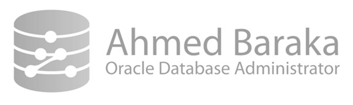

# Bài 06: Kiến trúc Oracle Database (Oracle Database Architecture)

Chào mừng bạn đến với bài học quan trọng nhất về lý thuyết trong toàn bộ khóa học. Việc hiểu rõ kiến trúc của Oracle Database là nền tảng để bạn có thể trở thành một DBA (Database Administrator) thực thụ. Nó giúp bạn hiểu được hệ thống hoạt động ra sao, lỗi nằm ở đâu và tối ưu hóa hiệu suất như thế nào.

---

## 🎯 Mục tiêu bài học
Sau khi hoàn thành bài học này, bạn sẽ có khả năng:
- Liệt kê và mô tả được các thành phần chính của Database Instance (Thực thể cơ sở dữ liệu).
- Liệt kê và mô tả được các file quan trọng trong Oracle Database.
- Hiểu được sự khác biệt cốt lõi giữa Database và Instance.

---

## 1. Phân biệt Database và Instance (Cực kỳ quan trọng)

Nhiều người mới bắt đầu thường nhầm lẫn giữa hai khái niệm "Database" và "Instance". Để dễ hình dung, chúng ta hãy dùng một ví dụ đời thường nhé:

> 💡 **Ví von thực tế:**
> Hãy tưởng tượng hệ thống Oracle như một **nhà kho và đội ngũ nhân viên**.
> - **Database (Cơ sở dữ liệu)** chính là **Nhà kho (Kho hàng)**: Bao gồm các kệ hàng, hồ sơ sổ sách nằm vật lý trên mặt đất (ổ cứng/disk). Dù không có ai làm việc, nhà kho vẫn tồn tại ở đó, chứa đầy hàng hóa (dữ liệu).
> - **Instance (Thực thể)** chính là **Đội ngũ nhân viên và Khu vực làm việc tạm thời**: Bao gồm các công nhân đang hoạt động (Background Processes) và không gian xử lý hồ sơ trên bàn làm việc (Memory/RAM). Khi hết giờ làm (tắt máy), nhân viên đi về, bàn làm việc được dọn sạch (RAM giải phóng), nhưng nhà kho (Database) thì vẫn còn nguyên.

**Tóm lại:**
- **Database (Cơ sở dữ liệu)**: Là tập hợp các file (dữ liệu vật lý) nằm trên ổ cứng (disk) để lưu trữ thông tin vĩnh viễn.
- **Instance (Thực thể)**: Là tập hợp các cấu trúc bộ nhớ (Memory structures) và các tiến trình chạy ngầm (Background processes) để quản lý, truy xuất dữ liệu từ Database.

---

## 2. Quy trình Kết nối (Client Application → Listener → Server Process)

Làm thế nào để một người dùng có thể gửi lệnh SQL lấy dữ liệu ra khỏi Oracle? Dưới đây là hành trình từng bước của một kết nối:

1. **Client Application**: Người dùng sử dụng một ứng dụng (như SQL Developer, ứng dụng Web...) gửi yêu cầu kết nối đến máy chủ.
2. **Listener (Người gác cổng)**: Khi yêu cầu đến máy chủ Oracle, nó sẽ gặp Listener đầu tiên. Listener là một tiến trình mạng, lắng nghe các kết nối tới và kiểm tra tính hợp lệ.
3. **Server Process (Nhân viên phục vụ riêng)**: Nếu hợp lệ, Listener sẽ yêu cầu Instance tạo ra một Server Process (Tiến trình máy chủ) để chuyên phục vụ Client này. Listener "bàn giao" Client cho Server Process rồi quay lại làm nhiệm vụ gác cổng.
4. **PGA (Program Global Area)**: Mỗi Server Process sẽ được cấp một vùng nhớ riêng tư gọi là PGA (giống như một góc làm việc cá nhân của nhân viên đó) để xử lý các phép toán, sắp xếp dữ liệu (sort), lưu giữ thông tin session cho Client đó.

---

## 3. Kiến trúc Vùng nhớ chung (SGA - System Global Area)

Nếu PGA là vùng nhớ "cá nhân" của mỗi Server Process, thì **SGA (System Global Area)** là vùng nhớ "dùng chung" khổng lồ cho toàn bộ Instance. Khi Instance khởi động, vùng nhớ SGA này sẽ được cấp phát trên RAM.

SGA bao gồm nhiều thành phần quan trọng:

### 3.1. Shared Pool (Hồ chia sẻ)
Đây là nơi lưu trữ các thông tin "dùng chung" để tăng tốc độ xử lý:
- **Library Cache**: Chứa mã SQL và PL/SQL đã được biên dịch (executable code). Nếu user A chạy lệnh `SELECT * FROM EMP`, Oracle sẽ phân tích lệnh và lưu "kế hoạch thực thi" vào đây. Nếu user B chạy lệnh y hệt, Oracle sẽ lấy luôn kế hoạch trong Library Cache ra dùng, không mất công phân tích lại.
- **Data Dictionary Cache**: Lưu thông tin về cấu trúc database (user, table, quyền...). Ví dụ, kiểm tra xem user A có quyền đọc bảng EMP không.
- **Result Cache**: Chứa kết quả trực tiếp của các câu lệnh SQL. Nếu câu lệnh được gọi nhiều lần và dữ liệu không đổi, Oracle trả luôn kết quả từ đây.

### 3.2. Database Buffer Cache (Bộ đệm dữ liệu)
Là nơi lưu các khối dữ liệu (data blocks) được đọc từ ổ cứng (Data Files) lên. 
Khi user muốn đọc/ghi dữ liệu, Oracle KHÔNG thao tác trực tiếp trên đĩa ngay, mà nó copy dữ liệu lên Database Buffer Cache để thao tác trên RAM cho nhanh.
Một block trong buffer cache có thể ở 3 trạng thái:
- **Unused**: Block trống, chưa dùng đến.
- **Clean**: Block chứa dữ liệu vừa được đọc từ đĩa lên (hoặc đã ghi xuống đĩa), dữ liệu trên RAM và trên đĩa đang giống hệt nhau.
- **Dirty (Dữ liệu bẩn)**: Block chứa dữ liệu vừa bị thay đổi (UPDATE/INSERT/DELETE) nhưng **chưa được ghi xuống đĩa**.

### 3.3. Redo Log Buffer (Bộ đệm nhật ký)
Ghi chép lại **mọi sự thay đổi** diễn ra trong database (gọi là redo entries). Nó đóng vai trò cốt lõi trong việc phục hồi dữ liệu khi xảy ra sự cố sập nguồn.

### 3.4. Large Pool & Fixed SGA
- **Large Pool**: Vùng nhớ tuỳ chọn dùng cho các tiến trình sao lưu phục hồi (RMAN), xử lý song song (Parallel execution)...
- **Fixed SGA**: Vùng nhớ tĩnh lưu các thông tin trạng thái nền tảng của bản thân Instance.

---

## 4. Các Tiến Trình Nền (Background Processes)

Đây là các "công nhân" hoạt động âm thầm đằng sau để giữ cho hệ thống trơn tru và an toàn.

Các tiến trình bắt buộc (Mandatory) phải có bao gồm:

### 4.1. DBWn (Database Writer - Nhân viên ghi lười biếng)
- **Nhiệm vụ**: Quét các block dữ liệu **Dirty** (dữ liệu đã bị thay đổi) từ *Database Buffer Cache* và ghi chúng xuống *Data Files* trên ổ cứng.
- **Đặc điểm**: Ghi "lười" (lazy). DBWn không ghi ngay lập tức mỗi khi bạn sửa dữ liệu. Nó chờ đến khi bộ đệm đầy, hoặc có lệnh Checkpoint thì mới ghi một loạt để tối ưu hiệu suất I/O.

### 4.2. LGWR (Log Writer - Nhân viên ghi chép siêu tốc)
- **Nhiệm vụ**: Quét các dữ liệu nhật ký (redo entries) từ *Redo Log Buffer* và ghi xuống *Online Redo Log Files* trên đĩa.
- **Đặc điểm**: Ghi "ngay lập tức" và cực kỳ nhanh. Bắt buộc phải ghi xong mỗi khi một giao dịch được **COMMIT** (lưu lại). Nhờ có LGWR, dù DBWn có lười ghi chưa kịp xuống đĩa mà mất điện, ta vẫn có nhật ký để khôi phục lại dữ liệu đã sửa.

### 4.3. CKPT (Checkpoint Process - Người đánh dấu mốc thời gian)
- **Nhiệm vụ**: Cập nhật Control Files và phần Header của các Data Files với thông tin Checkpoint. Nó phát tín hiệu yêu cầu DBWn bắt đầu ghi các khối Dirty xuống đĩa. Nó giống như việc "lưu game" tới một thời điểm nhất định.

### 4.4. SMON & PMON & LREG
- **SMON (System Monitor)**: Chuyên gia dọn dẹp hệ thống. Nếu server bị sập đột ngột (crash), khi khởi động lại, SMON sẽ thực hiện "Instance Recovery" (khôi phục tự động) dựa vào Redo Log.
- **PMON (Process Monitor)**: Chuyên gia dọn dẹp các tiến trình bị lỗi. Nếu một User bị mất mạng đột ngột khi đang thao tác, PMON sẽ dọn dẹp PGA của user đó, nhả các lock (khóa) dữ liệu ra để người khác còn dùng.
- **LREG (Listener Registration)**: Tự động đăng ký Instance với Listener, giúp Listener biết có những service nào đang chạy.

---

## 5. Hệ thống File của Database

Để nhà kho (Database) hoạt động, Oracle có các loại file vật lý lưu trên đĩa như sau:

> [!IMPORTANT]
> **Các file cực kỳ quan trọng không thể thiếu:**
> 1. **Control Files**: Bộ não của Database. Chứa thông tin cấu trúc vật lý (tên và đường dẫn của các data files, redo log files), thời điểm sinh ra database, thời điểm checkpoint gần nhất. Mất file này database sẽ dừng hoạt động.
> 2. **Online Redo Log Files**: Luôn có ít nhất 2 file để ghi xoay vòng. Lưu trữ mọi thay đổi của dữ liệu. Giúp khôi phục (recovery) dữ liệu trong trường hợp sập nguồn.
> 3. **Data Files**: Các file thực sự chứa dữ liệu người dùng (User Datafiles) và cấu trúc hệ thống của Oracle (System Datafiles).

**Các file quan trọng khác:**
- **Parameter File (SPFILE/PFILE)**: Chứa các tham số cấu hình khi khởi động Instance (ví dụ quy định RAM cho SGA là bao nhiêu).
- **Archived Redo Log Files**: Khi các Online Redo Log đầy, chúng sẽ được copy (lưu trữ) sang dạng Archive Log. Rất quan trọng khi cần khôi phục dữ liệu ở một thời điểm trong quá khứ (Point-in-time recovery).
- **Password File**: Lưu mật khẩu của các user có quyền tối cao (như SYSDBA) để họ có thể kết nối ngay cả khi database chưa mở.
- **ADR (Automatic Diagnostic Repository)**: Thư mục chứa các file log chẩn đoán lỗi, alert log (nhật ký hệ thống). Khi Oracle có lỗi, DBA sẽ chui vào đây để đọc file.

---

## 📝 Tóm tắt bài học
1. **Kiến trúc cơ bản**: Oracle Database gồm **Instance** (SGA + Background Processes) chạy trên RAM và **Database** (Các file) lưu trên đĩa cứng.
2. **Luồng kết nối**: Client kết nối thông qua **Listener**, sau đó **Server Process** xử lý cùng với bộ nhớ riêng **PGA**.
3. **SGA**: Vùng nhớ chung lưu trữ lệnh SQL (Library Cache), dữ liệu đang xử lý (Buffer Cache) và nhật ký sửa đổi (Redo Log Buffer).
4. **Tiến trình ngầm (Background Processes)**: Giữ vai trò bảo vệ hệ thống: DBWn (ghi dữ liệu chậm), LGWR (ghi nhật ký siêu tốc), SMON (phục hồi sự cố), PMON (dọn dẹp).
5. **Hệ thống file**: Control file, Data file, và Redo Log file là 3 trụ cột vật lý không thể thiếu để duy trì dữ liệu sống còn.

---

### ❓ Câu hỏi ôn tập

**1. Sự khác nhau giữa trạng thái Dirty block và Clean block trong Database Buffer Cache là gì?**
> **Trả lời:**
> - **Clean Block (Block sạch):** Là data block trong Buffer Cache chưa hề bị sửa đổi, hoặc đã được tiến trình DBWn ghi đồng bộ xuống Datafile trên đĩa. Nội dung trong RAM giống hệt trên đĩa, có thể bị ghi đè bất kỳ lúc nào nếu RAM cần chỗ trống.
> - **Dirty Block (Block bẩn):** Là data block đã bị câu lệnh DML (INSERT, UPDATE, DELETE) sửa đổi nội dung trên RAM nhưng **chưa được ghi xuống đĩa**. DBWn sẽ chịu trách nhiệm ghi các block này xuống đĩa sau đó (tại thời điểm Checkpoint hoặc khi cache cần giải phóng).

**2. Tại sao người ta lại thiết kế DBWn ghi lười (chậm) nhưng LGWR lại phải ghi rất nhanh và ngay lập tức khi Commit?**
> **Trả lời:**
> - **LGWR (Log Writer) ghi tuần tự (Sequential I/O):** Redo Log Buffer chỉ ghi nối đuôi các mẩu tin thay đổi ngắn gọn (redo entries) vào Redo Log file. Thao tác ghi tuần tự cực nhanh, không gây nghẽn I/O. Khi người dùng COMMIT, chỉ cần Redo Log được ghi an toàn xuống đĩa là Oracle đảm bảo dữ liệu không bao giờ bị mất (ACID - Durability).
> - **DBWn (Database Writer) ghi ngẫu nhiên (Random I/O):** Các data block (8KB) nằm rải rác trên nhiều datafiles khác nhau. Nếu mỗi lần COMMIT mà DBWn phải tìm đến đúng vị trí từng data block trên đĩa để ghi thì ổ cứng sẽ quá tải ngay lập tức (Disk Bottleneck). Do đó, DBWn gom nhiều block lại rồi mới ghi một lượt (Lazy write / Batch write) để tối ưu hiệu năng tối đa.

**3. Nếu xóa mất file Parameter, bạn có khởi động được Database Instance không?**
> **Trả lời:**
> **Không thể khởi động bình thường.** Oracle Instance cần SPFILE hoặc PFILE để biết các thông số thiết lập kích thước vùng nhớ SGA, đường dẫn Control Files, tên database (`db_name`)... Nếu mất hoàn toàn cả SPFILE lẫn PFILE, lệnh `STARTUP` sẽ thất bại với lỗi `ORA-01078` hoặc `LRM-00109`. (Để cứu hộ, DBA phải tạo lại một PFILE tối thiểu chứa ít nhất tham số `db_name`).

---

!!! info "Nguồn gốc"
    `Oracle-Database-Administration-from-Zero-to-Hero/VN/06-kien-truc-oracle-database.md`
