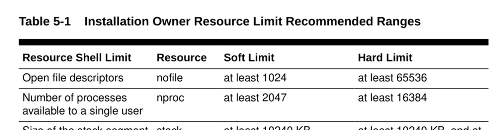
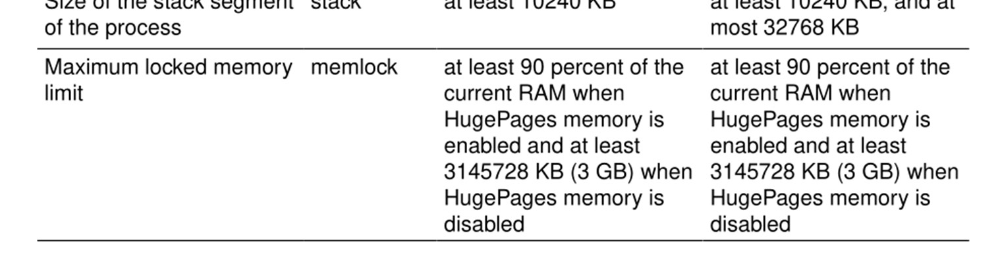

# Bài 08: Cài đặt Oracle Database Software (Phần mềm Cơ sở dữ liệu)

Chào mừng bạn đến với bài học quan trọng đầu tiên trong việc thực hành DBA: Cài đặt phần mềm Oracle Database. Trước khi có thể tạo ra một Database (cơ sở dữ liệu) để lưu trữ thông tin, chúng ta cần phải cài đặt "bộ khung" (software) của nó trước. 

## Mục tiêu bài học
Trong bài này, bạn sẽ học cách:
- Hiểu được tải phần mềm Oracle ở đâu và phiên bản nào phù hợp.
- Nắm được các yêu cầu hệ thống và cách chuẩn bị máy chủ.
- Cấu trúc thư mục chuẩn của Oracle (OFA) và các biến môi trường quan trọng.
- Hiểu các bước cài đặt trên Linux và Windows.
- Biết về Oracle Inventory và Oracle Universal Installer (OUI).

---

## 1. Tải phần mềm Oracle Database từ đâu?

> 💡 **Mẹo thực tế:** Không giống như các phần mềm thông thường cứ lên trang chủ tải bản mới nhất, với Database, sự **ổn định** là quan trọng nhất!

- **Phiên bản mới nhất (như 19c, 21c):** Bạn có thể tải miễn phí cho mục đích học tập/phát triển từ [Trang chủ Oracle](https://www.oracle.com/database/technologies/).
- **Các phiên bản cũ hơn (hoặc bản quyền chính thức):** Tải từ [Oracle Software Delivery Cloud](https://edelivery.oracle.com).
- **Các bản vá lỗi (Patches/Updates):** Chỉ tải được từ [Oracle Support](https://support.oracle.com) (yêu cầu tài khoản có trả phí/bản quyền).

### Chọn phiên bản nào?
- **Long Term Release (Ví dụ 19c):** Hỗ trợ lâu dài (hàng chục năm), cực kỳ ổn định. **Luôn dùng cho môi trường Production (Thực tế).**
- **Innovation Release (Ví dụ 21c):** Chứa các tính năng mới nhất để thử nghiệm. Không nên dùng cho Production trừ khi có yêu cầu bắt buộc.


---

## 2. Tại sao lại cài Software riêng và tạo Database riêng?

Nhiều người mới học thường thắc mắc: "Tại sao không cài 1 phát có luôn Database?".

> 🏢 **Ví von đời thường:** Tưởng tượng bạn đang xây một toà nhà văn phòng.
> - **Cài đặt Software (Phần mềm):** Giống như bạn xây lên "bộ khung" của toà nhà (tường, điện, nước). Lúc này toà nhà chưa thể cho thuê vì chưa có phòng ốc nào.
> - **Tạo Database:** Giống như việc bạn chia toà nhà đó thành các văn phòng nhỏ, trang trí nội thất để các công ty vào làm việc.
> 
> Lợi ích: Từ 1 "bộ khung" (Software), bạn có thể tạo ra NHIỀU "văn phòng" (Databases) khác nhau. Nếu 1 Database bị lỗi, các Database khác vẫn an toàn.

### Tổng quan các bước:
1. Chuẩn bị máy chủ (đáp ứng phần cứng, OS).
2. Tải phần mềm Oracle.
3. Cài đặt Oracle Software.
4. Cài bản vá lỗi (nếu có).
5. **Tạo Database (Sẽ học ở bài sau).**

---

## 3. Yêu cầu hệ thống (Linux)

Để Database chạy mượt mà, máy chủ cần đáp ứng phần cứng tối thiểu:
- **RAM:** Ít nhất 2 GB.
- **Disk (Ổ cứng):** Thư mục `/tmp` phải trống ít nhất 1 GB.
- **Swap (Bộ nhớ ảo):**
  - RAM 1 - 2 GB: Swap = 1.5 lần RAM.
  - RAM 2 - 16 GB: Swap = Bằng đúng RAM.
  - RAM > 16 GB: Swap = 16 GB.

---

## 4. Chuẩn bị máy chủ Linux (Rất quan trọng)

Trước khi cài, Linux cần được cấu hình chuẩn. Nếu thiếu bước này, OUI (Oracle Universal Installer) sẽ báo lỗi.

### A. Cài đặt các thư viện (Libraries)
Thay vì ngồi tìm và cài từng gói thư viện rườm rà, Oracle cung cấp một gói "ăn liền".
```bash
# Lệnh này sẽ tự động cài mọi thư viện cần thiết và cấu hình nhân (kernel)
yum install oracle-database-preinstall-19c
```

### B. Tắt Transparent HugePages (THP)
THP là một tính năng của Linux giúp quản lý bộ nhớ, nhưng nó lại gây "xung đột" và làm chậm Oracle Database. Do đó, DBA bắt buộc phải tắt nó đi.
```bash
# Kiểm tra xem THP có đang bật không
cat /sys/kernel/mm/transparent_hugepage/enabled

# Sửa file GRUB để tắt THP khi khởi động máy
# Thêm transparent_hugepage=never vào dòng GRUB_CMDLINE_LINUX
```

### C. Tạo User và Group cho OS
Phần mềm Oracle không bao giờ được chạy bằng quyền `root` để đảm bảo bảo mật. Ta cần tạo các nhóm và user riêng:
```bash
# Tạo group dba (Quản trị viên) và oinstall (Cài đặt)
/usr/sbin/groupadd -g 54322 dba
/usr/sbin/groupadd oinstall

# Tạo user 'oracle', gán vào group oinstall (chính) và dba (phụ)
useradd -u 54321 -g oinstall -G dba oracle
```

---

## 5. Kiến trúc thư mục chuẩn (OFA) và Biến môi trường

OFA (Optimal Flexible Architecture) là một quy tắc chuẩn của Oracle về cách đặt tên thư mục, giúp mọi hệ thống Oracle trên thế giới đều có cấu trúc giống nhau, dễ quản lý.

Bạn phải cấu hình các biến môi trường này cho user `oracle` (trong file `.bash_profile`):

```bash
# 1. Tên của Database Instance
ORACLE_SID=ORADB; export ORACLE_SID

# 2. ORACLE_BASE: Thư mục gốc chứa mọi thứ liên quan đến Oracle của bạn.
# Giống như mảnh đất của toà nhà.
ORACLE_BASE=/u01/app/oracle; export ORACLE_BASE

# 3. ORACLE_HOME: Thư mục chứa các file thực thi phần mềm (bộ cài).
# Luôn nằm CÙNG TRONG ORACLE_BASE.
ORACLE_HOME=$ORACLE_BASE/product/19.0.0/db_1; export ORACLE_HOME

# 4. Thêm Oracle vào đường dẫn hệ thống để gõ lệnh ở đâu cũng được
PATH=.:${PATH}:$ORACLE_HOME/bin
export PATH
```



---

## 6. Oracle Universal Installer (OUI) và Phương pháp cài

OUI là trình cài đặt (Installer) của Oracle. Nó có 2 chế độ:
1. **Interactive (Giao diện GUI):** Mở cửa sổ lên, bấm Next liên tục như cài game. Yêu cầu máy chủ Linux phải có giao diện đồ hoạ.
2. **Silent (Cài không cửa sổ):** Cài qua giao diện dòng lệnh bằng cách cung cấp một file cấu hình (`response file`). Rất hữu ích khi bạn muốn tự động hoá hoặc máy chủ không có giao diện GUI.

### Cài đặt qua RPM (Cách mới từ bản 18c)
Thay vì bung file zip và chạy OUI, giờ đây bạn có thể cài cực nhanh bằng gói RPM trên Linux:
```bash
# Lệnh cài đặt phần mềm Oracle tự động (chưa có Database)
yum -y localinstall oracle-database-ee-19c-1.0-1.x86_64.rpm
```

---

## 7. Cài đặt trên Windows có gì khác?

Nếu Linux dùng User và Group của OS, thì Windows dùng khái niệm **Oracle Home User**.
- Nên tạo một user Windows riêng (không phải quyền Admin) chỉ để chạy các Dịch vụ (Services) của Oracle.
- Việc này giúp cô lập Oracle, nếu bị hack cũng không ảnh hưởng toàn bộ Windows.



---

## 8. Oracle Inventory là gì?

> ⚠️ **Chú ý:** Đừng bao giờ xoá thư mục này!

**Oracle Inventory** là một danh mục lưu trữ thông tin về TẤT CẢ các sản phẩm Oracle đã cài trên máy. Nó giống như "sổ cái" hệ thống.
- **Trên Windows:** Nằm ở `C:\Program Files\Oracle\Inventory\ContentsXML`
- **Trên Linux:** Đường dẫn được lưu trong file `/etc/oraInst.loc` (Thường là `/u01/app/oraInventory`)

Nếu thư mục này bị hỏng, sau này bạn sẽ không thể cài thêm bản vá (Patch) hay nâng cấp phần mềm được nữa.

---

## 9. Gỡ cài đặt (Deinstall)

Đừng xoá thư mục cài đặt bằng lệnh `rm -rf`! Hãy dùng công cụ chuẩn để xoá sạch sẽ các tệp tin cấu hình và registry.
```bash
# Chạy công cụ gỡ cài đặt
$ORACLE_HOME/deinstall/deinstall
```

---

## Tóm tắt bài học
- Phân biệt bản **Long Term (19c)** cho Production và **Innovation (21c)** cho thử nghiệm.
- Hiểu được tách biệt giữa việc cài **Software (Khung)** và tạo **Database (Nội dung)**.
- **OFA** quy định cấu trúc thư mục chuẩn, quan trọng nhất là `ORACLE_BASE` (Gốc) và `ORACLE_HOME` (Nơi chứa phần mềm).
- Trước khi cài trên Linux cần chuẩn bị OS: Cài gói thư viện `preinstall`, tạo user/group `oracle:dba` và tắt `Transparent HugePages`.

---

## Câu hỏi ôn tập

**1. Tại sao trong môi trường doanh nghiệp thực tế, người ta lại ưu tiên dùng Oracle 19c hơn là 21c?**
> **Trả lời:**
> Oracle 19c là phiên bản **Long-Term Support (LTS)** với chu kỳ hỗ trợ kéo dài tới năm 2027+, được thử nghiệm và vá lỗi qua nhiều năm nên đạt độ ổn định và tin cậy cực cao. Bản 21c chỉ là Innovation Release với thời gian hỗ trợ ngắn hạn (khoảng 2 năm), chủ yếu để khách hàng thử nghiệm tính năng mới trước khi nâng cấp lên bản LTS kế tiếp (như 23ai). Doanh nghiệp ưu tiên sự an toàn và ổn định nên luôn chọn 19c.

**2. Sự khác biệt giữa `ORACLE_BASE` và `ORACLE_HOME` là gì?**
> **Trả lời:**
> - **`ORACLE_BASE`:** Là thư mục gốc cấp cao nhất (ví dụ: `/u01/app/oracle`), nơi lưu trữ chung cho tất cả các phần mềm, sản phẩm của Oracle, cũng như các file chẩn đoán (diag, trace), dữ liệu (`oradata`).
> - **`ORACLE_HOME`:** Là thư mục con bên dưới `ORACLE_BASE` (ví dụ: `/u01/app/oracle/product/19.3.0/dbhome_1`), dành riêng để chứa mã nguồn nhị phân (binaries), thư viện và công cụ của **một phiên bản phần mềm cụ thể**. Một `ORACLE_BASE` có thể chứa nhiều `ORACLE_HOME` khác nhau (ví dụ: vừa có 12c, vừa có 19c).

**3. Nếu máy chủ Linux có 8GB RAM, thì dung lượng Swap tối thiểu nên được thiết lập là bao nhiêu?**
> **Trả lời:**
> Theo khuyến nghị chính thức của Oracle Database Installation Guide:
> - RAM từ 1GB đến 2GB: Swap = 1.5 lần RAM.
> - RAM từ 2GB đến 16GB: Swap = **Bằng dung lượng RAM** (hoặc 1 đến 1.5 lần).
> Vậy với 8GB RAM, dung lượng Swap tối thiểu nên được thiết lập là **8GB** (hoặc cấu hình an toàn là 8GB - 12GB).

**4. Chế độ cài đặt `Silent` của OUI thường được sử dụng trong trường hợp nào?**
> **Trả lời:**
> Chế độ **Silent Mode (`./runInstaller -silent -responseFile ...`)** được sử dụng khi:
> - Cài đặt trên máy chủ không có giao diện đồ họa GUI (Headless Server) hoặc mạng chậm không truyền được X11/VNC.
> - Tự động hóa quy trình cài đặt hàng loạt (Automation/DevOps) bằng Ansible, Terraform, Puppet, Docker script.
> - Đảm bảo tính nhất quán tuyệt đối về cấu hình cài đặt giữa môi trường Dev, Test, UAT và Production.


---

!!! info "Nguồn gốc"
    `Oracle-Database-Administration-from-Zero-to-Hero/VN/08-cai-dat-oracle-db.md`
