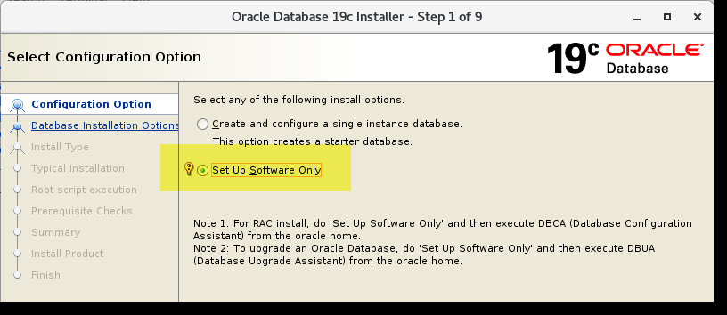
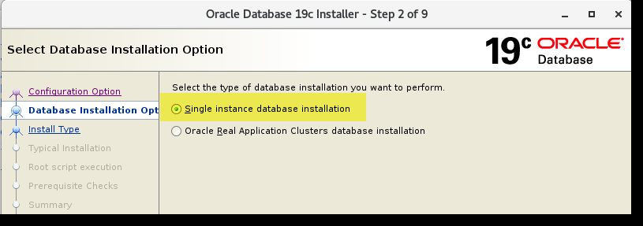
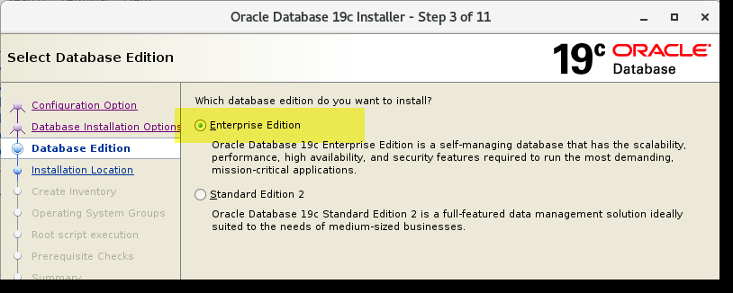
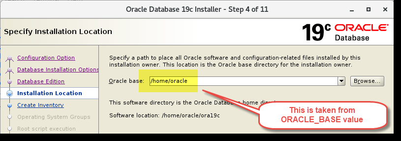
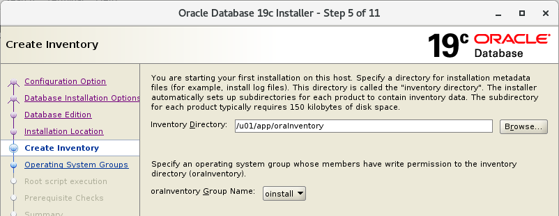
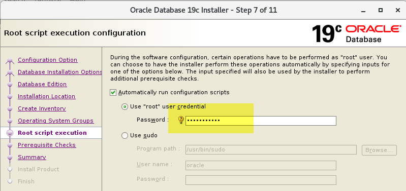
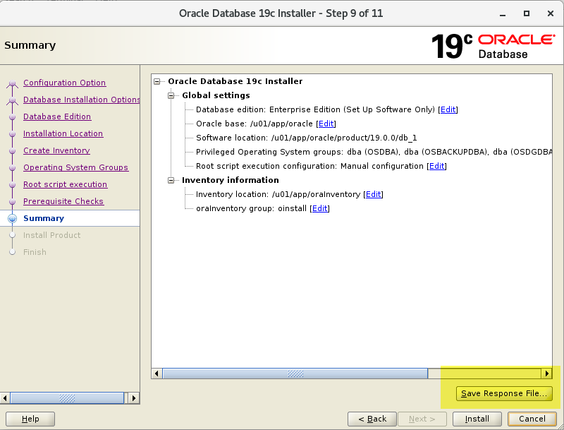
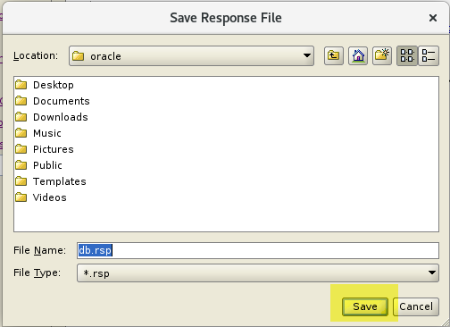

# Bài 09: Thực Hành - Cài Đặt Oracle Database Software trên Linux

Chào mừng bạn đến với bài thực hành cài đặt Oracle Database Software trên môi trường Linux. Ở bài này, chúng ta sẽ thao tác từng bước để biến một máy chủ Linux trống thành một môi trường sẵn sàng chạy Oracle Database 19c. 

> 💡 **Tại sao lại là 19c mà không phải 21c?**
> Ở thời điểm viết bài, 21c là phiên bản mới nhất. Tuy nhiên, đối với các hệ thống Production (môi trường thực tế), Oracle khuyến nghị nên sử dụng bản có hỗ trợ dài hạn (Long-term supported release). Oracle 19c chính là phiên bản như vậy. Giống như khi bạn chọn mua một chiếc xe để đi làm hàng ngày, bạn sẽ ưu tiên một chiếc xe bền bỉ, được bảo hành lâu dài thay vì một phiên bản thể thao mới ra mắt nhưng chưa được kiểm chứng độ bền.

---

## 1. Mục Tiêu Học Tập

Sau khi hoàn thành bài thực hành này, bạn sẽ:
- Biết cách kiểm tra các điều kiện tiên quyết của hệ điều hành.
- Chuẩn bị hệ điều hành, cài đặt các gói phụ thuộc (prerequisites).
- Cấu hình user `oracle`, các group cần thiết và môi trường biến hệ thống.
- Chạy Oracle Universal Installer (OUI) để tạo response file.
- Cài đặt Oracle Database Software bằng chế độ *Silent Mode* (không cần giao diện đồ họa).

---

## 2. Kiểm Tra Yêu Cầu Hệ Thống

Trước khi xây nhà, chúng ta phải kiểm tra nền móng. Đối với Oracle Database, "nền móng" chính là tài nguyên phần cứng và hệ điều hành.

**Bước 1:** Mở công cụ Putty và kết nối vào máy chủ `srv1` với user `root`.

**Bước 2:** Kiểm tra RAM
Oracle 19c yêu cầu tối thiểu 1GB RAM, nhưng thực tế nếu dưới 4GB, máy chủ của bạn sẽ "thở dốc".
```bash
grep MemTotal /proc/meminfo
```
*Lệnh này sẽ lấy ra tổng dung lượng RAM của máy.*

**Bước 3:** Kiểm tra Swap Space (Ram ảo)
Swap giúp hệ thống không bị crash khi hết RAM vật lý. Với RAM khoảng 6GB, có 16GB swap là quá dư dả.
```bash
grep SwapTotal /proc/meminfo
```

**Bước 4:** Kiểm tra dung lượng thư mục `/tmp`
Quá trình cài đặt của Oracle sẽ bung rất nhiều file tạm vào đây. Bạn cần ít nhất 1GB trống.
```bash
df -h /tmp
```

**Bước 5:** Kiểm tra tổng quan RAM và Swap
```bash
free -h
```

**Bước 6:** Kiểm tra kiến trúc hệ điều hành
Hãy đảm bảo bạn đang dùng Linux x86-64 (64-bit), vì Oracle Database hiện tại không còn hỗ trợ bản 32-bit.
```bash
uname -m
```

**Bước 7:** Kiểm tra phân vùng `/dev/shm` (Shared Memory)
Phân vùng này rất quan trọng để Oracle lưu trữ các cấu trúc bộ nhớ dùng chung.
```bash
df -h /dev/shm
```

---

## 3. Chuẩn Bị Hệ Điều Hành (OS Preparation)

### 3.1. Tắt Transparent HugePages
Theo khuyến nghị của Oracle, tính năng Transparent HugePages của Linux có thể gây ra hiện tượng chậm hoặc treo database. Chúng ta cần phải vô hiệu hóa nó.

Kiểm tra trạng thái hiện tại:
```bash
cat /sys/kernel/mm/transparent_hugepage/enabled
```

Chỉnh sửa file cấu hình boot của Linux:
```bash
vi /etc/default/grub
```
Tìm dòng `GRUB_CMDLINE_LINUX` và thêm `transparent_hugepage=never` vào cuối chuỗi, ví dụ:
```text
GRUB_CMDLINE_LINUX="crashkernel=auto rhgb quiet transparent_hugepage=never"
```

Cập nhật lại cấu hình GRUB và khởi động lại:
```bash
grub2-mkconfig -o /boot/grub2/grub.cfg
reboot
```

### 3.2. Cài Đặt Gói Cấu Hình Tự Động (Preinstall Package)
Kết nối lại `srv1` bằng `root`. Chúng ta sẽ cài đặt gói `oracle-database-preinstall-19c`. Gói này giống như một "nhà thầu trọn gói", tự động tải về các thư viện còn thiếu, tự động cấu hình các tham số hệ thống (kernel parameters) và tự động tạo luôn user `oracle` cho chúng ta!

Cập nhật OS (bước này có thể tốn 10-15 phút):
```bash
yum update -y
reboot
```
Sau khi khởi động lại, tiếp tục chạy:
```bash
yum install oracle-database-preinstall-19c -y
```

Kiểm tra thành quả xem các tham số đã tự động được thêm vào chưa:
```bash
cat /etc/sysctl.d/99-oracle-database-preinstall-19c-sysctl.conf
cat /etc/security/limits.d/oracle-database-preinstall-19c.conf
```

Kiểm tra user `oracle` đã được tạo:
```bash
id oracle
```

---

## 4. Cấu Hình User `oracle` và Biến Môi Trường

Bây giờ chúng ta sẽ thiết lập "nơi làm việc" cho user `oracle`.

Chuyển sang user `oracle`:
```bash
su - oracle
```

Sao lưu và chỉnh sửa file `.bash_profile`:
```bash
cp /home/oracle/.bash_profile /home/oracle/.bash_profile.old
vi /home/oracle/.bash_profile
```

Xóa hết nội dung cũ và dán nội dung sau vào:
```bash
# .bash_profile

if [ -f ~/.bashrc ]; then
    . ~/.bashrc
fi

# Thiết lập các biến môi trường quan trọng
ORACLE_BASE=/u01/app/oracle; export ORACLE_BASE
ORACLE_SID=oradb; export ORACLE_SID
ORACLE_HOME=$ORACLE_BASE/product/19.0.0/db_1; export ORACLE_HOME
NLS_DATE_FORMAT="DD-MON-YYYY HH24:MI:SS"; export NLS_DATE_FORMAT

# Thiết lập PATH để gõ lệnh oracle trực tiếp không cần đường dẫn dài
PATH=$PATH:$HOME/.local/bin:$HOME/bin
PATH=${PATH}:/usr/bin:/bin:/usr/local/bin
PATH=.:${PATH}:$ORACLE_HOME/bin
export PATH

# Thiết lập thư viện và Java
LD_LIBRARY_PATH=$ORACLE_HOME/lib
LD_LIBRARY_PATH=${LD_LIBRARY_PATH}:$ORACLE_HOME/oracm/lib
LD_LIBRARY_PATH=${LD_LIBRARY_PATH}:/lib:/usr/lib:/usr/local/lib
export LD_LIBRARY_PATH

CLASSPATH=$ORACLE_HOME/JRE
CLASSPATH=${CLASSPATH}:$ORACLE_HOME/jlib
CLASSPATH=${CLASSPATH}:$ORACLE_HOME/rdbms/jlib
CLASSPATH=${CLASSPATH}:$ORACLE_HOME/network/jlib
export CLASSPATH

export TEMP=/tmp
export TMPDIR=/tmp
export EDITOR=vi

# Quyền mặc định cho file mới tạo
umask 022
```

Trở lại user `root` (gõ `exit`), sau đó thêm user `oracle` vào nhóm `oper` (nhóm dành cho các operator):
```bash
usermod oracle -a -G oper
exit
```

---

## 5. Chuẩn Bị File Cài Đặt và Thư Mục

> ⚠️ **Lưu ý Quan Trọng:** Bắt đầu từ bản 18c, Oracle thay đổi cách cài đặt. Bạn không giải nén file cài ra một thư mục `staging` tạm thời nữa, mà bạn **PHẢI** giải nén trực tiếp vào thư mục `ORACLE_HOME`.

Đứng ở quyền `root`, tạo cấu trúc thư mục:
```bash
mkdir -p /u01/app/oracle/product/19.0.0/db_1
mkdir -p /u01/app/oraInventory
chown -R oracle:oinstall /u01/app/oracle
chown -R oracle:oinstall /u01/app/oraInventory
```

Chuyển sang `oracle`:
```bash
su - oracle
```

Giả sử file cài đặt đã được tải về ở thư mục `/media/sf_staging/LINUX.X64_193000_db_home.zip`. Tiến hành giải nén thẳng vào `ORACLE_HOME`:
```bash
cd /media/sf_staging/
unzip LINUX.X64_193000_db_home.zip -d $ORACLE_HOME >/dev/null
```

---

## 6. Chạy Oracle Universal Installer để tạo Response File

Trong thực tế, bạn có thể chạy giao diện đồ họa (GUI) để cài thẳng (nhấn nút Next liên tục rồi Install). Nhưng ở bài này, ta sẽ dùng GUI để **lưu lại các lựa chọn** thành một file kịch bản (gọi là Response File). Sau đó dùng file này để cài đặt nền (Silent Mode). Cách này rất hữu dụng khi bạn phải cài Oracle trên hàng trăm máy chủ khác nhau!

Đăng nhập vào giao diện Desktop của máy ảo (VirtualBox) bằng user `oracle`, mở Terminal:
```bash
cd $ORACLE_HOME
./runInstaller
```

Tại các màn hình của Installer, bạn chọn như sau:

**1. Set Up Software Only:** Chỉ cài phần mềm, chưa tạo Database lúc này.


**2. Single instance database installation:** Cài trên 1 node duy nhất.


**3. Enterprise Edition:** Chọn bản đầy đủ tính năng.


**4. Oracle Base:** Trỏ về `/u01/app/oracle`.


**5. Inventory Directory:** Nơi lưu lịch sử cài đặt, trỏ về `/u01/app/oraInventory`.


**6. Operating System Groups:** Kiểm tra các group ánh xạ chuẩn.


**7. Prerequisite Checks:** Oracle sẽ tự động kiểm tra hệ thống.


**8. Summary:** TỚI ĐÂY, khoan ấn Install! Hãy ấn vào **Save Response File** và lưu lại thành `/home/oracle/db.rsp`. Sau khi lưu, bạn ấn **Cancel** để thoát Installer.



---

## 7. Cài Đặt Bằng Chế Độ Silent Mode

Bây giờ bạn quay lại cửa sổ dòng lệnh Putty (đang ở user `oracle`).

Kiểm tra xem response file đã được tạo chưa:
```bash
cat /home/oracle/db.rsp
```

Phân quyền bảo mật cho file (vì file này có thể chứa mật khẩu trong một số ngữ cảnh):
```bash
chmod 600 /home/oracle/db.rsp
```

Bắt đầu tiến trình cài đặt bí mật (Silent Mode):
```bash
$ORACLE_HOME/runInstaller -silent -responseFile /home/oracle/db.rsp
```
*Lưu ý: Vì ở bước trước Installer đã chạy kiểm tra Prerequisite Checks và Passed, ta không cần thêm cờ `-executePrereqs`. Nếu đem file rsp này qua máy khác cài, bạn cần thêm cờ đó.*

Nếu thành công, bạn sẽ nhận được thông báo:
> `Successfully Setup Software`

---

## 8. Kiểm Tra Lại Và Dọn Dẹp

Để chắc chắn cài đặt thành công, hãy thử gọi công cụ `sqlplus`:
```bash
which sqlplus
```
*(Kết quả trả về phải nằm trong `/u01/app/oracle/product/19.0.0/db_1/bin/sqlplus`)*

Kiểm tra danh mục phần mềm (Inventory):
```bash
cat /etc/oraInst.loc
cat /u01/app/oraInventory/ContentsXML/inventory.xml
```

Cuối cùng, dọn dẹp file zip để tiết kiệm dung lượng ổ cứng:
```bash
rm -f /media/sf_staging/LINUX.X64_193000_db_home.zip
```

> 💡 **Mẹo Thực Tế (Best Practice):** Trong môi trường làm việc thực, ngay sau khi cài xong Software như bước này, DBA sẽ tiếp tục tải và cài đặt bản vá lỗi (Patch/Release Update - RU) mới nhất ngay, rồi mới tạo Database. Chúng ta sẽ học cách cài Patch ở các bài sau!

---
## Tóm Tắt
Sử dụng Response File, chúng ta có thể cài đặt Oracle Database Software trên Linux ở chế độ dòng lệnh hoàn toàn, rất phù hợp cho việc tự động hóa (automation) và triển khai trên máy chủ không có giao diện đồ họa. 

## Câu Hỏi Ôn Tập

**1. Tại sao phải giải nén trực tiếp vào thư mục `ORACLE_HOME` ở bản 19c thay vì bung ra thư mục staging?**
> **Trả lời:**
> Từ Oracle 18c/19c trở đi, Oracle áp dụng kiến trúc **Image-Based Installation**. Gói cài đặt `.zip` chính là một image hoàn chỉnh của `ORACLE_HOME`. Bạn giải nén trực tiếp vào thư mục đích, sau đó script `./runInstaller` sẽ thực thi cấu hình và đăng ký ngay tại chỗ mà không cần copy file qua lại từ một thư mục tạm (staging) nào khác. Điều này giúp tiết kiệm 50% dung lượng ổ cứng và rút ngắn đáng kể thời gian cài đặt.

**2. Group `dba` và `oinstall` có vai trò gì trong quá trình cài đặt?**
> **Trả lời:**
> - **`oinstall` (Oracle Inventory Group):** Là nhóm sở hữu thư mục lưu thông tin kiểm kê sản phẩm cài đặt (`oraInventory`). Dùng để xác thực quyền hạn ai được phép cài đặt, nâng cấp hoặc vá lỗi phần mềm Oracle.
> - **`dba` (OSDBA Group):** Là nhóm cấp quyền quản trị cao nhất ở tầng hệ điều hành. Bất kỳ user Linux nào thuộc nhóm `dba` đều có thể đăng nhập vào database mà không cần password với đặc quyền cao nhất (`sqlplus / as sysdba`) thông qua cơ chế OS Authentication.

**3. Tham số `-silent` trong lệnh `runInstaller` mang lại lợi ích gì?**
> **Trả lời:**
> Tham số `-silent` hướng dẫn bộ cài đặt đọc toàn bộ cấu hình từ file trả lời mẫu (`-responseFile`) và tiến hành cài đặt ngầm ở chế độ dòng lệnh (non-interactive):
> - Không cần bật giao diện đồ họa X-Windows / VNC.
> - Tốc độ cài đặt nhanh hơn, tránh lỗi crash màn hình đồ họa khi đường truyền mạng từ xa chập chờn.
> - Dễ dàng viết script tự động hóa (shell script, CI/CD pipeline).


---

!!! info "Nguồn gốc"
    `Oracle-Database-Administration-from-Zero-to-Hero/VN/09-thuc-hanh-cai-oracle-linux.md`
