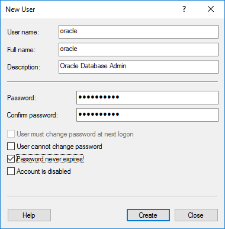
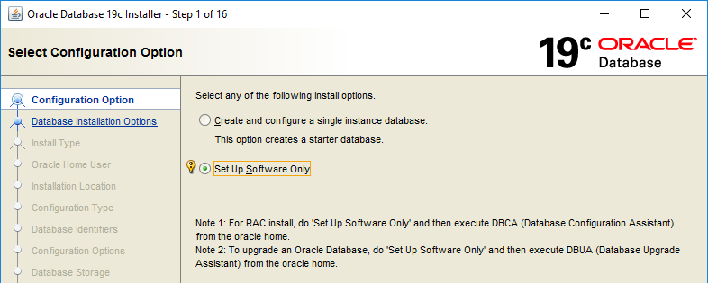
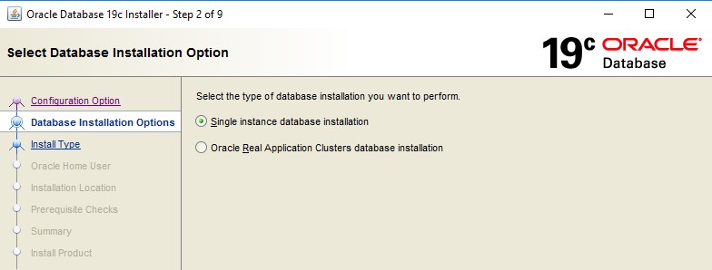
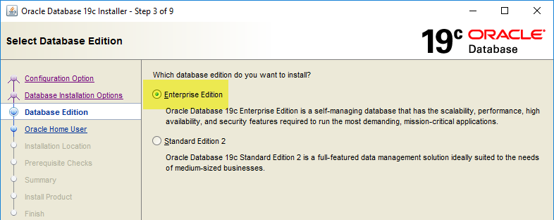
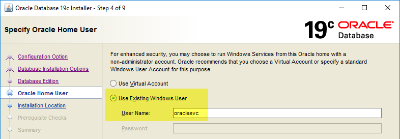
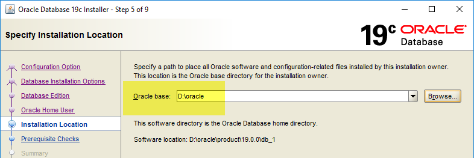
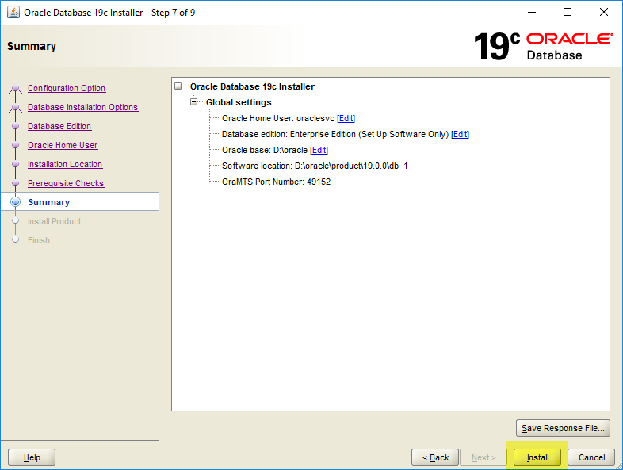
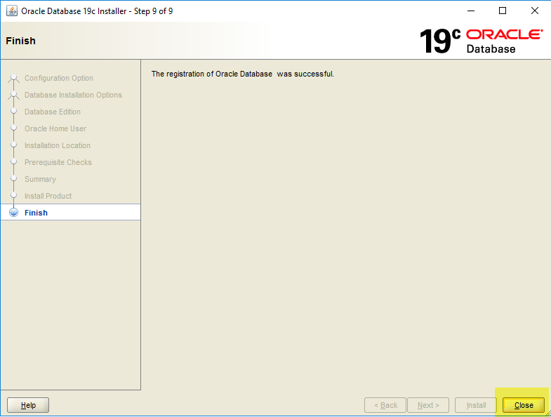

# Bài 10: Thực hành - Cài đặt Oracle Database Software trên Windows

## 🎯 Mục tiêu bài học
Chào mừng bạn đến với bài thực hành cài đặt Oracle Database trên môi trường Windows! Sau bài học này, bạn sẽ tự tay:
- Chuẩn bị hệ điều hành Windows để cài đặt Oracle.
- Tải, giải nén và cấu hình đúng chuẩn các thư mục `ORACLE_BASE` và `ORACLE_HOME`.
- Sử dụng Oracle Universal Installer (OUI) để cài đặt phần mềm Oracle Database 19c.
- Hiểu rõ về các User và Group phân quyền mà Oracle tự động tạo ra.

> 💡 **Tại sao DBA cần biết điều này?**
> Trong thực tế, việc cài đặt phần mềm Database là bước đi đầu tiên của mọi DBA. Việc setup đúng chuẩn ngay từ đầu (phân quyền user, tách biệt ổ đĩa C/D) sẽ giúp hệ thống bảo mật tốt hơn và dễ dàng bảo trì về sau.

---

## 🛠️ Phần 1: Chuẩn bị trước khi cài đặt (Pre-installation)

Trước khi bắt tay vào cài đặt, giống như việc xây nhà cần làm móng, chúng ta cần tạo các User (tài khoản người dùng) trên Windows chuyên dụng để quản lý Oracle. 

> ⚠️ **Lưu ý thực tế:** Trong môi trường Production (thực tế), bạn luôn phải cập nhật Windows lên bản mới nhất trước khi cài. Ở bài thực hành này, chúng ta tạm bỏ qua bước update để tiết kiệm thời gian.

**Các bước thực hiện:**
1. Đăng nhập vào máy chủ Windows của bạn bằng quyền **Administrator**.
2. Click chuột phải vào nút **Start** (logo Windows góc trái bên dưới) và chọn **Computer Management**.
3. Ở bảng bên trái, mở rộng mục **Local Users and Groups** > click chọn **Users**.
4. Click chuột phải vào vùng trống bên phải và chọn **New User...**
5. Lần lượt tạo 2 user sau:
   - **`oracle`**: User này sẽ là người quản trị (DBA) chuyên dùng để đăng nhập và vận hành Database. Hãy tạo password cho user này.
   - **`oraclesvc`**: User này đóng vai trò là "Service Account" (tài khoản dịch vụ). Oracle sẽ dùng tài khoản này để chạy các dịch vụ (Windows Services) ngầm trong hệ thống.
6. Ở bảng bên trái, click chọn **Groups** > double click vào group **Administrators**.
7. Thêm user **`oracle`** vào group Administrators. (Tuyệt đối **không** thêm `oraclesvc` vào group này để đảm bảo an toàn bảo mật).
8. **Đăng xuất (Sign out)** khỏi Windows và **đăng nhập lại bằng user `oracle`**. Từ giờ, chúng ta sẽ thực hiện mọi thứ bằng user này.

---

## 🚀 Phần 2: Cài đặt Oracle Database Software

Bây giờ chúng ta sẽ tiến hành cài đặt. Trên máy tính thực hành, chúng ta giả sử có 2 ổ đĩa: Ổ C (chứa hệ điều hành) và Ổ D (100GB trống, chuyên để cài Oracle). 

> 💡 **Tips:** Việc tách biệt ổ đĩa HĐH và ổ đĩa Database giúp tránh tình trạng Database phình to làm đầy ổ C gây sập hệ điều hành.

### Bước 2.1: Tải và chuẩn bị thư mục
1. Tải bộ cài Oracle Database 19c (phiên bản Windows x64) từ trang chủ Oracle (file zip nặng khoảng 3GB).
2. Mở Command Prompt (cmd) hoặc File Explorer và tạo thư mục chứa phần mềm (đây sẽ là **ORACLE_HOME**):
   ```cmd
   mkdir D:\oracle\product\19.0.0\db_1
   ```
   *Giải thích: `ORACLE_HOME` là nơi chứa mã nguồn phần mềm Oracle.*
3. Giải nén toàn bộ nội dung file zip bộ cài trực tiếp vào thư mục `D:\oracle\product\19.0.0\db_1` vừa tạo. (Lưu ý: Không tạo thêm thư mục con khi giải nén).

### Bước 2.2: Chạy Oracle Universal Installer (OUI)
1. Vào thư mục `D:\oracle\product\19.0.0\db_1`.
2. Tìm và double-click vào file **`setup.exe`**. 
*(Màn hình OUI đầu tiên có thể mất một lúc để hiển thị, hãy kiên nhẫn)*.

3. Làm theo các bước trên giao diện OUI:

**Màn hình 1: Configuration Option**
- Chọn **"Set Up Software Only"** (Chỉ cài đặt phần mềm). Chúng ta sẽ học cách tạo Database (tạo kho dữ liệu) ở một bài khác.


**Màn hình 2: Database Installation Options**
- Chọn **"Single instance database installation"** (Cài đặt máy chủ độc lập).


**Màn hình 3: Database Edition**
- Chọn **"Enterprise Edition"** (Phiên bản cao cấp đầy đủ tính năng nhất).


**Màn hình 4: Oracle Home User Selection**
- Chọn **"Use Existing Windows User"** và nhập User Name là **`oraclesvc`** cùng mật khẩu bạn đã tạo ở phần 1. 
- *Ví von:* Đây giống như việc bạn cấp một chiếc thẻ nhân viên riêng biệt (`oraclesvc`) cho Oracle để nó có quyền chạy các tác vụ ngầm.


**Màn hình 5: Installation Location**
- Nhập **Oracle Base**: `D:\oracle`
- OUI sẽ tự động nhận diện Software Location (Oracle Home) là thư mục bạn đang chạy file setup.


**Màn hình 6: Prerequisite Checks**
- Trình cài đặt sẽ tự động kiểm tra xem máy bạn có đủ RAM, đủ ổ cứng và cấu hình chuẩn chưa. Nếu mọi thứ xanh mượt, hệ thống sẽ chuyển sang bước tiếp.


**Màn hình 7: Summary**
- Kiểm tra lại toàn bộ cấu hình. Bấm **"Install"**.


**Màn hình 8: Install Product**
- Ngồi nhâm nhi tách cà phê và đợi tiến trình chạy 100%.


**Màn hình 9: Finish**
- Khi hiện chữ "The setup of Oracle Database was successful", hãy bấm **"Close"**.


---

## 🔍 Phần 3: Kiểm tra sau cài đặt (Post-installation)

Sau khi cài xong, Oracle đã âm thầm tạo ra một số cấu hình quan trọng trong hệ điều hành. Hãy cùng khám phá:

1. **Kiểm tra thư mục Inventory:**
   Mở File Explorer vào đường dẫn: `C:\Program Files\Oracle\Inventory\ContentsXML`. Đây là "cuốn sổ tay" của Oracle ghi chú lại những gì nó đã cài trên máy này.

2. **Kiểm tra các Windows Groups mới:**
   Mở lại **Computer Management** > **Local Users and Groups** > **Groups**. 
   Bạn sẽ thấy có các group mới bắt đầu bằng chữ `ORA_` được tạo ra.
   
   - **`ORA_DBA`**: Những ai nằm trong group này sẽ có quyền năng tối thượng (đăng nhập vào Database với quyền `SYSDBA` mà không cần nhập mật khẩu trong hệ thống cục bộ). Bạn hãy kiểm tra xem user `oracle` có nằm trong group này chưa nhé.
   - **`ORA_INSTALL`**: Group dành cho việc cài đặt và cấp quyền lên thư mục phần mềm. Hãy kiểm tra xem `oraclesvc` có nằm trong đây không.

> ⚠️ **Xử lý lỗi thường gặp:**
> - *Lỗi giải nén:* Đảm bảo giải nén trúng thư mục `db_1` chứ không sinh ra thư mục con (VD: `db_1/WINDOWS.X64_193000...`). Nếu có thư mục con, file setup.exe sẽ không chạy đúng cấu trúc ORACLE_HOME.
> - *Setup.exe chớp tắt:* Tắt diệt virus hoặc chạy lại setup.exe dưới quyền Run As Administrator.
> - *Báo lỗi thư mục không trống:* Nếu cài thất bại và phải cài lại, bạn cần xóa trắng thư mục `db_1` và giải nén lại từ đầu.

---

## 📝 Tóm tắt bài học

- Bạn đã biết cách phân vai trò user trên Windows: `oracle` để quản trị, `oraclesvc` để làm Service Account.
- Bạn đã cài đặt thành công Oracle Database Software 19c.
- Bạn đã phân biệt được **ORACLE_BASE** (thư mục gốc chứa nhiều phần mềm Oracle, dữ liệu, logs) và **ORACLE_HOME** (thư mục cài đặt một phiên bản phần mềm cụ thể).

## ❓ Câu hỏi ôn tập

**1. Tại sao chúng ta không dùng tài khoản Administrator mặc định của Windows để vận hành Oracle?**
> **Trả lời:**
> Áp dụng nguyên tắc đặc quyền tối thiểu (Principle of Least Privilege):
> - Tài khoản `Administrator` có toàn quyền can thiệp vào toàn bộ hệ điều hành Windows, nếu có lỗi bảo mật từ ứng dụng bên ngoài hoặc script database, kẻ tấn công có thể chiếm quyền kiểm soát toàn bộ máy chủ.
> - Tách biệt user chuyên dụng (như `oracle` để quản trị và `oraclesvc` với quyền hạn dịch vụ tối thiểu) giúp hạn chế rủi ro bảo mật, dễ dàng phân quyền và audit hoạt động của hệ thống.

**2. Group `ORA_DBA` trên Windows có ý nghĩa gì đối với bảo mật của Oracle Database?**
> **Trả lời:**
> Group `ORA_DBA` trên Windows tương đương với group `dba` trên Linux. Bất kỳ tài khoản người dùng Windows nào được thêm vào group `ORA_DBA` đều được cấp quyền quản trị cao nhất qua OS Authentication: có thể mở Command Prompt và gõ lệnh `sqlplus / as sysdba` để truy cập database mà không cần nhập mật khẩu của user `SYS`. Do đó, cần kiểm soát cực kỳ nghiêm ngặt danh sách thành viên của group này.

**3. Nếu muốn cài bản Oracle 21c trên cùng máy này, thư mục ORACLE_HOME của bạn nên đặt tên là gì để chuẩn nhất?**
> **Trả lời:**
> Theo tiêu chuẩn OFA (Optimal Flexible Architecture), thư mục nên được đặt tên phân biệt rõ phiên bản và mục đích, ví dụ:
> `C:\app\oracle\product\21.3.0\dbhome_1`
> Trong đó `C:\app\oracle` là `ORACLE_BASE`, `21.3.0` là phiên bản và `dbhome_1` là home đầu tiên của phiên bản đó. Tránh đặt tên chung chung như `db_home` để không bị xung đột với bản 19c (`19.3.0\dbhome_1`).


---

!!! info "Nguồn gốc"
    `Oracle-Database-Administration-from-Zero-to-Hero/VN/10-thuc-hanh-cai-oracle-windows.md`
