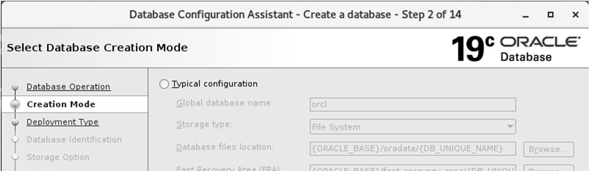
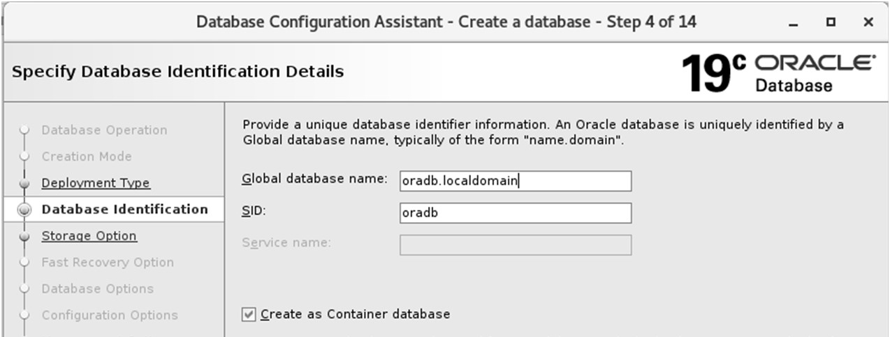
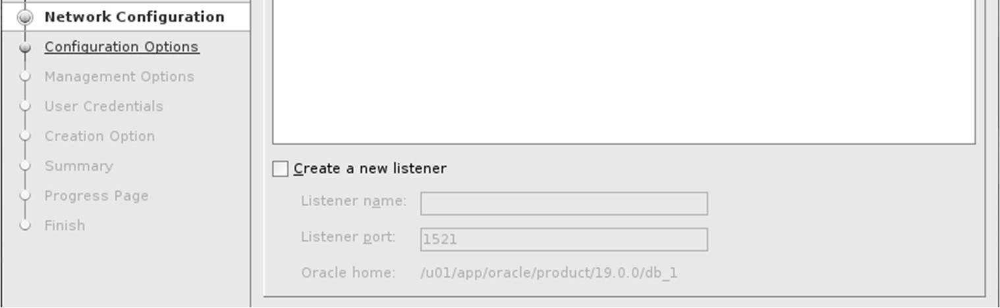

# Bài 11: Tạo Oracle Database (Creating an Oracle Database)

Chào mừng bạn đến với bài học quan trọng bậc nhất trong hành trình trở thành một Oracle DBA! Giống như việc xây một ngôi nhà, việc tạo lập cơ sở dữ liệu (Database) đòi hỏi sự chuẩn bị kỹ lưỡng và thao tác chuẩn xác. Trong bài này, chúng ta sẽ học cách tạo một Oracle Database hoàn chỉnh từ con số không.

## 🎯 Mục Tiêu Học Tập
Sau bài học này, bạn sẽ có thể:
1. Lên kế hoạch chi tiết trước khi tạo Database.
2. Hiểu và sử dụng công cụ **DBCA (Database Configuration Assistant)**.
3. Tạo Database bằng giao diện đồ họa (GUI) và chế độ không tương tác (Silent Mode).
4. Cài đặt các schema mẫu (Sample Schemas) để học tập.
5. Xóa (Drop) một Database an toàn.
6. Nắm vững các nguyên tắc thực tiễn (best practices) khi tạo Database.

---

## 🏗️ 1. Lập Kế Hoạch Trước Khi Xây Dựng (Planning)

Trước khi bấm nút "Create", bạn cần trả lời các câu hỏi sau, giống như kiến trúc sư phác thảo bản vẽ trước khi xây nhà:

*   **Sức chứa (Capacity):** Bao nhiêu người dùng sẽ kết nối đồng thời? Dung lượng lưu trữ dự kiến là bao nhiêu?
*   **Tên cơ sở dữ liệu (Database Name - `DB_NAME`):** Đây là tên "khai sinh" của DB. Chỉ được dùng chữ cái, số, ký tự `_`, `#`, `$`.
*   **Tên miền (Domain Name - `DB_DOMAIN`):** Ví dụ `ctyABC.com`. Kết hợp với `DB_NAME` sẽ tạo thành **Global Database Name** (ví dụ: `orcl.ctyABC.com`).
*   **Character Set:** Bộ mã ký tự (rất quan trọng, giải thích chi tiết ở phần sau).
*   **Block Size:** Kích thước "viên gạch" cơ sở của Oracle. Mặc định là **8K** (khuyên dùng chung), **4K** cho hệ thống giao dịch (OLTP), **16K** cho kho dữ liệu (Data Warehouse).
*   **Multitenancy:** Có dùng kiến trúc Container DB (CDB) và Pluggable DB (PDB) không?

> 💡 **Khái niệm cốt lõi: SID, DB_NAME và ORACLE_SID**
> *   **`DB_NAME`**: Tên định danh của *Database* (phần dữ liệu vật lý nằm trên đĩa cứng).
> *   **SID (System Identifier)**: Tên định danh của *Instance* (phần bộ nhớ RAM và các process chạy nền trên máy chủ).
> *   **`ORACLE_SID`**: Là một biến môi trường (environment variable) của hệ điều hành, dùng để báo cho hệ điều hành biết bạn đang muốn làm việc với Instance nào.
> 
> *Ví dụ đời thường*: `DB_NAME` giống như nội dung cuốn sách, còn `SID` giống như người đang đọc cuốn sách đó. Bạn có thể có nhiều người (Instance) cùng đọc một cuốn sách (Database) trong hệ thống Oracle RAC. Với hệ thống Single Instance (1 DB - 1 Instance), người ta thường đặt `DB_NAME` và `SID` giống hệt nhau cho dễ quản lý.

---

## 🛠️ 2. Các Công Cụ Tạo Database

Oracle cung cấp 2 phương pháp chính để tạo Database:

### 2.1. Sử Dụng Lệnh SQL (`CREATE DATABASE`)
Bạn có thể tự viết một script SQL chứa lệnh `CREATE DATABASE`. Phương pháp này giống như việc bạn tự tay trộn vôi vữa, xếp từng viên gạch. Rất thủ công, dễ sai sót nếu bạn chưa có kinh nghiệm, nhưng mang lại sự linh hoạt tối đa.

### 2.2. Sử Dụng DBCA (Database Configuration Assistant)
**DBCA là gì?** Đây là một công cụ (wizard) cực kỳ mạnh mẽ do Oracle cung cấp. Nó tự động hóa quá trình tạo Database, giúp bạn thiết lập mọi thứ thông qua các màn hình giao diện (GUI) hoặc bằng các tham số dòng lệnh (Silent Mode).
**Tại sao nên dùng DBCA?** 
*   An toàn và chuẩn xác (giảm thiểu lỗi do con người).
*   Nhanh chóng (chỉ cần click "Next").
*   Tự động cấu hình các file chuẩn của Oracle.

**DBCA có hai chế độ hoạt động:**
1.  **Interactive Mode (Giao diện GUI):** Dùng chuột click chọn, phù hợp cho người mới hoặc khi cài đặt đơn lẻ.
2.  **Silent Mode (Dòng lệnh):** Chạy DBCA qua terminal mà không hiện giao diện. Cực kỳ hữu ích khi bạn phải cài đặt tự động trên nhiều máy chủ, hoặc máy chủ Linux không có môi trường giao diện đồ họa.

---

## 🖥️ 3. Các Bước Tạo Database Bằng DBCA (Giao diện GUI)

> ⚠️ **Lưu ý quan trọng**: Trước khi tạo DB, hệ thống cần phải có **Listener** đang chạy. Bạn có thể tạo Listener bằng công cụ **`netca`** (Network Configuration Assistant).
> Lệnh chạy netca: `netca -silent -responsefile /u01/app/oracle/product/19.0.0/db_1/assistants/netca/netca.rsp`

Hãy khởi chạy DBCA bằng cách gõ lệnh `dbca` trên terminal. Dưới đây là các bước chính:

### Bước 1: Chọn Database Operation
Chọn "Create a database".



### Bước 2: Chọn Creation Mode
Chọn "Advanced configuration" để chúng ta có thể kiểm soát chi tiết mọi cấu hình.

### Bước 3: Chọn Template (Khuôn mẫu)
Oracle cung cấp sẵn các Template giống như các "bản thiết kế nhà mẫu":
*   **General Purpose / Transaction Processing:** Dành cho hệ thống chung và các ứng dụng giao dịch (OLTP) như web bán hàng, hệ thống nhân sự.
*   **Data Warehouse:** Dành cho kho dữ liệu, hệ thống báo cáo phân tích khối lượng lớn.
*   **Custom Database:** Bạn tự cấu hình từ A-Z.

### Bước 4: Tên và Kiến Trúc (Database Identification)
*   Nhập `Global database name` và `SID`.
*   Chọn có tạo **Container database** (CDB) hay không. (Trong khóa học này, chúng ta sẽ thực hành với CDB).



### Bước 5: Cấu Hình Lưu Trữ (Storage Option)
Lựa chọn nơi các file dữ liệu sẽ được tạo ra: trên File System thông thường hay trên hệ thống ASM (Automatic Storage Management).

### Bước 6: Cấu Hình Fast Recovery Area (FRA)
FRA là một khu vực đặc biệt dùng để chứa các file liên quan đến sao lưu và phục hồi. Bạn có thể bật tính năng này sau khi tạo DB, nhưng thường nên cấu hình ngay từ đầu và cấp phát dung lượng tối đa mà ổ cứng cho phép.

### Bước 7: Memory và Character Set
Đây là bước cực kỳ quan trọng:
*   **Memory (Bộ nhớ):** Phân bổ RAM cho SGA và PGA. Thông thường Oracle có tính năng tự động quản lý bộ nhớ (AMM hoặc ASMM).
*   **Character Set (Bảng mã):**
    > 💡 **Khuyên dùng `AL32UTF8`**: Đây là bộ mã chuẩn Unicode hỗ trợ mọi ngôn ngữ trên thế giới (bao gồm tiếng Việt). Một khi DB đã tạo với một character set, việc thay đổi sau này là CỰC KỲ rủi ro và phức tạp. Do đó, hãy luôn chọn `AL32UTF8` trừ khi có yêu cầu đặc thù từ ứng dụng cũ.



### Bước 8: Tạo Script và Kết thúc
Bạn có thể lưu các cấu hình thành một "Template" mới hoặc xuất ra các file script SQL để sau này dùng lại. Sau khi hoàn tất, click "Finish" và Oracle sẽ bắt đầu xây dựng Database.

---

## 📂 4. Cấu Trúc File Sau Khi Tạo Database

Sau khi DBCA chạy xong, một "ngôi nhà" Database hoàn chỉnh sẽ bao gồm các thành phần vật lý chính sau trên đĩa cứng:
1.  **Datafiles (`.dbf`)**: Chứa dữ liệu thực sự (bảng, dữ liệu người dùng).
2.  **Control files (`.ctl`)**: File điều khiển, như bộ não ghi nhớ cấu trúc và trạng thái của toàn bộ Database.
3.  **Redo Log files (`.log`)**: Ghi nhận mọi thay đổi của dữ liệu để phục hồi khi có sự cố.
4.  **Parameter file (`spfile.ora` hoặc `init.ora`)**: Lưu các cấu hình khởi động của Instance (như bộ nhớ, tên DB...).
5.  **Password file (`orapw<SID>`)**: Dùng để xác thực các user đặc quyền (như SYSDBA).

---

## ⌨️ 5. Tạo Database Bằng DBCA Silent Mode

Khi bạn là một DBA chuyên nghiệp, bạn sẽ thường xuyên dùng **Silent Mode** để tự động hóa.
Bạn có thể cung cấp các thông số qua **Response File** (một file text chứa các cấu hình), hoặc gõ trực tiếp trên dòng lệnh.

Ví dụ lệnh tạo DB trong Silent Mode:
```bash
dbca -silent -createDatabase \
-templateName General_Purpose.dbc \
-gdbname cdb3 -sid cdb3 -responseFile NO_VALUE \
-characterSet AL32UTF8 \
-createAsContainerDatabase true \
-numberOfPDBs 1 \
-pdbName pdb3 \
-pdbAdminPassword OraPasswd1 \
```
*(Lệnh này tạo một Container DB tên là cdb3, chứa 1 Pluggable DB tên là pdb3, mã ký tự AL32UTF8).*

---

## 📚 6. Sample Schemas (Dữ Liệu Mẫu)

Oracle cung cấp các Schema mẫu (dựa trên một công ty giả định) để bạn học tập và thực hành SQL.
Các schema phổ biến:
*   **HR (Human Resources):** Quản lý nhân sự (bảng employees, departments...)
*   **OE (Order Entry):** Quản lý bán hàng.
*   **SH (Sales History):** Dùng cho thực hành kho dữ liệu.

> ⚠️ **Lưu ý**: Từ bản 12c R2 trở đi, DBCA chỉ hỗ trợ cài sẵn schema HR. Các schema khác bạn phải lên [GitHub của Oracle](https://github.com/oracle/db-sample-schemas) tải về và chạy script cài đặt thủ công.

Lệnh SQL kiểm tra các user hệ thống (không phải user mẫu):
```sql
-- Kiểm tra các user không phải mặc định của Oracle
SELECT USERNAME FROM DBA_USERS 
WHERE ORACLE_MAINTAINED='N' 
ORDER BY 1;
```

---

## 🗑️ 7. Xóa Oracle Database (Dropping)

Nếu bạn muốn đập bỏ ngôi nhà để xây lại, DBCA cũng hỗ trợ xóa một cách sạch sẽ:
1. Dùng giao diện DBCA, chọn "Delete a database".
2. Dùng Silent Mode:
```bash
dbca -silent -deleteDatabase -sourceDB ${ORACLE_SID} -sysDBAUserName sys -sysDBAPassword <password>
```
3. Dùng lệnh SQL (Nguy hiểm, hãy cẩn thận!):
```sql
-- Đăng nhập vào SQL*Plus với quyền SYSDBA, mount database ở chế độ RESTRICTED, sau đó:
DROP DATABASE;
```

---

## 📝 Tóm Tắt (Summary)
*   Chuẩn bị kỹ lưỡng về tên (`DB_NAME`, `SID`), bộ nhớ và đặc biệt là **Character Set (`AL32UTF8`)** trước khi tạo DB.
*   **DBCA** là công cụ tốt nhất để tạo DB, hỗ trợ cả giao diện đồ họa lẫn Silent Mode.
*   Hiểu rõ các loại Template để chọn cho phù hợp với loại hình hệ thống.
*   Có thể dùng Silent Mode để triển khai hàng loạt một cách tự động.

## ❓ Câu Hỏi Ôn Tập

**1. Sự khác biệt giữa `DB_NAME` và `SID` là gì? Khi nào thì chúng có thể khác nhau?**
> **Trả lời:**
> - **`DB_NAME` (Database Name):** Là định danh logic duy nhất của toàn bộ cơ sở dữ liệu vật lý (tập hợp các datafiles, control files, redo logs trên đĩa). Tối đa 8 ký tự.
> - **`SID` (System Identifier):** Là tên định danh duy nhất của **Database Instance** (tiến trình và vùng nhớ RAM) trên một máy chủ hệ điều hành cụ thể.
> - **Khi nào khác nhau?** Trong môi trường Oracle RAC (Real Application Clusters), nhiều instance cùng chạy trên các node khác nhau để phục vụ cho một database chung. Khi đó `DB_NAME` là giống nhau trên toàn cụm (ví dụ: `PROD`), nhưng mỗi node sẽ có một `SID` riêng biệt (ví dụ node 1 là `PROD1`, node 2 là `PROD2`).

**2. Tại sao lại được khuyên dùng character set `AL32UTF8` khi tạo Database mới?**
> **Trả lời:**
> `AL32UTF8` là bảng mã chuẩn hóa quốc tế của Unicode (tương đương UTF-8 chuẩn). Nó hỗ trợ lưu trữ hầu hết mọi ngôn ngữ trên thế giới (bao gồm tiếng Việt có dấu đầy đủ, tiếng Trung, tiếng Nhật, ký tự biểu cảm emoji...) với cơ chế biến đổi độ dài byte (1 đến 4 bytes/ký tự) giúp tiết kiệm dung lượng. Sử dụng `AL32UTF8` ngay từ đầu giúp tránh được các dự án di chuyển dữ liệu (character set migration) cực kỳ tốn kém và rủi ro khi hệ thống mở rộng đa ngôn ngữ sau này.

**3. Nếu máy chủ Linux của bạn không có giao diện đồ họa (GUI), bạn sẽ tạo Database bằng cách nào?**
> **Trả lời:**
> Bạn sử dụng công cụ DBCA chạy ở chế độ **Silent Mode** với file cấu hình tham số:
> ```bash
> dbca -silent -createDatabase -responseFile /duong_dan/dbca.rsp
> ```
> Hoặc truyền trực tiếp các tham số trên dòng lệnh (`-gdbName`, `-sid`, `-templateName`, `-characterSet`, `-memoryPercentage`...).
> Ngoài ra, DBA cấp cao có thể dùng script SQL thủ công (`CREATE DATABASE ...`), nhưng DBCA silent mode vẫn là phương pháp chuẩn và an toàn nhất.

**4. Kể tên 3 loại file vật lý cốt lõi được tạo ra sau khi xây dựng xong một Oracle Database.**
> **Trả lời:**
> Ba loại file vật lý cốt lõi (bắt buộc phải có để database hoạt động) gồm:
> 1. **Data files (`.dbf`):** Chứa dữ liệu thực tế của các bảng, index, từ điển dữ liệu, undo...
> 2. **Control files (`.ctl`):** Chứa metadata cấu trúc vật lý của database (tên database, vị trí datafiles, redo log files, SCN hiện tại, checkpoint info).
> 3. **Online Redo Log files (`.log`):** Chứa nhật ký ghi lại mọi thay đổi trên block dữ liệu phục vụ cho việc phục hồi sự cố (Instance Recovery / Crash Recovery).


---

!!! info "Nguồn gốc"
    `Oracle-Database-Administration-from-Zero-to-Hero/VN/11-tao-oracle-database.md`
