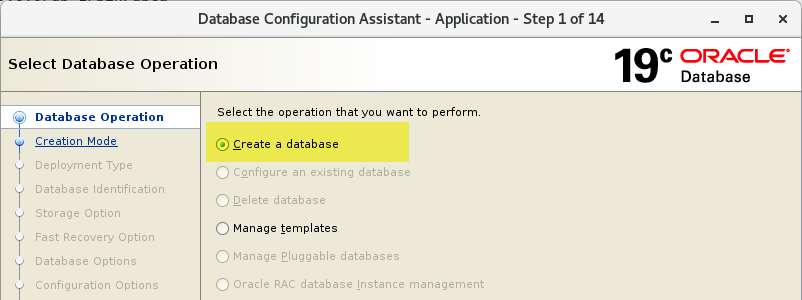
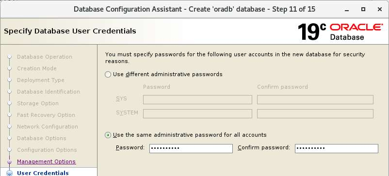
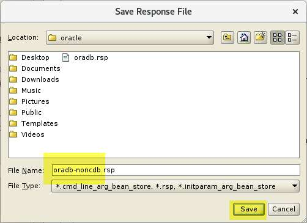

# Bài 12: Thực hành - Tạo Oracle Databases

Chào mừng các bạn đến với Bài 12! Trong bài học này, chúng ta sẽ xắn tay áo lên và thực hành tạo cơ sở dữ liệu (Database) Oracle trên cả hai hệ điều hành phổ biến: Linux và Windows. 

> 💡 **Mục tiêu bài học:** 
> Sau bài này, bạn sẽ biết cách tự tay tạo một Oracle non-CDB database trên môi trường Linux (bằng dòng lệnh - silent mode) và trên Windows (sử dụng giao diện đồ họa).

---

## 1. Tạo Database Oracle (non-CDB) trên Linux (Silent Mode)

Trong thực tế, các DBA thường xuyên phải cài đặt Oracle trên các máy chủ Linux không có giao diện đồ họa (GUI). Do đó, việc sử dụng chế độ "Silent Mode" (chế độ ẩn/dòng lệnh) là một kỹ năng cực kỳ quan trọng. 

> ⚠️ **Lưu ý:** Trong các hệ thống Production mới, Oracle khuyến nghị sử dụng kiến trúc Multitenant (CDB/PDB). Tuy nhiên, vì vẫn còn rất nhiều hệ thống cũ chạy non-CDB, chúng ta sẽ thực hành tạo non-CDB trước.

### Bước 1: Chuẩn bị môi trường
Hãy đảm bảo máy chủ Linux (`srv1`) của bạn đang chạy.
Mở Putty và đăng nhập với user `oracle`. 

Kiểm tra các biến môi trường quan trọng (để chắc chắn Oracle biết phải cài đặt vào đâu):
```bash
echo $ORACLE_BASE
echo $ORACLE_HOME
echo $ORACLE_SID
```

### Bước 2: Kiểm tra và tạo Listener
Listener giống như một "nhân viên lễ tân", chuyên tiếp nhận các kết nối đến Database. Chúng ta cần đảm bảo chưa có Listener nào đang chạy, sau đó tạo một Listener mới.

Kiểm tra Listener hiện tại:
```bash
# Kiểm tra trạng thái của listener
lsnrctl status

# Hoặc dùng lệnh ps để tìm tiến trình listener đang chạy
ps -ef | grep lsn
```

Tạo một Listener mới bằng chế độ silent:
```bash
# Gọi công cụ NetCA (Network Configuration Assistant) ở chế độ im lặng
netca -silent -responsefile /u01/app/oracle/product/19.0.0/db_1/assistants/netca/netca.rsp
```

### Bước 3: Tạo File Cấu Hình (Response File) bằng GUI
Mở giao diện GUI của máy `srv1` (qua VirtualBox), mở Terminal và chạy lệnh `dbca`:
```bash
which dbca
dbca
```
Làm theo các bước trên giao diện để cấu hình DB, **NHƯNG** ở bước cuối, thay vì chọn "Create Database", hãy chọn **"Generate Response File"** để lưu cấu hình thành một file `.rsp` (ví dụ: `oradb-noncdb.rsp`).



### Bước 4: Chạy DBCA bằng Silent Mode
Mở lại Putty, kiểm tra file response vừa tạo. Lưu ý rằng file này không lưu mật khẩu và một số tùy chọn (như `dbOptions`), nên chúng ta phải truyền thêm vào qua dòng lệnh.

```bash
# Lệnh tạo database ở chế độ silent, truyền vào file response và cấu hình thêm dbOptions
dbca -createDatabase -silent -responseFile /home/oracle/oradb-noncdb.rsp -dbOptions JSERVER:true,DV:false,APEX:false,OMS:false,SPATIAL:false,IMEDIA:false,ORACLE_TEXT:false,CWMLITE:false -sampleSchema true
```
> 💡 **Tip:** Khi được hỏi, hãy nhập mật khẩu cho SYS và SYSTEM (ví dụ: `ABcd##1234`). Nhập cẩn thận vì màn hình sẽ không hiển thị ký tự (kể cả dấu `*`).

### Bước 5: Kiểm tra Database
Khi DBCA chạy xong, kiểm tra xem tiến trình `pmon` (tiến trình lõi của Oracle) đã lên chưa:
```bash
# Tìm tiến trình pmon
ps -ef | grep pmon

# Đăng nhập vào database bằng quyền DBA tối cao
sqlplus / as sysdba
```

Kiểm tra các thành phần đã cài đặt:
```sql
set linesize 180
col COMP_NAME for a40
col STATUS for a15
col VERSION for a10

-- Truy vấn xem các thành phần (components) nào đang có trong DB
SELECT COMP_NAME, STATUS, VERSION FROM DBA_REGISTRY ORDER BY 1;
```

Cài đặt Schema mẫu (HR schema):
```sql
-- Chạy script tạo user HR (dữ liệu mẫu để thực hành)
@ $ORACLE_HOME/demo/schema/human_resources/hr_main_new.sql
```
Kiểm tra lại xem dữ liệu mẫu đã có chưa:
```sql
SELECT USERNAME FROM DBA_USERS WHERE USERNAME='HR';
SELECT COUNT(*) FROM HR.EMPLOYEES;
```

### Bước 6: Cấu hình tự động khởi động (Auto-restart)
Khi máy chủ Linux khởi động lại, Database sẽ không tự bật trừ khi ta cấu hình nó.
Chuyển sang user `root` và sửa file `/etc/oratab`:
```bash
# Đổi cờ N thành Y ở cuối dòng
vi /etc/oratab
# oradb:/u01/app/oracle/product/19.0.0/db_1:Y
```

Tạo script `/etc/init.d/dbora` để hệ điều hành gọi lệnh `dbstart` khi bật máy và `dbshut` khi tắt máy. Phân quyền cho script và tạo các symbolic links (tắt/bật dịch vụ theo run-level của Linux).

---

## 2. Tạo Database Oracle (non-CDB) trên Windows

Việc tạo Database trên Windows thường dễ dàng và trực quan hơn nhờ giao diện đồ họa. Chúng ta sẽ tạo một database tên là `orawindb` trên máy `winsrv`.

### Bước 1: Tạo Listener bằng NetCA
Mở **Command Prompt (Run as Administrator)** và gõ:
```cmd
netca
```
Giao diện sẽ hiện ra, bạn chỉ cần chọn cấu hình Listener, dùng cổng mặc định 1521.


Vào `services.msc` trong Windows, bạn sẽ thấy một service mới tên là **OracleOraDB19Home1TNSListener** đang chạy.

### Bước 2: Tạo Database bằng DBCA
Trên Command Prompt, gõ:
```cmd
dbca
```
Cửa sổ **Database Configuration Assistant** xuất hiện. 
1. Chọn **Create a database**.
2. Chọn **Advanced configuration** để có thể tùy chỉnh chi tiết hơn.
3. Database type: **Oracle single instance database**, và loại là **General Purpose**.
4. Global Database Name: `orawindb`, bỏ chọn ô "Create as Container database" (vì ta đang tạo non-CDB).



> 💡 **Khái niệm thực tế:** Ở màn hình "Customize Storage Locations", bạn sẽ thấy mục giới hạn số lượng Data Files (mặc định là 100). Trong thực tế với các DB lớn, bạn phải tăng con số này lên vì sau khi tạo DB, đổi thông số này khá phức tạp. Kích thước Redo Log cũng nên được cân nhắc tăng nếu hệ thống giao dịch nhiều.

Ở bước "Sample Schemas", nhớ chọn cài đặt để tạo sẵn user HR. Và ở bước "Passwords", mở khóa (Unlock) tài khoản HR và đặt mật khẩu.

### Bước 3: Kiểm tra Database trên Windows
Mở Command Prompt và đăng nhập:
```cmd
sqlplus / as sysdba
```
Kiểm tra xem HR schema có hoạt động không:
```sql
-- Kết nối vào user HR
conn hr/ABcd##1234

-- Đếm số nhân viên trong bảng mẫu
SELECT COUNT(*) FROM EMPLOYEES ;
```
Vào `services.msc`, bạn sẽ thấy 2 service mới:
- **OracleServiceORAWIBDB**: Dịch vụ chính của Database. Nhờ service này, Database trên Windows tự động khởi động khi bật máy tính.
- **OracleVssWriterORAWIBDB**: Dịch vụ hỗ trợ backup VSS (nếu không dùng, bạn có thể Stop và Disable nó đi cho nhẹ máy).

---

## 📝 Tóm tắt bài học

- Bạn đã biết cách sử dụng `NetCA` để tạo Listener (chế độ silent trên Linux và GUI trên Windows).
- Bạn đã trải nghiệm việc dùng `DBCA` tạo database ở chế độ đồ họa (Windows) và chế độ ẩn bằng file response (Linux).
- Bạn đã cấu hình để Database tự động khởi động cùng hệ điều hành trên Linux bằng cách chỉnh sửa `/etc/oratab` và tạo script dịch vụ. (Trên Windows, Oracle đã tự làm việc này thông qua Windows Services).

## ❓ Câu hỏi ôn tập

**1. Tại sao trong môi trường Production, người ta lại chuộng cài đặt Oracle Database bằng lệnh (Silent Mode) thay vì dùng giao diện đồ họa?**
> **Trả lời:**
> - **Tính tự động và lặp lại (Reproducibility):** Cho phép triển khai cấu hình giống hệt nhau trên hàng chục máy chủ (Dev, Test, Staging, Prod) thông qua Response File hoặc script IaC (Ansible/Terraform).
> - **Không phụ thuộc môi trường mạng & đồ họa:** Không cần cài đặt máy chủ X-Server, không lo bị đứt kết nối VNC/X11 giữa chừng khi mạng lag làm hỏng tiến trình tạo DB.
> - **Tiết kiệm tài nguyên server:** Máy chủ Production Linux thường cài đặt dạng Minimal/Server Core (không có giao diện Desktop GUI) nhằm tối ưu hiệu năng và giảm thiểu các lỗ hổng bảo mật.

**2. File cấu hình nào trong Linux quyết định việc Oracle có được khởi động cùng hệ điều hành hay không?**
> **Trả lời:**
> Đó là file **`/etc/oratab`**.
> Trong file này, mỗi database được định nghĩa theo cú pháp:
> `<ORACLE_SID>:<ORACLE_HOME>:<Y|N>`
> Ký tự cuối cùng:
> - `Y` (Yes): Cho phép script khởi động hệ thống (`dbstart` / `systemd service`) tự động start instance này khi máy chủ boot.
> - `N` (No): Không tự động khởi động.

**3. Trên Windows, làm cách nào để biết Oracle Database đã được bật hay chưa mà không cần dùng lệnh SQL*Plus?**
> **Trả lời:**
> - Mở công cụ **Windows Services (`services.msc`)**.
> - Tìm service có tên dạng: `OracleService<ORACLE_SID>` (ví dụ `OracleServiceORADB`).
> - Kiểm tra cột **Status**: Nếu hiển thị là **Running** thì Database Instance đã được khởi chạy. Nếu hiển thị trạng thái dừng hoặc trống thì database đang tắt. Ngoài ra cũng có thể kiểm tra service `OracleOraDB19Home1TNSListener` để biết Listener mạng có đang chạy hay không.

---

Chúc các bạn thực hành thành công! Hẹn gặp lại ở bài học tiếp theo.


---

!!! info "Nguồn gốc"
    `Oracle-Database-Administration-from-Zero-to-Hero/VN/12-thuc-hanh-tao-database.md`
