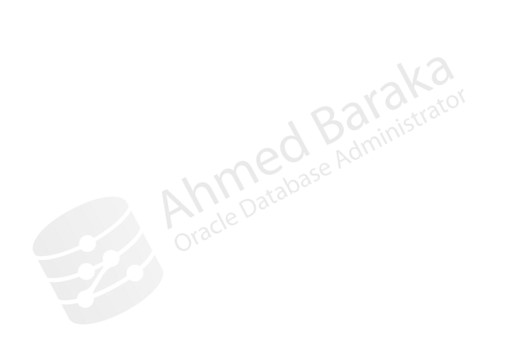
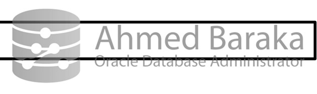
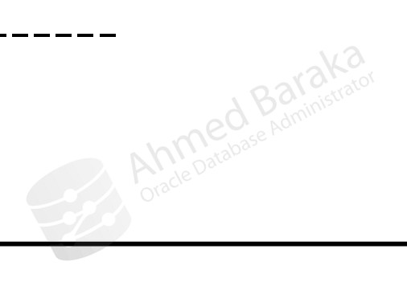
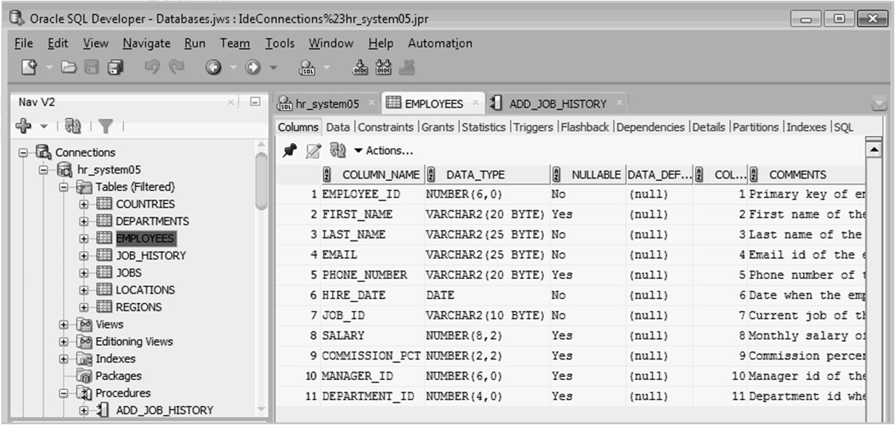

# Bài 13: Các công cụ quản trị Oracle Database

## Mục tiêu học tập
Trong bài này, chúng ta sẽ tìm hiểu về các công cụ quản trị Oracle Database phổ biến nhất. Là một DBA, việc thành thạo các công cụ này cũng giống như một người thợ mộc am hiểu từng món đồ nghề của mình vậy. Bạn sẽ biết khi nào nên dùng búa (SQL*Plus) và khi nào nên dùng máy khoan (OEM).

---

## 1. SQL*Plus và SQLcl: "Những người bạn đồng hành truyền thống"

### SQL*Plus là gì?
SQL*Plus là công cụ dòng lệnh (command-line) mặc định, đi kèm với mọi bản cài đặt Oracle Database. Nó giống như "Terminal" hay "Command Prompt", nơi bạn giao tiếp trực tiếp với cơ sở dữ liệu bằng các câu lệnh.

> 💡 **Thực tế:** Dù giao diện đen trắng trông có vẻ nhàm chán, nhưng SQL*Plus là công cụ cực kỳ quan trọng vì nó LUÔN LUÔN có sẵn. Trong các trường hợp khẩn cấp khi server bị lỗi hoặc bạn không thể dùng giao diện đồ họa, SQL*Plus chính là "chiếc phao cứu sinh" của bạn.

### Cách kết nối vào SQL*Plus

```bash
# Khởi động SQL*Plus nhưng chưa kết nối vào database
sqlplus /nolog
SQL> connect user/password

# Kết nối trực tiếp vào database local bằng user bình thường
sqlplus scott/tiger

# Kết nối với quyền cao nhất (SYSDBA) - thường dùng cho DBA
# Nếu user hệ điều hành của bạn thuộc group dba (như user 'oracle' trên Linux)
sqlplus / as sysdba

# Hoặc kết nối bằng user SYS với password cụ thể
sqlplus sys/MatKhauCuaBan as sysdba
```

### Cách chạy script trong SQL*Plus

Bạn có thể viết sẵn các câu lệnh SQL vào một file text (ví dụ `list-dept.sql`) và chạy nó:
```sql
-- Chạy script bằng ký tự @ (a còng) hoặc lệnh start
SQL> @list-dept
SQL> start list-dept.sql
```
*(Ghi chú: đuôi `.sql` là không bắt buộc khi gọi lệnh)*

### SQLcl (SQL Developer Command Line)
Oracle cung cấp thêm **SQLcl** - một công cụ dòng lệnh hiện đại hơn, thay thế cho SQL*Plus. Nó dựa trên Java và mang đến nhiều tính năng tiện lợi hơn (như tự động hoàn thành code, lịch sử lệnh, format kết quả dễ nhìn hơn).

---

## 2. Oracle SQL Developer: "Bàn làm việc tiện nghi"



**SQL Developer** là công cụ có giao diện đồ họa (GUI) hoàn toàn miễn phí do Oracle cung cấp. Nó viết bằng Java nên có thể chạy trên Windows, Linux, hoặc Mac.

- **Dành cho ai:** Developer và DBA đều rất thích dùng.
- **Tính năng:** Giúp bạn viết SQL, thiết kế bảng, xem dữ liệu, và thậm chí lập báo cáo chỉ bằng vài cú click chuột.
- **So sánh:** Nếu SQL*Plus là chiếc xe đạp đơn giản thì SQL Developer là một chiếc ô tô có đầy đủ tiện nghi (máy lạnh, GPS).

> ⚠️ **Lưu ý:** Từ bản 19c trở đi, SQL Developer không còn được cài sẵn kèm theo database nữa. Bạn sẽ cần tải nó riêng từ trang chủ của Oracle.

---

## 3. Các công cụ quản trị qua Web: EM Express và Cloud Control

### Oracle Enterprise Manager Database Express (EM Express)


Đây là giao diện web siêu nhẹ được tích hợp sẵn bên trong chính database của bạn. Bạn không cần cài thêm gì cả, chỉ cần mở trình duyệt web và gõ địa chỉ IP.

- **Chức năng chính:** Theo dõi tình trạng sức khỏe (Performance Hub), quản lý dung lượng (Tablespaces), xem câu lệnh nào đang chạy chậm.
- **Giới hạn:** Chỉ dùng để quản lý **một** database cục bộ (local). Yêu cầu phải có license của Diagnostics Pack và Tuning Pack để xem một số tính năng nâng cao.

### Oracle Enterprise Manager Cloud Control (OEM)


Nếu công ty bạn có 10, 50 hay hàng trăm database, bạn không thể mở hàng trăm tab EM Express được. Đó là lúc cần đến **OEM Cloud Control**.

- **Chức năng:** "Trạm điều khiển trung tâm". Quản lý, giám sát, backup, bảo mật cho tất cả các database, server, và ứng dụng trong toàn bộ công ty từ một màn hình duy nhất.
- **Yêu cầu:** Phải cài đặt phần mềm Agent lên các máy chủ, và cần mua license riêng khá đắt tiền.

---

## 4. Các công cụ đặc thù của DBA (Mở rộng)

Trong công việc hàng ngày, DBA còn làm việc với các công cụ không thể thiếu sau:

### DBCA (Database Configuration Assistant)
- **Công dụng:** Công cụ GUI dùng để tạo mới, xóa, hoặc cấu hình các tùy chọn của database.
- **Ví von:** Giống như "Wizard" cài đặt Windows, nó giúp bạn tạo ra một database chuẩn chỉnh mà không cần nhớ hàng tá câu lệnh phức tạp.

### RMAN (Recovery Manager)
- **Công dụng:** Công cụ dòng lệnh (hoặc gọi qua OEM) chuyên dụng cho việc Backup (sao lưu) và Recovery (phục hồi) dữ liệu.
- **Thực tế:** Đây là "bảo hiểm nhân thọ" của DBA. Nếu mất dữ liệu, RMAN sẽ giúp bạn cứu lại mọi thứ. Nó thông minh hơn copy file thông thường vì có thể backup trong lúc database vẫn đang hoạt động.

### Oracle Net Manager & Listener Control (`lsnrctl`)
- **Công dụng:** Quản lý "cánh cửa" mạng kết nối vào Database (Listener).
- Cụ thể, `lsnrctl` là dòng lệnh dùng để bật/tắt Listener, còn Net Manager là giao diện GUI để cấu hình các file mạng như `tnsnames.ora` hay `listener.ora`.

---

## 5. Tổng kết: Khi nào dùng công cụ nào?

| Mục đích / Tình huống | Công cụ khuyên dùng |
|-----------------------|---------------------|
| Khắc phục sự cố khẩn cấp, mất mạng, chạy script | **SQL\*Plus / SQLcl** |
| Truy vấn dữ liệu hàng ngày, viết code PL/SQL | **SQL Developer** |
| Xem nhanh hiệu năng của 1 database | **EM Express** |
| Quản trị hệ thống lớn (hàng chục database) | **OEM Cloud Control** |
| Tạo mới một database | **DBCA** |
| Backup hoặc cứu hộ dữ liệu | **RMAN** |

*(Ảnh minh họa Database Management Cloud Service và hệ sinh thái)*


---

## Câu hỏi ôn tập

**1. Tại sao DBA vẫn phải thành thạo SQL*Plus dù đã có SQL Developer?**
> **Trả lời:**
> - **Luôn có sẵn:** SQL*Plus đi kèm trong mọi bản cài đặt Oracle Database/Client trên mọi hệ điều hành (Linux, Unix, Windows) mà không cần cài đặt thêm Java Runtime hay môi trường đồ họa.
> - **Cứu hộ khẩn cấp:** Khi database bị treo, crash hoặc server chỉ truy cập được qua SSH/Putty dòng lệnh, SQL Developer hoàn toàn vô dụng. Chỉ có SQL*Plus mới cho phép DBA kết nối bằng socket nội bộ (`/ as sysdba`) để startup/shutdown và chẩn đoán.
> - **Tự động hóa tác vụ:** SQL*Plus là nền tảng để chạy các shell script, cron job, batch file định kỳ của hệ điều hành.

**2. So sánh sự khác biệt lớn nhất giữa EM Express và OEM Cloud Control.**
> **Trả lời:**
> - **Enterprise Manager Database Express (EM Express):** Là công cụ web nhẹ được tích hợp sẵn bên trong chính database kernel. **Chỉ quản lý được 1 database duy nhất**, chủ yếu theo dõi hiệu năng cơ bản, không cần cài đặt thêm server quản trị riêng.
> - **Oracle Enterprise Manager Cloud Control (OEM):** Là một hệ thống quản trị doanh nghiệp khổng lồ độc lập (gồm OMS server, Management Repository database và các Management Agent phân tán trên hàng trăm máy chủ). **Quản trị tập trung toàn bộ hạ tầng IT**: hàng trăm database, cụm RAC, Data Guard, máy chủ Exadata, middleware WebLogic và cloud.

**3. Nếu bạn muốn backup database trong lúc hệ thống vẫn đang online, bạn sẽ dùng công cụ nào?**
> **Trả lời:**
> Sử dụng **RMAN (Recovery Manager)**. RMAN là công cụ sao lưu chuyên dụng của Oracle, có khả năng sao lưu trực tuyến (Hot Backup / Online Backup) một cách nhất quán (consistent) mà không cần phải dừng database hay ngắt kết nối của người dùng. RMAN tự động bỏ qua các block trống, kiểm tra block corruption và tích hợp hoàn hảo với kiến trúc Archivelog.


---

!!! info "Nguồn gốc"
    `Oracle-Database-Administration-from-Zero-to-Hero/VN/13-cong-cu-quan-tri.md`
