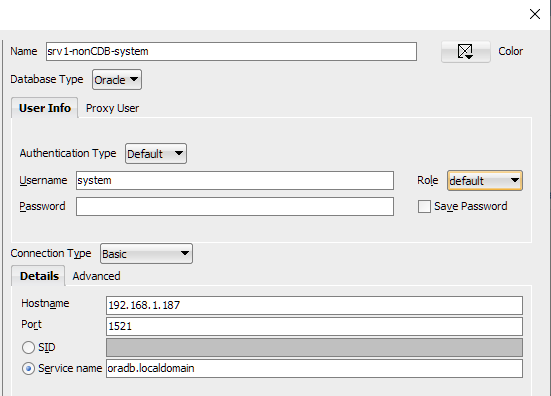

# Bài 15: Thực hành - Sử dụng SQL Developer

**Mục tiêu bài học:**
Trong bài thực hành này, bạn sẽ học cách cài đặt và sử dụng **Oracle SQL Developer** - một công cụ đồ họa (GUI) miễn phí và vô cùng mạnh mẽ của Oracle. Bạn sẽ biết cách kết nối vào database, thực thi các câu lệnh SQL, duyệt qua các đối tượng, và làm quen với các tính năng hữu ích cho DBA.

---

## 1. SQL Developer là gì? Tại sao lại cần nó?

Hãy tưởng tượng Oracle Database như một kho hàng khổng lồ không có cửa sổ. 
- **SQL*Plus** (mà bạn đã biết) giống như việc giao tiếp với kho hàng qua một cái bộ đàm: bạn nói lệnh (gõ text), nó trả lời (text). Rất nhanh và nhẹ, nhưng khó nhìn tổng thể.
- **SQL Developer** giống như bạn lắp một hệ thống camera quan sát có màn hình màu và bảng điều khiển hiện đại. Bạn có thể nhìn thấy mọi thứ (bảng, view, user) bằng cách click chuột, xuất báo cáo đẹp mắt mà không cần nhớ quá nhiều câu lệnh phức tạp.

> 💡 **So sánh SQL Developer vs SQL*Plus: Khi nào dùng cái nào?**
> - **Dùng SQL*Plus khi:** Bạn cần tốc độ, đang remote vào server Linux không có giao diện đồ họa, chạy các script tự động (batch jobs), hoặc thao tác những tác vụ quản trị cực kỳ cơ bản (như STARTUP/SHUTDOWN).
> - **Dùng SQL Developer khi:** Bạn cần viết/debug những câu lệnh SQL dài phức tạp, phân tích dữ liệu, xem cấu trúc bảng trực quan, export/import dữ liệu dễ dàng, hoặc quản lý nhiều database cùng lúc.

---

## 2. Hướng dẫn tải và cài đặt SQL Developer

**Bước 1: Tải bộ cài đặt**
- Tải SQL Developer từ trang chủ Oracle (kích thước khoảng 436MB). 
- **Lưu ý quan trọng:** Hãy chọn phiên bản **"Windows 64-bit with JDK 8 included"** (hoặc bản kèm JDK mới nhất). Việc có sẵn JDK (Java Development Kit) giúp bạn không cần cài thêm Java vào máy, tải về là dùng được luôn!

**Bước 2: Sử dụng không cần cài đặt**
- SQL Developer là một phần mềm dạng portable (không cần cài đặt). Bạn chỉ cần copy file vừa tải (định dạng zip) và giải nén vào thư mục mong muốn. Ví dụ: `C:\sqldeveloper`
- Vào thư mục vừa giải nén, tìm file `sqldeveloper.exe`, click chuột phải chọn **Send to > Desktop (create shortcut)** để tiện sử dụng sau này.
- Chạy file `sqldeveloper.exe` để mở ứng dụng.

---

## 3. Tạo kết nối mới (New Connection)

Khi mở SQL Developer, giao diện sẽ có cửa sổ **Connections** ở bên trái. Chúng ta sẽ tạo một kết nối đến database `srv1` của bạn.

1. Tại panel **Connections**, click chuột phải vào biểu tượng kết nối (dấu + màu xanh lá) hoặc click nút **Add**.
2. Điền thông tin kết nối vào form:
   - **Name:** Đặt tên gợi nhớ (VD: `srv1_system`)
   - **Username:** `system` (hoặc sys)
   - **Password:** Nhập mật khẩu bạn đã thiết lập
   - **Hostname:** Nhập IP của server `srv1` (VD: IP trong mạng ảo của bạn)
   - **Port:** `1521` (Cổng kết nối mặc định của Oracle)
   - **SID / Service Name:** Tên database của bạn (VD: `ORCL` hoặc `orcl`)


3. Click nút **Test** để kiểm tra. Nếu thấy chữ "Status: Success" ở góc dưới bên trái là kết nối thành công!
4. Click **Save** để lưu lại, rồi click **Connect** để bắt đầu làm việc.

---

## 4. Giao diện làm việc và Chạy câu lệnh SQL

Sau khi kết nối, bạn sẽ thấy 3 khu vực chính:
- **Connections panel (Trái):** Cây thư mục để duyệt các đối tượng trong database.
- **SQL Worksheet (Giữa):** Nơi bạn gõ các câu lệnh SQL.
- **Results (Dưới):** Nơi hiển thị kết quả truy vấn.

### Chạy lệnh SQL cơ bản

Hãy thử gõ câu lệnh sau vào SQL Worksheet:

```sql
-- Lấy ngày giờ hệ thống hiện tại từ server
SELECT SYSDATE FROM DUAL;
```

> 💡 **DUAL là gì?** `DUAL` là một bảng đặc biệt có sẵn trong mọi database Oracle. Nó chỉ có đúng 1 cột và 1 dòng. Người ta hay dùng nó như một cái "thớt" để thử nghiệm (test) các hàm như ngày tháng, tính toán mà không cần truy vấn vào một bảng dữ liệu thật nào cả.

**Cách chạy lệnh:**
- Đặt con trỏ chuột ở dòng lệnh đó, bấm nút **Run** (mũi tên màu xanh lá) hoặc dùng phím tắt `Ctrl + Enter`.
- Kết quả sẽ hiển thị dạng bảng tính (như Excel) ở tab **Query Result** phía dưới.

### Chạy nhiều lệnh dưới dạng Script

Giờ hãy gõ thêm một lệnh nữa ngay bên dưới lệnh trước (không xóa lệnh cũ):

```sql
-- Liệt kê tất cả các bảng (tables) mà user hiện tại đang sở hữu
SELECT * FROM USER_TABLES;
```

- Nếu bạn muốn chạy một lệnh cụ thể, dùng phím mũi tên di chuyển con trỏ tới lệnh đó rồi bấm `Ctrl + Enter`.
- Nếu bạn muốn chạy TẤT CẢ các lệnh cùng lúc (giống như lệnh `@` hoặc `start` trong SQL*Plus), hãy bấm phím **F5** (Run Script).
- **Sự khác biệt:** Khi bấm F5, kết quả không hiển thị ở tab *Query Result* nữa mà sẽ xuất hiện ở tab **Script Output** dưới dạng text thuần, y hệt như khi bạn thao tác trên màn hình đen của SQL*Plus!

---

## 5. Duyệt các đối tượng Database trực quan

Thay vì phải gõ lệnh như `SELECT * FROM DBA_TABLES` để xem danh sách bảng, ở panel **Connections** bên trái, bạn chỉ cần mở rộng kết nối `srv1` ra. 
Bạn sẽ thấy một danh sách phân loại rõ ràng: **Tables, Views, Indexes, Packages, Procedures...**

- Thử mở rộng phần **Tables**, click chọn một bảng bất kỳ.
- Bạn có thể xem định nghĩa các cột (Columns), dữ liệu thực tế trong bảng (Data), hoặc các ràng buộc (Constraints) chỉ bằng những cú click chuột. Vô cùng tiện lợi!



---

## 6. Sử dụng DBA Panel (Dành riêng cho Quản trị viên)

Là một DBA, SQL Developer trang bị cho bạn một bảng điều khiển chuyên sâu:
1. Vào menu **View > DBA**. Một panel mới tên là "DBA" sẽ xuất hiện.
2. Click dấu **+** ở panel này và thêm kết nối `srv1` của bạn vào.
3. Ở đây chứa các công cụ quản trị mạnh mẽ:
   - **Database Status:** Xem trạng thái tổng quan của Database.
   - **Storage:** Quản lý Tablespaces, Datafiles trực quan.
   - **Security:** Tạo User, cấp quyền (Roles/Privileges) nhanh chóng qua giao diện.
   - **Performance:** Theo dõi hiệu năng, các phiên làm việc (Sessions) đang hoạt động.

Đây là công cụ đắc lực giúp DBA không phải nhớ toàn bộ các lệnh cấu hình phức tạp!

---

## 7. Export / Import dữ liệu dễ dàng

Nếu cần xuất nhập dữ liệu nhanh chóng, SQL Developer hỗ trợ bạn rất tốt:

**Export (Xuất dữ liệu):**
1. Mở bảng cần xuất (VD: bảng chứa thông tin nhân viên).
2. Chuyển qua tab **Data**, click chuột phải vào lưới dữ liệu chọn **Export...**
3. Bạn có thể chọn xuất ra định dạng Excel, CSV, HTML hoặc tạo sẵn các câu lệnh `INSERT`. Chọn đường dẫn lưu file và bấm Next để hoàn tất.

**Import (Nhập dữ liệu từ Excel/CSV vào bảng):**
1. Click chuột phải vào mục **Tables** ở cây kết nối bên trái, chọn **Import Data...**
2. Trỏ tới file Excel/CSV chứa dữ liệu.
3. Map (nối) các cột trong file Excel tương ứng với các cột trong bảng, dữ liệu sẽ được nhập thẳng vào database.

---

## Tóm tắt bài học

- **SQL Developer** là công cụ GUI miễn phí, không cần cài đặt (chỉ cần có JDK).
- Cung cấp giao diện trực quan để viết SQL, duyệt dữ liệu, quản trị database qua DBA panel và export/import.
- `Ctrl + Enter` dùng để chạy từng lệnh riêng lẻ, `F5` dùng để chạy toàn bộ file như một script.
- DBA nên biết kết hợp linh hoạt: dùng SQL*Plus cho server/script tự động và dùng SQL Developer khi cần làm việc trực quan trên máy trạm (client).

## Câu hỏi ôn tập

**1. `DUAL` là bảng gì và thường được sử dụng trong trường hợp nào?**
> **Trả lời:**
> `DUAL` là một bảng đặc biệt thuộc schema `SYS` chỉ có **1 dòng và 1 cột** (tên cột là `DUMMY`, giá trị là `'X'`).
> Bảng này được sử dụng khi bạn cần tính toán một biểu thức logic, gọi hàm số học, hàm ngày tháng hoặc xem biến môi trường mà không cần truy vấn từ bất kỳ bảng dữ liệu thực tế nào (do cú pháp SQL của Oracle bắt buộc mệnh đề `SELECT` phải đi kèm `FROM`):
> ```sql
> SELECT SYSDATE FROM DUAL;
> SELECT 100 * 20 FROM DUAL;
> SELECT USER FROM DUAL;
> ```

**2. Nêu sự khác nhau giữa kết quả trả về khi dùng phím `Ctrl + Enter` và `F5`?**
> **Trả lời:**
> - **`Ctrl + Enter` (Run Statement):** Thực thi duy nhất câu lệnh SQL tại vị trí con trỏ chuột. Kết quả trả về hiển thị dưới dạng **bảng lưới tương tác (Grid View / Query Result)**, cho phép click sắp xếp, lọc, chỉnh sửa hoặc copy từng ô dữ liệu.
> - **`F5` (Run Script):** Thực thi toàn bộ nội dung trong cửa sổ soạn thảo như một kịch bản SQL file. Kết quả trả về hiển thị dưới dạng **văn bản thô (Script Output)** tương tự như chạy trên màn hình dòng lệnh của SQL*Plus.

**3. Trong những trường hợp nào thì bạn nên ưu tiên dùng SQL*Plus thay vì SQL Developer?**
> **Trả lời:**
> - Khi thao tác trực tiếp trên máy chủ Linux/Unix qua kết nối SSH/Putty không có giao diện đồ họa.
> - Khi thực hiện các tác vụ quản trị vòng đời cốt lõi: Khởi động (`STARTUP`), tắt database (`SHUTDOWN`), nâng cấp database (upgrade script), khôi phục thảm họa (Disaster Recovery).
> - Khi cấu hình tự động hóa bằng Cron Job / Bash Script để thực hiện backup, export dữ liệu hoặc batch processing hàng đêm.
> - Khi đường truyền mạng từ xa quá yếu hoặc băng thông hạn chế, giao diện web/GUI bị giật lag.


---

!!! info "Nguồn gốc"
    `Oracle-Database-Administration-from-Zero-to-Hero/VN/15-thuc-hanh-sql-developer.md`
