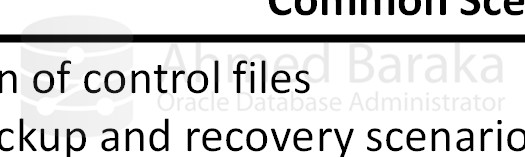

# Bài 16: Khởi động và Tắt Database Instance

## Mục tiêu học tập
- Hiểu rõ các giai đoạn khởi động (Startup) và tắt (Shutdown) của một Oracle Database.
- Nắm vững cách sử dụng các chế độ Startup và Shutdown phù hợp với từng tình huống thực tế.
- Biết cách theo dõi quá trình thông qua Alert Log.
- Nắm được các "Best Practices" (thực hành tốt nhất) khi thực hiện bảo trì hệ thống.

---

## 1. Các giai đoạn khởi động (Startup) Database

Hãy tưởng tượng việc bật Database giống như khởi động một chiếc máy bay. Bạn không thể nhảy vào và bay ngay, mà phải qua từng bước kiểm tra hệ thống. Oracle Database cũng vậy, nó trải qua 3 trạng thái chính: **NOMOUNT**, **MOUNT**, và **OPEN**.


### 1.1. Trạng thái NOMOUNT (Chỉ bật Instance)
- **Hoạt động**: Oracle sẽ đọc file cấu hình (`pfile` hoặc `spfile`) để biết cần bao nhiêu RAM, sau đó cấp phát vùng nhớ SGA và khởi chạy các Background Processes (PMON, SMON, DBWn...). Lúc này, Instance đã chạy nhưng chưa gắn kết với bất kỳ file dữ liệu nào.
- **Ví von**: Giống như việc nổ máy ô tô nhưng chưa vào số, xe nổ máy nhưng chưa chạy.
- **Khi nào sử dụng**:
  - Khi cần tạo mới Control File.
  - Khi tạo một Database hoàn toàn mới.
  - Khôi phục Database từ một số kịch bản backup đặc biệt.

```sql
-- Khởi động Database ở trạng thái NOMOUNT
STARTUP NOMOUNT;
```

### 1.2. Trạng thái MOUNT (Gắn kết Control File)
- **Hoạt động**: Oracle đọc Control File (được chỉ định trong spfile). Control File giống như "bản đồ" của Database, chứa thông tin về tên và vị trí của các Datafiles và Redo Logs. Tuy nhiên, ở bước này Oracle **chưa mở** các file dữ liệu đó ra.
- **Ví von**: Giống như bạn lấy bản đồ ra xem đường đi, nhưng chưa thực sự khởi hành.
- **Khi nào sử dụng**:
  - Bật/tắt chế độ Archive Log.
  - Phục hồi toàn bộ Database (Full Database Recovery).
  - Đổi tên hoặc di chuyển Datafiles.

```sql
-- Chuyển từ NOMOUNT sang MOUNT
ALTER DATABASE MOUNT;

-- Hoặc khởi động thẳng từ trạng thái tắt lên MOUNT
STARTUP MOUNT;
```

### 1.3. Trạng thái OPEN (Sẵn sàng phục vụ)
- **Hoạt động**: Oracle mở tất cả Datafiles và Redo Logs. Lúc này, người dùng bình thường có thể kết nối và thao tác với dữ liệu (Đọc/Ghi).
- **Ví von**: Máy bay đã mở cửa đón khách, sẵn sàng cất cánh.
- **Khi nào sử dụng**: 
  - Hoạt động hàng ngày để ứng dụng và người dùng truy cập.
  - Có thể mở ở chế độ `READ ONLY` (chỉ đọc) để làm báo cáo mà không sợ bị thay đổi dữ liệu.

```sql
-- Chuyển từ MOUNT sang OPEN
ALTER DATABASE OPEN;

-- Mở ở chế độ chỉ đọc
ALTER DATABASE OPEN READ ONLY;

-- Khởi động từ lúc tắt lên thẳng OPEN (Lệnh phổ biến nhất)
STARTUP;
```

> 💡 **Tip:** Trong thực tế, bạn chỉ cần gõ `STARTUP`, Oracle sẽ tự động đi qua lần lượt 3 bước: NOMOUNT -> MOUNT -> OPEN.

---

## 2. Restrict Mode (Chế độ hạn chế)

Đôi khi, bạn cần mở Database nhưng **không muốn người dùng bình thường kết nối vào**, chỉ cho phép DBA (những người có quyền `RESTRICTED SESSION`) truy cập để bảo trì. 

```sql
-- Khởi động Database nhưng chỉ cho DBA truy cập (kết nối trực tiếp tại server)
STARTUP RESTRICT;

-- Sau khi bảo trì xong, mở khóa để người dùng bình thường có thể vào
ALTER SYSTEM DISABLE RESTRICTED SESSION;
```

---

## 3. Các chế độ tắt Database (Shutdown)

Tương tự như khi tắt máy tính, bạn có thể "Shutdown" chuẩn chỉ hoặc "rút phích cắm". Oracle cung cấp 4 chế độ Shutdown, được tóm tắt trong bảng sau:


| Tiêu chí | NORMAL | TRANSACTIONAL | IMMEDIATE | ABORT |
|:---|:---:|:---:|:---:|:---:|
| **Cho phép kết nối mới?** | ❌ Không | ❌ Không | ❌ Không | ❌ Không |
| **Đợi các session hiện tại ngắt kết nối?** | ✅ Có | ❌ Không | ❌ Không | ❌ Không |
| **Đợi giao dịch (Transaction) hiện tại hoàn tất?** | ✅ Có | ✅ Có | ❌ Không | ❌ Không |
| **Tự động Rollback các giao dịch dang dở?** | (Không cần) | (Không cần) | ✅ Có | ❌ Không |
| **Ghi Checkpoint & đóng file an toàn (Clean)?** | ✅ Có | ✅ Có | ✅ Có | ❌ Không |
| **Cần Instance Recovery khi bật lại?** | ❌ Không | ❌ Không | ❌ Không | ✅ Có |

### Phân tích chi tiết từng chế độ:

1. **SHUTDOWN NORMAL**
   - Chờ đến khi **tất cả người dùng tự nguyện ngắt kết nối**. 
   - **Thực tế:** RẤT HIẾM KHI DÙNG vì nếu có một user treo máy đi ngủ quên không log out, database sẽ chờ mãi mãi.

2. **SHUTDOWN TRANSACTIONAL**
   - Ngăn người dùng mới, và chờ các người dùng hiện tại **hoàn tất giao dịch (Commit/Rollback) của họ**, sau đó tự động ngắt kết nối họ.
   - Thích hợp khi bạn không muốn làm gián đoạn các cập nhật dữ liệu quan trọng đang diễn ra.

3. **SHUTDOWN IMMEDIATE (Phổ biến nhất - 99% DBA sử dụng)**
   - Không đợi ai cả. Chặn kết nối mới, lập tức ngắt các kết nối hiện tại.
   - **Đặc biệt**: Các giao dịch đang làm dở (chưa Commit) sẽ bị **Rollback** (hoàn tác). Sau đó Oracle ghi Checkpoint và đóng các file một cách an toàn.
   - **Ví von**: Giống như loa siêu thị thông báo "Đã đến giờ đóng cửa, quý khách vui lòng ra quầy thanh toán ngay", ai không thanh toán sẽ phải để hàng lại.

4. **SHUTDOWN ABORT (Tắt nóng)**
   - Rút điện cái rụp! Chết đứng ngay lập tức. Không Rollback, không Checkpoint.
   - Lần khởi động tiếp theo (STARTUP), Oracle bắt buộc phải tự thực hiện **Instance Recovery** (đọc Redo Log để khôi phục dữ liệu) làm quá trình khởi động chậm hơn.
   - **Khi nào dùng**: Khi Database bị treo không thể tắt bằng `IMMEDIATE`, hoặc cần khởi động lại khẩn cấp.

```sql
-- Tắt an toàn (khuyên dùng)
SHUTDOWN IMMEDIATE;

-- Tắt nóng (trường hợp khẩn cấp)
SHUTDOWN ABORT;

-- Lệnh "khởi động lại nóng": Tương đương SHUTDOWN ABORT + STARTUP
STARTUP FORCE;
```

---

## 4. Tại sao DBA phải luôn theo dõi Alert Log?

**Alert Log** là cuốn nhật ký hệ thống quan trọng nhất của Oracle Database (thường nằm trong thư mục `trace` của `DIAGNOSTIC_DEST`, tên file dạng `alert_<SID>.log`).

Mỗi khi bạn thực hiện `STARTUP` hoặc `SHUTDOWN`, Oracle sẽ ghi lại toàn bộ tiến trình vào file này.

> ⚠️ **Cảnh báo:** DBA CHUYÊN NGHIỆP LUÔN THEO DÕI ALERT LOG KHI TẮT/MỞ DATABASE!
> Khi bạn gõ `SHUTDOWN IMMEDIATE`, giao diện SQL*Plus có thể bị "treo" (hang) nếu có những giao dịch (transaction) quá lớn đang phải Rollback. Nếu không xem Alert Log, bạn sẽ không biết hệ thống đang làm gì, có bị lỗi hay không, hay chỉ đơn giản là đang bận Rollback.

**Cách xem (trên Linux/Unix):**
```bash
# Mở một terminal khác, dùng lệnh tail để xem log real-time
tail -f /u01/app/oracle/diag/rdbms/orcl/orcl/trace/alert_orcl.log
```
*Ghi chú: Thay đường dẫn tương ứng với hệ thống của bạn.*

---

## 5. Best Practices (Thực hành tốt nhất) trong công việc thực tế



Khi làm DBA quản trị hệ thống Production (môi trường thật), việc tắt/mở Database không chỉ là gõ lệnh, mà cần quy trình:

1. **Không bao giờ tắt đột ngột**: Mọi kế hoạch bảo trì tắt Database phải được thông báo trước cho tất cả người dùng và các bên tích hợp (third-party).
2. **Kiểm tra Session**: Trước khi tắt, hãy kiểm tra xem có batch job hay tiến trình quan trọng nào đang chạy không. Nếu có user đang kết nối, hãy hỏi ý kiến quản lý hoặc thông báo trực tiếp cho họ.
3. **Tuân thủ quy trình (SOP)**: Luôn tuân theo tài liệu quy trình chuẩn đã được phê duyệt của công ty.
4. **Luôn dùng `SHUTDOWN IMMEDIATE`**: Hạn chế tối đa việc dùng `ABORT` trừ khi bất khả kháng.
5. **Môi trường Grid (RAC/Clusterware)**: Nếu Database chạy trên nền Grid Infrastructure, KHÔNG dùng SQL*Plus để tắt/mở mà phải dùng lệnh **srvctl** ở cấp độ OS.
   ```bash
   # Lệnh tắt/mở dùng cho Cluster/Grid
   srvctl stop database -d orcl
   srvctl start database -d orcl
   ```

---

## Tổng kết
- Nắm vững 3 trạng thái **NOMOUNT -> MOUNT -> OPEN** và ý nghĩa của chúng.
- Phân biệt 4 chế độ Shutdown, ưu tiên dùng **IMMEDIATE**.
- **Alert Log** là người bạn đồng hành, luôn theo dõi nó.
- Tắt Database trên Production cần quy trình, không thể làm tùy tiện.

## Câu hỏi ôn tập

**1. Nếu bạn cần chạy script khôi phục toàn bộ Database, bạn phải mở Database ở trạng thái nào? Tại sao?**
> **Trả lời:**
> Bạn phải đưa Database về trạng thái **`MOUNT`** (`STARTUP MOUNT`):
> - Ở trạng thái `MOUNT`, Oracle đã đọc Control File nên biết được danh sách và vị trí của tất cả Data Files, Redo Log Files.
> - Đồng thời, Data Files chưa được mở (`OPEN`), ngăn chặn người dùng kết nối hoặc thực hiện thay đổi dữ liệu, cho phép RMAN hoặc DBA ghi đè, restore và áp dụng redo log (recover) an toàn vào các file dữ liệu.

**2. Sự khác biệt giữa `SHUTDOWN IMMEDIATE` và `SHUTDOWN ABORT` là gì?**
> **Trả lời:**
> - **`SHUTDOWN IMMEDIATE` (Tắt an toàn & sạch sẽ - Clean Shutdown):**
>   + Chấm dứt các lệnh đang chạy, tự động Rollback các transaction chưa commit.
>   + Ngắt kết nối tất cả user sessions.
>   + Thực hiện **Checkpoint** đồng bộ toàn bộ Dirty Blocks từ RAM xuống Datafiles và đóng Datafiles, Control Files một cách tuần tự.
>   + Khi bật lại, database mở ngay mà **không cần Instance Recovery**.
> - **`SHUTDOWN ABORT` (Tắt khẩn cấp - Dirty Shutdown giống như rút phích điện):**
>   + Dừng ngay lập tức các tiến trình của Oracle Instance trên RAM.
>   + Không rollback transaction, không thực hiện checkpoint, không đóng file sạch sẽ.
>   + Khi khởi động lại (`STARTUP`), Oracle bắt buộc phải tự động thực hiện quy trình **Crash Recovery / Instance Recovery** (dùng Redo Log để lăn tới - Roll Forward và Undo để hoàn tác - Roll Back) trước khi mở được database.

**3. Khi gõ `SHUTDOWN IMMEDIATE` nhưng SQL*Plus bị treo rất lâu, bạn nên làm gì tiếp theo?**
> **Trả lời:**
> Nguyên nhân treo thường do có một transaction khổng lồ đang phải Rollback (ví dụ vừa DELETE hàng chục triệu dòng mà chưa commit), hoặc có tiến trình nền bị nghẽn I/O.
> Cách xử lý chuẩn của DBA:
> 1. Mở một cửa sổ Putty/Terminal thứ hai, đăng nhập `sqlplus / as sysdba`.
> 2. Gõ lệnh **`SHUTDOWN ABORT;`** để lập tức hạ gục Instance đang bị treo.
> 3. Sau đó gõ ngay lệnh **`STARTUP;`** để Oracle tự động kích hoạt Instance Recovery và mở lại bình thường. (Nếu cần bảo trì tiếp, sau khi STARTUP thành công hãy gõ lại `SHUTDOWN IMMEDIATE`).


---

!!! info "Nguồn gốc"
    `Oracle-Database-Administration-from-Zero-to-Hero/VN/16-khoi-dong-tat-database.md`
