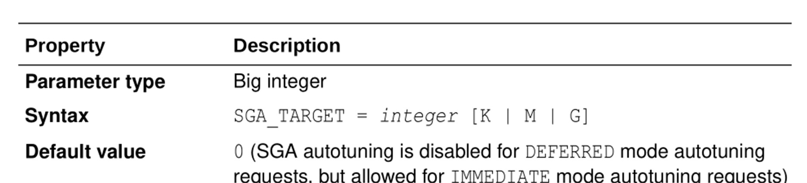

# Bài 18: Tham số khởi tạo Database (Database Initialization Parameters)

Chào mừng các bạn đến với bài 18! Trong bài này, chúng ta sẽ tìm hiểu về một thành phần cực kỳ quan trọng giúp định hình cách thức hoạt động của Oracle Database: **Các tham số khởi tạo (Initialization Parameters)**.

## 1. Mục tiêu học tập
Sau khi hoàn thành bài học này, bạn sẽ nắm được:
- File tham số (Parameter file) trong database là gì và có mấy loại.
- Cách quản lý các tham số khởi tạo.
- Hiểu rõ thuộc tính của các tham số (Static vs Dynamic).
- Cách tạo và chuyển đổi qua lại giữa PFILE và SPFILE.

---

## 2. Initialization Parameters là gì? Vai trò của chúng

> 💡 **Ví von đời thường:**
> Hãy tưởng tượng Oracle Database như một chiếc điện thoại thông minh (smartphone) của bạn. Khi bạn mới mua về, điện thoại đã được cài đặt sẵn một số cấu hình mặc định (như độ sáng màn hình, thời gian tự động khóa, nhạc chuông...). 
> Trong Oracle, những "cấu hình" này chính là **Initialization Parameters** (Các tham số khởi tạo). Chúng được dùng để kiểm soát hành vi và cách thức hoạt động của database (ví dụ: cấp phát bao nhiêu RAM, dùng file control nào, cho phép tối đa bao nhiêu user kết nối...).

**Đặc điểm chính:**
- Chúng được lưu trong **Initialization parameter file** (File tham số khởi tạo).
- Oracle Database sẽ đọc file này **ngay khi nó khởi động (start up)**.
- Nếu một tham số không được khai báo rõ ràng trong file, Oracle sẽ sử dụng giá trị **mặc định (default)** của tham số đó.

---

## 3. Phân biệt PFILE và SPFILE

Tham số khởi tạo có thể được lưu trữ dưới 2 dạng file:

| Tiêu chí | PFILE (Text Initialization Parameter File) | SPFILE (Server Parameter File) |
|----------|--------------------------------------------|--------------------------------|
| **Định dạng** | File text thông thường (text file). | File nhị phân (binary file). |
| **Cách chỉnh sửa** | Có thể mở và sửa thủ công bằng các trình soạn thảo (vi, nano, notepad). | **KHÔNG ĐƯỢC** sửa bằng text editor. Chỉ được thay đổi thông qua lệnh SQL `ALTER SYSTEM`. |
| **Lúc nào database cập nhật?** | Chỉ có tác dụng vào lần khởi động tiếp theo (sau khi restart DB). | Database có thể cập nhật trực tiếp vào file này ngay khi đang chạy. |
| **Mức độ sử dụng** | Thường dùng trong các tình huống đặc biệt, khôi phục hệ thống, hoặc DB không khởi động được. | Được Oracle khuyên dùng làm chuẩn cho vận hành bình thường (Default). |

> ⚠️ **Chú ý:** Đừng bao giờ thử mở SPFILE bằng Notepad hoặc `vi` để sửa nội dung. Việc này sẽ làm hỏng (corrupt) file và DB của bạn sẽ không thể khởi động!

---

## 4. Thứ tự tìm kiếm file tham số khi STARTUP

Khi bạn gõ lệnh `STARTUP` trong SQL*Plus, Oracle Instance sẽ không tự động biết file tham số nằm ở đâu nếu bạn không chỉ định. Do đó, nó sẽ tìm kiếm theo thứ tự ưu tiên trong thư mục mặc định:
- **Linux:** `$ORACLE_HOME/dbs`
- **Windows:** `%ORACLE_HOME%\database`

**Thứ tự tìm kiếm (Search Flow):**
1. **spfileSID.ora** (SPFILE ưu tiên số 1, với SID là tên instance của bạn, VD: `spfileorcl.ora`)
2. **spfile.ora** (SPFILE chung)
3. **initSID.ora** (PFILE chuẩn, VD: `initorcl.ora`)

Nếu Oracle tìm thấy file ở bước 1, nó sẽ dùng luôn và bỏ qua các bước sau. Nếu không thấy, nó tìm tiếp bước 2, và cứ thế.



*Mẹo: Bạn có thể ép Oracle dùng một PFILE cụ thể bằng lệnh: `STARTUP PFILE='/đường/dẫn/đến/file.ora'`*

---

## 5. Phân loại tham số: Basic vs Advanced

Oracle có hàng trăm tham số, nhưng để dễ quản lý, chúng được chia làm 2 nhóm:
- **Basic Parameters (Tham số cơ bản):** Có khoảng 30 tham số thiết yếu nhất mà các DBA thường xuyên phải cấu hình. 
  - *Ví dụ:* `CONTROL_FILES`, `DB_BLOCK_SIZE`, `PROCESSES`, `UNDO_TABLESPACE`...
- **Advanced Parameters (Tham số nâng cao):** Hàng trăm tham số còn lại dành cho việc tinh chỉnh (tuning) chuyên sâu. Người dùng bình thường rất ít khi phải chạm tới.
  - *Ví dụ:* `DB_CACHE_SIZE`, `DB_BLOCK_CHECKSUM`, `AUDIT_TRAIL`...

---

## 6. Phân loại theo cách thay đổi: Static vs Dynamic

Đây là khái niệm cực kỳ quan trọng đối với một DBA:

- **Static Parameters (Tham số tĩnh):**
  - Chỉ có thể thay đổi trong file tham số.
  - **BẮT BUỘC phải khởi động lại (restart)** database (tắt đi bật lại) thì cấu hình mới có hiệu lực.
  - *Ví dụ đời thường:* Bạn muốn nâng cấp ổ cứng hoặc thay RAM cho máy tính. Bạn bắt buộc phải tắt máy, tháo lắp phần cứng rồi bật lại.

- **Dynamic Parameters (Tham số động):**
  - Có thể thay đổi ngay cả khi database đang hoạt động (online).
  - Có hiệu lực ngay lập tức (ở mức System - toàn hệ thống, hoặc Session - phiên làm việc hiện tại).
  - *Ví dụ đời thường:* Bạn muốn thay đổi hình nền điện thoại, chỉ cần vào Cài đặt và đổi, hình nền áp dụng ngay lập tức mà không cần khởi động lại máy.

---

## 7. Cú pháp ALTER SYSTEM và ý nghĩa của SCOPE

Đối với **Dynamic Parameters** và khi bạn đang dùng **SPFILE**, bạn sử dụng lệnh `ALTER SYSTEM` để thay đổi tham số. Tuy nhiên, điều quan trọng nhất là bạn phải chỉ định thuộc tính **SCOPE**.

**SCOPE** xác định xem sự thay đổi này sẽ được lưu ở đâu và bao giờ có hiệu lực. Có 3 giá trị cho SCOPE:

1. **SCOPE = MEMORY**
   - Sự thay đổi áp dụng NGAY LẬP TỨC trên RAM (chỉ ảnh hưởng tới DB đang chạy).
   - **Không** lưu vào SPFILE.
   - Khi khởi động lại DB, sự thay đổi này sẽ bị **MẤT**.

2. **SCOPE = SPFILE**
   - Sự thay đổi CHỈ được ghi vào file cấu hình (SPFILE) trên ổ cứng.
   - **Không** áp dụng ngay lúc này.
   - Khi khởi động lại DB, sự thay đổi mới bắt đầu có **HIỆU LỰC**. (Bắt buộc dùng đối với các Static Parameters).

3. **SCOPE = BOTH** (Mặc định nếu bạn dùng SPFILE)
   - Sự thay đổi áp dụng NGAY LẬP TỨC và cũng được GHI LẠI vào SPFILE.
   - Sau khi khởi động lại DB, cấu hình vẫn được giữ nguyên.

**Ví dụ thực tế:**
```sql
-- Thay đổi tham số động, áp dụng ngay và lưu vĩnh viễn (BOTH)
ALTER SYSTEM SET SGA_TARGET = 2048M SCOPE = BOTH;

-- Thay đổi tham số tĩnh, chỉ ghi vào file, chờ lần restart tiếp theo
ALTER SYSTEM SET PROCESSES = 500 SCOPE = SPFILE;
```

Ngoài ra, với một số tham số, bạn có thể đổi ở cấp độ phiên làm việc hiện tại bằng `ALTER SESSION`:
```sql
-- Đổi định dạng ngày tháng chỉ cho session hiện tại của bạn
ALTER SESSION SET NLS_DATE_FORMAT = 'Mon-dd-yyyy';
```

---

## 8. Xem và kiểm tra tham số

Làm sao để biết tham số hiện tại đang có giá trị bao nhiêu?

**Cách 1: Dùng lệnh SHOW PARAMETER**
```sql
SQL> SHOW PARAMETER sga_target;

NAME                                 TYPE        VALUE
------------------------------------ ----------- -----------------------
sga_target                           big integer 2400M
```

**Cách 2: Truy vấn View V$PARAMETER (Xem giá trị đang có hiệu lực ở RAM)**
```sql
SQL> SELECT NAME, VALUE FROM V$PARAMETER WHERE NAME='sga_target';
```

**Cách 3: Truy vấn View V$SPPARAMETER (Xem giá trị thực sự được ghi trong SPFILE)**
```sql
SQL> SELECT NAME, VALUE FROM V$SPPARAMETER WHERE NAME='sga_target';
```

**Cách 4: Kiểm tra xem Database đang chạy bằng PFILE hay SPFILE?**
```sql
SQL> SHOW PARAMETER SPFILE;
```
*Nếu cột VALUE có chứa đường dẫn (ví dụ `/u01/.../spfileoradb.ora`), DB đang dùng SPFILE. Nếu VALUE rỗng, DB đang dùng PFILE.*

---

## 9. Tạo PFILE từ SPFILE (và ngược lại)

Do PFILE là file text (có thể đọc được bằng mắt thường), đôi khi bạn sẽ muốn tạo một bản PFILE từ SPFILE đang chạy để xem chi tiết cấu hình, hoặc để làm bản backup, hoặc để sửa tay khi SPFILE bị hỏng.

```sql
-- Từ SPFILE tạo ra PFILE (để đọc/sửa tay/backup)
CREATE PFILE = '/home/oracle/mypfile.ora' FROM SPFILE;

-- Từ PFILE tạo ngược lại SPFILE (sau khi đã sửa tay xong PFILE)
CREATE SPFILE FROM PFILE = '/home/oracle/mypfile.ora';
```

> 💡 **Best Practice (Thực hành tốt nhất) cho DBA:**
> - Hãy luôn để Database vận hành bằng **SPFILE** mặc định.
> - Nếu một ngày đẹp trời DB không khởi động được do bạn lỡ thiết lập sai một tham số trong SPFILE (ví dụ set RAM quá lớn):
>   1. Tạo một PFILE tạm từ SPFILE đó.
>   2. Mở PFILE ra bằng `vi` và sửa lại tham số bị sai.
>   3. Khởi động DB bằng PFILE tạm này (`STARTUP PFILE=...`).
>   4. Tạo lại SPFILE từ PFILE này.
>   5. Restart lại DB bình thường.
> - Hãy luôn **backup (sao lưu)** SPFILE trong lịch trình sao lưu hàng ngày.

---

## 10. Tóm tắt
- **Tham số khởi tạo** quyết định "tính cách" và "sức mạnh" của Oracle Database.
- Có 2 loại file cấu hình: **PFILE** (file text, sửa thủ công) và **SPFILE** (file binary, sửa bằng lệnh ALTER SYSTEM).
- Thứ tự startup tìm file: `spfileSID.ora` -> `spfile.ora` -> `initSID.ora`.
- Có tham số **Static** (cần restart) và tham số **Dynamic** (không cần restart).
- Hãy nắm vững 3 mức độ của **SCOPE**: `MEMORY`, `SPFILE`, `BOTH`.

---

## Câu hỏi ôn tập

**1. PFILE và SPFILE khác nhau ở điểm cơ bản nào nhất?**
> **Trả lời:**
> - **Định dạng file:** PFILE (Parameter File - ví dụ `initORADB.ora`) là file văn bản thuần túy (Plain Text), có thể mở và sửa bằng Notepad hoặc `vi`. SPFILE (Server Parameter File - ví dụ `spfileORADB.ora`) là file nhị phân (Binary), tuyệt đối không được sửa bằng text editor vì sẽ làm hỏng header của file.
> - **Cách chỉnh sửa:** PFILE chỉ sửa được thủ công khi database tắt hoặc phải restart mới nhận. SPFILE được chỉnh sửa trực tiếp từ câu lệnh SQL `ALTER SYSTEM SET ...` khi database đang chạy trực tuyến.
> - **Vị trí lưu trữ:** SPFILE luôn nằm trên máy chủ Database Server (hoặc trên ASM Diskgroup trong cụm RAC).

**2. Nếu bạn thay đổi một Static parameter với `SCOPE=BOTH`, chuyện gì sẽ xảy ra? (Gợi ý: Hệ thống có báo lỗi không?)**
> **Trả lời:**
> **Hệ thống sẽ báo lỗi ngay lập tức:** `ORA-02095: specified initialization parameter cannot be modified`.
> Vì `SCOPE=BOTH` yêu cầu áp dụng ngay vào bộ nhớ RAM (`MEMORY`) và lưu vào `SPFILE`. Tuy nhiên, các tham số tĩnh (Static parameters - ví dụ `processes`, `sga_max_size`, `audit_trail`) không thể sửa đổi giá trị trong RAM khi Instance đang hoạt động. Đối với tham số Static, bạn bắt buộc phải dùng **`SCOPE=SPFILE`** và restart database sau đó.

**3. Giải thích tình huống thực tế khi nào bạn cần dùng lệnh `CREATE PFILE FROM SPFILE`?**
> **Trả lời:**
> Bạn cần dùng lệnh này trong các tình huống:
> - **Sao lưu dự phòng cấu hình (Backup):** Trước khi chỉnh sửa các tham số nhạy cảm trong SPFILE, xuất ra 1 bản PFILE dạng text để lưu trữ phòng ngừa sự cố.
> - **Cứu hộ Database khi không khởi động được (Disaster Recovery):** Khi vô tình sửa một giá trị sai trong SPFILE khiến DB crash và không STARTUP được nữa. Do SPFILE là file nhị phân không sửa tay được, DBA sẽ dùng `CREATE PFILE='/tmp/init_fix.ora' FROM SPFILE;`, dùng `vi` mở file text đó lên xóa dòng lỗi, khởi động DB tạm thời bằng `STARTUP PFILE='/tmp/init_fix.ora';`, rồi tạo lại SPFILE mới (`CREATE SPFILE FROM PFILE='/tmp/init_fix.ora';`).
> - **Đọc và đối chiếu cấu hình:** Cần gửi cấu hình tham số cho Oracle Support hoặc DBA khác đọc dạng text dễ nhìn.


---

!!! info "Nguồn gốc"
    `Oracle-Database-Administration-from-Zero-to-Hero/VN/18-tham-so-khoi-tao.md`
