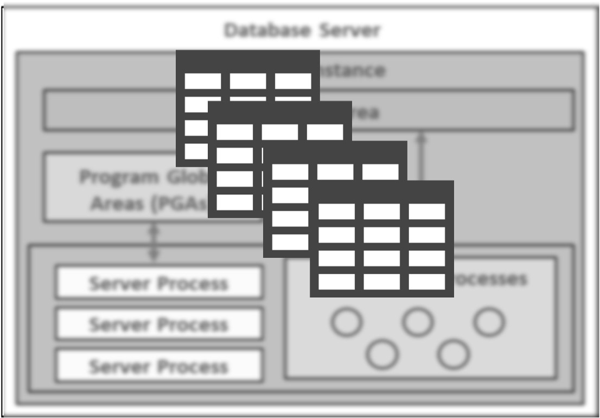
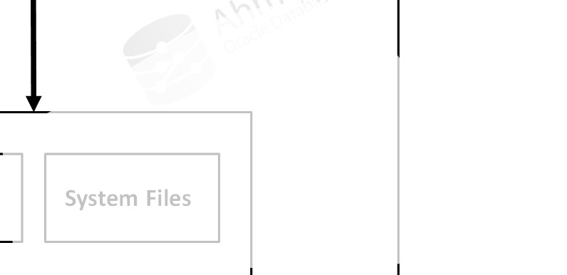

# Bài 20: Data Dictionary (Từ điển dữ liệu) và Dynamic Performance Views

## Mục tiêu bài học
Trong bài học này, chúng ta sẽ tìm hiểu về:
- **Data Dictionary (Từ điển dữ liệu)** là gì và cách truy vấn các View tĩnh.
- **Dynamic Performance Views (V$ views)** là gì và cách xem thông tin hiệu suất động của Database.

---

## 1. Data Dictionary là gì?

> 💡 **Khái niệm:** Data Dictionary (Từ điển dữ liệu) được ví như "mục lục" hoặc "dữ liệu về dữ liệu" (metadata) của Oracle Database. Nó là nơi lưu trữ mọi thông tin về cấu trúc của cơ sở dữ liệu: ai là người dùng, có những bảng (table) nào, cấu trúc bảng ra sao, ai có quyền gì, v.v.

**Những đặc điểm quan trọng:**
- **Ai sở hữu Data Dictionary?** User `SYS` (người có quyền lực cao nhất) sở hữu Data Dictionary.
- **Nó nằm ở đâu?** Dữ liệu của Data Dictionary được lưu trữ vật lý trong **SYSTEM tablespace** (chỉ có thể truy cập khi Database ở trạng thái OPEN).
- Giống như việc bạn muốn tìm chương 3 của một cuốn sách thì phải tra mục lục, Oracle cũng phải tra Data Dictionary để biết bảng nhân viên (`EMPLOYEES`) nằm ở đâu trên ổ cứng trước khi lấy dữ liệu cho bạn.



---

## 2. Phân biệt 3 mức độ Views của Data Dictionary

Data Dictionary cung cấp 3 bộ Views (khung nhìn) chính để người dùng tra cứu thông tin. Chúng được phân loại dựa trên phạm vi quyền hạn:

| Tiền tố View | Đối tượng sử dụng | Mô tả | Chi tiết |
| --- | --- | --- | --- |
| **USER_** | Bất kỳ ai | Tất cả các đối tượng **do user hiện tại sở hữu**. | Ví dụ: `USER_TABLES` (Các bảng do tôi tạo ra). View này không có cột `OWNER`. |
| **ALL_** | Bất kỳ ai | Tất cả các đối tượng mà user **có quyền truy cập** (kể cả của người khác). | Gộp của `USER_` và những thứ người khác cấp quyền cho bạn xem. |
| **DBA_** | Chỉ DBA (Quản trị viên) | **Tất cả mọi đối tượng** trong toàn bộ Database. | Yêu cầu quyền `SYSDBA` hoặc `SELECT ANY DICTIONARY`. Thường dành cho Admin. |

> ⚠️ **Lưu ý thực tế:** Trong công việc hàng ngày, DBA chủ yếu dùng các view bắt đầu bằng `DBA_` để kiểm tra tổng thể hệ thống, ví dụ `DBA_USERS` để xem tất cả tài khoản.

---

## 3. Dynamic Performance Views (V$ Views)

Nếu Data Dictionary là thông tin "tĩnh" (lưu trên ổ cứng), thì **Dynamic Performance Views** lại là thông tin "động" (lưu trong bộ nhớ RAM).

- **V$ Views là gì?** Nó là các bảng ảo đọc dữ liệu trực tiếp từ bộ nhớ của Database.
- **Khác biệt cốt lõi:** Nó phản ánh những gì **đang diễn ra ngay lúc này** (session nào đang kết nối, câu SQL nào đang chạy, RAM đang dùng bao nhiêu). 
- **Ví von:** Data Dictionary giống như "sổ đăng ký xe" (thông tin cố định), còn V$ Views giống như "bảng điều khiển xe hơi" (tốc độ, vòng tua máy liên tục thay đổi).
- **Trạng thái hoạt động:** Nhiều V$ view có thể truy vấn ngay cả khi DB chưa mở hoàn toàn (ở trạng thái `NOMOUNT` hoặc `MOUNT`), vì nó chỉ đọc từ RAM (SGA).
- SYS sở hữu các bảng gốc với tiền tố `V_$`, và chúng ta thường truy vấn qua các view có tiền tố `V$`.



---

## 4. Các ví dụ truy vấn thực tế

### 4.1. Lệnh tra cứu các Views (Rất quan trọng)
Nếu bạn không nhớ tên View mình cần tìm, hãy tra cứu bảng `DICTIONARY` (hoặc viết tắt là `DICT`):

```sql
-- Tra cứu xem có những view nào liên quan đến 'TABLE'
SELECT * FROM DICT 
WHERE TABLE_NAME LIKE '%TABLE%';
```

### 4.2. Truy vấn Data Dictionary (Tĩnh)
```sql
-- Xem danh sách tất cả các tài khoản (user) đang mở trong Database
SELECT USERNAME, ACCOUNT_STATUS 
FROM DBA_USERS 
WHERE ACCOUNT_STATUS = 'OPEN';

-- Xem các bảng do chính bạn (user đang login) tạo ra
SELECT TABLE_NAME, TABLESPACE_NAME 
FROM USER_TABLES 
ORDER BY 1;
```

### 4.3. Truy vấn Dynamic Performance Views (Động)
```sql
-- Xem trạng thái hiện tại của Database (Đang open hay mount, chế độ log là gì)
SELECT LOG_MODE, OPEN_MODE, DATABASE_ROLE 
FROM V$DATABASE;

-- Xem thông tin các phiên (session) đang kết nối từ 1 máy cụ thể (VD: EDRSR9P1)
SELECT SID, SERIAL#, USERNAME, STATUS 
FROM V$SESSION 
WHERE MACHINE = 'EDRSR9P1';
```

---

## 5. Tóm tắt bài học

1. **Data Dictionary** chứa Metadata (thông tin về cấu trúc DB), do SYS sở hữu, nằm ở SYSTEM Tablespace.
2. 3 mức độ view tĩnh: **USER_** (của tôi), **ALL_** (tôi được phép xem), **DBA_** (tất cả mọi thứ).
3. **Dynamic Performance Views (V$)** chứa thông tin động từ RAM, giúp theo dõi hiệu suất, session, memory ngay thời gian thực.
4. Sử dụng view `DICT` để tra cứu nếu quên tên các data dictionary views khác.

---

## 6. Câu hỏi ôn tập

**1. Sự khác biệt chính giữa `DBA_TABLES`, `ALL_TABLES`, và `USER_TABLES` là gì?**
> **Trả lời:**
> - `USER_TABLES`: Chỉ hiển thị các bảng do **chính người dùng hiện tại sở hữu** (schema của tôi). View này không có cột `OWNER`.
> - `ALL_TABLES`: Hiển thị tất cả các bảng mà **người dùng hiện tại có quyền truy cập** (bao gồm bảng do mình sở hữu và bảng của người khác nhưng mình được GRANT quyền SELECT/UPDATE...).
> - `DBA_TABLES`: Hiển thị **toàn bộ tất cả các bảng tồn tại trong database**, bất kể thuộc sở hữu của ai. Chỉ có tài khoản có quyền DBA hoặc `SELECT ANY DICTIONARY` mới được xem view này.

**2. Nếu database đang ở trạng thái `MOUNT`, bạn có thể truy vấn `DBA_TABLES` không? Tại sao?**
> **Trả lời:**
> **Không thể truy vấn.**
> Vì Data Dictionary (trong đó có bảng gốc `SYS.TAB$` mà `DBA_TABLES` trỏ tới) được lưu trữ vật lý bên trong `SYSTEM` Tablespace (nằm trong datafiles). Ở trạng thái `MOUNT`, các Datafiles chưa được mở (`OPEN`), Oracle chưa đọc được nội dung dữ liệu bên trong đĩa, do đó câu lệnh sẽ báo lỗi `ORA-01219: database or pluggable database not open`.

**3. Khi bạn muốn biết có bao nhiêu người dùng đang kết nối vào cơ sở dữ liệu ngay lúc này, bạn sẽ dùng Data Dictionary tĩnh hay Dynamic Performance Views?**
> **Trả lời:**
> Bạn phải sử dụng **Dynamic Performance Views (V$)**, cụ thể là view **`V$SESSION`** (ví dụ: `SELECT COUNT(*) FROM V$SESSION WHERE TYPE='USER';`).
> Bởi vì số lượng kết nối là dữ liệu động theo thời gian thực (real-time data) phát sinh trên bộ nhớ RAM (SGA), Data Dictionary tĩnh chỉ lưu trữ cấu trúc schema và định nghĩa đối tượng chứ không theo dõi phiên kết nối hiện hành.


---

!!! info "Nguồn gốc"
    `Oracle-Database-Administration-from-Zero-to-Hero/VN/20-data-dictionary.md`
