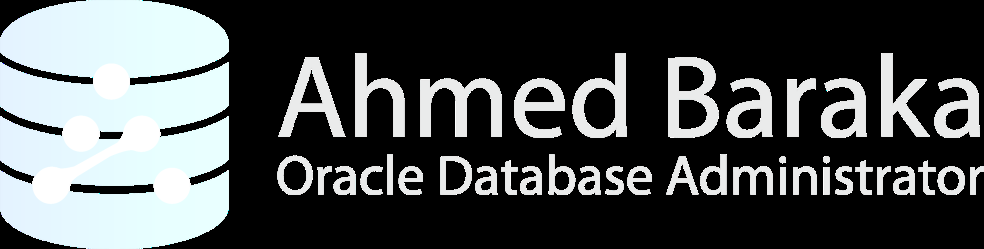

# Bài 59: Thực hành - Các phương thức xác thực Database (Authentication Methods)

## Mục tiêu thực hành
Trong bài thực hành này, bạn sẽ trực tiếp kiểm chứng và làm chủ các phương thức xác thực trong Oracle Database:
- Kiểm chứng cơ chế xác thực cấp Hệ điều hành (**OS Authentication**) dành cho người dùng quản trị (`SYSDBA`, `SYSOPER`).
- Tạo mới và sử dụng file mật khẩu (**Password File** - `orapwd`).
- Hiểu và đối chứng hiện tượng **OS Authentication ưu tiên hơn (supersedes) Password File Authentication**.
- Cấu hình xác thực OS cho người dùng thông thường không có quyền quản trị (`IDENTIFIED EXTERNALLY`).

---

## Sơ đồ luồng xác thực quản trị viên (Authentication Flowchart)



> **Giải thích sơ đồ:**
> - Nếu kết nối cục bộ (Local Connection - an toàn) và tài khoản OS thuộc nhóm quản trị (`dba`/`oper`) $\rightarrow$ **Sử dụng OS Authentication** (không cần/bỏ qua mật khẩu).
> - Nếu kết nối từ xa qua mạng (Remote Connection) hoặc tài khoản không thuộc nhóm OS $\rightarrow$ **Sử dụng Password File Authentication**.

---

## Phần 1: Kiểm chứng OS Authentication cho Người dùng Quản trị

### Bước 1–3: Tạo User OS thử nghiệm và cấu hình môi trường
Mở cửa sổ dòng lệnh (Putty) kết nối vào máy chủ `srv1` bằng quyền `root`:

```bash
# Tạo user testuser và gán vào nhóm dba
useradd testuser -g dba

# Chuyển sang user testuser và thêm các biến môi trường vào .bash_profile
su - testuser
echo "export ORACLE_HOME=/u01/app/oracle/product/19.3.0/dbhome_1" >> .bash_profile
echo "export ORACLE_SID=oradb" >> .bash_profile
echo "export TNS_ADMIN=/u01/app/oracle/product/19.3.0/dbhome_1/network/admin" >> .bash_profile
echo "export PATH=\$PATH:/u01/app/oracle/product/19.3.0/dbhome_1/bin" >> .bash_profile

source .bash_profile
```

### Bước 4–6: Đăng nhập quyền SYSDBA và kiểm chứng SYSOPER
```bash
# Đăng nhập bằng testuser
sqlplus / as sysdba
```
```sql
-- Kiểm tra user hiện tại:
SHOW USER;
-- Kết quả: USER is "SYS" (Mặc dù trên OS là testuser, nhưng vì thuộc nhóm dba nên vào thẳng SYSDBA)

-- Thử kết nối as sysoper:
CONNECT / as sysoper
-- ❌ Báo lỗi: ORA-01031: insufficient privileges (vì testuser chưa thuộc nhóm oper)
EXIT;
```

### Bước 7–10: Bổ sung nhóm `oper` và kiểm tra Schema mặc định
```bash
# Trở về root và thêm testuser vào nhóm oper:
exit
usermod -aG oper testuser

# Đăng nhập lại bằng testuser:
su - testuser
sqlplus / as sysoper
```
```sql
SHOW USER;
-- Kết quả: USER is "PUBLIC" (Schema mặc định khi vào bằng quyền SYSOPER)
EXIT;
```

---

## Phần 2: Tạo và Kiểm chứng Password File

### Bước 11–15: Xem danh sách trong Password File
Chuyển sang user `oracle`:
```bash
su - oracle
sqlplus / as sysdba
```
```sql
COL USERNAME FORMAT A15
SELECT USERNAME, SYSDBA, SYSOPER FROM V$PWFILE_USERS;
```
> **Quan sát:** Chỉ có tài khoản `SYS` được lưu trong Password File. `testuser` không hề xuất hiện trong view này vì `testuser` dùng OS Authentication.

### Bước 16–18: Đối chứng OS Authentication ưu tiên hơn Password
```bash
# Thử gõ mật khẩu SAI khi kết nối cục bộ (Local):
sqlplus sys/mat_khau_sai as sysdba
# ✅ VẪN ĐĂNG NHẬP THÀNH CÔNG! Vì user oracle thuộc nhóm dba, OS Auth ghi đè hoàn toàn mật khẩu.

# Thử kết nối qua Listener mạng (Remote format) với mật khẩu SAI:
sqlplus sys/mat_khau_sai@oradb as sysdba
# ❌ BÁO LỖI NGAY: ORA-01017: invalid username/password; logon denied!

# Kết nối qua Listener mạng với mật khẩu ĐÚNG trong Password File:
sqlplus sys/ABcd##1234@oradb as sysdba
# ✅ ĐĂNG NHẬP THÀNH CÔNG qua xác thực Password File!
```

### Bước 19–25: Đổi tên và tạo lại Password File bằng `orapwd`
```bash
# Kiểm tra file hiện tại:
ls -al $ORACLE_HOME/dbs/orapw$ORACLE_SID

# Đổi tên file để giả lập tình huống mất Password File:
mv $ORACLE_HOME/dbs/orapworadb $ORACLE_HOME/dbs/orapworadb.bak

# Thử kết nối qua mạng:
sqlplus sys/ABcd##1234@oradb as sysdba
# ❌ Lỗi ORA-01031 / ORA-01017 vì không tìm thấy file orapworadb!

# Tạo Password File mới tinh với mật khẩu SYS mới:
orapwd FILE=$ORACLE_HOME/dbs/orapw$ORACLE_SID PASSWORD=NewPass##4321 FORCE=y

# Đăng nhập lại bằng mật khẩu mới:
sqlplus sys/NewPass##4321@oradb as sysdba
# ✅ ĐĂNG NHẬP THÀNH CÔNG!
```

---

## Phần 3: Xác thực OS cho Người dùng thông thường (`IDENTIFIED EXTERNALLY`)

### Bước 26–30: Tạo DB User và OS User tương ứng
```sql
sqlplus / as sysdba
SHOW PARAMETER OS_AUTHENT_PREFIX; -- Mặc định là 'ops$'

-- Tạo Database user gắn liền với OS
CREATE USER OPS$DBUSER IDENTIFIED EXTERNALLY;
GRANT CONNECT, RESOURCE, DBA TO OPS$DBUSER;

SELECT USERNAME, AUTHENTICATION_TYPE FROM DBA_USERS WHERE USERNAME='OPS$DBUSER';
-- AUTHENTICATION_TYPE hiển thị là: EXTERNAL
EXIT;
```

```bash
# Đăng nhập root để tạo user dbuser trên OS:
exit
useradd dbuser

# Chuyển sang dbuser:
su - dbuser
export ORACLE_HOME=/u01/app/oracle/product/19.3.0/dbhome_1
export ORACLE_SID=oradb
export PATH=$PATH:$ORACLE_HOME/bin

# Thử gõ sqlplus / as sysdba (Thất bại vì không thuộc nhóm dba):
sqlplus / as sysdba
# ❌ ORA-01031: insufficient privileges

# Đăng nhập bình thường không cần gõ mật khẩu:
sqlplus /
```
```sql
SHOW USER;
-- Kết quả: USER is "OPS$DBUSER" (Xác thực OS thành công!)
```

---

## Dọn dẹp môi trường thực hành
```bash
exit
userdel -r dbuser
userdel -r testuser
```

---

## Câu hỏi ôn tập

**1. Tại sao khi user `oracle` chạy lệnh `sqlplus sys/sai_mat_khau as sysdba` trên server Linux thì vẫn đăng nhập thành công?**
> **Trả lời:**
> Vì lệnh này là kết nối cục bộ (Local IPC connection). Trên hệ thống Linux, khi kết nối cục bộ, cơ chế **OS Authentication luôn được ưu tiên cao hơn (Supersedes) Password Authentication**. Do user `oracle` trên OS thuộc nhóm `dba`, Oracle lập tức xác nhận đặc quyền `SYSDBA` và bỏ qua hoàn toàn chuỗi mật khẩu gõ vào.

**2. Để bắt buộc Oracle phải kiểm tra mật khẩu trong Password File thay vì dùng OS Authentication khi đang đứng trên server, bạn phải làm gì?**
> **Trả lời:**
> Bạn phải kết nối thông qua Listener mạng (bằng cách thêm `@tns_alias` hoặc chuỗi Easy Connect), ví dụ:
> `sqlplus sys/password@oradb as sysdba`
> Khi kết nối qua tầng mạng (TCP/IP), Oracle coi đây là kết nối không tin cậy (Non-secure connection) và buộc phải sử dụng Password File để xác thực mật khẩu.

**3. Tại sao trong view `V$PWFILE_USERS` không xuất hiện `testuser` dù `testuser` có thể đăng nhập bằng `as sysdba`?**
> **Trả lời:**
> Vì `testuser` chỉ là một tài khoản ở tầng hệ điều hành Linux và được cấp quyền thông qua cơ chế thành viên nhóm OS (`dba` group). `testuser` không hề được tạo tài khoản trong database và không có mật khẩu nào lưu trong Password File, nên view `V$PWFILE_USERS` không hiển thị.

**4. Khi tạo database user với câu lệnh `CREATE USER OPS$HRUSER IDENTIFIED EXTERNALLY;`, tên user tương ứng trên hệ điều hành Linux phải là gì?**
> **Trả lời:**
> Tên user trên Linux phải là **`hruser`** (chữ thường hoặc chữ hoa). Tiền tố `OPS$` là do tham số `OS_AUTHENT_PREFIX` của Oracle tự động ghép vào tên tài khoản OS khi đối chiếu xác thực.

**5. Điều gì xảy ra nếu bạn đổi tên file `orapworadb` thành `orapworadb.bak` trong thư mục `$ORACLE_HOME/dbs`?**
> **Trả lời:**
> Database Instance sẽ không thể tìm thấy Password File theo quy ước đặt tên chuẩn (`orapw<ORACLE_SID>`). Hệ quả là:
> - Các kết nối từ xa qua mạng bằng quyền quản trị (`CONNECT sys/pass@oradb AS SYSDBA`) sẽ bị lỗi `ORA-01031: insufficient privileges` hoặc `ORA-01017`.
> - Các kết nối cục bộ qua OS Authentication (`sqlplus / as sysdba`) vẫn hoạt động bình thường nếu user OS thuộc nhóm `dba`.


---

!!! info "Nguồn gốc"
    `Oracle-Database-Administration-from-Zero-to-Hero/VN/59-thuc-hanh-authentication-methods.md`
