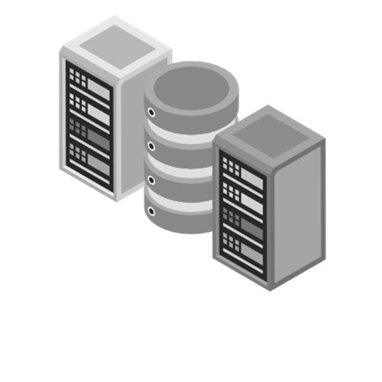
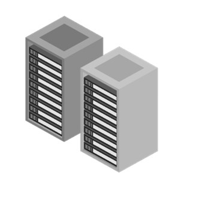
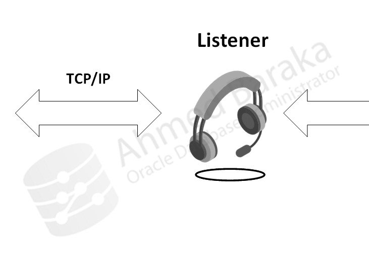
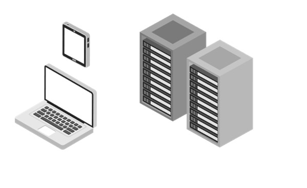
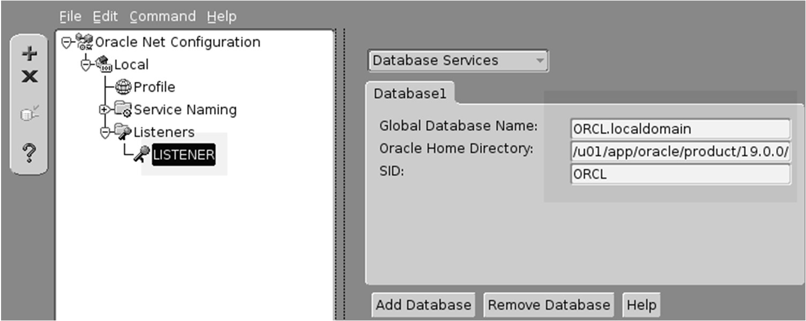

# Bài 60: Cấu hình Môi trường Mạng Oracle Network (Configuring Oracle Network)

## Mục tiêu
Sau bài học này, bạn sẽ có thể:
- Hiểu vai trò và kiến trúc hoạt động của **Oracle Net Services** và tiến trình **Listener**.
- Nắm vững chu trình thiết lập kết nối từ Client đến Database Server.
- Hiểu rõ 3 file cấu hình mạng cốt lõi: `listener.ora`, `tnsnames.ora`, `sqlnet.ora` và biến môi trường `TNS_ADMIN`.
- Sử dụng các phương pháp phân giải tên (Naming Methods): **Easy Connect** và **Local Naming** (`tnsnames.ora`).
- Kiểm tra kết nối tầng mạng bằng công cụ **`tnsping`**.
- Quản trị Listener bằng công cụ dòng lệnh **`lsnrctl`** (Status, Start, Stop, Reload).
- Phân biệt cơ chế đăng ký dịch vụ: **Đăng ký Động (Dynamic Registration - LREG)** và **Đăng ký Tĩnh (Static Registration)**.

---

## 1. Kiến trúc Oracle Net Services và Listener



- **Oracle Net Services:** Là tầng phần mềm mạng trung gian cho phép các ứng dụng khách (Client / Middle-tier) giao tiếp với Oracle Database Server qua các giao thức mạng chuẩn (phổ biến nhất là TCP/IP).
- **Oracle Net Listener:** Là một tiến trình chạy ngầm độc lập trên Database Server, có nhiệm vụ "lắng nghe" các yêu cầu kết nối gửi đến cổng mạng (mặc định là cổng **1521**), sau đó điều phối kết nối tới Database Instance tương ứng.

---

## 2. Chu trình Thiết lập Kết nối Database (Connection Cycle)



Quy trình 3 bước diễn ra khi ứng dụng kết nối:
1. **Gửi yêu cầu (Request):** Client gửi gói tin kết nối qua TCP/IP đến Listener (bao gồm: Host IP/Domain, Port 1521, Service Name).
2. **Điều phối (Hand-off / Redirect):** Listener kiểm tra xem Database Service yêu cầu có đang hoạt động không. Nếu có, Listener chọn một **Service Handler** (Server Process) phù hợp.
3. **Kết nối trực tiếp (Established):** Listener bàn giao kết nối cho Server Process. Từ lúc này, Client trao đổi dữ liệu SQL trực tiếp với Server Process, Listener rút lui và tiếp tục lắng nghe các kết nối mới khác.

---

## 3. Các File Cấu hình Mạng Cốt lõi



Ba file cấu hình quan trọng nhất đều là file văn bản thuần túy, mặc định nằm tại:
`$ORACLE_HOME/network/admin` (hoặc thư mục do biến `$TNS_ADMIN` chỉ định).

| Tên file | Vị trí | Mục đích & Nội dung |
| :--- | :--- | :--- |
| **`listener.ora`** | **Server** | Cấu hình cho Listener: Tên Listener, giao thức, địa chỉ IP/Hostname, cổng lắng nghe (1521), danh sách dịch vụ đăng ký tĩnh (nếu có). |
| **`tnsnames.ora`** | **Client & Server** | Danh bạ ánh xạ tên gợi nhớ (TNS Alias / Network Service Name) sang chuỗi kết nối đầy đủ (Host, Port, Service Name). Dùng cho phương pháp Local Naming. |
| **`sqlnet.ora`** | **Client & Server** | File tham số mạng cấp cao: Thứ tự ưu tiên phương pháp phân giải tên (`NAMES.DIRECTORY_PATH`), cấu hình domain mặc định, timeout, mã hóa mạng. |

---

## 4. Các Phương pháp Phân giải Tên (Naming Methods)

### 4.1. Easy Connect (Kết nối nhanh)
Không cần cấu hình file `tnsnames.ora`. Cú pháp truyền thẳng trên câu lệnh:
```bash
sqlplus hr/ABcd##1234@//srv1.localdomain:1521/oradb.localdomain
```
- Ưu điểm: Nhanh gọn, không cần chỉnh sửa file danh bạ mạng trên máy client.
- Nhược điểm: Chỉ hỗ trợ TCP/IP cơ bản, không cấu hình được cân bằng tải hay failover.

### 4.2. Local Naming (Dùng `tnsnames.ora` - Phổ biến nhất)


Định nghĩa trong `$TNS_ADMIN/tnsnames.ora`:
```text
ORADB =
  (DESCRIPTION =
    (ADDRESS = (PROTOCOL = TCP)(HOST = srv1.localdomain)(PORT = 1521))
    (CONNECT_DATA =
      (SERVER = DEDICATED)
      (SERVICE_NAME = oradb.localdomain)
    )
  )
```
Khi đó ứng dụng chỉ cần gọi tên ngắn gọn:
```bash
sqlplus hr/ABcd##1234@ORADB
```

---

## 5. Kiểm tra Kết nối mạng bằng Tiện ích `tnsping`

Tiện ích **`tnsping`** dùng để kiểm tra xem Listener mạng tại địa chỉ đích có đang phản hồi hay không:
```bash
tnsping ORADB
```
*Kết quả:*
```text
Attempting to contact (DESCRIPTION = (ADDRESS = (PROTOCOL = TCP)(HOST = srv1)(PORT = 1521)) ...)
OK (20 msec)
```
> ⚠️ **Lưu ý sống còn của DBA:**
> `tnsping` **CHỈ KIỂM TRA ĐẾN TẦNG LISTENER**, nó KHÔNG kiểm tra xem Database Instance có đang mở hay không, cũng không xác thực username/password. Muốn biết Database có vào được không, bắt buộc phải dùng `sqlplus`.

---

## 6. Quản trị Listener bằng Lệnh `lsnrctl`


Tiện ích **`lsnrctl`** (Listener Control) cung cấp các lệnh quản trị hàng ngày:

```bash
# Xem trạng thái hoạt động và các dịch vụ đang lắng nghe:
lsnrctl status

# Khởi động Listener:
lsnrctl start

# Dừng Listener:
lsnrctl stop

# Nạp lại cấu hình file listener.ora mà không cần tắt Listener:
lsnrctl reload
```

---

## 7. Cơ chế Đăng ký Dịch vụ: Dynamic vs Static Registration



### 7.1. Đăng ký Động (Dynamic Registration - Mặc định)
- Tiến trình nền **LREG (Listener Registration)** của Database Instance tự động gửi thông tin Service Name, Instance Name, tải CPU và số lượng kết nối tới Listener định kỳ mỗi 60 giây.
- Trong `lsnrctl status`, trạng thái sẽ hiển thị là **`READY`**.
- Để ép buộc đăng ký ngay lập tức mà không cần chờ 60s:
  ```sql
  ALTER SYSTEM REGISTER;
  ```

### 7.2. Đăng ký Tĩnh (Static Registration)
- DBA khai báo thủ công danh sách database trong khối `SID_LIST_LISTENER` của file `listener.ora`.
- Trong `lsnrctl status`, trạng thái sẽ hiển thị là **`UNKNOWN`** (vì Listener chỉ đọc file text cấu hình, không biết instance thực sự còn sống hay đã chết).
- **Khi nào bắt buộc phải dùng Đăng ký Tĩnh?**
  Khi cần kết nối từ xa để **STARTUP một Database đang bị tắt** thông qua Data Guard Broker hoặc RMAN Duplicate. Vì khi DB tắt thì tiến trình LREG không chạy, nếu không có đăng ký tĩnh thì Listener sẽ từ chối kết nối!

---

## Câu hỏi ôn tập

**1. Lệnh `tnsping oradb` báo kết quả `OK (10 msec)`. Liệu điều này có đảm bảo người dùng chắc chắn đăng nhập thành công vào database không? Tại sao?**
> **Trả lời:**
> **KHÔNG đảm bảo.** Lệnh `tnsping` chỉ kiểm tra tính thông suốt của đường truyền mạng và xác nhận rằng tiến trình Listener ở cổng 1521 đang phản hồi. Nó không hề kiểm tra: Database Instance có đang bị tắt (SHUTDOWN) hay không, Service Name có tồn tại không, và tài khoản/mật khẩu của người dùng có đúng hay không.

**2. Tiến trình nền nào của Oracle Database chịu trách nhiệm tự động đăng ký Service Name với Listener?**
> **Trả lời:**
> Tiến trình nền **`LREG` (Listener Registration)** (ở các phiên bản cũ trước 12c là `PMON`). Tiến trình này định kỳ gửi thông tin đăng ký dịch vụ tới Listener. Bạn có thể kích hoạt đăng ký ngay lập tức bằng lệnh `ALTER SYSTEM REGISTER;`.

**3. Trong kết quả lệnh `lsnrctl status`, trạng thái `READY` và `UNKNOWN` của một service khác nhau như thế nào?**
> **Trả lời:**
> - **`READY`:** Dịch vụ được **đăng ký động (Dynamic Registration)** bởi tiến trình `LREG`. Listener biết chắc chắn rằng Database Instance đang hoạt động và sẵn sàng nhận kết nối.
> - **`UNKNOWN`:** Dịch vụ được **đăng ký tĩnh (Static Registration)** qua file `listener.ora`. Listener chỉ biết thông tin từ file cấu hình mà không biết thực tế instance có đang sống hay đã chết.

**4. Biến môi trường `$TNS_ADMIN` có tác dụng gì? Nếu không thiết lập biến này, Oracle sẽ tìm các file `tnsnames.ora` và `listener.ora` ở đâu?**
> **Trả lời:**
> - Biến môi trường `$TNS_ADMIN` chỉ định đường dẫn thư mục tùy chỉnh chứa các file cấu hình mạng Oracle Net (`listener.ora`, `tnsnames.ora`, `sqlnet.ora`).
> - Nếu biến này không được thiết lập, Oracle sẽ tự động tìm kiếm theo đường dẫn mặc định là:
>   `$ORACLE_HOME/network/admin` trên Linux hoặc `%ORACLE_HOME%\network\admin` trên Windows.

**5. Tại sao DBA vẫn cần cấu hình Đăng ký Tĩnh (Static Registration) cho Database trong môi trường có Oracle Data Guard?**
> **Trả lời:**
> Trong hệ thống Data Guard, khi Standby Database bị tắt hoặc cần khởi động lại từ xa qua mạng (bằng công cụ Data Guard Broker / Enterprise Manager / RMAN), tiến trình `LREG` không hề chạy do database đang tắt. Nếu chỉ có đăng ký động, Listener sẽ không nhận diện được service và từ chối kết nối. Cấu hình Đăng ký Tĩnh giúp Listener luôn luôn mở sẵn cổng chờ, cho phép DBA kết nối từ xa với quyền `AS SYSDBA` để thực thi lệnh `STARTUP`.


---

!!! info "Nguồn gốc"
    `Oracle-Database-Administration-from-Zero-to-Hero/VN/60-cau-hinh-oracle-network.md`
