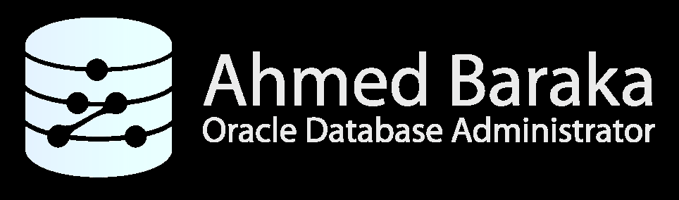

# Bài 63: Thực hành - Sử dụng Database Links (Using Database Links)

## Mục tiêu thực hành
Trong bài thực hành này, bạn sẽ thiết lập và kiểm chứng kết nối giữa 2 máy chủ cơ sở dữ liệu độc lập:
- Máy chủ nguồn: **`winsrv`** (Windows Server).
- Máy chủ đích: **`srv1`** (Linux Server - chứa Pluggable Database `PDB1`).
- Cấu hình TNS Service Name trong `tnsnames.ora` trên máy nguồn để trỏ sang máy đích.
- Kiểm tra tham số `GLOBAL_NAMES` và tra cứu `GLOBAL_NAME` của database đích.
- Tạo người dùng và cấp quyền `CREATE DATABASE LINK`, `CREATE SYNONYM`.
- Tạo **Database Link** loại Fixed User từ `winsrv` sang schema `SOE` trong `PDB1` trên `srv1`.
- Tạo **Synonym** để truy vấn dữ liệu từ xa một cách trong suốt.

---

## Sơ đồ Mô hình Thực hành



> **Mô hình triển khai:**
> - Máy trạm `winsrv` kết nối tới Database cục bộ.
> - Database Link trên `winsrv` gửi yêu cầu qua Listener (Port 1521) của `srv1`.
> - Listener tại `srv1` kết nối vào `PDB1`, xác thực tài khoản `SOE` và trả dữ liệu bảng `CUSTOMERS` về `winsrv`.

---

## Phần 1: Cấu hình Mạng trên Máy nguồn (`winsrv`)

### Bước 1–2: Mở và cấu hình `tnsnames.ora` trên Windows
Trên máy ảo `winsrv`, mở Notepad với quyền Administrator và mở file:
`D:\oracle\product\19.0.0\db_1\network\admin\tnsnames.ora`

Thêm khối cấu hình TNS Alias trỏ sang `PDB1` của máy `srv1`:
```text
soesrv1 =
  (DESCRIPTION =
    (ADDRESS_LIST =
      (ADDRESS = (PROTOCOL = TCP)(HOST = srv1)(PORT = 1521))
    )
    (CONNECT_DATA =
      (SERVICE_NAME = pdb1.localdomain)
    )
  )
```
Lưu file.

### Bước 3: Kiểm tra kết nối mạng từ `winsrv`
Mở Command Prompt trên `winsrv` và kiểm tra:
```cmd
tnsping soesrv1
sqlplus soe/ABcd##1234@soesrv1
```
*Kết quả:* Đăng nhập thành công vào schema `SOE` trên `PDB1` của `srv1`. Gõ `exit` để thoát.

---

## Phần 2: Kiểm tra Tên Định danh Toàn cầu trên Máy đích (`srv1`)

### Bước 4–6: Đăng nhập `srv1` và kiểm tra `GLOBAL_NAMES`
Mở Putty kết nối vào `srv1` bằng user `oracle`:
```bash
sqlplus sys/ABcd##1234@pdb1 as sysdba
```
```sql
-- Kiểm tra tham số GLOBAL_NAMES:
SHOW PARAMETER GLOBAL_NAMES;
-- Trong bài thực hành này, giá trị là FALSE.

-- Tra cứu Global Database Name của PDB1:
SELECT * FROM GLOBAL_NAME;
-- Kết quả hiển thị: PDB1.LOCALDOMAIN
EXIT;
```

---

## Phần 3: Tạo User và Cấp quyền trên Máy nguồn (`winsrv`)

Quay lại máy `winsrv`, mở Command Prompt và đăng nhập vào database cục bộ:
```cmd
sqlplus / as sysdba
```

```sql
-- Tạo user thử nghiệm USER1:
CREATE USER USER1 IDENTIFIED BY ABcd##1234 DEFAULT TABLESPACE USERS;

-- Cấp các đặc quyền cần thiết (không cấp quyền tạo bảng!):
GRANT CREATE SESSION, CREATE DATABASE LINK, CREATE SYNONYM TO USER1;

-- Đăng nhập bằng USER1:
CONNECT USER1/ABcd##1234
```

---

## Phần 4: Tạo Database Link và Truy vấn Dữ liệu Từ xa

### Bước 7–8: Tạo Database Link trỏ sang `srv1`
Đang ở phiên làm việc của `USER1` trên `winsrv`:
```sql
-- Tạo Database Link sử dụng Global Name của PDB1 và TNS alias soesrv1:
CREATE DATABASE LINK pdb1.localdomain
  CONNECT TO soe IDENTIFIED BY ABcd##1234
  USING 'soesrv1';

-- Kiểm tra xem link đã được tạo trong từ điển dữ liệu chưa:
SELECT DB_LINK, USERNAME, HOST FROM USER_DB_LINKS;
```

### Bước 9: Truy vấn dữ liệu bảng từ xa qua DB Link
```sql
-- Truy vấn trực tiếp qua Database Link:
SELECT COUNT(*) FROM CUSTOMERS@pdb1.localdomain;

SELECT CUSTOMER_ID, CUST_FIRST_NAME, CUST_LAST_NAME 
FROM CUSTOMERS@pdb1.localdomain 
WHERE ROWNUM <= 5;
```
> ✅ **Kết quả:** `USER1` trên `winsrv` không hề sở hữu bảng `CUSTOMERS` và cũng không có quyền `CREATE TABLE`, nhưng đã đọc được dữ liệu bảng từ xa tại `srv1` thông qua Database Link!

---

## Phần 5: Tạo Synonym để Trong suốt hóa Vị trí Dữ liệu

### Bước 10: Tạo Synonym che giấu DB Link
```sql
-- Tạo Synonym cục bộ đại diện cho bảng từ xa:
CREATE SYNONYM cust FOR CUSTOMERS@pdb1.localdomain;

-- Bây giờ người dùng chỉ cần truy vấn qua tên ngắn gọn:
SELECT COUNT(*) FROM cust;

SELECT CUSTOMER_ID, CUST_FIRST_NAME, CUST_LAST_NAME 
FROM cust 
WHERE ROWNUM <= 5;
```

---

## Phần 6: Dọn dẹp môi trường thực hành
```sql
-- Xóa Synonym và Database Link:
DROP SYNONYM cust;
DROP DATABASE LINK pdb1.localdomain;

-- Xóa User thử nghiệm:
CONNECT / as sysdba
DROP USER USER1 CASCADE;
```

---

## Câu hỏi ôn tập

**1. Trong bài thực hành, user `USER1` trên `winsrv` không có quyền `CREATE TABLE` và không có hạn mức `QUOTA` trên tablespace, tại sao vẫn truy vấn được bảng `CUSTOMERS`?**
> **Trả lời:**
> Vì bảng `CUSTOMERS` không hề nằm trên database của `winsrv` và không chiếm dụng bất kỳ byte dung lượng nào trên `winsrv`. Bảng này nằm trên `PDB1` của máy chủ từ xa `srv1`. User `USER1` chỉ sử dụng quyền `CREATE DATABASE LINK` để gửi câu lệnh `SELECT` qua mạng sang `srv1`. Trên `srv1`, câu lệnh được thực thi dưới quyền của tài khoản `SOE` (chủ sở hữu bảng).

**2. Nếu trên `srv1` bạn đổi tham số `ALTER SYSTEM SET GLOBAL_NAMES = TRUE;`, việc tạo Database Link với câu lệnh `CREATE DATABASE LINK mylink CONNECT TO soe IDENTIFIED BY pass USING 'soesrv1';` trên `winsrv` có thành công không? Tại sao?**
> **Trả lời:**
> Câu lệnh tạo link vẫn thực thi được, nhưng khi bạn chạy câu truy vấn `SELECT * FROM cust@mylink;`, hệ thống sẽ **báo lỗi `ORA-02085: database link mylink connects to PDB1.LOCALDOMAIN`**.
> Bởi vì khi `GLOBAL_NAMES = TRUE`, Oracle bắt buộc tên của Database Link (`mylink`) phải trùng khớp 100% với tên định danh toàn cầu của cơ sở dữ liệu đích (`pdb1.localdomain`).

**3. Mệnh đề `USING 'soesrv1'` trong câu lệnh tạo Database Link có ý nghĩa gì?**
> **Trả lời:**
> Mệnh đề `USING 'soesrv1'` chỉ định tên bí danh kết nối mạng (TNS Service Name Alias). Oracle sẽ tìm định nghĩa của bí danh `soesrv1` trong file `tnsnames.ora` trên máy cục bộ để biết địa chỉ IP (`srv1`), cổng mạng (`1521`), và tên dịch vụ (`pdb1.localdomain`) của database từ xa cần kết nối tới.

**4. Sau khi tạo xong Synonym `CREATE SYNONYM cust FOR CUSTOMERS@pdb1.localdomain;`, nếu Database Link bị xóa (`DROP DATABASE LINK pdb1.localdomain;`), điều gì sẽ xảy ra khi người dùng chạy `SELECT * FROM cust;`?**
> **Trả lời:**
> Câu lệnh `SELECT` sẽ báo lỗi: **`ORA-02019: connection description for remote database not found`**.
> Bởi vì Synonym chỉ là một bí danh trỏ tới đối tượng đích. Bản thân Synonym không lưu trữ dữ liệu hay thông tin kết nối. Khi Database Link bên dưới bị mất, Synonym trở thành một con trỏ trỏ vào khoảng trống (broken reference).

**5. Lệnh nào dùng để kiểm tra danh sách tất cả các Database Link mà người dùng hiện tại đang sở hữu?**
> **Trả lời:**
> Truy vấn Data Dictionary view **`USER_DB_LINKS`**:
> ```sql
> SELECT DB_LINK, USERNAME, HOST, CREATED FROM USER_DB_LINKS;
> ```
> (Nếu có quyền DBA, có thể xem toàn bộ hệ thống qua view `DBA_DB_LINKS`).


---

!!! info "Nguồn gốc"
    `Oracle-Database-Administration-from-Zero-to-Hero/VN/63-thuc-hanh-database-links.md`
