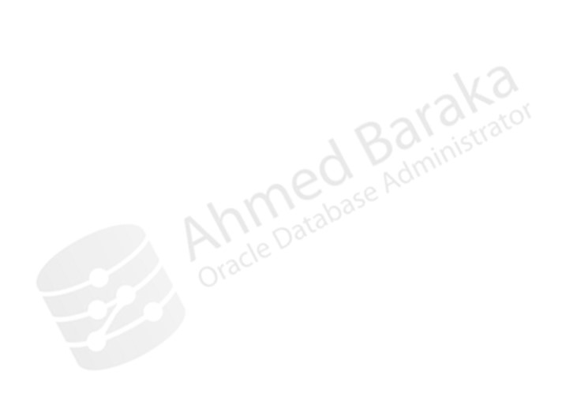
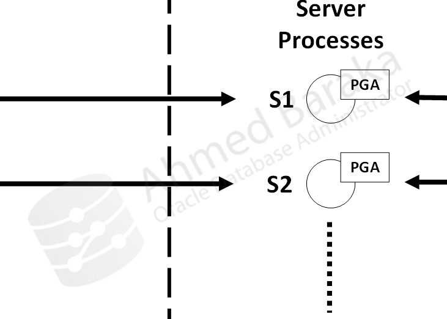

# Bài 64: Cấu hình Shared Server (Configuring Databases for Shared Server)

## Mục tiêu
Sau bài học này, bạn sẽ có thể:
- Phân biệt kiến trúc **Dedicated Server** (Tiến trình Chuyên dụng) và **Shared Server** (Tiến trình Chia sẻ).
- Hiểu rõ lợi ích tiết kiệm bộ nhớ và giảm tải tiến trình hệ điều hành của Shared Server.
- Nắm vững quy trình xử lý câu lệnh thông qua **Dispatcher**, **Request Queue** và **Response Queue** trong SGA.
- Cấu hình các tham số khởi tạo then chốt: `DISPATCHERS`, `SHARED_SERVERS`, `MAX_SHARED_SERVERS`.
- Cấu hình Client để chủ động lựa chọn chế độ kết nối Dedicated hoặc Shared (`tnsnames.ora`).
- Nhận biết các trường hợp bắt buộc phải dùng Dedicated Server và không được dùng Shared Server.

---

## 1. So sánh Kiến trúc Dedicated Server và Shared Server

### 1.1. Dedicated Server (Mặc định)


- **Mỗi kết nối người dùng (Client Process)** được phục vụ bởi **duy nhất một Server Process riêng biệt**.
- Vùng nhớ riêng của người dùng (**UGA - User Global Area**) nằm trong **PGA** của Server Process đó.
- *Nhược điểm:* Nếu có 5,000 kết nối đồng thời, hệ điều hành phải sinh ra 5,000 tiến trình nền và tốn 5,000 vùng nhớ PGA $\rightarrow$ Gây cạn kiệt RAM và quá tải CPU do Context Switching.

### 1.2. Shared Server


- Sử dụng một nhóm nhỏ các tiến trình **Shared Server Processes** (ví dụ 50 tiến trình) để phục vụ cho hàng nghìn Client.
- Các tiến trình **Dispatcher** (tiến trình điều phối) nhận yêu cầu từ Client và đưa vào **Hàng đợi Yêu cầu chung (Common Request Queue)** nằm trong SGA.
- Bất kỳ Shared Server Process nào rảnh rỗi sẽ lấy yêu cầu từ hàng đợi ra xử lý, sau đó đặt kết quả vào **Hàng đợi Phản hồi riêng (Response Queue)** của Dispatcher đó để trả về cho Client.
- **UGA được chuyển vào SGA** (cụ thể là nằm trong **Large Pool**).

---

## 2. Bài toán Tiết kiệm Bộ nhớ Thực tế


Giả sử hệ thống có **1,000 kết nối đồng thời**:
- Mỗi phiên làm việc (Session) cần 400 KB dữ liệu trạng thái.
- Mỗi Server Process của hệ điều hành chiếm 4 MB bộ nhớ.

| Mô hình kết nối | Công thức tính dung lượng | Tổng RAM cần thiết |
| :--- | :--- | :---: |
| **Dedicated Server** | $1000 \times (4\text{ MB} + 0.4\text{ MB})$ | **4,400 MB (~4.4 GB)** |
| **Shared Server** *(Dùng 100 Shared Processes)* | $(1000 \times 0.4\text{ MB}) + (100 \times 4\text{ MB})$ | **800 MB** |

> 🚀 **Tiết kiệm:** Giảm hơn **80% dung lượng RAM**, giúp server tránh được tình trạng Swap/Paging và chịu tải tốt hơn hàng chục lần.

---

## 3. Các Tham số Khởi tạo Cốt lõi của Shared Server

```sql
-- 1. Bật Dispatcher cho giao thức TCP (Bắt buộc):
ALTER SYSTEM SET DISPATCHERS = '(PROTOCOL=TCP)(DISPATCHERS=2)' SCOPE=BOTH;

-- 2. Số lượng Shared Server Processes tối thiểu khởi chạy ban đầu:
ALTER SYSTEM SET SHARED_SERVERS = 4 SCOPE=BOTH;

-- 3. Số lượng Shared Server Processes tối đa cho phép tự động scale-up:
ALTER SYSTEM SET MAX_SHARED_SERVERS = 20 SCOPE=BOTH;

-- 4. Số lượng Dispatchers tối đa:
ALTER SYSTEM SET MAX_DISPATCHERS = 10 SCOPE=BOTH;
```

> 💡 **Khuyến nghị cấu hình bộ nhớ:** Khi kích hoạt Shared Server, vùng nhớ UGA sẽ nằm trong SGA. DBA **bắt buộc phải cấu hình vùng nhớ `LARGE_POOL_SIZE`** (hoặc dùng ASMM `SGA_TARGET`) để tránh làm cạn kiệt `SHARED_POOL`.

---

## 4. Cấu hình Phía Client: Chọn Shared hay Dedicated?

Trong file `tnsnames.ora`, bạn có thể chỉ định rõ chế độ kết nối mong muốn qua tham số `(SERVER = ...)`:

```text
# Kết nối ép buộc qua Shared Server:
ORADB_SHARED =
  (DESCRIPTION =
    (ADDRESS = (PROTOCOL = TCP)(HOST = srv1)(PORT = 1521))
    (CONNECT_DATA =
      (SERVER = SHARED)
      (SERVICE_NAME = oradb.localdomain)
    )
  )

# Kết nối ép buộc qua Dedicated Server:
ORADB_DEDICATED =
  (DESCRIPTION =
    (ADDRESS = (PROTOCOL = TCP)(HOST = srv1)(PORT = 1521))
    (CONNECT_DATA =
      (SERVER = DEDICATED)
      (SERVICE_NAME = oradb.localdomain)
    )
  )
```

---

## 5. Khi nào KHÔNG ĐƯỢC dùng Shared Server?

Một số tác vụ nặng hoặc đặc thù bắt buộc phải sử dụng **Dedicated Server**:
1. **Các thao tác quản trị Database:** Khởi động (`STARTUP`), tắt (`SHUTDOWN`), phục hồi sau sự cố (`RECOVER`).
2. **Sao lưu và Phục hồi bằng RMAN.**
3. **Các tác vụ Batch Job / Data Warehouse chạy lâu dài:** Các câu lệnh quét bảng lớn, Export/Import Data Pump dữ liệu lớn chạy hàng giờ. Nếu dùng Shared Server, một tiến trình chạy lâu sẽ "chiếm giữ" (monopolize) Shared Server Process, làm nghẽn hàng nghìn người dùng khác đang chờ trong Request Queue.

---

## Câu hỏi ôn tập

**1. Trong kiến trúc Shared Server, vùng nhớ UGA (User Global Area) của phiên làm việc người dùng nằm ở đâu?**
> **Trả lời:**
> Trong Dedicated Server, UGA nằm trong vùng nhớ riêng **PGA** của Server Process.
> Trong Shared Server, vì các Server Process được luân phiên phục vụ nhiều Client khác nhau, nên UGA bắt buộc phải được đặt trong vùng nhớ chia sẻ chung **SGA (cụ thể là nằm trong Large Pool)** để bất kỳ Shared Server Process nào cũng có thể truy cập được dữ liệu ngữ cảnh của phiên làm việc đó.

**2. Thành phần nào trong kiến trúc Shared Server chịu trách nhiệm nhận yêu cầu SQL từ Client và xếp vào Request Queue?**
> **Trả lời:**
> Đó là tiến trình **Dispatcher** (tiến trình điều phối). Client kết nối mạng trực tiếp tới Dispatcher. Dispatcher nhận gói tin SQL và đẩy vào Hàng đợi Yêu cầu chung (Common Request Queue) trong SGA, sau đó chờ Shared Server xử lý xong thì lấy kết quả từ Response Queue của mình để gửi trả về cho Client.

**3. Tại sao các tác vụ quản trị như `STARTUP` hoặc chạy backup RMAN bắt buộc phải dùng Dedicated Server?**
> **Trả lời:**
> - Khi database đang tắt hoặc đang ở trạng thái NOMOUNT/MOUNT, các tiến trình Dispatcher và Shared Server chưa hề được khởi chạy. Do đó, để khởi động database, kết nối quản trị (`AS SYSDBA`) bắt buộc phải tạo một Dedicated Server Process riêng ở tầng hệ điều hành.
> - Đối với RMAN, quá trình sao lưu thực hiện truyền luồng I/O liên tục dung lượng hàng trăm GB. Nếu dùng Shared Server sẽ làm nghẽn toàn bộ hàng đợi, phong tỏa tài nguyên của các user giao dịch OLTP khác.

**4. Để tắt hoàn toàn tính năng Shared Server khi database đang chạy, DBA cần thay đổi tham số nào?**
> **Trả lời:**
> DBA chỉ cần đặt tham số `SHARED_SERVERS` về giá trị bằng **`0`**:
> ```sql
> ALTER SYSTEM SET SHARED_SERVERS = 0 SCOPE=BOTH;
> ```
> Khi đó Oracle sẽ không cấp phát thêm Shared Server Process nào nữa, các kết nối hiện tại hoàn thành xong sẽ đóng, và mọi kết nối mới sau đó sẽ tự động chuyển sang chế độ Dedicated Server.

**5. View nào trong Oracle Database cho phép kiểm tra xem các phiên làm việc hiện tại đang chạy ở chế độ DEDICATED hay SHARED?**
> **Trả lời:**
> Bạn truy vấn Dynamic Performance View **`V$SESSION`**, kiểm tra cột **`SERVER`**:
> ```sql
> SELECT SID, SERIAL#, USERNAME, SERVER, STATUS 
> FROM V$SESSION 
> WHERE USERNAME IS NOT NULL;
> ```
> Giá trị cột `SERVER` sẽ hiển thị là `'DEDICATED'`, `'SHARED'`, hoặc `'NONE'`.


---

!!! info "Nguồn gốc"
    `Oracle-Database-Administration-from-Zero-to-Hero/VN/64-cau-hinh-shared-server.md`
