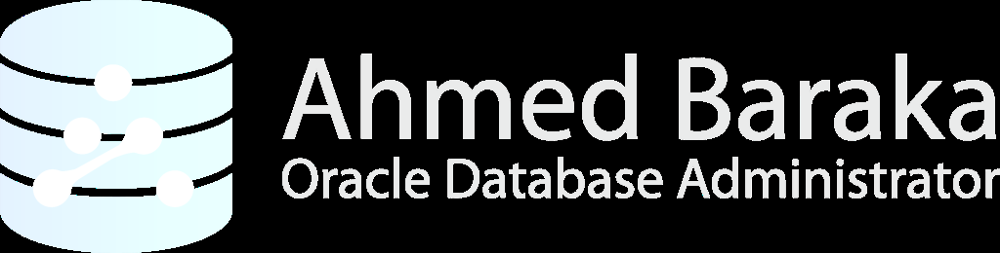
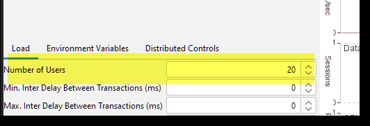

# Bài 65: Thực hành - Cấu hình và Giám sát Shared Server

## Mục tiêu thực hành
Trong bài thực hành này, bạn sẽ trực tiếp cấu hình và theo dõi hoạt động của Shared Server trong môi trường thực tế:
- Kiểm tra cấu hình Shared Server mặc định của Oracle.
- Gặp và phân tích lỗi `ORA-12520: TNS:listener could not find available handler for requested type of server`.
- Cấu hình Dispatcher cho dịch vụ Pluggable Database (`PDB1`).
- Đối chứng trạng thái `SERVER` trong `V$SESSION` (`NONE` khi rảnh rỗi vs `SHARED` khi bận xử lý).
- Sử dụng công cụ tạo tải **Swingbench** để mô phỏng 20 kết nối đồng thời.
- Theo dõi các tiến trình Dispatcher (`D001`), Shared Server (`S001`...) và hàng đợi qua `V$QUEUE`, `V$DISPATCHER`, `V$PROCESS`.
- Giới hạn trần số lượng tiến trình chia sẻ bằng tham số `MAX_SHARED_SERVERS`.

---

## Sơ đồ Kiến trúc Điều phối Shared Server



---

## Phần 1: Kiểm tra Cấu hình Mặc định và Lỗi `ORA-12520`

### Bước 1–4: Kiểm tra tham số mặc định
Đăng nhập máy chủ `srv1` bằng user `oracle`:
```bash
sqlplus / as sysdba
```
```sql
COL NAME FOR A20
COL VALUE FOR A35
SELECT NAME, VALUE FROM V$PARAMETER
WHERE NAME IN ('shared_servers', 'dispatchers');
```
*Kết quả:* Mặc định Oracle chỉ bật 1 Dispatcher dành riêng cho dịch vụ XML DB (`oradbXDB`).

### Bước 5–6: Thử kết nối Shared Server và gặp lỗi
Thêm cấu hình vào `$TNS_ADMIN/tnsnames.ora`:
```text
PDB1_shared =
  (DESCRIPTION =
    (ADDRESS_LIST =
      (ADDRESS = (PROTOCOL = TCP)(HOST = srv1)(PORT = 1521))
    )
    (CONNECT_DATA =
      (SERVICE_NAME = pdb1.localdomain)
      (SERVER = SHARED)
    )
  )
```

Thử kết nối:
```bash
sqlplus soe/ABcd##1234@pdb1_shared
```
> ❌ **Báo lỗi:**
> `ORA-12520: TNS:listener could not find available handler for requested type of server`
> **Nguyên nhân:** Listener không tìm thấy bất kỳ tiến trình Dispatcher nào được gán để phục vụ dịch vụ `pdb1.localdomain`!

---

## Phần 2: Cấu hình Dispatcher cho Dịch vụ PDB1

### Bước 7–10: Thêm cấu hình Dispatcher thứ hai
```bash
sqlplus / as sysdba
```
```sql
-- Cấu hình thêm Dispatcher thứ 2 (INDEX=1) dành riêng cho PDB1:
ALTER SYSTEM SET DISPATCHERS = 
  '(INDEX=1)(PROTOCOL=TCP)(DISPATCHERS=1)(SERVICE=pdb1.localdomain)' SCOPE=BOTH;
```

### Bước 11–12: Xác nhận Dispatcher và đăng ký Listener
```sql
-- Kiểm tra cấu hình Dispatcher:
SELECT * FROM V$DISPATCHER_CONFIG;

-- Xem thông tin tiến trình Dispatcher:
SELECT NAME, STATUS, MESSAGES, IDLE, BUSY FROM V$DISPATCHER;
-- Sẽ thấy D000 (cho XML DB) và D001 (cho PDB1).
EXIT;
```

Kiểm tra Listener nhận diện Dispatcher:
```bash
lsnrctl services
```
> **Quan sát:** Xuất hiện mục `DISPATCHER` với địa chỉ IP và cổng mạng ngẫu nhiên mà Listener cấp cho `D001`.

### Bước 13–14: Kết nối lại thành công
```bash
sqlplus soe/ABcd##1234@pdb1_shared
# ✅ KẾT NỐI THÀNH CÔNG VÀO PDB1 QUA SHARED SERVER!
```

---

## Phần 3: Trạng thái Phiên làm việc: `NONE` vs `SHARED`

### Bước 15: Kiểm tra khi session rảnh rỗi (Idle)
Mở một cửa sổ SQL*Plus khác hoặc SQL Developer:
```sql
SELECT USERNAME, SERVER, STATUS FROM V$SESSION WHERE USERNAME='SOE';
```
*Kết quả:* Cột `SERVER` hiển thị là **`NONE`**!
*(Vì trong Shared Server, khi Client không gửi câu lệnh SQL nào, tiến trình Shared Server Process đã được trả về hàng đợi để phục vụ người khác; Client chỉ duy trì kết nối mạng tới Dispatcher mà không chiếm giữ Server Process nào).*

### Bước 16–17: Kiểm tra khi session chạy tác vụ nặng (Busy)
Trong phiên kết nối của `SOE`, chạy vòng lặp ngốn CPU:
```sql
DECLARE
  n NUMBER;
BEGIN
  WHILE (TRUE) LOOP
    n := DBMS_RANDOM.VALUE(1, 100);
  END LOOP;
END;
/
```

Ở cửa sổ giám sát, kiểm tra lại:
```sql
SELECT USERNAME, SERVER, STATUS FROM V$SESSION WHERE USERNAME='SOE';
```
*Kết quả:* Cột `SERVER` lập tức chuyển thành **`SHARED`**!
*(Nhấn `Ctrl + C` ở cửa sổ SOE để dừng vòng lặp).*

---

## Phần 4: Tạo Tải bằng Swingbench và Giám sát Hàng đợi



1. Khởi động Swingbench, cấu hình chuỗi kết nối Shared Server và chạy thử với **20 người dùng đồng thời**.
2. Giám sát hoạt động của Dispatcher và Hàng đợi:
```sql
-- Xem số lượng thông điệp mà Dispatcher D001 đã tiếp nhận:
SELECT NAME, STATUS, MESSAGES, IDLE, BUSY FROM V$DISPATCHER;

-- Xem trạng thái hàng đợi:
SELECT TYPE, QUEUED, WAIT, TOTALQ FROM V$QUEUE;

-- Xem các tiến trình Shared Server (tên S000, S001...):
SELECT PID, SPID, PNAME, USERNAME, PGA_USED_MEM, CPU_USED
FROM V$PROCESS 
WHERE PNAME LIKE 'S0%';
```

3. Giới hạn số lượng Shared Server tối đa:
```sql
-- Giới hạn tối đa 5 tiến trình:
ALTER SYSTEM SET MAX_SHARED_SERVERS = 5 SCOPE=BOTH;
```
Quan sát qua `V$PROCESS`, số lượng tiến trình `S0xx` sẽ tự động được Oracle thu hồi và duy trì không vượt quá 5.

---

## Câu hỏi ôn tập

**1. Lỗi `ORA-12520: TNS:listener could not find available handler for requested type of server` khi kết nối `SERVER=SHARED` báo hiệu điều gì?**
> **Trả lời:**
> Lỗi này báo hiệu rằng chuỗi kết nối từ phía client yêu cầu kết nối vào database dưới dạng Shared Server (`SERVER=SHARED`), nhưng tại thời điểm đó, Listener **không tìm thấy bất kỳ tiến trình Dispatcher nào đang hoạt động và đăng ký hỗ trợ cho Service Name đó**. DBA cần kiểm tra tham số `DISPATCHERS` trong database để bổ sung khai báo dịch vụ tương ứng.

**2. Tại sao khi user `SOE` kết nối qua Shared Server nhưng đang ở trạng thái rảnh rỗi (idle), view `V$SESSION` lại hiển thị `SERVER = 'NONE'`?**
> **Trả lời:**
> Đây là đặc tính cốt lõi của kiến trúc Shared Server:
> - Khi người dùng không gửi câu lệnh SQL nào, session không hề chiếm dụng bất kỳ tiến trình Shared Server Process nào (Server Process đã được giải phóng để quay lại pool phục vụ câu lệnh của user khác).
> - Do đó cột `SERVER` hiển thị là `NONE`. Chỉ khi người dùng bấm chạy một câu lệnh SQL, Oracle mới cấp phát một Shared Server Process để gánh session đó và cột `SERVER` tạm thời đổi thành `SHARED`.

**3. Tiền tố tên của tiến trình Dispatcher và tiến trình Shared Server ở tầng hệ điều hành là gì?**
> **Trả lời:**
> - Tiến trình Dispatcher có tiền tố là **`D`** kèm theo số thứ tự 3 chữ số: **`D000`**, **`D001`**, **`D002`**...
> - Tiến trình Shared Server có tiền tố là **`S`** kèm theo số thứ tự 3 chữ số: **`S000`**, **`S001`**, **`S002`**...

**4. Mệnh đề `(INDEX=1)` trong câu lệnh `ALTER SYSTEM SET DISPATCHERS='(INDEX=1)...'` có tác dụng gì?**
> **Trả lời:**
> Tham số `DISPATCHERS` hỗ trợ nhiều dòng cấu hình (Multi-value parameter) được đánh chỉ mục từ `0`, `1`, `2`...
> Khi bạn chỉ định `(INDEX=1)`, Oracle hiểu rằng bạn muốn **thêm một cấu hình Dispatcher mới ở vị trí số 1 và giữ nguyên cấu hình hiện tại ở vị trí số 0** (ví dụ cấu hình số 0 của XDB), tránh việc ghi đè làm mất cấu hình Dispatcher đang có.

**5. Tham số `MAX_SHARED_SERVERS` giúp ích gì cho DBA trong việc kiểm soát tài nguyên server?**
> **Trả lời:**
> Giúp thiết lập **ngưỡng trần tối đa (Hard Limit)** cho số lượng tiến trình Shared Server Processes mà Oracle được phép tự động sinh ra. Ngăn chặn tình trạng khi tải truy cập tăng đột biến, Oracle sinh ra quá nhiều tiến trình `S0xx` cạnh tranh CPU và RAM với các tác vụ nghiệp vụ quan trọng khác (như tiến trình nền DBWn, LGWR hoặc các tác vụ batch job chạy đêm).


---

!!! info "Nguồn gốc"
    `Oracle-Database-Administration-from-Zero-to-Hero/VN/65-thuc-hanh-shared-server.md`
