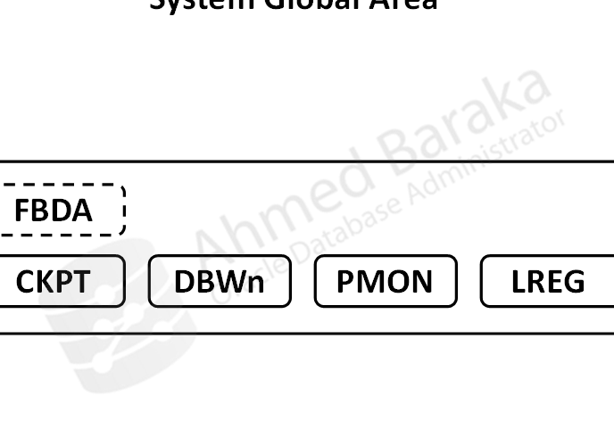

# Bài 68: Quản lý Online Redo Log (Managing the Redo Log)

## Mục tiêu
Sau bài học này, bạn sẽ có thể:
- Hiểu vai trò cốt tử của **Online Redo Log** trong việc đảm bảo tính bền vững dữ liệu (ACID - Durability).
- Phân biệt kiến trúc database ở chế độ **NOARCHIVELOG** và **ARCHIVELOG**.
- Nắm vững chu trình ghi vòng tròn (**Circular Writing**) và sự kiện **Log Switch**.
- Hiểu 4 trạng thái của Redo Log Group: `CURRENT`, `ACTIVE`, `INACTIVE`, `UNUSED`.
- Hiểu cơ chế phục hồi sau sự cố (**Instance / Crash Recovery**): Lăn tới (Roll Forward - Redo) và Hoàn tác (Roll Back - Undo).
- Thực hiện các thao tác quản trị: Thêm/xóa Redo Log Group, thêm/xóa Redo Log Member (Multiplexing).
- Áp dụng các Best Practices về kích thước và nhân bản Redo Log trong môi trường Production.

---

## 1. Vai trò của Online Redo Log trong Database


- **Online Redo Log** là tập hợp tối thiểu **2 nhóm (Groups)** file vật lý trên đĩa ghi lại toàn bộ lịch sử mọi sự thay đổi trên các block dữ liệu (Data Blocks, Undo Blocks).
- Khi người dùng `COMMIT`, tiến trình **LGWR (Log Writer)** lập tức xả nội dung từ `Redo Log Buffer` trên RAM xuống đĩa. Dù server có mất điện ngay sau đó, dữ liệu của bạn vẫn an toàn tuyệt đối.

---

## 2. Chu trình Ghi Vòng tròn (Circular Writing Cycle)



LGWR ghi vào các Redo Log Group theo cơ chế nối đuôi vòng tròn:
$$\text{Group 1} \xrightarrow{\text{Đầy (Log Switch)}} \text{Group 2} \xrightarrow{\text{Đầy (Log Switch)}} \text{Group 3} \xrightarrow{\text{Đầy (Log Switch)}} \text{Quay lại Group 1}$$

### Các trạng thái của Redo Log Group (`V$LOG.STATUS`):
- **`CURRENT`:** Nhóm hiện tại mà LGWR đang trực tiếp ghi dữ liệu vào.
- **`ACTIVE`:** Nhóm vừa ghi xong (sau khi Log Switch). Dữ liệu trong nhóm này vẫn **cần thiết cho Instance Recovery** vì một số dirty blocks tương ứng trên RAM chưa được tiến trình DBWn ghi hết xuống Datafiles.
- **`INACTIVE`:** Tiến trình Checkpoint đã hoàn tất, toàn bộ block dữ liệu liên quan đã nằm an toàn trên đĩa. Nhóm này **không còn cần cho Instance Recovery** và đã sẵn sàng để LGWR ghi đè (ở NOARCHIVELOG) hoặc sau khi đã archive xong (ở ARCHIVELOG).
- **`UNUSED`:** Nhóm mới tạo, chưa từng được ghi lần nào.

---

## 3. Cơ chế Phục hồi Sự cố (Instance Recovery)

Khi database bị tắt đột ngột (`SHUTDOWN ABORT` hoặc máy chủ sập nguồn):
Khi bật lại (`STARTUP`), tiến trình nền **SMON** tự động thực hiện 2 giai đoạn phục hồi:

1. **Giai đoạn 1: Roll Forward (Lăn tới - Dùng Redo Log):**
   Đọc toàn bộ các thay đổi trong các nhóm Redo Log `ACTIVE` và `CURRENT` để tái tạo lại trạng thái của các data blocks y hệt thời điểm trước khi crash (bao gồm cả các giao dịch đã commit và chưa commit).
2. **Giai đoạn 2: Roll Back (Hoàn tác - Dùng Undo Segments):**
   Tìm tất cả các giao dịch dở dang (chưa kịp commit lúc sập máy) và dùng dữ liệu trong Undo Tablespace để hoàn tác lại nguyên trạng ban đầu.

---

## 4. Quản trị Redo Log Groups và Multiplexing (Nhân bản Member)

Để chống hỏng ổ cứng, mỗi Group nên có ít nhất **2 Members (bản sao giống hệt nhau)** nằm trên 2 ổ đĩa vật lý độc lập.

```sql
-- Xem thông tin các Groups và Members hiện tại:
SELECT GROUP#, SEQUENCE#, BYTES/1024/1024 AS SIZE_MB, MEMBERS, STATUS FROM V$LOG;
SELECT GROUP#, MEMBER, STATUS FROM V$LOGFILE;

-- 1. Thêm một Redo Log Group mới (Group 4 dung lượng 100MB):
ALTER DATABASE ADD LOGFILE GROUP 4 
  ('/u01/oradata/redo04a.log', '/u02/oradata/redo04b.log') SIZE 100M;

-- 2. Thêm một Member (nhân bản) vào Group 1 đã có:
ALTER DATABASE ADD LOGFILE MEMBER '/u02/oradata/redo01b.log' TO GROUP 1;

-- 3. Ép buộc chuyển sang Group mới (Force Log Switch):
ALTER SYSTEM SWITCH LOGFILE;

-- 4. Ép buộc Checkpoint đồng bộ dirty blocks (chuyển ACTIVE sang INACTIVE):
ALTER SYSTEM CHECKPOINT;

-- 5. Xóa một Member (Không thể xóa nếu group chỉ còn 1 member):
ALTER DATABASE DROP LOGFILE MEMBER '/u02/oradata/redo01b.log';

-- 6. Xóa một Group (Chỉ xóa được khi status là INACTIVE, không xóa được CURRENT):
ALTER DATABASE DROP LOGFILE GROUP 4;
```

---

## Câu hỏi ôn tập

**1. Tại sao một cơ sở dữ liệu Oracle bắt buộc phải có tối thiểu 2 nhóm Online Redo Log Groups?**
> **Trả lời:**
> Vì cơ chế ghi của LGWR là **ghi vòng tròn (Circular Fashion)**: khi Group 1 đầy (Log Switch), LGWR bắt buộc phải có Group 2 để chuyển sang tiếp tục ghi các giao dịch của người dùng. Trong thời gian LGWR ghi vào Group 2, hệ thống mới có thời gian để thực hiện Checkpoint (và Archive log nếu ở chế độ ARCHIVELOG) trên Group 1. Nếu chỉ có 1 group, khi group đầy database sẽ bị treo ngay lập tức.

**2. Sự khác biệt giữa trạng thái `ACTIVE` và `INACTIVE` của một Redo Log Group là gì?**
> **Trả lời:**
> - `ACTIVE`: Nhóm log đã đầy nhưng vẫn chứa các thay đổi thuộc về các data blocks bẩn (dirty blocks) trên RAM **chưa được tiến trình DBWn ghi xong xuống đĩa**. Nhóm này bắt buộc phải giữ lại để phục vụ Instance Recovery nếu xảy ra sự cố sập nguồn.
> - `INACTIVE`: Tiến trình DBWn đã hoàn tất việc flush các dirty blocks liên quan xuống đĩa (Checkpoint hoàn tất). Nhóm này không còn cần cho Instance Recovery nữa và an toàn để tái sử dụng/ghi đè.

**3. Tại sao DBA tuyệt đối không thể xóa một Redo Log Group đang ở trạng thái `CURRENT` hoặc `ACTIVE`?**
> **Trả lời:**
> - Nhóm `CURRENT` là nhóm đang trực tiếp nhận các bản ghi giao dịch theo thời gian thực của các ứng dụng đang chạy.
> - Nhóm `ACTIVE` chứa các giao dịch cần thiết để phục hồi instance nếu crash.
> Xóa một trong hai nhóm này sẽ phá hủy tính toàn vẹn dữ liệu (Data Corruption) và gây mất mát dữ liệu. Muốn xóa, DBA phải dùng `ALTER SYSTEM SWITCH LOGFILE;` và `ALTER SYSTEM CHECKPOINT;` để đưa nhóm đó về trạng thái `INACTIVE` trước.

**4. Kỹ thuật "Redo Log Multiplexing" (Nhân bản Redo Log Member) mang lại lợi ích gì cho hệ thống?**
> **Trả lời:**
> Mang lại tính sẵn sàng cao và chống lỗi phần cứng (Fault Tolerance). Trong mỗi Group, Oracle cho phép cấu hình 2 hoặc nhiều Member (bản sao giống hệt nhau ghi đồng thời). Bằng cách đặt mỗi Member trên một ổ đĩa vật lý riêng biệt, nếu một ổ cứng bị hỏng (bad sector / mất nguồn đĩa), LGWR vẫn tiếp tục ghi vào Member còn lại trên ổ đĩa kia mà database không hề bị dừng hoạt động.

**5. Lệnh SQL nào dùng để ép buộc Database Instance chuyển sang ghi vào Redo Log Group kế tiếp ngay lập tức?**
> **Trả lời:**
> Đó là lệnh:
> ```sql
> ALTER SYSTEM SWITCH LOGFILE;
> ```


---

!!! info "Nguồn gốc"
    `Oracle-Database-Administration-from-Zero-to-Hero/VN/68-quan-ly-redo-log.md`
