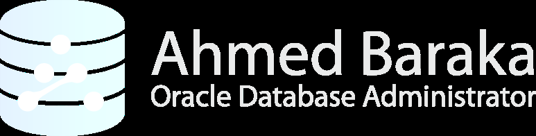

# Bài 70: Thực hành Bật Chế độ ARCHIVELOG Mode

## Mục tiêu bài thực hành
Sau khi hoàn thành bài thực hành này, bạn sẽ có khả năng:
- Kiểm tra trạng thái lưu trữ hiện tại của cơ sở dữ liệu (ARCHIVE LOG LIST và từ view V).
- Cấu hình đích đến của Archive Log trỏ về Fast Recovery Area (FRA) bằng LOG_ARCHIVE_DEST_1.
- Thực hiện quy trình chuẩn: Đưa Database về trạng thái MOUNT, kích hoạt ARCHIVELOG mode và mở lại database an toàn.
- Kiểm tra hoạt động của tiến trình ARCn bằng cách ép buộc chuyển đổi nhật ký giao dịch (SWITCH LOGFILE).
- Kiểm tra thông tin các file Archive Log vừa được tự động sinh ra trong FRA qua view V.

---

## 1. Môi trường Thực hành
- **Máy chủ thực hành:** srv1 (Virtual Machine chạy Oracle Database).
- **Hệ thống cơ sở dữ liệu:** oradb (CDB).
- **User thực hiện:** oracle (hệ điều hành) và đăng nhập SQL*Plus với quyền SYSDBA.

---

## 2. Các Bước Thực hiện

### Bước 1: Kết nối vào máy chủ và vào SQL*Plus
Mở terminal hoặc PuTTY, đăng nhập vào srv1 bằng tài khoản oracle và kết nối với quyền quản trị tối cao:
`ash
sqlplus / as sysdba
`

### Bước 2: Kiểm tra cấu hình Fast Recovery Area (FRA)
Archive Log nên được lưu trữ tập trung vào vùng FRA để Oracle tự động quản lý dung lượng và dọn dẹp theo chính sách lưu giữ.
`sql
SHOW PARAMETER DB_RECOVERY_FILE_DEST
`
*Kết quả:* Hai tham số db_recovery_file_dest (đường dẫn thư mục) và db_recovery_file_dest_size (kích thước hạn mức) đã được thiết lập sẵn từ khi tạo database bằng DBCA.

### Bước 3: Kiểm tra chế độ hoạt động hiện tại
Sử dụng lệnh đặc thù của SQL*Plus:
`sql
ARCHIVE LOG LIST
`
*Ghi nhận thông tin hiển thị:*
- **Database log mode:** No Archive Mode
- **Automatic archival:** Disabled
- **Archive destination:** USE_DB_RECOVERY_FILE_DEST (chỉ định đến FRA)
- **Oldest online log sequence:** Số thứ tự log cũ nhất.
- **Current log sequence:** Số thứ tự log đang được ghi hiện tại.

Bạn cũng có thể kiểm tra qua câu truy vấn SQL chuẩn:
`sql
SELECT log_mode FROM v;
`
*(Kết quả trả về sẽ là NOARCHIVELOG)*.

### Bước 4: Cấu hình tường minh đích đến của Archive Log
Mặc định nếu để trống, Oracle sẽ tự trỏ về FRA khi FRA đã bật. Tuy nhiên, theo chuẩn thực hành tốt nhất, chúng ta nên gán rõ ràng:
`sql
ALTER SYSTEM SET LOG_ARCHIVE_DEST_1='LOCATION=USE_DB_RECOVERY_FILE_DEST' SCOPE=SPFILE;
`
Kiểm tra lại xem OMF (Oracle Managed Files) có đang bật không:
`sql
SHOW PARAMETER DB_CREATE_FILE_DEST
`
> [!NOTE]
> Khi OMF được kích hoạt, tham số định dạng tên file LOG_ARCHIVE_FORMAT sẽ tự động bị bỏ qua (ignored) do Oracle áp dụng chuẩn đặt tên tự động duy nhất (Unique OMF Name).

### Bước 5: Chuyển đổi trạng thái Database sang ARCHIVELOG
Để thay đổi cờ trạng thái này trong Control File, Database bắt buộc phải ở trạng thái MOUNT:
`sql
-- 1. Tắt database an toàn
SHUTDOWN IMMEDIATE;

-- 2. Khởi động đến trạng thái MOUNT
STARTUP MOUNT;

-- 3. Bật chế độ ARCHIVELOG
ALTER DATABASE ARCHIVELOG;

-- 4. Mở lại Database ở chế độ Read/Write bình thường
ALTER DATABASE OPEN;
`

### Bước 6: Xác minh trạng thái sau khi chuyển đổi
Chạy lại lệnh kiểm tra:
`sql
ARCHIVE LOG LIST;
`
*Quan sát kết quả mới:*
- **Database log mode:** Archive Mode
- **Automatic archival:** Enabled
- **Next log sequence to archive:** Xuất hiện thêm dòng hiển thị số sequence kế tiếp đang sẵn sàng được lưu trữ.

### Bước 7: Thử nghiệm ép Log Switch và kiểm tra Archive Log sinh ra
Thực hiện chuyển đổi file log thủ công để kích hoạt tiến trình ARCn:
`sql
ALTER SYSTEM SWITCH LOGFILE;
`

Kiểm tra số thứ tự Sequence tăng lên:
`sql
ARCHIVE LOG LIST;
`

Truy vấn danh sách và đường dẫn vật lý của các file Archive Log vừa được tạo ra:
`sql
SELECT name FROM v;
`
*Nhận xét:*
- File được lưu trong thư mục con đặt tên theo ngày hiện tại (ví dụ: .../archivelog/2026_09_09/...).
- Cấu trúc thư mục phân cấp theo ngày giúp DBA cực kỳ thuận tiện trong việc phân loại, giám sát và quản lý sao lưu.

---

## 3. Dọn dẹp môi trường (Cleanup)
Nếu bạn đang thực hành trong môi trường lab học tập có snapshot, bạn có thể tắt máy và khôi phục về snapshot CDB ban đầu nếu cần thiết.

---

## Câu hỏi ôn tập

**1. Lệnh ARCHIVE LOG LIST cung cấp những thông tin quan trọng nào cho người quản trị DBA?**
> **Trả lời:**
> Lệnh ARCHIVE LOG LIST cung cấp:
> - Trạng thái chế độ nhật ký của Database: Archive Mode hay No Archive Mode.
> - Trạng thái tiến trình tự động lưu trữ (Automatic archival): Enabled hay Disabled.
> - Vị trí lưu trữ các tệp lưu trữ (Archive destination): Ví dụ USE_DB_RECOVERY_FILE_DEST hoặc đường dẫn thư mục cụ thể.
> - Số thứ tự chuỗi Redo Log cũ nhất (Oldest online log sequence).
> - Số thứ tự chuỗi log kế tiếp cần archive (Next log sequence to archive).
> - Số thứ tự chuỗi log hiện hành đang được sử dụng (Current log sequence).

**2. Giá trị USE_DB_RECOVERY_FILE_DEST trong tham số LOG_ARCHIVE_DEST_1 có ý nghĩa gì?**
> **Trả lời:**
> Giá trị này báo cho Oracle biết rằng các bản sao Archived Redo Log sẽ được lưu trực tiếp vào phân vùng **Fast Recovery Area (FRA)** được chỉ định bởi tham số DB_RECOVERY_FILE_DEST. Khi lưu vào FRA, Oracle sẽ tự động quản lý tên file theo chuẩn OMF, tổ chức theo thư mục ngày tháng và theo dõi dung lượng chặt chẽ để tự dọn dẹp khi hết chỗ.

**3. Tại sao khi bật tính năng Oracle Managed Files (OMF) thì tham số LOG_ARCHIVE_FORMAT lại bị bỏ qua?**
> **Trả lời:**
> Vì khi OMF được kích hoạt (DB_CREATE_FILE_DEST có giá trị), Oracle tự động chịu trách nhiệm hoàn toàn về việc tạo tên file độc nhất, an toàn và phân cấp thư mục có tổ chức (Unique Name) để tránh bất kỳ xung đột trùng tên nào trên hệ điều hành. Do đó quy tắc định dạng đặt tên thủ công của LOG_ARCHIVE_FORMAT không còn hiệu lực.

**4. Sau khi gõ lệnh ALTER SYSTEM SWITCH LOGFILE;, điều gì diễn ra ngầm bên dưới hệ thống cơ sở dữ liệu?**
> **Trả lời:**
> Khi thực thi lệnh SWITCH LOGFILE:
> - Tiến trình LGWR sẽ đóng file Online Redo Log hiện tại (chuyển trạng thái từ CURRENT sang ACTIVE) và chuyển sang ghi vào nhóm Redo Log kế tiếp.
> - Oracle kích hoạt tiến trình nền ARCn (Archiver) sao chép toàn bộ nội dung từ nhóm Redo Log vừa đóng thành một tệp tin mới tại thư mục đích (Archive Destination).
> - Một Checkpoint được kích hoạt để tiến trình DBWn đẩy các Dirty Buffer tương ứng từ Buffer Cache xuống Datafile trên đĩa cứng.

**5. View động nào trong Oracle cho phép kiểm tra đường dẫn, dung lượng và thời gian tạo của các file Archive Log?**
> **Trả lời:**
> View động **V**. DBA có thể truy vấn các cột quan trọng như:
> - NAME: Đường dẫn vật lý đầy đủ của file Archive Log.
> - SEQUENCE#: Số thứ tự của bản ghi nhật ký.
> - FIRST_TIME / COMPLETION_TIME: Thời điểm bắt đầu và thời điểm hoàn tất archive.
> - BLOCKS * BLOCK_SIZE: Dung lượng thực tế của file.
> - DELETED: Đã bị xóa khỏi đĩa hay chưa.

---

!!! info "Nguồn gốc"
    `Oracle-Database-Administration-from-Zero-to-Hero/VN/70-thuc-hanh-archivelog-mode.md`
