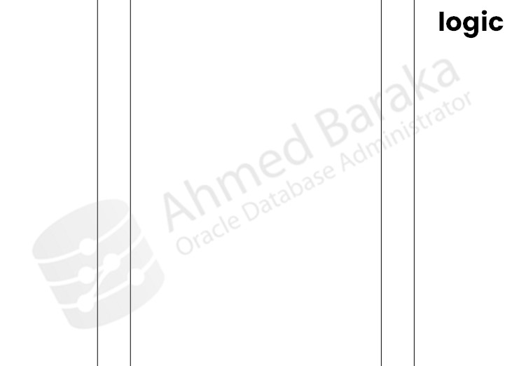
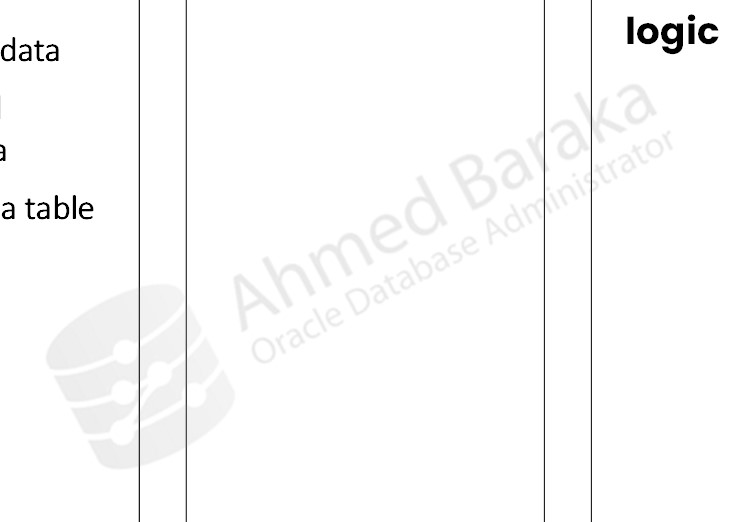
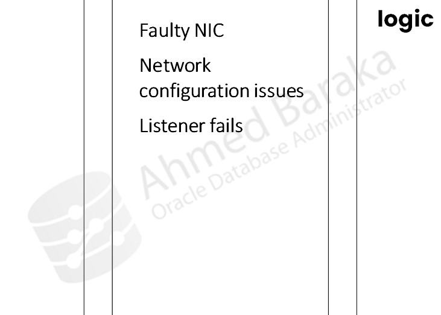
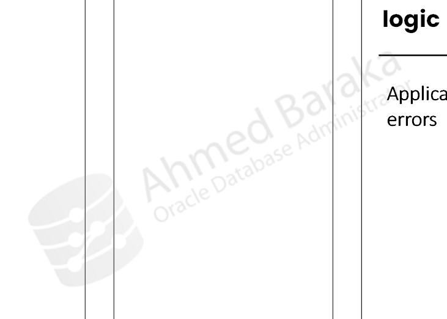
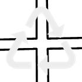

# Bài 71: Giới thiệu về Sao lưu và Phục hồi (Backup and Recovery)

## Mục tiêu
Sau bài học này, bạn sẽ có thể:
- Phân loại và hiểu rõ các dạng sự cố thường gặp trong hệ thống cơ sở dữ liệu (Categories of Failure).
- Nắm vững lộ trình xây dựng chiến lược Sao lưu và Phục hồi (Roadmap: Plan - Do - Monitor - Improve).
- Định nghĩa và phân biệt hai chỉ số quan trọng bậc nhất của DBA: **RTO (Recovery Time Objective)** và **RPO (Recovery Point Objective)**.
- So sánh các giải pháp phục hồi dữ liệu trong Oracle: **RMAN, RAC, Data Guard, Flashback Database**.

---

## 1. Các Dạng Sự cố Cơ sở Dữ liệu (Categories of Failure)

Trong môi trường thực tế, DBA phải đối mặt với nhiều nhóm rủi ro khác nhau làm gián đoạn hoặc mất mát dữ liệu:

### 1.1. Lỗi Phương tiện Lưu trữ (Media Failure)
- **Nguyên nhân:** Đĩa cứng vật lý (HDD/SSD) bị hỏng, bộ điều khiển lưu trữ (Storage Controller) bị lỗi, hư hỏng linh kiện phần cứng, hoặc quản trị viên vô tình xóa nhầm một Datafile/Controlfile/Redo Log trên hệ điều hành.
- **Giải pháp:** Sử dụng giải pháp sao lưu vật lý **RMAN (Recovery Manager)** kết hợp kiến trúc đĩa chịu lỗi (RAID / ASM Mirroring).

### 1.2. Lỗi do Người dùng (User Error)
- **Nguyên nhân:** Lập trình viên hoặc người dùng vô tình chạy nhầm lệnh DELETE mà không có mệnh đề WHERE, câu lệnh UPDATE sai dữ liệu, hoặc lệnh DROP TABLE / TRUNCATE TABLE trên môi trường Production.
- **Giải pháp:** Công nghệ **Oracle Flashback** (Flashback Table, Flashback Query, Flashback Drop, Flashback Database) hoặc phục hồi theo mốc thời gian (Point-in-Time Recovery - PITR).

### 1.3. Lỗi Mạng (Network Failure)
- **Nguyên nhân:** Card mạng (NIC) bị hỏng, cáp mạng bị đứt, cấu hình mạng/tường lửa bị lỗi, hoặc tiến trình Listener của Oracle bị dừng đột ngột.
- **Giải pháp:** Cấu hình card mạng dự phòng (NIC Teaming / Bonding), nhiều Listener dự phòng, cấu hình kết nối mạng chuyển đổi dự phòng suốt (Transparent Application Failover - TAF).

### 1.4. Lỗi Logic Ứng dụng (Application Invalid Logic)
- **Nguyên nhân:** Lỗi cú pháp trong code ứng dụng, deadlock không thể tự giải quyết, các tiến trình ứng dụng chiếm dụng tài nguyên quá tải hoặc xử lý sai logic nghiệp vụ dẫn đến dữ liệu không nhất quán.

### 1.5. Thảm họa Tự nhiên & Hành vi Phá hoại (Disaster)
- **Nguyên nhân:** Lũ lụt, động đất, hỏa hoạn, ngập nước trung tâm dữ liệu (Data Center), hoặc tấn công phá hoại, mã độc tống tiền (Ransomware).
- **Giải pháp:** Thiết lập trung tâm dữ liệu dự phòng thảm họa (Disaster Recovery Site - DR Site) với giải pháp **Oracle Data Guard**.

---

## 2. Lộ trình Xây dựng Chiến lược Sao lưu và Phục hồi (Roadmap)

Một chiến lược sao lưu chuyên nghiệp luôn tuân theo chu trình chuẩn: **Plan $\rightarrow$ Do $\rightarrow$ Monitor $\rightarrow$ Improve**.

`
    ┌───────────────┐          ┌───────────────┐
    │     PLAN      │  ──────► │      DO       │
    │  Chính sách   │          │   Triển khai  │
    │   RTO & RPO   │          │  RMAN / DG... │
    └───────────────┘          └───────────────┘
            ▲                          │
            │                          ▼
    ┌───────────────┐          ┌───────────────┐
    │    IMPROVE    │  ◄────── │    MONITOR    │
    │  Diễn tập DR  │          │  Giám sát Log │
    │  Tối ưu hóa   │          │  Kiểm tra đĩa │
    └───────────────┘          └───────────────┘
`

### Hai chỉ số cốt lõi mà DBA phải nắm rõ:
1. **RTO (Recovery Time Objective - Mục tiêu Thời gian Phục hồi):**
   - Là khoảng thời gian tối đa cho phép hệ thống dừng hoạt động (Downtime) để DBA tiến hành khôi phục và đưa dịch vụ online trở lại.
   - *Ví dụ:* RTO = 2 giờ nghĩa là từ lúc hệ thống gặp sự cố cho đến khi người dùng sử dụng lại được tối đa là 2 tiếng.
2. **RPO (Recovery Point Objective - Mục tiêu Điểm Phục hồi):**
   - Là lượng dữ liệu tối đa chấp nhận bị mất mát (tính theo đơn vị thời gian) khi xảy ra sự cố nghiêm trọng.
   - *Ví dụ:* RPO = 0 (Zero Data Loss) nghĩa là không được phép mất dù chỉ 1 giao dịch; RPO = 15 phút nghĩa là nếu thảm họa xảy ra, tối đa chỉ chấp nhận mất dữ liệu trong vòng 15 phút gần nhất.

---

## 3. So sánh các Giải pháp Phục hồi trong Oracle

| Tiêu chí so sánh | RMAN (Recovery Manager) | RAC (Real Application Clusters) | Data Guard (Standby Database) | Flashback Database |
| :--- | :--- | :--- | :--- | :--- |
| **Khái niệm cốt lõi** | Tiện ích sao lưu mức khối vật lý (Physical backup). | Cụm máy chủ chia sẻ cùng kho lưu trữ (Shared Storage). | Cơ sở dữ liệu dự phòng đồng bộ liên tục qua Redo Log. | Ghi nhật ký biến đổi (Flashback Logs) để tua ngược DB. |
| **Mục tiêu bảo vệ chính** | Chống hỏng hóc vật lý (Data loss, Media failure). | Khả năng sẵn sàng cao (High Availability), chịu lỗi hỏng server. | Khắc phục thảm họa toàn diện (Disaster Recovery - DR). | Khắc phục nhanh chóng lỗi thao tác người dùng (User error). |
| **Chi phí bản quyền (License)** | **Miễn phí** (Tích hợp sẵn trong mọi bản Oracle DB). | Cần mua thêm tùy chọn RAC License. | Data Guard cơ bản đi kèm bản EE; Active Data Guard cần thêm license. | Đi kèm bản Enterprise Edition (EE). |
| **Hỗ trợ sao lưu từng phần** | Có (Tablespace, Datafile, Controlfile). | Không áp dụng. | Có (ở mức Database). | Có (Flashback Table, Drop...). |
| **Khả năng tiệm cận Zero Downtime** | Không (Phải có thời gian Restore & Recover). | **Có** (Nếu 1 node chết, các node khác vẫn xử lý bình thường). | **Có** (Chuyển đổi dự phòng Failover trong vài chục giây). | Không (Phải dừng database để tua ngược trạng thái). |

---

## Câu hỏi ôn tập

**1. RTO và RPO khác nhau như thế nào? Chỉ số nào quan trọng hơn trong bảo toàn dữ liệu tài chính?**
> **Trả lời:**
> - **RTO (Recovery Time Objective):** Đo lường **thời gian downtime** cho phép để đưa hệ thống hoạt động trở lại. Trả lời cho câu hỏi: *"Mất bao lâu để hệ thống mở lại?"*.
> - **RPO (Recovery Point Objective):** Đo lường **mức độ dữ liệu tối đa chấp nhận mất mát** tính theo dòng thời gian. Trả lời cho câu hỏi: *"Mất bao nhiêu dữ liệu giao dịch?"*.
> - Trong các hệ thống tài chính/ngân hàng, **RPO là chỉ số quan trọng bậc nhất** vì doanh nghiệp không thể chấp nhận mất mát tiền bạc hay lịch sử chuyển khoản (yêu cầu RPO = 0, Zero Data Loss).

**2. Nếu một người dùng vô tình chạy lệnh DROP TABLE EMPLOYEES;, công nghệ nào của Oracle giúp khôi phục bảng này nhanh nhất mà không cần restore từ băng từ hay RMAN backup?**
> **Trả lời:**
> Công nghệ **Oracle Flashback Drop** (sử dụng tính năng Thùng rác - Recyclebin). DBA có thể khôi phục bảng ngay lập tức trong 1 giây mà không làm gián đoạn các người dùng khác bằng lệnh:
> `sql
> FLASHBACK TABLE EMPLOYEES TO BEFORE DROP;
> `

**3. Tại sao giải pháp Oracle RAC (Real Application Clusters) chỉ chống được sự cố hỏng Server mà không thay thế được việc Sao lưu bằng RMAN?**
> **Trả lời:**
> Oracle RAC sử dụng kiến trúc nhiều Node máy chủ cùng truy cập vào một vùng lưu trữ chung (Shared Storage / SAN Storage).
> - Nếu một máy chủ bị cháy mainboard/CPU, các máy chủ còn lại vẫn hoạt động bình thường $\rightarrow$ Chống lỗi phần cứng máy chủ.
> - Tuy nhiên, nếu toàn bộ phân vùng SAN Storage bị hỏng đĩa vật lý (Media Failure) hoặc ai đó xóa mất Datafile, thì toàn bộ cụm RAC đều sập và mất dữ liệu. Do đó, RAC **không thể thay thế RMAN** trong việc sao lưu dữ liệu ra nơi lưu trữ độc lập.

**4. Khi nào một DBA nên đề xuất triển khai Oracle Data Guard thay vì chỉ dựa vào bản sao lưu RMAN định kỳ hàng đêm?**
> **Trả lời:**
> DBA nên đề xuất triển khai Data Guard khi:
> - Doanh nghiệp yêu cầu thời gian gián đoạn dịch vụ cực ngắn (**RTO tính bằng phút hoặc giây**) khi phòng máy chủ chính gặp hỏa hoạn, động đất, ngập lụt.
> - Yêu cầu bảo toàn dữ liệu nghiêm ngặt (**RPO = 0 hoặc tiệm cận 0**), không thể chấp nhận mất dữ liệu của ngày hôm đó nếu chỉ backup RMAN vào ban đêm.
> - Cần giảm tải cho hệ thống chính bằng cách chuyển các tác vụ báo cáo, phân tích đọc nặng (Read-Only) sang máy chủ Standby (sử dụng Active Data Guard).

**5. Lỗi Statement Failure và Instance Failure khác nhau như thế nào về cơ chế xử lý tự động của Oracle?**
> **Trả lời:**
> - **Statement Failure (Lỗi câu lệnh đơn lẻ):** Xảy ra khi một câu lệnh SQL không thể hoàn tất (ví dụ: vi phạm ràng buộc khóa chính, bảng bị hết hạn mức tablespace). Oracle tự động thực hiện **Statement-level Rollback** (hủy bỏ riêng lệnh lỗi đó) và trả lỗi về cho ứng dụng, các câu lệnh trước đó trong Transaction vẫn giữ nguyên.
> - **Instance Failure (Sự cố sập toàn bộ Instance):** Xảy ra do mất điện đột ngột hoặc kernel server bị crash. Bộ nhớ SGA và các tiến trình nền bị mất. Khi DBA khởi động lại (STARTUP), tiến trình nền **SMON** sẽ tự động thực hiện quy trình **Instance Recovery** (Roll forward từ Redo log, sau đó Roll back các transaction chưa commit) để đưa Database về trạng thái nhất quán hoàn toàn tự động mà không cần can thiệp thủ công.

---

!!! info "Nguồn gốc"
    `Oracle-Database-Administration-from-Zero-to-Hero/VN/71-gioi-thieu-backup-recovery.md`
