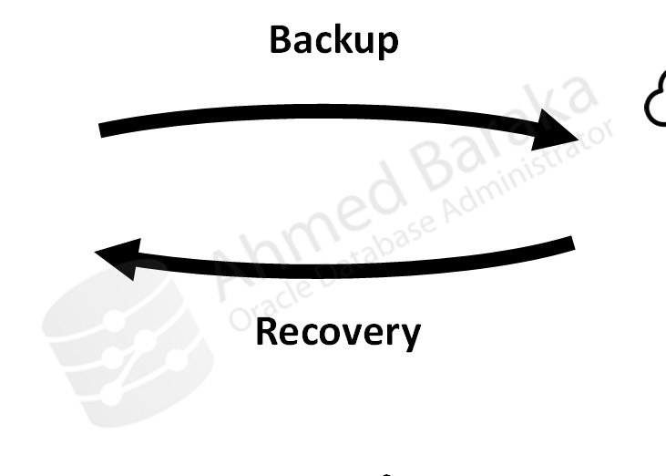
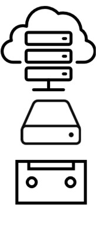
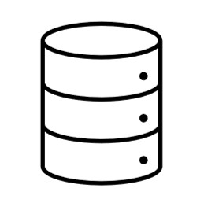
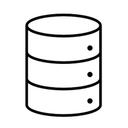
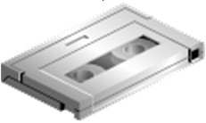

# Bài 72: Giới thiệu về Oracle Recovery Manager (RMAN)

## Mục tiêu
Sau bài học này, bạn sẽ có thể:
- Hiểu rõ Oracle Recovery Manager (RMAN) là gì và những ưu điểm vượt trội so với sao lưu thủ công (User-Managed Backup).
- Nắm vững các thành phần trong kiến trúc RMAN (Target Database, Recovery Catalog, Auxiliary Database, Channels, Media Management Layer).
- Phân biệt hai định dạng sao lưu của RMAN: **Backup Set** và **Image Copy**.
- Hiểu các chế độ kết nối và quyền hạn dành riêng cho sao lưu (**SYSBACKUP** vs **SYSDBA**).
- Nắm rõ cách xem, cấu hình và khôi phục các thiết lập bền vững (**Persistent Settings**) bằng lệnh CONFIGURE và SHOW ALL.

---

## 1. Tổng quan về Oracle Recovery Manager (RMAN)

**Oracle Recovery Manager (RMAN)** là công cụ dòng lệnh (Command-Line Utility) tích hợp sẵn bên trong hệ quản trị cơ sở dữ liệu Oracle, chuyên dụng cho các tác vụ sao lưu (Backup), khôi phục (Restore), phục hồi (Recover) và nhân bản cơ sở dữ liệu (Cloning/Duplication).

### Những ưu điểm và tính năng nổi bật của RMAN:
- **Sao lưu ở cấp độ khối dữ liệu (Block-level Backup):** RMAN chỉ đọc và sao lưu các khối dữ liệu thực sự có chứa dữ liệu (đối với Backup Set), bỏ qua các khối rỗng chưa dùng $\rightarrow$ Giảm đáng kể dung lượng backup.
- **Hỗ trợ Sao lưu Gia tăng (Incremental Backup):** Chỉ sao lưu các khối dữ liệu bị thay đổi kể từ lần backup gần nhất.
- **Tự động phát hiện khối dữ liệu hỏng (Corrupt Blocks):** RMAN quét và phát hiện lỗi hỏng khối vật lý hoặc logic ngay trong lúc đang sao lưu.
- **Cú pháp lệnh tự nhiên, gần với tiếng Anh:** Dễ học, dễ viết script tự động hóa.
- **Tích hợp sâu rộng:** Tương thích hoàn hảo với ASM (Automatic Storage Management), Oracle Data Guard, Oracle Secure Backup (OSB) và các phần mềm sao lưu của bên thứ ba (NetBackup, Commvault, Veeam, TSM) thông qua giao diện **MML (Media Management Layer)**.
- **Hỗ trợ nén (Compression) và mã hóa (Encryption):** Bảo mật và tiết kiệm không gian lưu trữ.
- **Hoàn toàn miễn phí:** Tích hợp sẵn trong mọi phiên bản Oracle Database mà không đòi hỏi thêm giấy phép (license) riêng.

---

## 2. Kiến trúc và Các Thành phần của RMAN

Các thành phần chính trong môi trường làm việc của RMAN bao gồm:
1. **Target Database (Cơ sở dữ liệu đích):** Là Database cần được sao lưu hoặc phục hồi. RMAN kết nối trực tiếp vào Target Database thông qua tiến trình máy chủ (Server Process) của Oracle.
2. **RMAN Executable:** File thực thi tiện ích 
man nằm trong $ORACLE_HOME/bin.
3. **Recovery Catalog (Tùy chọn):** Là một schema riêng nằm trên một database độc lập, dùng để lưu trữ toàn bộ lịch sử và siêu dữ liệu (metadata) sao lưu của một hoặc nhiều Target Database. Nếu không dùng Recovery Catalog, RMAN sẽ lưu metadata trực tiếp vào **Control File** của Target Database.
4. **Auxiliary Database (Database phụ trợ):** Là một instance tạm thời được RMAN tự động dựng lên khi thực hiện nhân bản database (DUPLICATE DATABASE) hoặc khôi phục bảng riêng lẻ (Table Point-in-Time Recovery).
5. **Channel (Kênh truyền dữ liệu):** Là luồng kết nối giữa RMAN và thiết bị lưu trữ (DISK hoặc băng từ SBT). Mỗi Channel tương ứng với một Server Process trên máy chủ. DBA có thể cấp phát nhiều Channel để sao lưu song song (Parallelism).

---

## 3. Các Định dạng File Sao lưu: Backup Set vs Image Copy

- **Backup Set (Mặc định):**
  - Là định dạng độc quyền của RMAN bao gồm một hoặc nhiều file nhị phân (Backup Pieces).
  - Tự động bỏ qua các khối dữ liệu rỗng.
  - Hỗ trợ nén dữ liệu và mã hóa.
  - Có thể ghi trực tiếp ra Đĩa (Disk) hoặc Băng từ (Tape).
- **Image Copy:**
  - Là bản sao chép nguyên trạng 1:1 theo từng byte của Datafile/Controlfile/Archivelog (giống lệnh cp trên Linux).
  - Không thể ghi trực tiếp ra băng từ (phải ghi ra đĩa).
  - Cho phép phục hồi cực nhanh thông qua tính năng **Switch Database to Copy** mà không cần qua giai đoạn Restore.

---

## 4. Kết nối RMAN và Phân quyền SYSBACKUP

Từ Oracle 12c trở đi, Oracle giới thiệu đặc quyền **SYSBACKUP** nhằm tách biệt nhiệm vụ quản trị (Separation of Duties). Quyền SYSBACKUP chỉ có quyền thực hiện sao lưu/phục hồi mà không thể đọc lén dữ liệu nhạy cảm của bảng nghiệp vụ như quyền SYSDBA.

`ash
# Kết nối cục bộ bằng OS Authentication:
export ORACLE_SID=oradb
rman target /

# Kết nối với quyền SYSBACKUP:
rman target "'/ as sysbackup'"

# Kết nối từ xa qua TNS:
rman target sys/Password123@oradb
rman target "'c##backup_admin/Password123@oradb as sysbackup'"
`

---

## 5. Cấu hình Cài đặt Bền vững (Persistent Settings)

Tất cả các cấu hình của RMAN được lưu vĩnh viễn trong Control File (và Recovery Catalog nếu có):

- **Xem toàn bộ cấu hình hiện tại:**
  `sql
  SHOW ALL;
  `
- **Thay đổi một thông số (ví dụ tăng số kênh song song hoặc bật tự động sao lưu Control File):**
  `sql
  CONFIGURE DEVICE TYPE DISK PARALLELISM 2;
  CONFIGURE CONTROLFILE AUTOBACKUP ON;
  `
- **Khôi phục thông số về giá trị mặc định của Oracle (CLEAR):**
  `sql
  CONFIGURE CONTROLFILE AUTOBACKUP CLEAR;
  `

---

## Câu hỏi ôn tập

**1. RMAN khác biệt căn bản như thế nào so với công cụ Oracle Data Pump (xpdp/impdp)?**
> **Trả lời:**
> - **RMAN là giải pháp sao lưu vật lý (Physical Backup):** RMAN sao lưu trực tiếp các khối dữ liệu (Data Blocks) vật lý cấu thành nên Datafile, Control File và Archive Log. Dữ liệu sao lưu bởi RMAN được dùng để khôi phục toàn diện khi hỏng hóc phần cứng hoặc thảm họa.
> - **Data Pump là công cụ xuất/nhập logic (Logical Export/Import):** Data Pump chỉ đọc cấu trúc và dữ liệu bảng dưới dạng câu lệnh DDL (CREATE TABLE) và bản ghi DML (INSERT). Data Pump không sao lưu các cấu trúc nội tại của database (như SCN, transaction state, redo stream), do đó **không được xem là giải pháp sao lưu thay thế cho hệ thống Production**.

**2. Điểm khác biệt giữa việc lưu trữ RMAN Metadata trong Control File và trong Recovery Catalog Database là gì?**
> **Trả lời:**
> - **Trong Control File:** Mặc định RMAN lưu trữ toàn bộ lịch sử sao lưu vào Control File của chính Target Database đó. Nhược điểm là dung lượng có hạn (bị chi phối bởi tham số CONTROL_FILE_RECORD_KEEP_TIME, mặc định sau 7 ngày sẽ bị ghi đè các bản ghi cũ) và nếu Control File bị mất mà không có bản backup thì việc dò tìm metadata sẽ phức tạp hơn.
> - **Trong Recovery Catalog:** Sử dụng một Database độc lập để lưu trữ metadata tập trung cho hàng chục/hàng trăm Target Database trong toàn doanh nghiệp. Lưu trữ lịch sử backup dài hạn (hàng năm), cho phép lưu trữ tập trung các RMAN Stored Scripts và hỗ trợ các tính năng báo cáo tập trung nâng cao.

**3. Tại sao quyền SYSBACKUP lại an toàn và bảo mật hơn quyền SYSDBA trong môi trường doanh nghiệp?**
> **Trả lời:**
> Quyền SYSBACKUP tuân thủ nguyên tắc đặc quyền tối thiểu (Principle of Least Privilege). Người dùng có quyền SYSBACKUP sở hữu đầy đủ quyền hạn để: khởi động/tắt database, vào chế độ mount, chạy các lệnh backup, restore, recover. Tuy nhiên, họ **hoàn toàn không thể thực hiện truy vấn SELECT vào bảng dữ liệu của người dùng** (như số tài khoản ngân hàng, lương nhân viên...). Ngược lại, SYSDBA là quyền lực tuyệt đối (Superuser), có thể truy cập và thay đổi mọi dữ liệu trong toàn hệ thống.

**4. Khái niệm "Channel" trong RMAN là gì? Làm thế nào để DBA tăng tốc độ sao lưu cho Database dung lượng lớn?**
> **Trả lời:**
> Channel là một luồng (stream) I/O giao tiếp giữa tiện ích RMAN và thiết bị lưu trữ vật lý (Disk hoặc Tape), tương ứng với một Server Process chạy ngầm trên máy chủ Oracle.
> Để tăng tốc độ sao lưu cho các Database dung lượng nhiều Terabyte, DBA có thể:
> - Cấu hình mức độ song song (**Parallelism**): Cấp phát nhiều Channel chạy đồng thời (ví dụ: CONFIGURE DEVICE TYPE DISK PARALLELISM 4;) để đọc/ghi đồng thời trên nhiều luồng.
> - Bật tính năng nén nâng cao (**Advanced Compression**).
> - Ghi bản sao lưu ra các đĩa cứng vật lý hoặc mảng SAN LUNs khác nhau để tránh thắt nút cổ chai (Bottleneck) về I/O.

**5. Lệnh CONFIGURE ... CLEAR trong RMAN dùng để làm gì? Lấy ví dụ minh họa.**
> **Trả lời:**
> Tùy chọn CLEAR trong câu lệnh CONFIGURE dùng để hủy bỏ giá trị cấu hình tùy biến trước đó và **khôi phục thiết lập trở về giá trị mặc định nguyên bản của Oracle (Factory Default)**.
> *Ví dụ:*
> `sql
> CONFIGURE BACKUP OPTIMIZATION CLEAR;
> CONFIGURE RETENTION POLICY CLEAR;
> `

---

!!! info "Nguồn gốc"
    `Oracle-Database-Administration-from-Zero-to-Hero/VN/72-gioi-thieu-rman.md`
