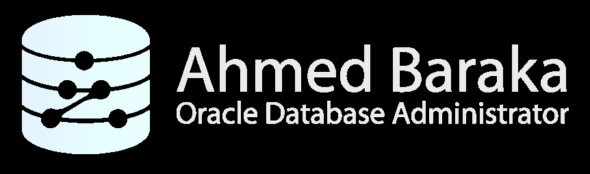

# Bài 73: Thực hành Giới thiệu và Khởi chạy RMAN Cơ bản

## Mục tiêu bài thực hành
Sau khi hoàn thành bài thực hành này, bạn sẽ có khả năng:
- Nắm vững các phương thức kết nối vào RMAN (OS authentication, đăng nhập với quyền SYSBACKUP, kết nối từ xa qua TNS).
- Xuất log thực thi của phiên làm việc RMAN ra tệp tin với tham số LOG và APPEND.
- Cấu hình biến môi trường NLS_DATE_FORMAT để RMAN hiển thị mốc thời gian chi tiết (ngày, tháng, năm, giờ, phút, giây).
- Xem và làm chủ các tham số cấu hình bền vững (SHOW ALL, SHOW CONTROLFILE AUTOBACKUP).
- Thực hiện tùy biến và khôi phục cài đặt mặc định của RMAN bằng lệnh CONFIGURE ... CLEAR.
- Cấu hình tham số khởi tạo CONTROL_FILE_RECORD_KEEP_TIME để đảm bảo lưu giữ lịch sử sao lưu dài hạn trong Control File.

---

## 1. Môi trường Thực hành
- **Máy chủ:** `srv1` (Linux Oracle Enterprise).
- **Database:** `oradb` (CDB).
- **User thực hiện:** `oracle` trên OS.



---

## 2. Các Bước Thực hiện

### Phần A: Khởi chạy và Kết nối RMAN

#### Bước 1: Kiểm tra vị trí file thực thi RMAN
Đăng nhập vào `srv1` với user `oracle`:
```bash
which rman
```
*Ghi nhận:* RMAN được chạy từ `$ORACLE_HOME/bin/rman`. Đảm bảo biến môi trường `ORACLE_HOME` và `ORACLE_SID` đã được thiết lập chính xác trước khi gọi `rman`.

#### Bước 2: Khởi chạy RMAN không kết nối và kết nối sau
```bash
rman
```
Tại dấu nhắc `RMAN>`, kết nối vào target database cục bộ bằng xác thực hệ điều hành (OS Authentication):
```text
RMAN> CONNECT TARGET /
```
*Quan sát:* RMAN sẽ hiển thị thông tin phiên bản, thông tin kết nối và **DBID (Database Identifier)** duy nhất của cơ sở dữ liệu.

Thoát khỏi RMAN:
```text
RMAN> EXIT;
```

#### Bước 3: Khởi chạy và kết nối trực tiếp trong một dòng lệnh
```bash
# Kết nối nhanh qua OS Authentication:
rman target /

# Thoát ra:
exit

# Kết nối qua chuỗi kết nối TNS với user SYS:
rman target sys/ABcd##1234@ORADB
exit
```

#### Bước 4: Tạo User chuyên trách Sao lưu với đặc quyền SYSBACKUP
Đăng nhập SQL*Plus với quyền SYSDBA để tạo người dùng chung (Common User):
```sql
sqlplus / as sysdba

-- Tạo user và gán quyền SYSBACKUP
CREATE USER C##BACKUPOPER IDENTIFIED BY ABcd##1234;
GRANT SYSBACKUP TO C##BACKUPOPER;
GRANT CREATE SESSION TO C##BACKUPOPER;
EXIT;
```

Khởi chạy RMAN và đăng nhập bằng tài khoản `C##BACKUPOPER` với đặc quyền `SYSBACKUP`:
```bash
rman target "'C##BACKUPOPER/ABcd##1234@ORADB as sysbackup'"
```
*Ghi nhận:* Kết nối thành công với vai trò sao lưu chuyên trách, tách biệt hoàn toàn khỏi quyền quản trị toàn diện của `SYSDBA`. Thoát khỏi RMAN (`EXIT;`).

#### Bước 5: Ghi nhật ký thực thi RMAN ra Log File
Khi lập lịch chạy sao lưu tự động bằng Crontab hoặc Script, ta cần chuyển hướng toàn bộ output vào tệp log:
```bash
rman target / log=/tmp/rman.log append
```
Trong dấu nhắc RMAN, gõ lệnh:
```text
SHOW ALL;
EXIT;
```
*Nhận xét:* Không có dòng text nào in ra màn hình Terminal vì tất cả đã được ghi thẳng vào `/tmp/rman.log`.
Kiểm tra nội dung file log:
```bash
cat /tmp/rman.log
rm /tmp/rman.log
```

Dọn dẹp user test:
```sql
sqlplus / as sysdba
DROP USER C##BACKUPOPER;
EXIT;
```

---

### Phần B: Cấu hình Định dạng Thời gian và Cài đặt Bền vững RMAN

#### Bước 6: Cấu hình biến môi trường hiển thị thời gian (NLS_DATE_FORMAT)
Mặc định RMAN chỉ hiển thị ngày/tháng/năm mà không hiển thị giờ:phút:giây. Điều này rất bất tiện khi cần khôi phục dữ liệu đến một thời điểm chính xác (PITR).
Mở file cấu hình profile của user `oracle`:
```bash
vi ~/.bash_profile
```
Thêm hoặc chỉnh sửa dòng sau:
```bash
export NLS_DATE_FORMAT="YYYY-MM-DD:HH24:MI:SS"
```
Áp dụng cấu hình ngay lập tức:
```bash
source ~/.bash_profile
```

#### Bước 7: Thao tác với cấu hình bền vững của RMAN
Khởi động RMAN:
```bash
rman target /
```

1. **Hiển thị toàn bộ cấu hình:**
   ```text
   RMAN> SHOW ALL;
   ```
   *Lưu ý:* Các tham số có gắn nhãn `# default` nghĩa là đang sử dụng giá trị mặc định của Oracle.

2. **Kiểm tra thông số tự động sao lưu Controlfile:**
   ```text
   RMAN> SHOW CONTROLFILE AUTOBACKUP;
   ```
   *Kết quả:* `CONFIGURE CONTROLFILE AUTOBACKUP ON; # default` (Trên Oracle 12c trở lên, tính năng này mặc định đã là ON).

3. **Thử nghiệm gán giá trị tường minh:**
   ```text
   RMAN> CONFIGURE CONTROLFILE AUTOBACKUP ON;
   RMAN> SHOW CONTROLFILE AUTOBACKUP;
   ```
   *Quan sát:* Nhãn `# default` đã biến mất, chứng tỏ tham số đã được người dùng tùy biến ghi đè.

4. **Khôi phục về giá trị mặc định nguyên bản:**
   ```text
   RMAN> CONFIGURE CONTROLFILE AUTOBACKUP CLEAR;
   RMAN> SHOW CONTROLFILE AUTOBACKUP;
   ```
   *Quan sát:* Chữ `# default` xuất hiện trở lại.

Thoát khỏi RMAN (`EXIT;`).

---

### Phần C: Cấu hình Tham số CONTROL_FILE_RECORD_KEEP_TIME

Khi không sử dụng Recovery Catalog, mọi bản ghi lịch sử sao lưu của RMAN được lưu trực tiếp trong **Control File**. Tham số `CONTROL_FILE_RECORD_KEEP_TIME` quy định số ngày tối thiểu mà các bản ghi này được giữ lại trước khi bị ghi đè.

Mặc định tham số này chỉ là **7 ngày**. Nếu chu kỳ backup của doanh nghiệp là 30 ngày hoặc 60 ngày, DBA cần tăng giá trị này lên:

```sql
sqlplus / as sysdba

-- 1. Xem giá trị hiện tại:
SHOW PARAMETER CONTROL_FILE_RECORD_KEEP_TIME

-- 2. Tăng giá trị lên 60 ngày:
ALTER SYSTEM SET CONTROL_FILE_RECORD_KEEP_TIME = 60 SCOPE = BOTH;

-- 3. Kiểm tra lại:
SHOW PARAMETER CONTROL_FILE_RECORD_KEEP_TIME
EXIT;
```

---

## Câu hỏi ôn tập

**1. DBID (Database Identifier) xuất hiện khi kết nối RMAN là gì và tại sao nó lại cực kỳ quan trọng trong công tác cứu hộ dữ liệu?**
> **Trả lời:**
> DBID là một số nguyên duy nhất (Unique 32-bit Number) được Oracle gán tự động cho Database khi khởi tạo.
> Khi xảy ra thảm họa mất toàn bộ đĩa cứng, bao gồm cả Control File và SPFILE, RMAN không thể nhận dạng được database để restore. Lúc này, DBA bắt buộc phải khởi động RMAN, thiết lập DBID bằng lệnh:
> ```text
> RMAN> SET DBID = 1234567890;
> ```
> Sau đó mới có thể khôi phục lại SPFILE và Control File từ các tệp tin Autobackup trong vùng lưu trữ.

**2. Tại sao DBA nên thiết lập biến môi trường `NLS_DATE_FORMAT="YYYY-MM-DD:HH24:MI:SS"` cho user `oracle` trên hệ điều hành?**
> **Trả lời:**
> Mặc định Oracle hiển thị ngày theo chuẩn ngắn (ví dụ: `09-SEP-26`). Khi thực hiện kiểm tra lịch sử sao lưu (`LIST BACKUP`) hoặc thực hiện phục hồi Point-in-Time (`SET UNTIL TIME '...'`), việc thiếu thông tin giờ, phút, giây sẽ khiến DBA không thể xác định chính xác thời điểm bản backup hoàn tất, dễ dẫn đến phục hồi sai mốc thời gian yêu cầu. Cấu hình biến môi trường này giúp RMAN hiển thị tường minh đầy đủ đến từng giây.

**3. Điều gì sẽ xảy ra nếu tham số `CONTROL_FILE_RECORD_KEEP_TIME = 7` trong khi chính sách lưu giữ bản sao lưu (Retention Policy) của công ty là 30 ngày?**
> **Trả lời:**
> Sau 7 ngày, phần dành riêng trong Control File (phần Reusable Section) sẽ được phép tái sử dụng và ghi đè các bản ghi sao lưu cũ hơn 7 ngày. Khi đó, mặc dù các file sao lưu vật lý của tuần trước vẫn còn nguyên vẹn trên đĩa, nhưng **RMAN không còn biết đến sự tồn tại của chúng trong metadata**. Muốn sử dụng lại các file sao lưu này để phục hồi, DBA sẽ phải mất thời gian chạy lệnh `CATALOG START WITH '...'` để nạp lại từng file vào Control File một cách thủ công.

**4. Khi chạy RMAN qua các script tự động hóa (Crontab / Scheduler), làm thế nào để lưu lại toàn bộ tiến trình thực thi vào file log và giữ nguyên nội dung log của các ngày trước đó?**
> **Trả lời:**
> Sử dụng hai tham số dòng lệnh `LOG` và `APPEND` khi gọi RMAN:
> ```bash
> rman target / log=/u01/app/oracle/logs/daily_backup.log append cmdfile=/u01/app/oracle/scripts/backup.rman
> ```
> - `LOG`: Chỉ định đường dẫn tệp ghi nhật ký.
> - `APPEND`: Ghi nối tiếp vào cuối tệp log thay vì ghi đè xóa sạch nội dung cũ.

**5. Mục đích của tính năng `CONTROLFILE AUTOBACKUP` trong RMAN là gì?**
> **Trả lời:**
> Khi bật `CONTROLFILE AUTOBACKUP ON`, mỗi khi DBA chạy lệnh `BACKUP` (sao lưu database, datafile, hoặc archivelog) hoặc mỗi khi có thay đổi cấu trúc vật lý của database (như thêm datafile, tạo tablespace mới), RMAN sẽ **tự động sao lưu một bản riêng biệt của Control File và SPFILE**. Điều này đảm bảo DBA luôn có trong tay bản sao lưu mới nhất của Control File để có thể khôi phục lại toàn bộ cơ sở dữ liệu ngay cả khi mất sạch toàn bộ hệ thống.


---

!!! info "Nguồn gốc"
    `Oracle-Database-Administration-from-Zero-to-Hero/VN/73-thuc-hanh-rman-co-ban.md`
