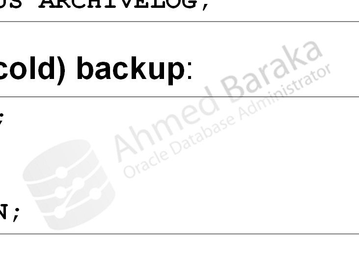

# Bài 74: Thực hiện RMAN Full Backups - Phần I

## Mục tiêu
Sau bài học này, bạn sẽ có khả năng:
- Hiểu rõ chiến lược sao lưu: Toàn bộ cơ sở dữ liệu (Whole Database Backup) so với từng phần (Partial Backup).
- Phân biệt giữa hai kiểu sao lưu: Full Backup và Incremental Backup (Differential vs Cumulative).
- Phân biệt chế độ sao lưu Nhất quán (Consistent / Cold / Offline Backup) và Không nhất quán (Inconsistent / Hot / Online Backup).
- So sánh chi tiết hai định dạng đầu ra của RMAN: Backup Set và Image Copy.
- Nắm rõ danh sách các đối tượng dữ liệu được phép và không được phép sao lưu bằng RMAN.
- Thực hiện cú pháp sao lưu toàn bộ Database, Tablespace, Datafile và chỉ định định dạng tên file (FORMAT).

---

## 1. Thuật ngữ và Chiến lược Sao lưu trong Oracle

### 1.1. Phạm vi sao lưu (Backup Strategy)
- **Whole Database Backup**: Sao lưu toàn bộ cấu trúc vật lý của cơ sở dữ liệu (tất cả Datafiles + Controlfile + SPFILE).
- **Partial Backup**: Chỉ sao lưu một phần của cơ sở dữ liệu (ví dụ: một Tablespace cụ thể hoặc các Datafile chỉ định).

### 1.2. Kiểu sao lưu (Backup Type)
- **Full Backup**: Đọc và sao lưu toàn bộ khối dữ liệu có chứa thông tin trong các tệp tin được chọn (tự động bỏ qua các khối rỗng chưa dùng nếu lưu dưới dạng Backup Set).
- **Incremental Backup**: Chỉ sao lưu các khối dữ liệu bị biến đổi kể từ lần sao lưu trước:
  - *Differential (Mặc định)*: Sao lưu các khối thay đổi kể từ lần Incremental (Level 0 hoặc Level 1) gần nhất.
  - *Cumulative*: Sao lưu tất cả các khối thay đổi kể từ lần Incremental Level 0 gần nhất.

### 1.3. Trạng thái sao lưu (Backup Mode)
- **Consistent Backup (Offline / Cold Backup)**: Thực hiện khi database đã được đóng sạch sẽ (SHUTDOWN IMMEDIATE / NORMAL) và đang mở ở chế độ MOUNT. Đây là giải pháp sao lưu duy nhất khi database ở chế độ NOARCHIVELOG.
- **Inconsistent Backup (Online / Hot Backup)**: Thực hiện khi Database đang mở (OPEN) cho người dùng truy cập bình thường 24/7. Bắt buộc cơ sở dữ liệu phải chạy ở chế độ ARCHIVELOG.

---

## 2. So sánh Định dạng Đầu ra: Backup Set vs Image Copy

| Đặc tính so sánh | Backup Set (Mặc định) | Image Copy |
| :--- | :--- | :--- |
| **Bản chất tệp tin** | Định dạng nén nội bộ độc quyền của Oracle, gồm một hoặc nhiều Backup Piece. | Bản sao chính xác 1:1 theo từng byte (Bit-by-bit copy) của Datafile. |
| **Kích thước tệp** | **Nhỏ hơn**: Chỉ sao lưu các khối có dữ liệu, tự động bỏ qua khối rỗng. | **Bằng dung lượng Datafile gốc** (sao lưu cả khối rỗng). |
| **Thiết bị lưu trữ** | Ghi trực tiếp được ra **Đĩa (Disk)** hoặc **Băng từ (Tape / SBT)**. | **Chỉ có thể ghi ra Đĩa (Disk)**. |
| **Khả năng Switch nhanh** | Không hỗ trợ (phải thực hiện bước Restore). | **Hỗ trợ cực nhanh** (SWITCH DATABASE TO COPY), không cần restore. |
| **Hỗ trợ nén & mã hóa** | Hỗ trợ nén nâng cao và mã hóa mạnh mẽ. | Không hỗ trợ nén. |

---

## 3. Các Loại Tệp Tin Hỗ trợ và Không Hỗ trợ trong RMAN

- **Các tệp RMAN ĐƯỢC PHÉP sao lưu:**
  - Tất cả các Data Files (ngoại trừ Tempfiles).
  - Control Files.
  - Server Parameter File (SPFILE).
  - Archived Redo Log Files.
  - Các bản sao lưu RMAN cũ (Backup of backups).
- **Các tệp RMAN KHÔNG THỂ sao lưu trực tiếp:**
  - **Online Redo Log Files**: Vì các file này luôn trong trạng thái thay đổi liên tục. RMAN chỉ sao lưu khi chúng đã trở thành Archive Log.
  - **Tempfiles**: Không cần sao lưu vì Oracle sẽ tự động tái tạo lại tempfile khi restore.
  - **Auxiliary Files**: Tệp mạng (listener.ora, tnsnames.ora), Password file (orapw<sid>), Keystore/Wallet mã hóa (cần sao chép thủ công ở mức OS).

---

## 4. Các Lệnh Sao lưu Cơ bản trong RMAN

### Sao lưu toàn bộ Database:
`sql
-- Mặc định sao lưu dưới dạng Backup Set
BACKUP DATABASE;

-- Sao lưu toàn bộ Database kèm toàn bộ Archive Log hiện hành
BACKUP DATABASE PLUS ARCHIVELOG;
`

### Sao lưu từng phần (Tablespace hoặc Datafile):
`sql
-- Sao lưu theo Tablespace
BACKUP TABLESPACE users, tools;

-- Sao lưu theo số thứ tự Datafile hoặc đường dẫn vật lý
BACKUP DATAFILE 1, 2, 3;
BACKUP DATAFILE '/u01/app/oradata/ORADB/users01.dbf';
`

### Chỉ định định dạng tên và nơi lưu trữ (FORMAT):
`sql
-- %U là ký tự đại diện tạo tên file duy nhất (Unique Name)
BACKUP DATABASE FORMAT '/u02/backup/oradb_%U.bck';
`

---

## Câu hỏi ôn tập

**1. Tại sao RMAN không bao giờ sao lưu các tệp tin tạm (Tempfiles) của Temporary Tablespace?**
> **Trả lời:**
> Vì Temporary Tablespace chỉ lưu trữ các kết quả trung gian tạm thời trong quá trình thực thi câu lệnh SQL (như phép toán sắp xếp SORT, băm HASH JOIN). Khi cơ sở dữ liệu gặp sự cố và phục hồi lại, các phiên làm việc đó đã kết thúc và dữ liệu tạm không còn giá trị. Oracle sẽ tự động tái tạo lại cấu trúc Tempfile rỗng ngay khi Database được mở, giúp tiết kiệm đáng kể thời gian và dung lượng sao lưu.

**2. Tại sao một bản sao lưu Hot Backup (Inconsistent Backup) lại bắt buộc phải có các tệp tin Archived Redo Log đi kèm mới có thể phục hồi được?**
> **Trả lời:**
> Khi thực hiện Hot Backup, các tiến trình người dùng vẫn đang liên tục ghi chép dữ liệu vào Datafile và Redo Log. Tại thời điểm RMAN đọc khối dữ liệu, các Datafiles không có cùng một mốc SCN (System Change Number) nhất quán. Khi khôi phục lại, Oracle bắt buộc phải áp dụng (Apply) các bản ghi thay đổi từ Archived Redo Log được tạo ra trong suốt quá trình sao lưu để đồng bộ đưa tất cả các Datafile về cùng một thời điểm SCN nhất quán.

**3. Sự khác nhau giữa một bản sao lưu toàn bộ (Whole Database Backup) và một bản sao lưu đầy đủ (Full Backup) là gì?**
> **Trả lời:**
> - **Whole Database Backup (Phạm vi)**: Đề cập đến **đối tượng được sao lưu**, tức là toàn bộ cơ sở dữ liệu (tất cả Datafiles thuộc tất cả Tablespace trong hệ thống).
> - **Full Backup (Phương thức)**: Đề cập đến **cơ chế đọc dữ liệu của RMAN**, tức là RMAN sẽ đọc toàn bộ các khối dữ liệu trong các file được chỉ định (khác với Incremental Backup chỉ đọc các khối thay đổi). Bạn hoàn toàn có thể chạy một bản Full Backup cho một Tablespace riêng lẻ (Partial Full Backup).

**4. Khi nào DBA nên lựa chọn sao lưu dưới dạng Image Copy thay vì Backup Set?**
> **Trả lời:**
> DBA nên dùng Image Copy khi mục tiêu thời gian khôi phục (**RTO**) đòi hỏi cực kỳ khắt khe (tiệm cận 0). Vì Image Copy là bản sao nguyên trạng 1:1, khi một Datafile bị hỏng, DBA có thể ra lệnh chuyển đổi sang file copy ngay lập tức (SWITCH DATAFILE TO COPY) mà không cần tốn thời gian giải nén hay copy dữ liệu (Restore phase) từ Backup Piece sang đĩa.

**5. Ký tự %U trong tùy chọn FORMAT của lệnh BACKUP mang ý nghĩa gì?**
> **Trả lời:**
> Ký tự đại diện %U (System-generated Unique Name) là quy chuẩn viết tắt của chuỗi %u_%p_%c:
> - %u: Chuỗi 8 ký tự mã băm duy nhất sinh ra cho backup set.
> - %p: Số thứ tự của backup piece trong backup set (bắt đầu từ 1).
> - %c: Số bản sao (copy number) của backup piece.
> Việc sử dụng %U đảm bảo mỗi tệp sao lưu được sinh ra luôn có tên duy nhất, không bao giờ xảy ra tình trạng ghi đè file trên hệ điều hành.

---

!!! info "Nguồn gốc"
    `Oracle-Database-Administration-from-Zero-to-Hero/VN/74-thuc-hien-rman-full-backups-p1.md`
