# MÔ HÌNH HÓA SỔ TAY CHẨN ĐOÁN — bản đồ tư duy bằng sơ đồ

> File này **mô hình hóa** [SO_TAY_CHAN_DOAN.md](so-tay-chan-doan.md) thành các sơ đồ Mermaid (GitHub / VS Code preview render trực tiếp).
> Mỗi mô hình gồm: **sơ đồ → cách đọc → câu hỏi tự kiểm tra**. Học sơ đồ TRƯỚC, tra code trong sổ tay SAU.
>
> Ký hiệu `§N` = mục N trong sổ tay chẩn đoán.

---

## Danh sách mô hình

| # | Mô hình | Trả lời câu hỏi tư duy |
|---|---------|------------------------|
| M1 | [Cây quyết định tổng](#m1--cây-quyết-định-tổng-master-decision-tree) | Bắt đầu từ đâu? Rẽ nhánh thế nào? |
| M2 | [Kiến trúc Oracle ↔ điểm quan sát V$](#m2--kiến-trúc-oracle--điểm-quan-sát-v) | Mỗi V$ view "nhìn vào" bộ phận nào? |
| M3 | [Cấu trúc DB Time](#m3--cấu-trúc-db-time--phép-cộng-đúng-vs-cây-lồng-nhau) | Vì sao % có thể > 100%? |
| M4 | [Trục thời gian công cụ](#m4--trục-thời-gian--chọn-công-cụ-theo-độ-tươi-của-sự-cố) | Sự cố lúc nào → dùng công cụ gì? |
| M5 | [Bản đồ wait event → root cause](#m5--bản-đồ-wait-event--root-cause--chuyên-đề) | Thấy event X thì nghi ai? |
| M6 | [Điều tra lock 3 thì](#m6--điều-tra-lock-theo-3-thì--sequence-v%24lock) | Lock sống/vừa chết/quá khứ điều tra khác nhau ra sao? |
| M7 | [Vòng xoáy literal storm](#m7--vòng-xoáy-literal-storm--điểm-đặt-thuốc) | Vì sao 1 dòng code sai đánh sập library cache? |
| M8 | [Cách đọc mọi Advisory](#m8--mô-hình-đọc-advisory-shared-pool--buffer-cache--pga) | "Điểm gãy khúc" là gì? Khi nào advisory nói dối? |
| M9 | [Lũ FTS & KEEP pool](#m9--buffer-cache-lũ-fts-đuổi-bảng-nóng--keep-pool) | Vì sao bảng nhỏ nóng lại đọc disk mãi? |
| M10 | [PGA: optimal → one-pass → multipass](#m10--pga-3-số-phận-của-một-work-area) | Sort tràn temp nghĩa là gì về vật lý? |
| M11 | [Đường đi của COMMIT](#m11--đường-đi-của-commit--phân-biệt-2-bệnh-redo) | `log file sync` khác `log file parallel write` chỗ nào? |
| M12 | [Ma trận CPU 4 ô](#m12--ma-trận-cpu-4-ô-host-busy--db-cpu) | Host bận — lỗi của DB hay của ai? |
| M13 | [Row Migration vs Chaining](#m13--row-migration-vs-chaining--mô-hình-block) | Khác nhau ở tầng block ra sao, vì sao fix khác nhau? |
| M14 | [HWM & FTS](#m14--hwm--vì-sao-delete-xong-fts-vẫn-chậm) | Vì sao DELETE không làm FTS nhanh lên? |
| M15 | [Vòng đời một lab / một cuộc tuning](#m15--vòng-đời-một-cuộc-tuning-đo--fix--đo-lại) | Thế nào là "đã chứng minh nhanh hơn"? |
| M16 | [Bản đồ liên kết chuyên đề](#m16--bản-đồ-liên-kết-mọi-con-đường-dẫn-về-db-time) | Các section móc nối nhau thế nào? |

---

## M1 — Cây quyết định tổng (master decision tree)

Đây là **toàn bộ sổ tay nén thành một cây**. Mọi cuộc điều tra đi từ gốc xuống, không nhảy cóc.

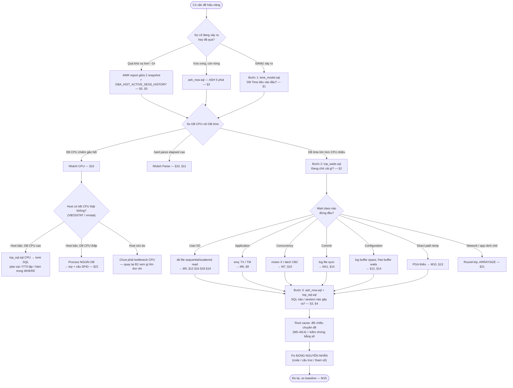
```mermaid
flowchart TD
    A0(["Có vấn đề hiệu năng"]) --> A1{"Sự cố đang xảy ra<br/>hay đã qua?"}

    A1 -->|"Quá khứ xa hơn ~1h"| P1["AWR report giữa 2 snapshot<br/>+ DBA_HIST_ACTIVE_SESS_HISTORY — §5, §3"]
    A1 -->|"Vừa xong, còn nóng"| P2["ash_now.sql — ASH 5 phút — §3"]
    A1 -->|"ĐANG xảy ra"| B1["Bước 1: time_model.sql<br/>DB Time tiêu vào đâu? — §1"]

    P1 --> B2
    P2 --> B2
    B1 --> B2{"So DB CPU với DB time"}

    B2 -->|"DB CPU chiếm gần hết"| C1["Nhánh CPU — §15"]
    B2 -->|"hard parse elapsed cao"| C2["Nhánh Parse — §10, §11"]
    B2 -->|"DB time lớn hơn CPU nhiều"| C3["Bước 2: top_waits.sql<br/>Đang chờ cái gì? — §2"]

    C1 --> D1{"Host có hết CPU thật không?<br/>(V$OSSTAT / vmstat)"}
    D1 -->|"Host bận, DB CPU cao"| E1["top_sql.sql CPU → tune SQL<br/>plan sai / FTS lặp / hàm trong WHERE"]
    D1 -->|"Host bận, DB CPU thấp"| E2["Process NGOÀI DB<br/>→ top + cầu SPID — §22"]
    D1 -->|"Host còn dư"| E3["Chưa phải bottleneck CPU<br/>— quay lại B2 xem gì lớn thứ nhì"]

    C3 --> D2{"Wait class nào<br/>đứng đầu?"}
    D2 -->|"User I/O"| F1["db file sequential/scattered read<br/>→ M5, §12 §16 §18 §19"]
    D2 -->|"Application"| F2["enq: TX / TM<br/>→ M6, §9"]
    D2 -->|"Concurrency"| F3["mutex X / latch CBC<br/>→ M7, §10"]
    D2 -->|"Commit"| F4["log file sync<br/>→ M11, §14"]
    D2 -->|"Configuration"| F5["log buffer space, free buffer waits<br/>→ §12, §14"]
    D2 -->|"Direct path temp"| F6["PGA thiếu → M10, §13"]
    D2 -->|"Network / app rảnh chờ"| F7["Round-trip, ARRAYSIZE — §21"]

    F1 --> G1["Bước 3: ash_now.sql + top_sql.sql<br/>SQL nào / session nào gây ra? — §3, §4"]
    F2 --> G1
    F3 --> G1
    F4 --> G1
    F5 --> G1
    F6 --> G1

    G1 --> H1["Root cause: đối chiếu chuyên đề<br/>(M5–M14) + kiểm chứng bằng số"]
    H1 --> H2["Fix ĐÚNG NGUYÊN NHÂN<br/>(code / cấu trúc / tham số)"]
    H2 --> H3(["Đo lại, so baseline — M15"])
```

**Cách đọc:**
- Cây có đúng **một cửa vào**: câu hỏi thời gian (M4). Sai cửa này là dùng sai công cụ ngay từ đầu (ví dụ soi `V$SESSION` cho sự cố hôm qua).
- Nút `B2` là **ngã ba quan trọng nhất khóa học**: CPU hay Wait quyết định nửa còn lại của cuộc điều tra.
- Không nhánh nào đi thẳng tới "Fix" mà không qua `G1` (tìm SQL/session cụ thể) — fix mà không biết thủ phạm là đoán mò.

**Tự kiểm tra:** người dùng than "app chậm" nhưng `top_waits` toàn thấy `SQL*Net message from client` — bạn rẽ nhánh nào? (Đáp: F7 — DB đang *rảnh chờ app*, vấn đề ở round-trip hoặc phía app, §21.)

---

## M2 — Kiến trúc Oracle ↔ điểm quan sát V$

Mỗi V$ view là một **camera** gắn vào một bộ phận. Thuộc bản đồ này thì không bao giờ quên "muốn xem X thì query view gì".

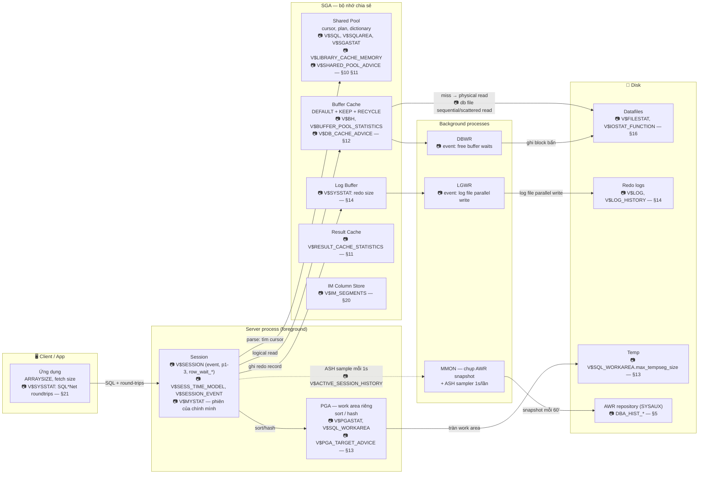
```mermaid
flowchart LR
    subgraph CLIENT["🖥️ Client / App"]
        APP["Ứng dụng<br/>ARRAYSIZE, fetch size<br/>📷 V$SYSSTAT: SQL*Net roundtrips — §21"]
    end

    subgraph SERVER["Server process (foreground)"]
        FG["Session<br/>📷 V$SESSION (event, p1-3, row_wait_*)<br/>📷 V$SESS_TIME_MODEL, V$SESSION_EVENT<br/>📷 V$MYSTAT — phiên của chính mình"]
        PGA["PGA — work area riêng<br/>sort / hash<br/>📷 V$PGASTAT, V$SQL_WORKAREA<br/>📷 V$PGA_TARGET_ADVICE — §13"]
    end

    subgraph SGA["SGA — bộ nhớ chia sẻ"]
        SP["Shared Pool<br/>cursor, plan, dictionary<br/>📷 V$SQL, V$SQLAREA, V$SGASTAT<br/>📷 V$LIBRARY_CACHE_MEMORY<br/>📷 V$SHARED_POOL_ADVICE — §10 §11"]
        BC["Buffer Cache<br/>DEFAULT + KEEP + RECYCLE<br/>📷 V$BH, V$BUFFER_POOL_STATISTICS<br/>📷 V$DB_CACHE_ADVICE — §12"]
        LB["Log Buffer<br/>📷 V$SYSSTAT: redo size — §14"]
        RC["Result Cache<br/>📷 V$RESULT_CACHE_STATISTICS — §11"]
        IM["IM Column Store<br/>📷 V$IM_SEGMENTS — §20"]
    end

    subgraph BG["Background processes"]
        LGWR["LGWR<br/>📷 event: log file parallel write"]
        DBWR["DBWR<br/>📷 event: free buffer waits"]
        MMON["MMON — chụp AWR snapshot<br/>+ ASH sampler 1s/lần"]
    end

    subgraph DISK["💾 Disk"]
        DF["Datafiles<br/>📷 V$FILESTAT, V$IOSTAT_FUNCTION — §16"]
        RL["Redo logs<br/>📷 V$LOG, V$LOG_HISTORY — §14"]
        TMP["Temp<br/>📷 V$SQL_WORKAREA.max_tempseg_size — §13"]
        AWR["AWR repository (SYSAUX)<br/>📷 DBA_HIST_* — §5"]
    end

    APP -->|"SQL + round-trips"| FG
    FG -->|"parse: tìm cursor"| SP
    FG -->|"logical read"| BC
    FG -->|"sort/hash"| PGA
    PGA -->|"tràn work area"| TMP
    BC -->|"miss → physical read<br/>📷 db file sequential/scattered read"| DF
    FG -->|"ghi redo record"| LB
    LB --> LGWR
    LGWR -->|"log file parallel write"| RL
    BC --> DBWR
    DBWR -->|"ghi block bẩn"| DF
    MMON -->|"snapshot mỗi 60'"| AWR
    FG -.->|"ASH sample mỗi 1s<br/>📷 V$ACTIVE_SESSION_HISTORY"| MMON
```

**Cách đọc:**
- Mọi mũi tên là **một chỗ có thể nghẽn**, và cạnh nó là **camera đo chỗ nghẽn đó**. Ví dụ: mũi tên `BC → DF` nghẽn thì camera là 2 event `db file *`; mũi tên `LB → LGWR → RL` nghẽn thì camera là `log file sync` / `log file parallel write`.
- `V$MYSTAT` chỉ thấy phiên của mình → dùng cho thí nghiệm có kiểm soát (lab 22, 23); `V$SYSSTAT` là cả instance.
- ASH sampler chụp ảnh mọi session active **mỗi giây** — đó là lý do `SAMPLES ≈ giây DB time` (M3, §3).

**Tự kiểm tra:** muốn biết "bảng nào đang chiếm buffer cache", camera nào? Nó gắn vào hộp nào? (Đáp: `V$BH`, gắn vào Buffer Cache.)

---

## M3 — Cấu trúc DB Time — phép cộng đúng vs cây lồng nhau

Hai cách nhìn cùng một `DB time`. Nhầm hai cách này là đọc sai `time_model.sql`.

**Cách nhìn 1 — phép cộng ĐÚNG (accounting identity), dùng để rẽ nhánh M1:**

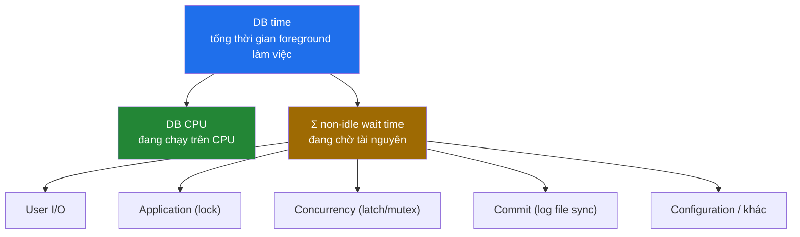
```mermaid
flowchart TD
    DBT["DB time<br/>tổng thời gian foreground làm việc"] --> CPU["DB CPU<br/>đang chạy trên CPU"]
    DBT --> W["Σ non-idle wait time<br/>đang chờ tài nguyên"]
    W --> W1["User I/O"]
    W --> W2["Application (lock)"]
    W --> W3["Concurrency (latch/mutex)"]
    W --> W4["Commit (log file sync)"]
    W --> W5["Configuration / khác"]
    style DBT fill:#1f6feb,color:#fff
    style CPU fill:#238636,color:#fff
    style W fill:#9e6a03,color:#fff
```

**Cách nhìn 2 — các stat trong V$SYS_TIME_MODEL LỒNG NHAU (không được cộng):**

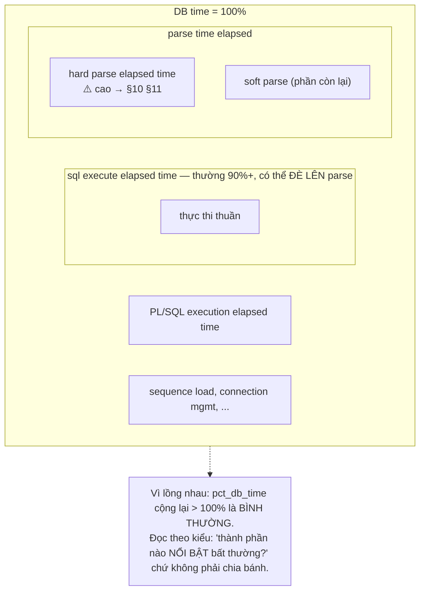
```mermaid
flowchart TD
    subgraph DBTIME["DB time = 100%"]
        subgraph SQLEXEC["sql execute elapsed time — thường 90%+, có thể ĐÈ LÊN parse"]
            EXEC["thực thi thuần"]
        end
        subgraph PARSETIME["parse time elapsed"]
            HP["hard parse elapsed time<br/>⚠️ cao → §10 §11"]
            SP2["soft parse (phần còn lại)"]
        end
        PLSQL["PL/SQL execution elapsed time"]
        SEQ["sequence load, connection mgmt, ..."]
    end
    NOTE["Vì lồng nhau: pct_db_time cộng lại > 100% là BÌNH THƯỜNG.<br/>Đọc theo kiểu: 'thành phần nào NỔI BẬT bất thường?' chứ không phải chia bánh."]
    DBTIME -.-> NOTE
```

**Cách đọc:**
- Cách nhìn 1 trả lời "**CPU hay wait?**" — dùng để rẽ nhánh. Cách nhìn 2 trả lời "**hoạt động loại gì?**" — dùng để đánh hơi (parse? PL/SQL?).
- `DB time` KHÔNG tính background (LGWR, DBWR…) và KHÔNG tính idle — vì thế job chạy bằng slave J00x gần như không cộng vào DB time (bẫy đã đo trong `workload_soe.sql`: job 15s → +0.01s DB time).

**Tự kiểm tra:** `sql execute elapsed time` = 130% DB time — có phải số liệu hỏng? (Đáp: không — lồng nhau + đo lũy kế, hoàn toàn hợp lệ.)

---

## M4 — Trục thời gian: chọn công cụ theo "độ tươi" của sự cố

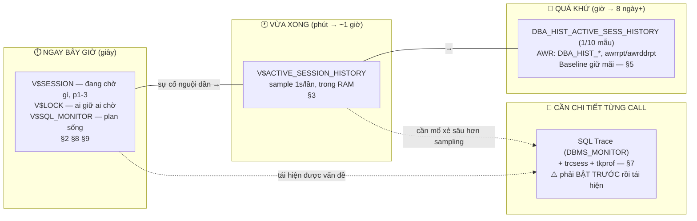
```mermaid
flowchart LR
    subgraph NOW["⏱️ NGAY BÂY GIỜ (giây)"]
        T1["V$SESSION — đang chờ gì, p1-3<br/>V$LOCK — ai giữ ai chờ<br/>V$SQL_MONITOR — plan sống<br/>§2 §8 §9"]
    end
    subgraph RECENT["🕐 VỪA XONG (phút → ~1 giờ)"]
        T2["V$ACTIVE_SESSION_HISTORY<br/>sample 1s/lần, trong RAM<br/>§3"]
    end
    subgraph PAST["📅 QUÁ KHỨ (giờ → 8 ngày+)"]
        T3["DBA_HIST_ACTIVE_SESS_HISTORY (1/10 mẫu)<br/>AWR: DBA_HIST_*, awrrpt/awrddrpt<br/>Baseline giữ mãi — §5"]
    end
    subgraph DEEP["🔬 CẦN CHI TIẾT TỪNG CALL"]
        T4["SQL Trace (DBMS_MONITOR)<br/>+ trcsess + tkprof — §7<br/>⚠️ phải BẬT TRƯỚC rồi tái hiện"]
    end
    T1 ---|"sự cố nguội dần →"| T2 ---|"→"| T3
    T2 -.->|"cần mổ xẻ sâu hơn sampling"| T4
    T1 -.->|"tái hiện được vấn đề"| T4
```

**Cách đọc — 3 quy luật đánh đổi:**

| Công cụ | Độ phân giải | Giữ được bao lâu | Cái giá |
|---|---|---|---|
| V$SESSION / V$LOCK | tức thời, chính xác | chỉ NGAY LÚC ĐÓ | sự cố qua là mất |
| ASH | 1 giây (sampling) | ~1h RAM, 8 ngày+ trên disk (1/10) | không đếm chính xác số lần |
| AWR | delta giữa 2 snapshot (60') | theo retention | mất chi tiết trong khoảng giữa |
| SQL Trace | từng call, chính xác tuyệt đối | file trace | phải bật trước, tốn disk |

- Sự cố càng nguội → độ phân giải càng thấp → kết luận càng phải thận trọng.
- Trace là công cụ duy nhất **không nhìn lùi được** — nó chỉ ghi từ lúc bật. Vì thế câu "làm ơn tái hiện lại lỗi" là câu cửa miệng của DBA.

**Tự kiểm tra:** 2h sáng qua DB treo 10 phút, giờ là 9h sáng — dùng gì? (Đáp: AWR report bao 2 snapshot quanh 2h + `DBA_HIST_ACTIVE_SESS_HISTORY` lọc `sample_time` khung đó. V$ và ASH-RAM đều đã trôi.)

---

## M5 — Bản đồ wait event → root cause → chuyên đề

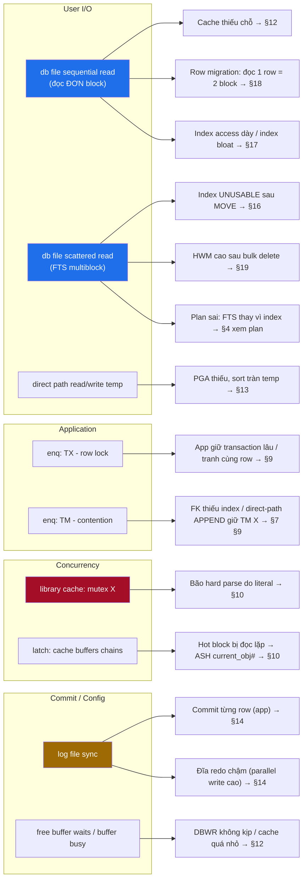
```mermaid
flowchart LR
    subgraph IO["User I/O"]
        E1["db file sequential read<br/>(đọc ĐƠN block)"]
        E2["db file scattered read<br/>(FTS multiblock)"]
        E3["direct path read/write temp"]
    end
    subgraph LOCKC["Application"]
        E4["enq: TX - row lock"]
        E5["enq: TM - contention"]
    end
    subgraph CONC["Concurrency"]
        E6["library cache: mutex X"]
        E7["latch: cache buffers chains"]
    end
    subgraph CMT["Commit / Config"]
        E8["log file sync"]
        E9["free buffer waits / buffer busy"]
    end

    E1 --> R1["Cache thiếu chỗ → §12"]
    E1 --> R2["Row migration: đọc 1 row = 2 block → §18"]
    E1 --> R3["Index access dày / index bloat → §17"]
    E2 --> R4["Index UNUSABLE sau MOVE → §16"]
    E2 --> R5["HWM cao sau bulk delete → §19"]
    E2 --> R6["Plan sai: FTS thay vì index → §4 xem plan"]
    E3 --> R7["PGA thiếu, sort tràn temp → §13"]
    E4 --> R8["App giữ transaction lâu / tranh cùng row → §9"]
    E5 --> R9["FK thiếu index / direct-path APPEND giữ TM X → §7 §9"]
    E6 --> R10["Bão hard parse do literal → §10"]
    E7 --> R11["Hot block bị đọc lặp → ASH current_obj# → §10"]
    E8 --> R12["Commit từng row (app) → §14"]
    E8 --> R13["Đĩa redo chậm (parallel write cao) → §14"]
    E9 --> R14["DBWR không kịp / cache quá nhỏ → §12"]

    style E1 fill:#1f6feb,color:#fff
    style E2 fill:#1f6feb,color:#fff
    style E6 fill:#a40e26,color:#fff
    style E8 fill:#9e6a03,color:#fff
```

**Cách đọc — kỹ năng quan trọng nhất: MỘT event có NHIỀU root cause.**
- `db file sequential read` có ít nhất 3 nghi phạm (R1/R2/R3) — **không được** thấy event là kết luận ngay. Phải có bằng chứng phân biệt: `table fetch continued row` tăng → migration; `V$BH` đầy bảng lạ → cache; `INDEX_STATS.del_lf_rows` cao → bloat.
- Ngược lại, MỘT root cause phát nhiều event: literal storm vừa gây `mutex X` (parse) vừa làm SQLA phình đuổi cursor (nạn nhân gián tiếp).
- Sự kiện thuộc lớp `Idle` **không phải bệnh DB** — nhưng `SQL*Net message from client` chiếm áp đảo trong khi user than chậm = manh mối bệnh **ở phía app/mạng** (§21).

**Tự kiểm tra:** `db file scattered read` tăng vọt ngay sau đêm bảo trì có chạy `ALTER TABLE MOVE` — nghi phạm số 1? Lệnh kiểm chứng? (Đáp: R4 — index UNUSABLE; `SELECT index_name, status FROM dba_indexes WHERE status <> 'VALID'`.)

---

## M6 — Điều tra lock theo 3 thì + sequence V$LOCK

**Thì của lock quyết định công cụ:**

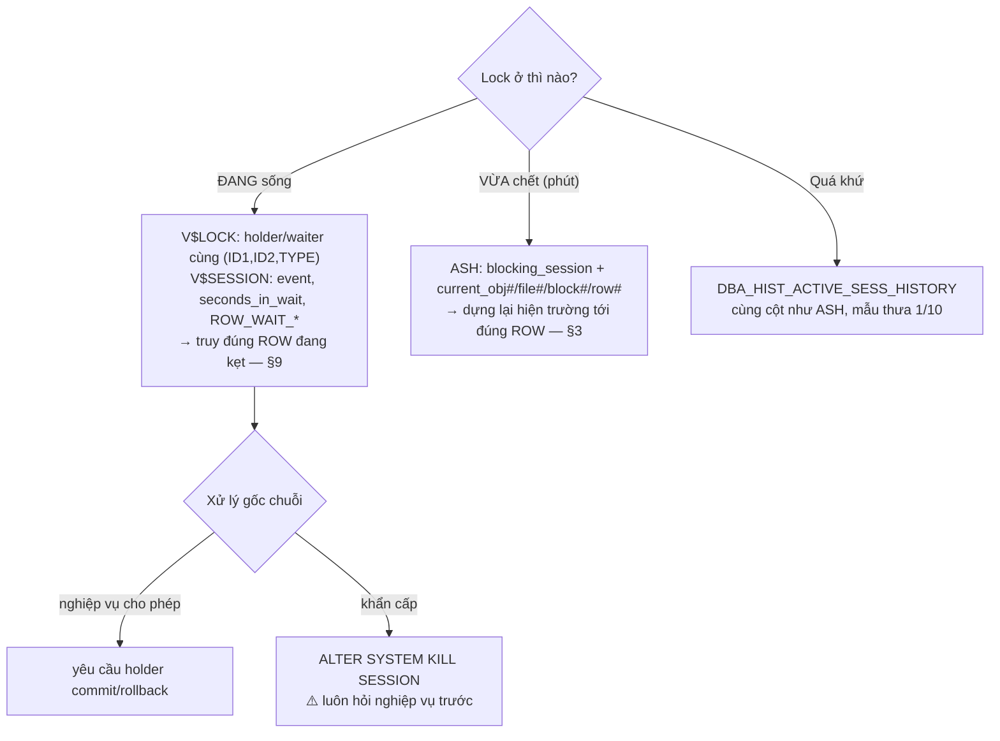
```mermaid
flowchart TD
    L0{"Lock ở thì nào?"}
    L0 -->|"ĐANG sống"| L1["V$LOCK: holder/waiter cùng (ID1,ID2,TYPE)<br/>V$SESSION: event, seconds_in_wait, ROW_WAIT_*<br/>→ truy đúng ROW đang kẹt — §9"]
    L0 -->|"VỪA chết (phút)"| L2["ASH: blocking_session + current_obj#/file#/block#/row#<br/>→ dựng lại hiện trường tới đúng ROW — §3"]
    L0 -->|"Quá khứ"| L3["DBA_HIST_ACTIVE_SESS_HISTORY<br/>cùng cột như ASH, mẫu thưa 1/10"]
    L1 --> L4{"Xử lý gốc chuỗi"}
    L4 -->|"nghiệp vụ cho phép"| L5["yêu cầu holder commit/rollback"]
    L4 -->|"khẩn cấp"| L6["ALTER SYSTEM KILL SESSION<br/>⚠️ luôn hỏi nghiệp vụ trước"]
```

**Sequence một vụ `enq: TX` kinh điển (lab 19):**

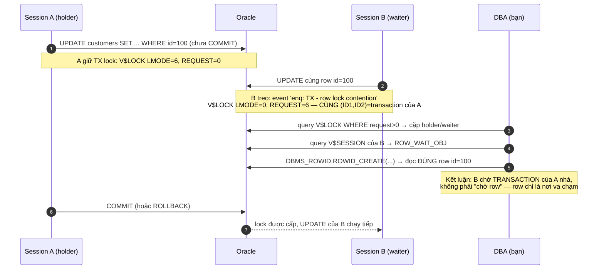
```mermaid
sequenceDiagram
    autonumber
    participant A as Session A (holder)
    participant DB as Oracle
    participant B as Session B (waiter)
    participant DBA as DBA (bạn)

    A->>DB: UPDATE customers SET ... WHERE id=100 (chưa COMMIT)
    Note over A,DB: A giữ TX lock: V$LOCK LMODE=6, REQUEST=0
    B->>DB: UPDATE cùng row id=100
    Note over B,DB: B treo: event 'enq: TX - row lock contention'<br/>V$LOCK LMODE=0, REQUEST=6 — CÙNG (ID1,ID2)=transaction của A
    DBA->>DB: query V$LOCK WHERE request>0 → cặp holder/waiter
    DBA->>DB: query V$SESSION của B → ROW_WAIT_OBJ#/FILE#/BLOCK#/ROW#
    DBA->>DB: DBMS_ROWID.ROWID_CREATE(...) → đọc ĐÚNG row id=100
    Note over DBA: Kết luận: B chờ TRANSACTION của A nhả,<br/>không phải "chờ row" — row chỉ là nơi va chạm
    A->>DB: COMMIT (hoặc ROLLBACK)
    DB-->>B: lock được cấp, UPDATE của B chạy tiếp
```

**Cách đọc:**
- Mấu chốt khái niệm: với `enq: TX`, `(ID1, ID2)` là **định danh transaction của holder** — bạn xếp hàng sau transaction, không phải sau row. Vì thế holder commit là cả hàng chờ chạy, không cần "mở khóa row".
- Chuỗi chờ dài (A←B←C): lần theo `blocking_session` về **gốc**; kill waiter giữa chuỗi là vô nghĩa.
- `SECONDS_IN_WAIT` lớn + holder `INACTIVE` = ai đó mở transaction rồi... đi ăn trưa — bài toán con người, không phải bài toán tuning.

**Tự kiểm tra:** vì sao waiter hiển thị `LMODE=0`? (Đáp: nó CHƯA giữ gì trên tài nguyên đó — chỉ đang REQUEST mode 6.)

---

## M7 — Vòng xoáy literal storm — điểm đặt thuốc

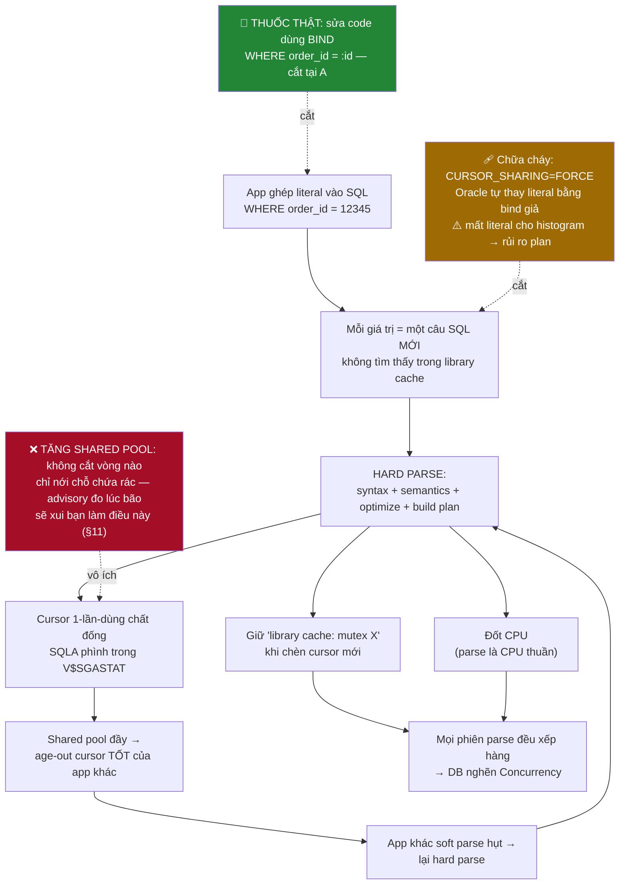
```mermaid
flowchart TD
    A["App ghép literal vào SQL<br/>WHERE order_id = 12345"] --> B["Mỗi giá trị = một câu SQL MỚI<br/>không tìm thấy trong library cache"]
    B --> C["HARD PARSE:<br/>syntax + semantics + optimize + build plan"]
    C --> D["Đốt CPU<br/>(parse là CPU thuần)"]
    C --> E["Giữ 'library cache: mutex X'<br/>khi chèn cursor mới"]
    C --> F["Cursor 1-lần-dùng chất đống<br/>SQLA phình trong V$SGASTAT"]
    F --> G["Shared pool đầy →<br/>age-out cursor TỐT của app khác"]
    G --> H["App khác soft parse hụt →<br/>lại hard parse"]
    H --> C
    E --> I["Mọi phiên parse đều xếp hàng<br/>→ DB nghẽn Concurrency"]
    D --> I

    FIX1["💊 THUỐC THẬT: sửa code dùng BIND<br/>WHERE order_id = :id — cắt tại A"] -.->|"cắt"| A
    FIX2["🩹 Chữa cháy: CURSOR_SHARING=FORCE<br/>Oracle tự thay literal bằng bind giả<br/>⚠️ mất literal cho histogram → rủi ro plan"] -.->|"cắt"| B
    FIX3["❌ TĂNG SHARED POOL: không cắt vòng nào<br/>chỉ nới chỗ chứa rác — advisory đo lúc bão<br/>sẽ xui bạn làm điều này (§11)"] -.->|"vô ích"| F

    style FIX1 fill:#238636,color:#fff
    style FIX2 fill:#9e6a03,color:#fff
    style FIX3 fill:#a40e26,color:#fff
```

**Cách đọc:**
- Đây là **vòng xoáy tự nuôi** (C→F→G→H→C): bệnh của MỘT app lan thành bệnh của MỌI app. Vì thế triệu chứng nhìn thấy đầu tiên có khi lại ở app vô tội.
- Ba vị trí đặt thuốc cho thấy nguyên tắc chung: **thuốc càng gần gốc càng thật**. Máy dò gốc = `FORCE_MATCHING_SIGNATURE` (§10): cùng signature, hàng nghìn `MATCHES` → chính là điểm A.
- Đo tốc độ vòng xoáy: delta `parse count (hard)` trong 15s (bình thường vài chục; bão = hàng trăm/nghìn).

**Tự kiểm tra:** vì sao `CURSOR_SHARING=FORCE` có thể làm một báo cáo đang nhanh thành chậm? (Đáp: optimizer mất giá trị literal thật → không dùng được histogram trên cột lệch → plan xấu cho giá trị phổ biến.)

---

## M8 — Mô hình đọc Advisory (Shared Pool / Buffer Cache / PGA)

**Cả 3 advisory đọc CÙNG MỘT KIỂU — đường cong lợi ích và "điểm gãy khúc":**

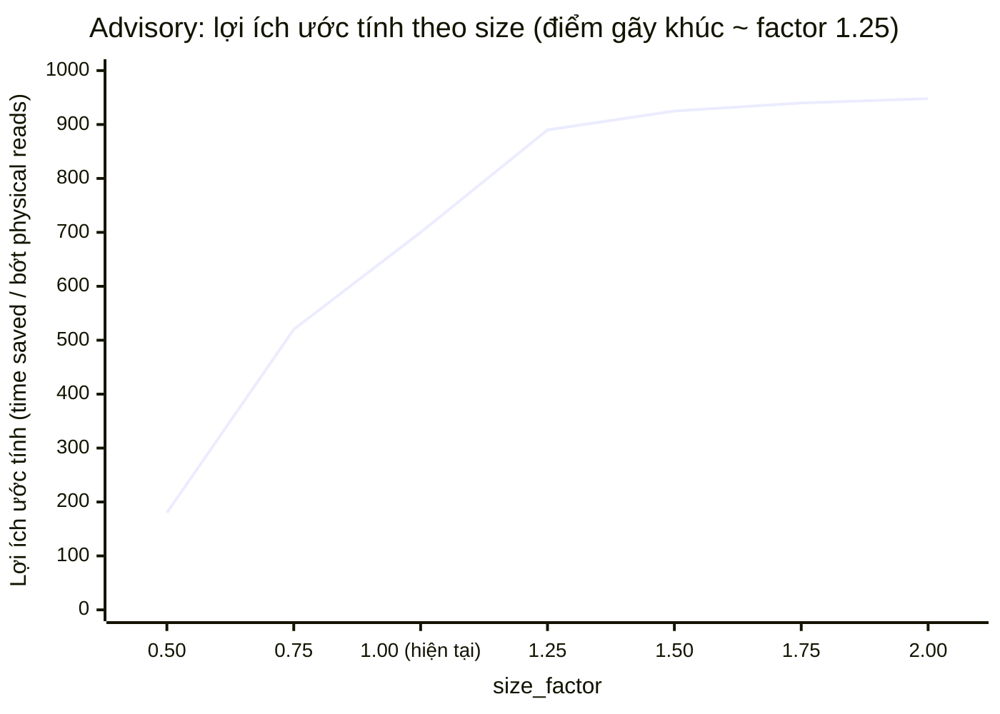
```mermaid
xychart-beta
    title "Advisory: lợi ích ước tính theo size (điểm gãy khúc ~ factor 1.25)"
    x-axis "size_factor" ["0.50", "0.75", "1.00 (hiện tại)", "1.25", "1.50", "1.75", "2.00"]
    y-axis "Lợi ích ước tính (time saved / bớt physical reads)" 0 --> 1000
    line [180, 520, 700, 890, 925, 940, 948]
```

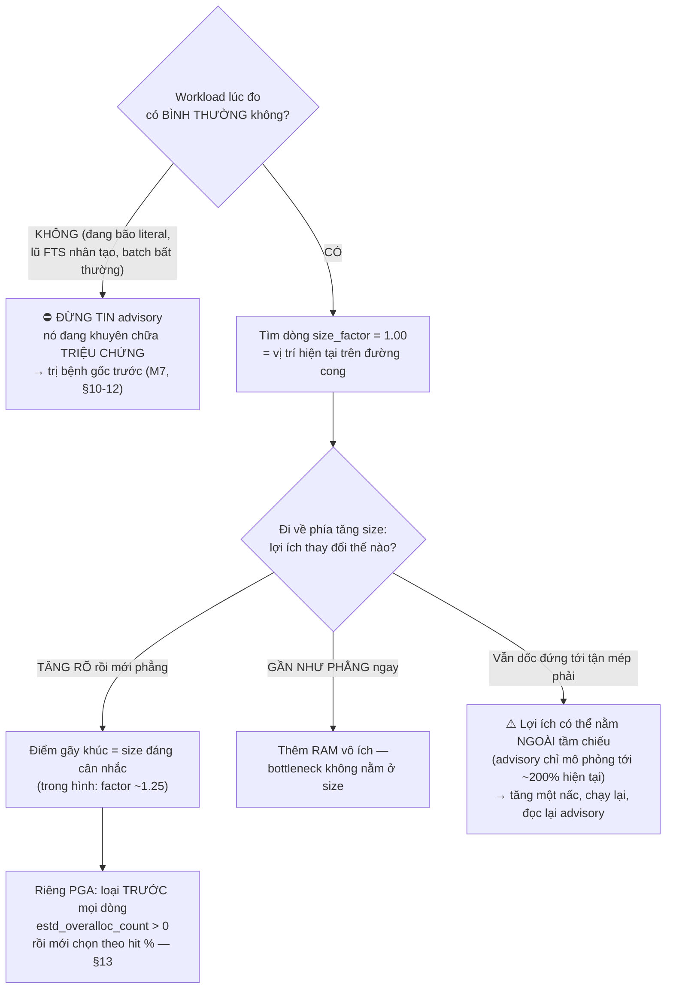
```mermaid
flowchart TD
    A{"Workload lúc đo<br/>có BÌNH THƯỜNG không?"}
    A -->|"KHÔNG (đang bão literal,<br/>lũ FTS nhân tạo, batch bất thường)"| X["⛔ ĐỪNG TIN advisory<br/>nó đang khuyên chữa TRIỆU CHỨNG<br/>→ trị bệnh gốc trước (M7, §10-12)"]
    A -->|"CÓ"| B["Tìm dòng size_factor = 1.00<br/>= vị trí hiện tại trên đường cong"]
    B --> C{"Đi về phía tăng size:<br/>lợi ích thay đổi thế nào?"}
    C -->|"TĂNG RÕ rồi mới phẳng"| D["Điểm gãy khúc = size đáng cân nhắc<br/>(trong hình: factor ~1.25)"]
    C -->|"GẦN NHƯ PHẲNG ngay"| E["Thêm RAM vô ích —<br/>bottleneck không nằm ở size"]
    C -->|"Vẫn dốc đứng tới tận mép phải"| F["⚠️ Lợi ích có thể nằm NGOÀI tầm chiếu<br/>(advisory chỉ mô phỏng tới ~200% hiện tại)<br/>→ tăng một nấc, chạy lại, đọc lại advisory"]
    D --> G["Riêng PGA: loại TRƯỚC mọi dòng<br/>estd_overalloc_count > 0<br/>rồi mới chọn theo hit % — §13"]
```

**Cách đọc:**
- Advisory là **mô phỏng what-if** từ workload thật vừa chạy qua — nó giỏi trả lời "size khác thì sao" nhưng **mù** về việc workload đó có đáng phục vụ hay không. Đó là gốc của nguyên tắc vàng "chỉ tin khi đo lúc bình thường".
- Ba view cùng khuôn: `V$SHARED_POOL_ADVICE` (est_lc_time_saved), `V$DB_CACHE_ADVICE` (estd_physical_read_factor — đọc NGƯỢC: giảm mạnh = tốt), `V$PGA_TARGET_ADVICE` (hit % + overalloc).
- Nhánh F là bài học Practice 23: cache 10MB → advisory chỉ chiếu tới 20MB, trong khi size đủ là 280MB — phải **leo thang nhiều nấc**, mỗi nấc đọc lại.

**Tự kiểm tra:** advisory buffer cache đọc lúc đang chạy "lũ FTS nhân tạo" của lab 22 sẽ khuyên gì, và vì sao không nghe? (Đáp: khuyên tăng cache thật to — nhưng lũ FTS là workload bất thường/một lần; nghe theo là mua RAM cho sự kiện không lặp lại.)

---

## M9 — Buffer cache: lũ FTS đuổi bảng nóng + KEEP pool

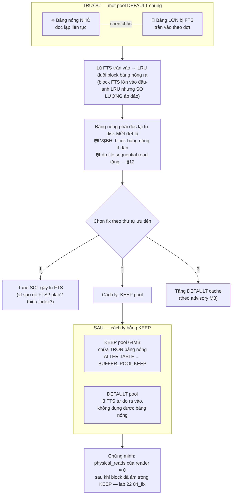
```mermaid
flowchart TD
    subgraph BEFORE["TRƯỚC — một pool DEFAULT chung"]
        direction LR
        HOT1["🔥 Bảng nóng NHỎ<br/>đọc lặp liên tục"] ---|"chen chúc"| BIG1["🌊 Bảng LỚN bị FTS<br/>tràn vào theo đợt"]
    end
    BEFORE --> EVICT["Lũ FTS tràn vào → LRU đuổi block bảng nóng ra<br/>(block FTS lớn vào đầu-lạnh LRU nhưng SỐ LƯỢNG áp đảo)"]
    EVICT --> SYMPTOM["Bảng nóng phải đọc lại từ disk MỖI đợt lũ<br/>📷 V$BH: block bảng nóng ít dần<br/>📷 db file sequential read tăng — §12"]
    SYMPTOM --> DECIDE{"Chọn fix theo thứ tự ưu tiên"}
    DECIDE -->|"1"| FIXSQL["Tune SQL gây lũ FTS<br/>(vì sao nó FTS? plan? thiếu index?)"]
    DECIDE -->|"2"| FIXKEEP["Cách ly: KEEP pool"]
    DECIDE -->|"3"| FIXSIZE["Tăng DEFAULT cache<br/>(theo advisory M8)"]

    subgraph AFTER["SAU — cách ly bằng KEEP"]
        direction LR
        KEEP["KEEP pool 64MB<br/>chứa TRỌN bảng nóng<br/>ALTER TABLE ... BUFFER_POOL KEEP"]
        DEF["DEFAULT pool<br/>lũ FTS tự do ra vào,<br/>không đụng được bảng nóng"]
    end
    FIXKEEP --> AFTER
    AFTER --> PROOF["Chứng minh: physical_reads của reader ≈ 0<br/>sau khi block đã ấm trong KEEP — lab 22 04_fix"]
```

**Cách đọc:**
- Thứ tự ưu tiên fix là của ADDM/course: **giảm I/O bằng tune SQL trước** — KEEP pool là cách ly nạn nhân, không trị thủ phạm.
- KEEP pool chỉ có nghĩa khi **chứa TRỌN** object (nhỏ hơn → vẫn bị đuổi ngay trong KEEP). Đo size bảng trước: `user_segments.bytes`.
- Hit % tổng thể có thể vẫn "đẹp" (95%+) trong khi bảng nóng khổ sở — đó là lý do phải nhìn `V$BH` theo object chứ không nhìn mỗi hit %.

---

## M10 — PGA: 3 số phận của một work area

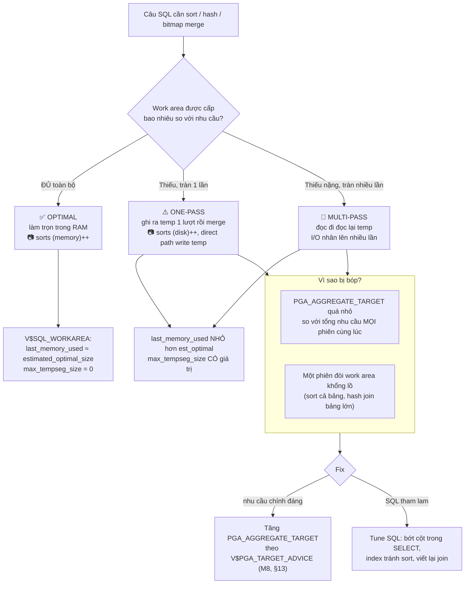
```mermaid
flowchart TD
    A["Câu SQL cần sort / hash / bitmap merge"] --> B{"Work area được cấp<br/>bao nhiêu so với nhu cầu?"}
    B -->|"ĐỦ toàn bộ"| OPT["✅ OPTIMAL<br/>làm trọn trong RAM<br/>📷 sorts (memory)++"]
    B -->|"Thiếu, tràn 1 lần"| ONE["⚠️ ONE-PASS<br/>ghi ra temp 1 lượt rồi merge<br/>📷 sorts (disk)++, direct path write temp"]
    B -->|"Thiếu nặng, tràn nhiều lần"| MULTI["🔴 MULTI-PASS<br/>đọc đi đọc lại temp<br/>I/O nhân lên nhiều lần"]

    OPT --> V1["V$SQL_WORKAREA:<br/>last_memory_used ≈ estimated_optimal_size<br/>max_tempseg_size = 0"]
    ONE --> V2["last_memory_used NHỎ hơn est_optimal<br/>max_tempseg_size CÓ giá trị"]
    MULTI --> V2

    subgraph WHY["Vì sao bị bóp?"]
        W1["PGA_AGGREGATE_TARGET quá nhỏ<br/>so với tổng nhu cầu MỌI phiên cùng lúc"]
        W2["Một phiên đòi work area khổng lồ<br/>(sort cả bảng, hash join bảng lớn)"]
    end
    ONE --> WHY
    MULTI --> WHY
    WHY --> FIX{"Fix"}
    FIX -->|"nhu cầu chính đáng"| F1["Tăng PGA_AGGREGATE_TARGET<br/>theo V$PGA_TARGET_ADVICE (M8, §13)"]
    FIX -->|"SQL tham lam"| F2["Tune SQL: bớt cột trong SELECT,<br/>index tránh sort, viết lại join"]
```

**Cách đọc:**
- Lab 23 tái hiện đúng mô hình này **bằng một tham số**: bóp `SORT_AREA_SIZE=160KB` (manual) → cùng câu SQL từ OPTIMAL rơi xuống ONE-PASS, `sorts (disk)=1`. Production không ai bóp tay — nhưng `PGA_AGGREGATE_TARGET` quá nhỏ gây **đúng hiệu ứng đó cho mọi phiên cùng lúc**.
- ONE-PASS thỉnh thoảng với batch lớn = chấp nhận được; MULTI-PASS = báo động đỏ (I/O nhân bản).
- Wait tương ứng ở M5: `direct path read/write temp` — thấy nó chiếm top là biết đi thẳng vào mô hình này.

---

## M11 — Đường đi của COMMIT — phân biệt 2 bệnh redo

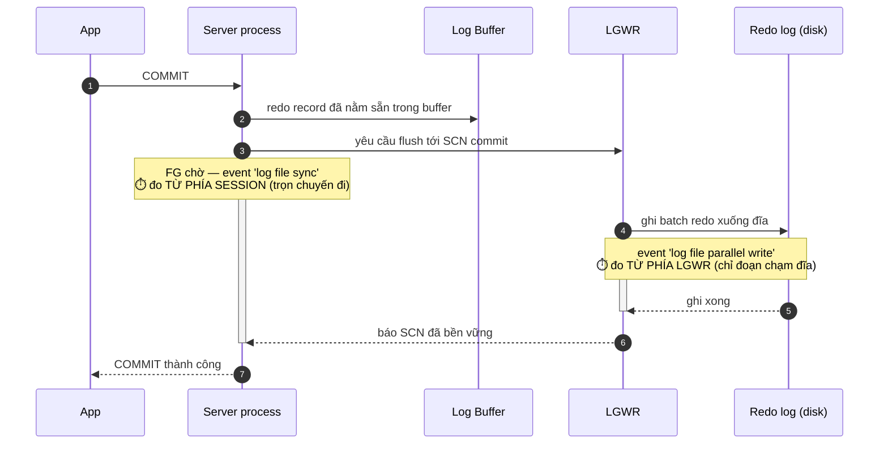
```mermaid
sequenceDiagram
    autonumber
    participant App
    participant FG as Server process
    participant LB as Log Buffer
    participant LGWR
    participant RL as Redo log (disk)

    App->>FG: COMMIT
    FG->>LB: redo record đã nằm sẵn trong buffer
    FG->>LGWR: yêu cầu flush tới SCN commit
    activate FG
    Note over FG: FG chờ — event 'log file sync'<br/>⏱️ đo TỪ PHÍA SESSION (trọn chuyến đi)
    LGWR->>RL: ghi batch redo xuống đĩa
    activate LGWR
    Note over LGWR,RL: event 'log file parallel write'<br/>⏱️ đo TỪ PHÍA LGWR (chỉ đoạn chạm đĩa)
    RL-->>LGWR: ghi xong
    deactivate LGWR
    LGWR-->>FG: báo SCN đã bền vững
    deactivate FG
    FG-->>App: COMMIT thành công
```

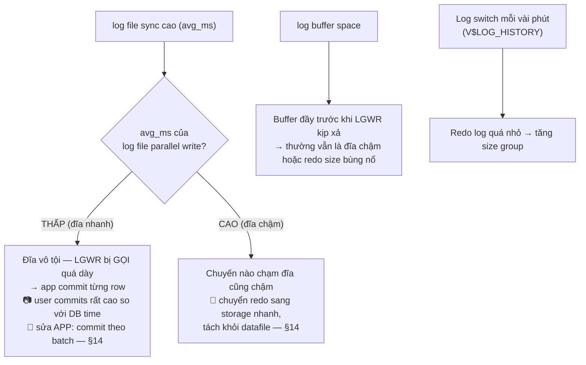
```mermaid
flowchart TD
    S["log file sync cao (avg_ms)"] --> Q{"avg_ms của<br/>log file parallel write?"}
    Q -->|"THẤP (đĩa nhanh)"| A1["Đĩa vô tội — LGWR bị GỌI quá dày<br/>→ app commit từng row<br/>📷 user commits rất cao so với DB time<br/>💊 sửa APP: commit theo batch — §14"]
    Q -->|"CAO (đĩa chậm)"| A2["Chuyến nào chạm đĩa cũng chậm<br/>💊 chuyển redo sang storage nhanh,<br/>tách khỏi datafile — §14"]
    S2["log buffer space"] --> A3["Buffer đầy trước khi LGWR kịp xả<br/>→ thường vẫn là đĩa chậm hoặc redo size bùng nổ"]
    S3["Log switch mỗi vài phút<br/>(V$LOG_HISTORY)"] --> A4["Redo log quá nhỏ → tăng size group"]
```

**Cách đọc:**
- `log file sync` (đo ở session) **bao trùm** `log file parallel write` (đo ở LGWR) + thời gian xếp hàng/báo hiệu. Hiệu của hai con số chính là chẩn đoán: sync cao − write thấp = **xếp hàng** (commit dày); cả hai cao = **đĩa**.
- Đây là mô hình mẫu cho tư duy "đo hai đầu một đường ống" — áp dụng được cho nhiều cặp event khác.

**Tự kiểm tra:** app OLTP ghi log mỗi giao dịch 1 row + commit ngay, `log file sync` avg 4ms, `parallel write` avg 0.4ms — thuốc là gì? (Đáp: A1 — gộp commit theo batch ở app; thay đĩa không giúp gì đáng kể.)

---

## M12 — Ma trận CPU 4 ô (Host busy × DB CPU)

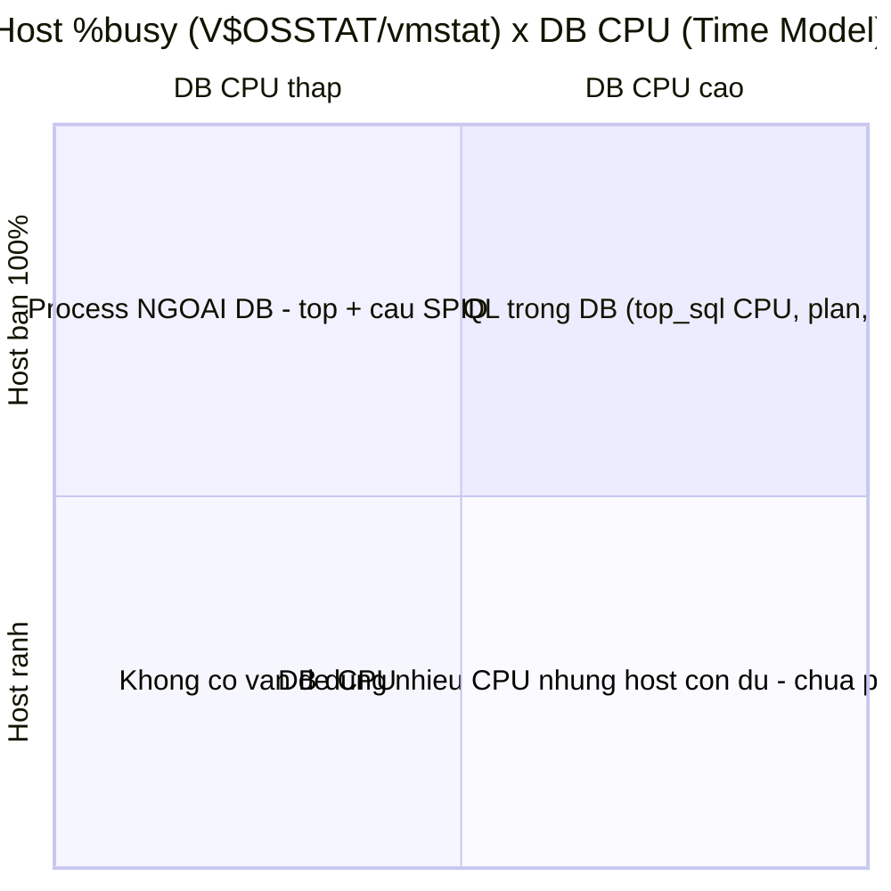
```mermaid
quadrantChart
    title Host %busy (V$OSSTAT/vmstat) x DB CPU (Time Model)
    x-axis "DB CPU thap" --> "DB CPU cao"
    y-axis "Host ranh" --> "Host ban 100%"
    quadrant-1 "Tune SQL trong DB (top_sql CPU, plan, parse)"
    quadrant-2 "Process NGOAI DB - top + cau SPID"
    quadrant-3 "Khong co van de CPU"
    quadrant-4 "DB dung nhieu CPU nhung host con du - chua phai bottleneck"
```

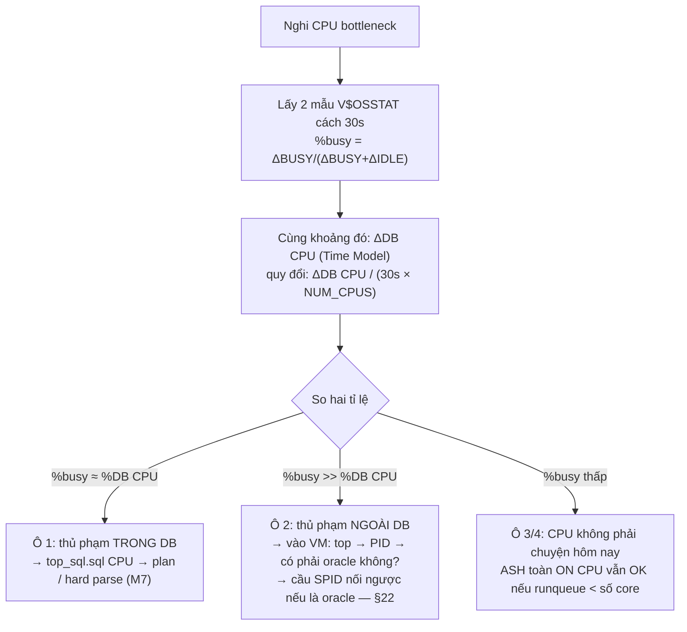
```mermaid
flowchart TD
    A["Nghi CPU bottleneck"] --> B["Lấy 2 mẫu V$OSSTAT cách 30s<br/>%busy = ΔBUSY/(ΔBUSY+ΔIDLE)"]
    B --> C["Cùng khoảng đó: ΔDB CPU (Time Model)<br/>quy đổi: ΔDB CPU / (30s × NUM_CPUS)"]
    C --> D{"So hai tỉ lệ"}
    D -->|"%busy ≈ %DB CPU"| E["Ô 1: thủ phạm TRONG DB<br/>→ top_sql.sql CPU → plan / hard parse (M7)"]
    D -->|"%busy >> %DB CPU"| F["Ô 2: thủ phạm NGOÀI DB<br/>→ vào VM: top → PID → có phải oracle không?<br/>→ cầu SPID nối ngược nếu là oracle — §22"]
    D -->|"%busy thấp"| G["Ô 3/4: CPU không phải chuyện hôm nay<br/>ASH toàn ON CPU vẫn OK nếu runqueue < số core"]
```

**Cách đọc:**
- Toàn bộ Section 25 nén vào **một phép so sánh hai delta** — kỹ thuật `cpu_sample.sql`. Nhớ ma trận là nhớ bài.
- Ô 4 hay bị hiểu nhầm: `DB CPU ≈ DB time` (M3 nhánh CPU) **chưa chắc** là bottleneck — chỉ là "DB bận làm việc thật". Chỉ báo động khi host **bão hòa** (runqueue `r` trong vmstat > số core).
- Ô 2 là cú lừa kinh điển: mọi chỉ số DB đều đẹp mà user than chậm — vì con trộm CPU đứng ngoài DB (backup, batch, VM hàng xóm).

---

## M13 — Row Migration vs Chaining — mô hình block

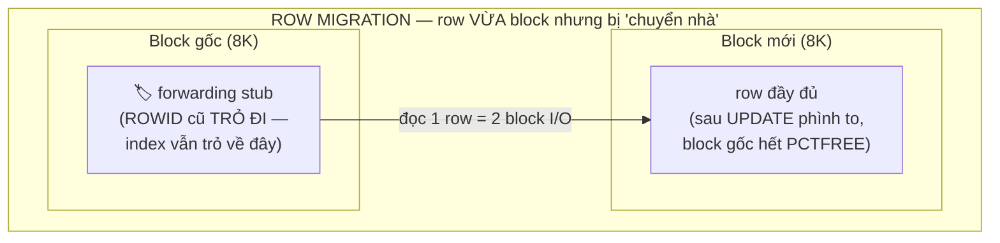
```mermaid
flowchart LR
    subgraph MIG["ROW MIGRATION — row VỪA block nhưng bị 'chuyển nhà'"]
        direction LR
        subgraph B1["Block gốc (8K)"]
            P1["🏷️ forwarding stub<br/>(ROWID cũ TRỎ ĐI —<br/>index vẫn trỏ về đây)"]
        end
        subgraph B2["Block mới (8K)"]
            R1["row đầy đủ<br/>(sau UPDATE phình to,<br/>block gốc hết PCTFREE)"]
        end
        P1 -->|"đọc 1 row = 2 block I/O"| R1
    end
```

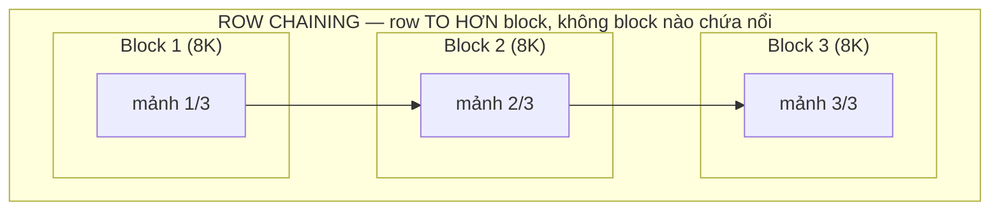
```mermaid
flowchart LR
    subgraph CHA["ROW CHAINING — row TO HƠN block, không block nào chứa nổi"]
        direction LR
        subgraph C1["Block 1 (8K)"]
            X1["mảnh 1/3"]
        end
        subgraph C2["Block 2 (8K)"]
            X2["mảnh 2/3"]
        end
        subgraph C3["Block 3 (8K)"]
            X3["mảnh 3/3"]
        end
        X1 --> X2 --> X3
    end
```

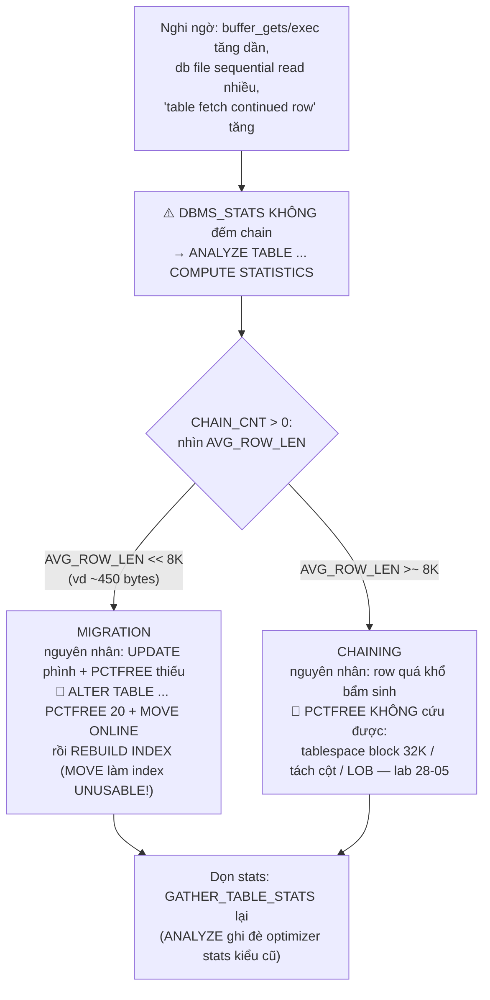
```mermaid
flowchart TD
    S["Nghi ngờ: buffer_gets/exec tăng dần,<br/>db file sequential read nhiều,<br/>'table fetch continued row' tăng"] --> A1["⚠️ DBMS_STATS KHÔNG đếm chain<br/>→ ANALYZE TABLE ... COMPUTE STATISTICS"]
    A1 --> D{"CHAIN_CNT > 0:<br/>nhìn AVG_ROW_LEN"}
    D -->|"AVG_ROW_LEN << 8K<br/>(vd ~450 bytes)"| MIGF["MIGRATION<br/>nguyên nhân: UPDATE phình + PCTFREE thiếu<br/>💊 ALTER TABLE ... PCTFREE 20 + MOVE ONLINE<br/>rồi REBUILD INDEX (MOVE làm index UNUSABLE!)"]
    D -->|"AVG_ROW_LEN >~ 8K"| CHAF["CHAINING<br/>nguyên nhân: row quá khổ bẩm sinh<br/>💊 PCTFREE KHÔNG cứu được:<br/>tablespace block 32K / tách cột / LOB — lab 28-05"]
    MIGF --> CLEAN["Dọn stats: GATHER_TABLE_STATS lại<br/>(ANALYZE ghi đè optimizer stats kiểu cũ)"]
    CHAF --> CLEAN
```

**Cách đọc:**
- Migration: ROWID gốc **không đổi** (index khỏi phải sửa) — cái giá là mọi truy cập qua index phải đi 2 bước. Đó là lý do triệu chứng là `buffer_gets/exec` tăng **mà bảng không to lên**.
- Hai bệnh, MỘT chỉ số gộp (`CHAIN_CNT` đếm chung) — phân biệt bằng `AVG_ROW_LEN` là kỹ năng mấu chốt, vì thuốc **hoàn toàn khác nhau** (một bên nới PCTFREE là khỏi, một bên PCTFREE vô dụng).
- Số thật lab 28: ~33% rows migrate sau UPDATE phình NOTE; fix PCTFREE 20 + MOVE → chain_cnt ≈ 0.

---

## M14 — HWM: vì sao DELETE xong FTS vẫn chậm?

```mermaid
flowchart TD
    subgraph T1["① Bảng đầy — HWM ở block 1000"]
        A1["■■■■■■■■■■  1000 block đầy dữ liệu"]
    end
    subgraph T2["② Sau bulk DELETE 90% — HWM VẪN ở block 1000"]
        A2["■□□■□□□■□□  ~100 block còn data, 900 block RỖNG<br/>nhưng vẫn nằm DƯỚI HWM"]
    end
    subgraph T3["③ FTS = quét TỚI HWM, không quét 'tới data'"]
        A3["FTS vẫn đọc đủ 1000 block<br/>📷 consistent gets KHÔNG giảm sau DELETE"]
    end
    subgraph T4["④ Fix: hạ HWM"]
        A4["ALTER TABLE ... ENABLE ROW MOVEMENT;<br/>ALTER TABLE ... SHRINK SPACE CASCADE;<br/>→ HWM về ~100 → FTS đọc ~100 block"]
    end
    T1 --> T2 --> T3 --> T4

    IDX["⚠️ Nhưng: truy cập QUA INDEX không bị phạt —<br/>rowid trỏ thẳng block, kệ HWM.<br/>Workload toàn index access → shrink KHÔNG cấp bách"]
    T3 -.-> IDX
```

**Cách đọc:**
- HWM (high water mark) là "mực nước từng dâng cao nhất" — DELETE rút nước nhưng **không hạ vạch**. Chỉ `SHRINK SPACE` / `MOVE` / `TRUNCATE` mới hạ.
- Ba góc đo cùng một sự thật (lab 29): `user_tables.blocks` cao + `avg_space` lớn (a), `DBMS_SPACE.SPACE_USAGE` nhiều block FS4-trống (b), `consistent gets` của FTS không giảm (c). Khớp cả ba mới kết luận.
- `SHRINK SPACE` đổi ROWID (cần ROW MOVEMENT) và giành lock từng đợt — DML dày dễ `ORA-00054`; làm ngoài giờ cao điểm.

---

## M15 — Vòng đời một cuộc tuning (đo → fix → đo lại)

```mermaid
flowchart LR
    S1["01_setup<br/>tái tạo vấn đề<br/>có kiểm soát"] --> S2["02_workload<br/>chạy tải + 📏 ĐO BASELINE<br/>AWR snap B / before_after BEGIN"]
    S2 --> S3["03_diagnose<br/>chứng minh root cause<br/>BẰNG SỐ (không đoán)"]
    S3 --> P{"🎯 DỰ ĐOÁN trước khi fix:<br/>'sau fix, chỉ số X sẽ về ~Y'"}
    P --> S4["04_fix<br/>sửa ĐÚNG NGUYÊN NHÂN<br/>+ chạy lại CÙNG workload"]
    S4 --> S5["📏 ĐO LẠI, so với baseline<br/>AWR snap E / before_after END"]
    S5 --> V{"Số có khớp<br/>dự đoán?"}
    V -->|"Khớp"| OK["✅ Hiểu đúng cơ chế<br/>→ 99_cleanup, ghi progress.md"]
    V -->|"KHÔNG khớp"| REDO["❌ Mô hình trong đầu sai ở đâu?<br/>→ quay lại 03, tìm biến số bỏ sót<br/>(đây là lúc HỌC được nhiều nhất)"]
    REDO --> S3
```

**Cách đọc:**
- Bước `P` (dự đoán) là **linh hồn phương pháp học** của khóa này: không có dự đoán thì "đo lại" chỉ là xem số, không phải kiểm định giả thuyết.
- "Cùng workload" khi đo lại là điều kiện bắt buộc — đổi tải giữa chừng thì so sánh vô nghĩa (biến số nhiễu).
- Nhánh `REDO` không phải thất bại — dự đoán trượt là tín hiệu quý nhất cho thấy chỗ hổng trong mental model.

---

## M16 — Bản đồ liên kết: mọi con đường dẫn về DB Time

Các chuyên đề không rời rạc — chúng là **các trạm trên cùng mạng lưới nhân quả**. Nhìn bản đồ này để hiểu vì sao thứ tự tư duy luôn bắt đầu từ DB Time.

```mermaid
flowchart TD
    DBT(("DB TIME<br/>mọi bệnh đều<br/>hiện ra ở đây"))

    DBT --> CPU["DB CPU cao"]
    DBT --> WAIT["Wait cao"]

    CPU --> SQL1["SQL plan xấu / FTS lặp<br/>§4"]
    CPU --> HP["Hard parse<br/>§10 M7"]
    CPU --> EXT["CPU ngoài DB<br/>§15 §22 M12"]

    WAIT --> UIO["User I/O"]
    WAIT --> LCK["Lock §9 M6"]
    WAIT --> MTX["Mutex/Latch"]
    WAIT --> CMTW["Commit §14 M11"]
    WAIT --> TMPW["Temp I/O §13 M10"]

    UIO --> BCACHE["Cache thiếu / bị chiếm<br/>§12 M9"]
    UIO --> RMIG["Row migration §18 M13"]
    UIO --> HWM2["HWM cao §19 M14"]
    UIO --> IDXB["Index bloat / UNUSABLE<br/>§17 §16"]

    HP --> MTX
    HP --> SPOOL["Shared pool phình<br/>§11 M8"]
    SQL1 --> BCACHE
    SQL1 --> UIO
    RMIG --> IDXB

    BATCH["ETL APPEND<br/>§7"] --> LCK
    ARR["Round-trip dày §21"] -.->|"KHÔNG hiện trong DB time<br/>(DB đang idle chờ app!)"| DBT

    style DBT fill:#1f6feb,color:#fff
    style ARR fill:#a40e26,color:#fff
```

**Cách đọc:**
- Một nút có thể có **nhiều cha**: `Mutex/Latch` vừa là hậu quả của hard parse (literal storm) vừa có thể là hot block riêng. `Index bloat` vừa tự gây I/O vừa là hậu quả phụ của fix migration (MOVE làm index UNUSABLE).
- Nút đỏ `Round-trip` là ngoại lệ quan trọng nhất: bệnh **không để lại dấu trong DB time** — DB càng rảnh, app càng chậm. Gặp ca "mọi chỉ số DB đều đẹp mà user than trời" → nghĩ ngay tới nó (và tới CPU ngoài DB).
- Ôn tập: che phần dưới sơ đồ, tự vẽ lại từ `DB TIME` xuống — vẽ được trọn là đã nắm khung cả khóa học.

---

## Gợi ý cách học với bộ mô hình

1. **Trước mỗi lab**: mở mô hình tương ứng (bảng đầu file), tự thuật lại bằng lời — rồi mới chạy script.
2. **Khi "chạy mù"** (ôn tập): chỉ được dùng M1 + M5 làm la bàn, cấm mở sổ tay cho đến khi có kết luận.
3. **Tự vẽ lại từ trí nhớ** M1, M7, M11, M16 sau mỗi 3 buổi — sai chỗ nào, đó chính là chỗ cần học lại.

---

!!! info "Nguồn gốc"
    `The-Oracle-Database-Performance-Tuning-Course/labs/SO_TAY_MO_HINH_BK.md`
