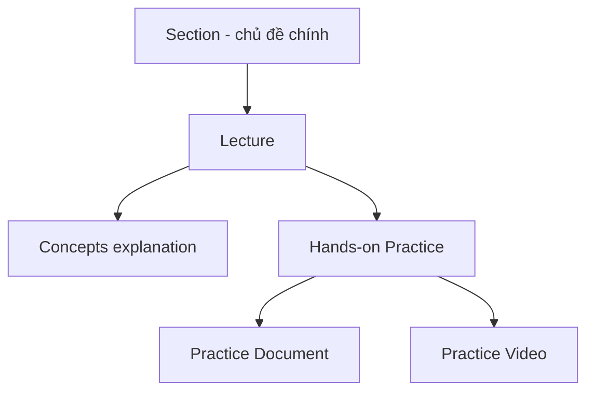

# 📘 Module 01: Introducing the Course

> **Section**: 01/14
> **Khóa học**: Oracle Database RAC Administration Course (Ahmed Baraka)
> **Thời gian học ước tính**: 30 phút

---

## 📋 Bài học trong Module

| #   | Bài học                | File nguồn                              | Loại      |
| --- | ---------------------- | --------------------------------------- | --------- |
| 1   | Introducing the Course | `Section 01/Introducing the Course.pdf` | Lý thuyết |

---

## 🎯 Mục tiêu Module

- Hiểu **mục tiêu khóa học**: tạo và quản lý Oracle Database **12c RAC** (cả **12.1** và **12.2**).
- Biết **ai nên / không nên** học khóa này.
- Nắm **kiến thức tiên quyết** và **các kỹ năng** sẽ đạt được.
- Hiểu **cấu trúc khóa học** (section → lecture → practice) và toàn bộ curriculum.

---

## 📋 Nội dung chính

> 📄 Nguồn: `Section 01/Introducing the Course.pdf`

### 1. Mục tiêu khóa học (Course Goal)

> **Tạo và quản lý các Oracle Database 12c RAC — bao gồm cả bản 12.1 và 12.2.**

### 2. Ai nên / không nên học?

|                     |                                                     |
| ------------------- | --------------------------------------------------- |
| ✅ **Nên học**       | DBA muốn học cách **tạo và quản lý** Oracle 12c RAC |
| ❌ **Không nên học** | DBA **đã có kinh nghiệm** quản trị Oracle 12c RAC   |

### 3. Kiến thức tiên quyết (đúng theo PDF — chỉ 2)

- Quen với **quản trị Oracle Database** (single instance).
- Quen với **kiến thức cơ bản về hệ điều hành Linux**.

> ⚠️ PDF chỉ yêu cầu 2 điều trên. Không bắt buộc kiến thức chuyên sâu về mạng/storage — những phần cần thiết sẽ được giới thiệu trong khóa.

### 4. Các kỹ năng sẽ học được

- Hiểu **kiến trúc** Oracle RAC.
- **Cài đặt và tạo** Oracle 12c RAC database.
- Thực hiện các **tác vụ quản trị** trên RAC.
- Quản lý **Backup & Recovery** trong RAC.
- Hiểu **Global Resource Management**.
- **Monitoring & Tuning** RAC database.
- Quản lý **dynamic database services**.
- Triển khai **load balancing, TAF, FAN, Application Continuity**.
- Áp **patch set** và **upgrade** Oracle RAC.
- Tạo và quản lý: **RAC One Node**, **RAC CDB (Multitenant)**, **Policy-managed RAC**.
- Hiểu cách hoạt động của **Oracle Flex Cluster**.

### 5. Cấu trúc khóa học (Course Layout)

- Các chủ đề chính chia thành **section**.
- Mỗi section gồm nhiều **lecture** liên quan.
- Lecture có thể là **giải thích khái niệm** hoặc **thực hành** (đi kèm **tài liệu practice** + **video**).

### 6. Tổng quan Curriculum (14 chủ đề)

| #   | Chủ đề                                  | Module |
| --- | --------------------------------------- | ------ |
| 1   | Oracle RAC Architecture                 | 02     |
| 2   | Installing and Creating Oracle RAC      | 03     |
| 3   | Oracle RAC Basic Administration         | 04     |
| 4   | Managing Backup and Recovery            | 04     |
| 5   | Global Resource Management              | 05     |
| 6   | Monitoring and Tuning                   | 05     |
| 7   | Managing Dynamic Database Services      | 06     |
| 8   | Connection Load Balancing and TAF       | 06     |
| 9   | Using Application Continuity            | 06     |
| 10  | Patching Oracle RAC                     | 07     |
| 11  | Upgrading Oracle RAC                    | 07     |
| 12  | RAC One Node                            | 08     |
| 13  | Multitenant Architecture and RAC        | 09     |
| 14  | Policy-Managed Clusters + Flex Clusters | 10, 11 |

---

## 📝 Ghi nhớ quan trọng

- Khóa học nhắm tới **DBA chưa có kinh nghiệm RAC**, dạy **12.1 và 12.2**.
- Chỉ cần nền tảng **Oracle DBA + Linux cơ bản**.
- Học theo cặp **lý thuyết (concepts) + thực hành (document/video)** — nên làm practice ngay sau mỗi lecture.

---

## 🛠️ Sau khi học xong, hãy tự làm

1. Tóm tắt 1 câu: mục tiêu của khóa học là gì?
2. Tự đánh giá mình đã đủ 2 điều kiện tiên quyết chưa.
3. Đánh dấu trong danh sách 14 chủ đề những phần bạn quan tâm nhất.

---

## ⏭️ Module tiếp theo

**Module 02: Oracle RAC Overview & Architecture** — tổng quan lợi ích/nhược điểm RAC và kiến trúc chi tiết (GI, Clusterware, SCAN, connectivity cycle).

---

!!! info "Nguồn gốc"
    `The-Oracle-Database-RAC-Administration-Course/modules/module_01/module_01_guide.md`
