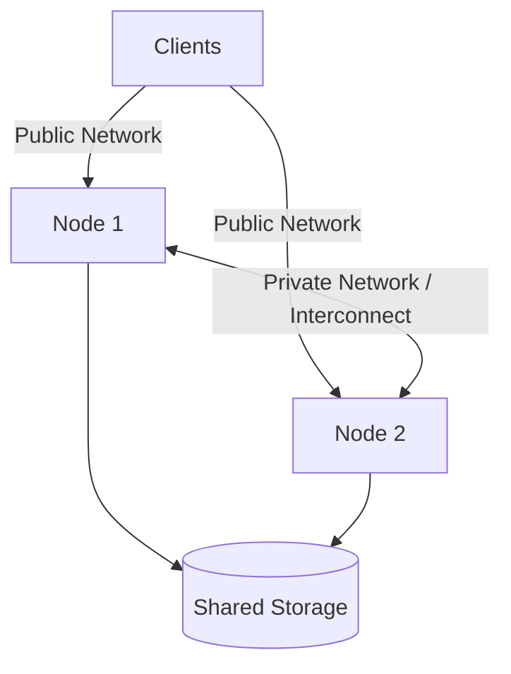
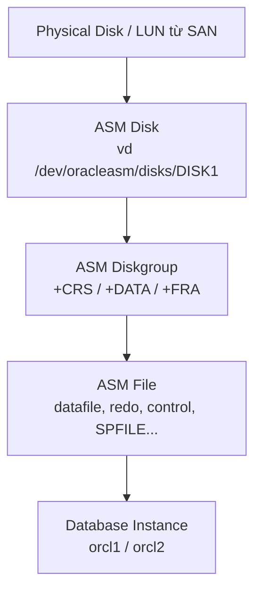
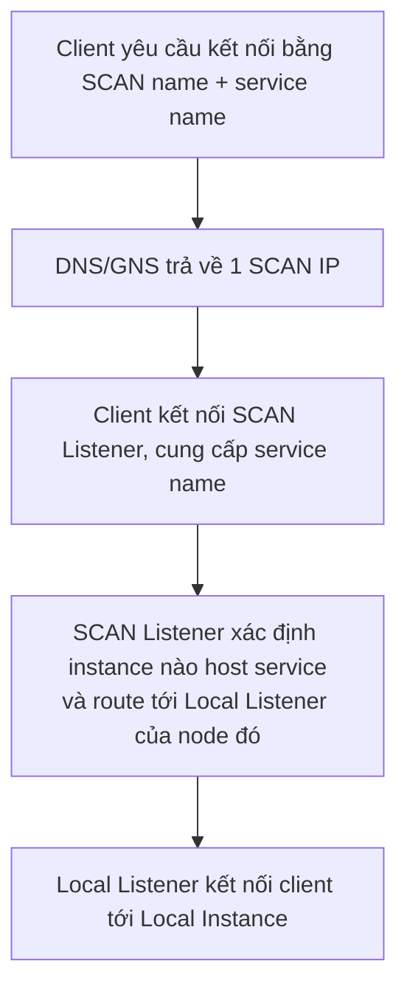

# 📘 Module 02: Oracle RAC Overview & Architecture

> **Section**: 02/14
> **Khóa học**: Oracle Database RAC Administration Course (Ahmed Baraka)
> **Thời gian học ước tính**: 2-3 giờ

---

## 📋 Bài học trong Module

| #   | Bài học                      | File nguồn                                    | Loại      |
| --- | ---------------------------- | --------------------------------------------- | --------- |
| 1   | Oracle RAC Database Overview | `Section 02/Oracle RAC Database Overview.pdf` | Lý thuyết |
| 2   | Oracle RAC Architecture      | `Section 02/Oracle RAC Architecture.pdf`      | Lý thuyết |

---

## 🎯 Mục tiêu Module

- Hiểu **RAC là gì**, **ưu điểm** và **nhược điểm**, khi nào doanh nghiệp nên dùng.
- Nắm **hardware/memory requirements** và các **shared storage options**.
- Hiểu **ASM là gì**: ASM instance, diskgroup, redundancy, striping & rebalance.
- Hiểu **thành phần Grid Infrastructure** và **Oracle Clusterware** (OCR, Voting files, OLR, GPnP, các CRS daemon).
- Nắm **cấu hình mạng** (GNS vs Static, SCAN, VIP) và **RAC Connectivity Cycle**.
- Biết **vị trí lưu file** của RAC database.

---

## 📋 Nội dung chính

### 1. Oracle RAC Database Overview

> 📄 Nguồn: `Section 02/Oracle RAC Database Overview.pdf`

#### 1.1 Oracle RAC là gì?

> Một database chạy trên **một cluster gồm nhiều server** nhưng hoạt động **như một database duy nhất** — đối lập với **single-instance database**.

#### 1.2 Ưu điểm (Benefits)

| Ưu điểm                  | Diễn giải                                                                                                                                |
| ------------------------ | ---------------------------------------------------------------------------------------------------------------------------------------- |
| **High Availability**    | Chống **unplanned downtime** (lỗi phần cứng/OS) và **planned downtime** (nâng cấp/patch HW, OS, DB); đáp ứng **SLA** rất cao (vd 99.99%) |
| **Scalability**          | Mở rộng **theo chiều ngang** (thêm node)                                                                                                 |
| **Load balancing**       | Phân phối tải giữa các instance                                                                                                          |
| **Resource Utilization** | Tận dụng tài nguyên nhiều node                                                                                                           |

#### 1.3 Nhược điểm (Drawbacks)

- **Chi phí license thêm**:
  - **Enterprise Edition**: license RAC **tính riêng**.
  - **Standard Edition**: RAC **đã bao gồm** nếu **tổng số CPU socket ≤ 4** trong cả cluster.
- Kiến trúc/yêu cầu phần cứng **phức tạp**.
- **Không được thiết kế cho Disaster Recovery (DR)**.
- Kỹ năng quản trị **phức tạp hơn** single-instance.

#### 1.4 Doanh nghiệp có nên dùng RAC?

Cân nhắc: nếu server sập thì mất bao lâu để phục hồi? Thiệt hại kinh doanh khi ứng dụng không sẵn sàng? Chi phí (hạ tầng HW + license DB/RAC + quản trị). Nếu cần HA nhưng ngân sách hạn chế → cân nhắc **Oracle RAC One Node** (Module 08).

> 💡 **Vì sao nên học RAC?** Được doanh nghiệp dùng rất phổ biến và **nhu cầu thị trường cao**.

---

### 2. Oracle RAC Architecture

> 📄 Nguồn: `Section 02/Oracle RAC Architecture.pdf`

#### 2.1 Lịch sử & Software Stack

- **OPS** (Oracle Parallel Server) — Oracle 6.2 trên VAX/VMS → **RAC** — từ Oracle 9i.
- **Software Stack** gồm:
  - **Oracle Grid Infrastructure** = **Clusterware** (quản lý cluster, giám sát resource, kiểm soát thứ tự startup, lập trình được cho ứng dụng) + **ASM**.
  - **Oracle Database**.

#### 2.2 Kiến trúc cơ bản



- Mỗi server trong RAC gọi là **node**. Client kết nối qua **public network**; các node nói chuyện với nhau qua **private network (interconnect)**.
- Datafile nằm trên **shared storage**. Một RAC database có **nhiều instance**, mỗi instance chạy trên một node; database **available** khi **ít nhất một instance** đang chạy.

#### 2.3 Hardware & Memory Requirements

- **≥ 2 server** cùng kiến trúc phần cứng và cùng OS.
- **2 card mạng/node**: **public** (tới client) + **private** (interconnect); khuyến nghị **interconnect dự phòng (redundant)**.
- **Shared storage**: mạng lưu trữ tốc độ cao (vd **16GbE FC**), kết nối dự phòng + **multipathing**.
- **Bộ nhớ**: khi chuyển single-instance sang RAC giữ nguyên workload cần thêm ~**10% buffer cache**, ~**15% shared pool**, cộng bộ nhớ cho ASM & Clusterware.

#### 2.4 Shared Storage Options

| Tùy chọn        | Ghi chú                                                                                                           |
| --------------- | ----------------------------------------------------------------------------------------------------------------- |
| **ASM** ⭐       | Volume manager + file system cho Oracle DB; hiệu quả nhất; **tùy chọn DUY NHẤT được hỗ trợ với Standard Edition** |
| **Oracle ACFS** | Mở rộng ASM cho **mọi loại file**; resize động, I/O parallelism                                                   |
| **OCFS2**       | Cluster file system mã nguồn mở của Oracle                                                                        |
| **Third-party** | Vd Veritas SFCFS for Oracle RAC                                                                                   |
| **NFS Server**  | Chỉ hỗ trợ **NFSv3**                                                                                              |

> 👉 ASM được giải thích chi tiết ở **mục 2.5** ngay bên dưới.

> **Engineered Systems**: **Oracle Database Appliance (ODA)** (tối ưu, dễ quản lý, nhưng chỉ 2 node) và **Oracle Exadata Database Machine**.

#### 2.5 Oracle ASM (Automatic Storage Management) — chi tiết

> **Định nghĩa**: **ASM** là **volume manager + cluster file system** do Oracle xây dựng **chuyên cho file của database**. ASM chạy dưới dạng **một instance riêng** (`+ASM1`, `+ASM2`…) thuộc **Grid Infrastructure**, gom các **disk thô (raw device)** thành **diskgroup**, rồi **tự động stripe + mirror + rebalance** dữ liệu trên các disk đó. Database **không** làm việc trực tiếp với disk hay file system của OS, mà chỉ tham chiếu file qua tên diskgroup, ví dụ `+DATA/RAC/datafile/users.271.1130`.

**Vì sao RAC cần ASM?**

- Mọi instance RAC phải **đọc/ghi cùng một bộ file** → bắt buộc có **shared storage**; ASM cung cấp điều đó mà **không cần** cluster file system của bên thứ ba.
- ASM là **tùy chọn storage duy nhất được hỗ trợ với Standard Edition** (xem 2.4) và là **khuyến nghị của Oracle** cho Enterprise Edition.
- OCR và Voting file **cũng** được đặt trong diskgroup ASM (diskgroup `CRS`).

##### a) Kiến trúc & các lớp lưu trữ



| Lớp                  | Ý nghĩa                                                                                             |
| -------------------- | ----------------------------------------------------------------------------------------------------- |
| **ASM disk**         | Một LUN/partition được đánh dấu cho ASM (qua **ASMLib**, **ASMFD** hoặc **udev**)                  |
| **Diskgroup**        | Đơn vị quản lý chính — tập hợp nhiều ASM disk; database chỉ "nhìn thấy" tên diskgroup (`+DATA`)   |
| **Failure group**    | Nhóm disk **cùng chia sẻ một điểm hỏng** (cùng controller/tủ đĩa); ASM không mirror trong cùng nhóm |
| **Allocation Unit (AU)** | Đơn vị cấp phát nhỏ nhất trong diskgroup (mặc định **1MB**, Exadata thường **4MB**)             |
| **ASM file**         | File Oracle nằm trong diskgroup, được đặt tên tự động theo **OMF**                                   |

##### b) ASM instance khác gì Database instance?

| Tiêu chí     | **ASM instance** | **Database instance** |
| ------------ | ---------------------------------------------- | ------------------------------- |
| SID          | `+ASM1`, `+ASM2`                               | `orcl1`, `orcl2`                |
| Có datafile? | **Không** — chỉ có metadata trong diskgroup    | Có datafile, control file…      |
| Mount cái gì | **Diskgroup**                                  | **Database**                    |
| Quyền quản trị | `SYSASM` (nhóm OS `asmadmin`)                | `SYSDBA` (nhóm OS `dba`)        |
| Bộ nhớ       | Rất nhỏ (vài trăm MB)                          | Lớn (SGA/PGA)                   |
| Chủ sở hữu   | User **`grid`**                                | User **`oracle`**               |
| Do ai quản lý | **Clusterware (CRS resource `ora.asm`)**      | CRS resource `ora.<db>.db`      |

> ⚠️ Với **Standard ASM** (11g): ASM instance **phải chạy trên mọi node**, và **ASM chết → DB instance trên node đó cũng chết**. Từ 12c, **Flex ASM** khắc phục điều này (xem Module 11).

##### c) Redundancy — ASM tự mirror như thế nào

| Mức          | Số bản copy | Failure group tối thiểu | Dùng khi                                                    |
| ------------ | ----------- | ----------------------- | ------------------------------------------------------------- |
| **External** | 1 (không mirror) | 1                  | **Storage SAN đã có RAID** — phổ biến nhất trong lab & thực tế |
| **Normal**   | 2           | 2                       | Không có RAID phần cứng; chịu được **hỏng 1 failure group**   |
| **High**     | 3           | 3                       | Yêu cầu bảo vệ cao; chịu được **hỏng 2 failure group**        |

> Voting file có quy tắc riêng: External = **1** vote, Normal = **3**, High = **5** (luôn số lẻ để quyết định đa số).

##### d) Striping & Rebalance

- **Striping**: ASM tự chia file thành các extent rồi rải đều trên **tất cả disk** trong diskgroup → **cân bằng I/O tự động**, không cần DBA tính toán thủ công.
- **Rebalance**: khi **thêm/bớt disk**, ASM **tự phân bố lại** dữ liệu **online**, không cần dừng database. Tốc độ chỉnh bằng `ASM_POWER_LIMIT` (0 = tắt, 1 = chậm nhất… 11/1024 = nhanh nhất tùy phiên bản).

```sql
-- thêm disk và rebalance nhanh
ALTER DISKGROUP DATA ADD DISK '/dev/oracleasm/disks/DISK5' REBALANCE POWER 8;
-- theo dõi tiến trình
SELECT * FROM v$asm_operation;
```

##### e) ASM lưu được những gì?

| Lưu được trong ASM ✅                                                                 | Không lưu trực tiếp ❌                              |
| -------------------------------------------------------------------------------------- | ---------------------------------------------------- |
| Datafile, tempfile, control file, **online + standby redo log**, archived log, SPFILE, backupset RMAN, Data Pump dumpset, **OCR & Voting file**, password file (12c+) | Binary Oracle Home, file trace/alert log, file text thường |

> Cần chứa **file bất kỳ** (script, log, ứng dụng) trên shared storage thì dùng **Oracle ACFS** — file system dựng **bên trên** ASM.

##### f) Lệnh thường gặp

```bash
# --- user grid ---
export ORACLE_SID=+ASM1
asmcmd lsdg                      # liệt kê diskgroup + dung lượng còn trống
asmcmd ls -l +DATA/RAC/DATAFILE  # duyệt file như file system
asmcmd du +DATA/RAC              # dung lượng đã dùng
asmca                            # GUI tạo/sửa diskgroup

srvctl status asm                # trạng thái ASM trên cluster
srvctl config asm
crsctl stat res ora.DATA.dg -t   # resource của diskgroup
```

```sql
sqlplus / as sysasm
SELECT name, state, type, total_mb, free_mb FROM v$asm_diskgroup;
SELECT group_number, path, mount_status, mode_status, failgroup FROM v$asm_disk;
SELECT instance_name, db_name, status FROM v$asm_client;   -- DB nào đang dùng ASM
ALTER DISKGROUP DATA MOUNT;
```

##### g) Lưu ý & best practice

- Đặt **Grid Home ngoài Oracle Base** và do user **`grid`** sở hữu (xem Module 03).
- Thực tế thường tách **3 diskgroup**: `CRS` (OCR/Voting), `DATA` (datafile), `FRA` (archive/backup) — lab có thể gộp.
- Các disk trong **cùng diskgroup nên đồng nhất** về **kích thước và hiệu năng**, nếu không disk chậm sẽ kéo tụt cả nhóm.
- Luôn giữ **free space dự phòng** để ASM còn chỗ **rebalance** khi mất một disk.
- Nhóm OS cần nhớ: **OSASM = `asmadmin`**, **OSDBA for ASM = `asmdba`**; user `oracle` phải nằm trong `asmdba` mới đọc được ASM.
- Từ **12c** trở đi mặc định dùng **Flex ASM** → node không có ASM instance vẫn truy cập storage **qua network** (chi tiết ở [Module 11](../module-11/module-11-guide.md)).

#### 2.6 Grid Infrastructure & CRS Resources

GI cung cấp clustering + ASM, cài trong **home cục bộ riêng**, thường thuộc user **`grid`**. Các **CRS resource** gồm:

- ASM instances · ASM Diskgroup · **VIP** · **SCAN** · **SCAN listener** · database services · **Oracle Net (local) listener** · **ONS**.

#### 2.7 Oracle Clusterware — dữ liệu cấu hình

| Lưu ở đâu                            | Thành phần                                                                                       |
| ------------------------------------ | ------------------------------------------------------------------------------------------------ |
| **Shared storage** (high-redundancy) | **Voting files** (node membership) + **OCR** (Oracle Cluster Registry — cấu hình cluster)        |
| **Local (mỗi node)**                 | **OLR** (Oracle Local Registry — metadata node cục bộ) + **GPnP profile** (network profile + VD) |

- Clusterware dùng **private interconnect** để truyền **heartbeat**.

**Các CRS daemon/service chính:**

| Daemon            | Process        | Vai trò                                                           |
| ----------------- | -------------- | ----------------------------------------------------------------- |
| CRS               | `crsd`         | Start/stop/monitor/failover resource                              |
| CSS               | `ocssd.bin`    | Giám sát **node membership**, cập nhật trạng thái vào VD          |
| CSS Agent         | `cssdagent`    | Giám sát/start/stop CSS                                           |
| CSS Monitor       | `cssdmonitor`  | Đảm bảo data integrity; **có thể reboot node** khi CPU starvation |
| CTSS              | `octssd.bin`   | Đồng bộ thời gian giữa các node                                   |
| EVM               | `evmd.bin`     | Phát event tới các node                                           |
| ONS               | `ons`          | Quản lý **FAN** events                                            |
| Oracle Agent      | `oraagent`     | Quản lý resource của `ohasd` thuộc oracle                         |
| Oracle Root Agent | `orarootagent` | Quản lý resource của `ohasd` thuộc root                           |

#### 2.8 Cấu hình mạng Clusterware

- **GNS (Grid Naming Service)**: ủy quyền một subdomain trên DNS cho cluster; chỉ cần khai **GNS VIP** trên DNS; hỗ trợ DHCP (chỉ Linux).
- **Static**: không ủy quyền subdomain; **mọi tên/địa chỉ do DNS phân giải** — **SCAN → 3 IP tĩnh**, và mỗi node có public name + VIP name.
- **SCAN (Single Client Access Name)**: tên đăng ký về **1 đến 3 IP** (trên DNS hoặc GNS); **client bắt buộc dùng SCAN** để kết nối.
- **VIP (Node Virtual IP)**: do Clusterware quản lý; mỗi node một VIP, **cùng subnet với public IP**; cho **thông báo lỗi và failover nhanh**.

#### 2.9 RAC Connectivity Cycle (rất quan trọng)



1. Client yêu cầu kết nối bằng **SCAN name + service name**; DNS/GNS trả về **một SCAN IP**.
2. Client dùng SCAN IP kết nối tới **SCAN Listener**, cung cấp service name.
3. SCAN Listener xác định **instance nào đang host service** và **route** client tới **local listener** của node đó.
4. Local listener kết nối client tới **local instance**.

#### 2.10 Vị trí file của RAC database

| Nơi lưu                    | File                                                                                                                            |
| -------------------------- | ------------------------------------------------------------------------------------------------------------------------------- |
| **Shared storage**         | System & user datafiles · **Undo tablespace / instance** · **2 redo group / instance** · Control files · SPFILE · password file |
| **Local (DB Home / node)** | Binaries; (password file để trong DB Home **không khuyến nghị**)                                                                |

---

## 🧠 Tóm tắt để nhớ lâu

- RAC = **nhiều instance, một database logic** trên cluster; mục tiêu **HA + scalability + load balancing**, nhưng **không phải giải pháp DR** và **tốn license**.
- Software stack = **Grid Infrastructure (Clusterware + ASM)** + **Database**.
- **ASM** = volume manager + file system cho database, chạy bằng **instance riêng `+ASM`** của user `grid`; gom disk thành **diskgroup** (`CRS`/`DATA`/`FRA`), tự **stripe – mirror – rebalance**. Là storage khuyến nghị và là **lựa chọn duy nhất cho Standard Edition**.
- Clusterware lưu **OCR + Voting files** trên **shared storage**, **OLR + GPnP** ở **local**; heartbeat qua **interconnect**; nhớ các daemon `crsd`, `ocssd`, `cssdmonitor`, `octssd`, `evmd`, `ons`.
- **SCAN** (1–3 IP) là điểm vào bắt buộc cho client; **VIP** cho failover nhanh.
- Thuộc lòng **Connectivity Cycle**: SCAN → SCAN Listener → Local Listener → Instance.

---

## 🛠️ Sau khi học xong, hãy tự làm

1. Vẽ lại kiến trúc RAC (public/private/interconnect/shared storage) bằng ngôn ngữ của bạn.
2. Liệt kê 5 shared storage options và nói rõ cái nào bắt buộc cho Standard Edition.
3. Giải thích ASM diskgroup, 3 mức redundancy và điều gì xảy ra khi thêm disk (rebalance).
4. Phân biệt **OCR/Voting** (shared) với **OLR/GPnP** (local).
5. Tự kể lại **RAC Connectivity Cycle** 4 bước.
6. Giải thích vì sao RAC **không thay thế** được DR.

---

## ⏭️ Module tiếp theo

**Module 03: Installing Oracle RAC** — cài Grid Infrastructure → ASM → Database và tạo RAC database bằng DBCA.


---

!!! info "Nguồn gốc"
    `The-Oracle-Database-RAC-Administration-Course/modules/module_02/module_02_guide.md`
