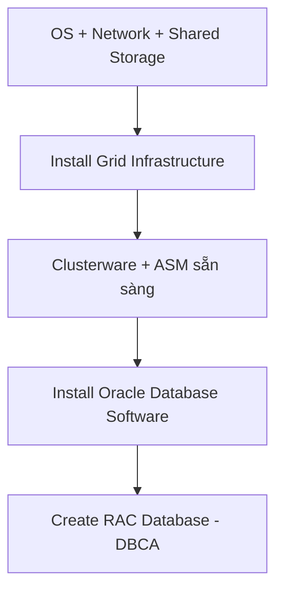

# 📘 Module 03: Installing Oracle RAC

> **Section**: 03/14
> **Khóa học**: Oracle Database RAC Administration Course (Ahmed Baraka)
> **Thời gian học ước tính**: 3-4 giờ

---

## 📋 Bài học trong Module

| #   | Bài học                                                 | File nguồn                                                              | Loại        |
| --- | ------------------------------------------------------- | ----------------------------------------------------------------------- | ----------- |
| 1   | Installing Oracle RAC Software Stack                    | `Section 03/Installing Oracle RAC Software Stack.pdf`                   | Lý thuyết   |
| 2   | Practice 01: Preparing the Practice Environment         | `Section 03/Practice 01 Preparing the Practice Environment.pdf`         | 🔧 Thực hành |
| 3   | Practice 02: Create Oracle 12c R1 Two-Node RAC Database | `Section 03/Practice 02 Create Oracle 12c R1 Two-Node RAC Database.pdf` | 🔧 Thực hành |

---

## 🎯 Mục tiêu Module

Sau module này, bạn sẽ:

- Cài đặt được **Oracle Grid Infrastructure (GI)** — nền tảng Clusterware + ASM.
- Cài đặt được **Oracle Database software** cho RAC.
- Tạo được một **RAC database** bằng DBCA.
- Dựng được lab thực hành 2 node (`srv1`, `srv2`) trên VirtualBox và tự tạo database `rac` 12c R1.

> 💡 Vì sao dùng 12c R1 chứ không phải 12c R2? Để sau này bạn có bài **upgrade** RAC lên 12c R2 (Module 07). Về cơ bản kiến trúc RAC hai bản gần như giống nhau.

---

## 📋 Nội dung chính

### 1. Installing Oracle RAC Software Stack

> 📄 Nguồn: `Section 03/Installing Oracle RAC Software Stack.pdf`

RAC gồm **hai sản phẩm phần mềm** phải cài theo đúng thứ tự:

1. **Oracle Grid Infrastructure** → tham khảo *Grid Infrastructure Installation Guide*
2. **Oracle Database** → tham khảo *Real Application Clusters Installation Guide for Linux and UNIX*



#### 1.1 Yêu cầu của Grid Infrastructure

| Thành phần      | Yêu cầu                                                                                                 |
| --------------- | ------------------------------------------------------------------------------------------------------- |
| RAM             | Tối thiểu 4 GB (12.2 cần 8 GB)                                                                          |
| Ổ cứng          | 8 GB cho Grid Home, 12 GB cho owner, 1 GB cho `/tmp`                                                    |
| Mạng            | Tối thiểu 1 GbE (khuyến nghị 10 GbE cho **private network**)                                            |
| OS Groups/Users | Ít nhất: owner của GI (thường là `grid`) và nhóm cài đặt (`oinstall`)                                   |
| Đặt tên         | **GNS** (một GNS name + fixed address trên DNS) **hoặc** **DNS** (SCAN name phân giải về **3 địa chỉ**) |
| Shared storage  | Cấu hình lưu trữ dùng chung (ví dụ ASM)                                                                 |

#### 1.2 Việc cần làm trước khi cài GI (Pre-installation)

- Cấu hình **shared storage**. Nếu dùng ASM: có thể tạo **một diskgroup** chứa cả OCR + Voting Disk (VD), data files và Fast Recovery Area (FRA) — hoặc tách mỗi loại một diskgroup riêng.
- Chọn phương pháp **đồng bộ thời gian**: NTP hoặc **CTSS** (Cluster Time Synchronization Service).

#### 1.3 Cài Grid Infrastructure

- **12.1**: dùng **OUI** (`runInstaller`). Cấu hình mạng theo GNS+DHCP hoặc thủ công (SCAN, public name, VIP name cho từng node). Cần quyền **root**. Grid Home phải **nằm ngoài** Oracle Base.
- **12.2**: (1) tạo Grid Home với quyền group phù hợp, (2) giải nén *image file* vào Grid Home, (3) chạy `gridSetup.sh`. Thông tin yêu cầu giống 12.1.

#### 1.4 Kiểm tra sau khi cài GI

```bash
# chạy bằng root
crsctl check cluster
#   CRS-4537 Cluster Ready Services is online
#   CRS-4529 Cluster Synchronization Services is online
#   CRS-4533 Event Manager is online

# chạy bằng grid
srvctl status asm
#   ASM is running on rac1,rac2
```

#### 1.5 Post-installation cho GI

- Kiểm tra SCAN: `cluvfy comp scan` (bằng user `grid`).
- Cài **ORAchk**, và cài **PSU** (patchset update) mới nhất.

#### 1.6 Cài Oracle Database Software

- **Pre-install**: Clusterware phải đã cài xong; tạo user/group của DB (thường `oracle` và `dba`); (tùy chọn) chạy **CVU** để kiểm tra và sinh *fixup scripts*:

  ```bash
  /u01/app/12.1.0/grid/bin/cluvfy stage -pre dbinst -fixup -n rac1,rac2 -osdba dba -verbose
  ```

- **Install**: dùng **OUI** (hoặc Rapid Home Provisioning). Cần root. **Oracle Base của DB khác Oracle Base của GI**; Oracle Home của DB nằm **dưới** Oracle Base.

#### 1.7 Tạo RAC Database

- Khuyến nghị dùng **DBCA**.
- Quyết định **CDB** hay **non-CDB**.
- Chọn kiểu quản lý cluster database:
  - **Administrator-managed** (gán instance vào node cụ thể), hoặc
  - **Policy-managed** (dùng server pool — xem Module 10).
- Đặt **Global Database Name** và **SID Prefix**. Instance name = SID + số thứ tự (ví dụ `rac1`, `rac2`).

#### 1.8 Post-installation cho DB

- Set biến môi trường Oracle trong profile của user owner.
- Cài PSU mới nhất.
- Biên dịch lại toàn bộ PL/SQL: `utlrp.sql`.
- Triển khai chiến lược **backup & recovery** (Module 04).
- Cấu hình **services** (Module 06).

---

### 2. Practice 01: Chuẩn bị môi trường thực hành

> 📄 Nguồn: `Section 03/Practice 01 Preparing the Practice Environment.pdf`

Mục tiêu: tạo **2 máy ảo** `srv1`, `srv2` (Oracle Linux 6.10 64-bit) trên **VirtualBox** và cấu hình **shared storage**.

#### 2.1 Kiến trúc lab

```text
                 srv-scan (192.168.56.91/92/93 - 3 IP round-robin)
                          │
        ┌─────────────────┴─────────────────┐
     srv1                                  srv2
  public  192.168.56.71                 192.168.56.72
  vip     192.168.56.81                 192.168.56.82
  priv    192.168.10.1                  192.168.10.2
        └──────── Shared Disks: DISK1/DISK2/DISK3 ────────┘
```

#### 2.2 Ba network adapter mỗi node

| Adapter | Attached To (VirtualBox)                 | Dùng cho               |
| ------- | ---------------------------------------- | ---------------------- |
| eth0    | **Host-only Adapter**                    | Public                 |
| eth1    | **Internal Network** (đặt tên `privnet`) | Private (interconnect) |
| eth2    | **Bridged Adapter**                      | Internet (tải package) |

#### 2.3 File `/etc/hosts` (thay cho DNS trong lab)

```text
# Public
192.168.56.71 srv1.localdomain srv1
192.168.56.72 srv2.localdomain srv2
# Private
192.168.10.1  srv1-priv.localdomain srv1-priv
192.168.10.2  srv2-priv.localdomain srv2-priv
# Virtual (VIP)
192.168.56.81 srv1-vip.localdomain srv1-vip
192.168.56.82 srv2-vip.localdomain srv2-vip
# SCAN (thực tế phải để trên DNS, round-robin 3 IP)
192.168.56.91 srv-scan.localdomain srv-scan
192.168.56.92 srv-scan.localdomain srv-scan
192.168.56.93 srv-scan.localdomain srv-scan
```

#### 2.4 Users, groups và ASMLib (chạy bằng root)

```bash
# groups + user grid (oracle đã có sẵn)
groupadd asmadmin
groupadd asmdba
useradd -u 54323 -g oinstall -G asmadmin,asmdba grid
usermod -a -G asmdba oracle          # oracle được đọc ASM
passwd oracle; passwd grid           # đặt mật khẩu = oracle

# kiểm tra thư viện prerequisite
/usr/bin/oracle-rdbms-server-12cR1-preinstall-verify

# cài + cấu hình ASMLib
yum install oracleasm-support
yum install kmod-oracleasm
oracleasm configure -i               # owner: grid / group: oinstall / boot: y
/usr/sbin/oracleasm init

# thư mục cài đặt
mkdir -p /u01/app/oracle/product /u01/app/grid /u01/app/12.1.0/grid
chown -R oracle:oinstall /u01/app/oracle
chown -R grid:oinstall  /u01/app/grid /u01/app/12.1.0/grid
chmod -R 775 /u01

# tắt NTP (dùng CTSS thay thế)
chkconfig ntpd off
mv /etc/ntp.conf /etc/ntp.conf.orig
```

#### 2.5 Tạo `srv2` bằng cách clone `srv1`

- Clone `srv1` → `srv2`, **initialize network cards**.
- Sửa lỗi **MAC address** trong `/etc/udev/rules.d/70-persistent-net.rules` và `ifcfg-eth*`.
- Đổi hostname (`/etc/sysconfig/network`) và IP eth0/eth1 cho `srv2`.
- Cài `cvuqdisk` (nằm trong `<grid>/rpm`) — nếu thiếu, CVU không thấy được shared disk.

#### 2.6 Shared disks (dùng cho ASM)

| Disk  | Size  | Diskgroup dự kiến       |
| ----- | ----- | ----------------------- |
| DISK1 | 10 GB | CRS (OCR + Voting Disk) |
| DISK2 | 15 GB | DATA                    |
| DISK3 | 15 GB | FRA                     |

Các bước: tạo VDI **Fixed size** → đổi type sang **Shareable** (Virtual Media Manager) → attach vào cả 2 node → phân vùng và tạo ASM disk:

```bash
fdisk /dev/sdb        # n, p, 1, Enter, Enter, w  (lặp cho sdc, sdd)
oracleasm createdisk DISK1 /dev/sdb1
oracleasm createdisk DISK2 /dev/sdc1
oracleasm createdisk DISK3 /dev/sdd1
oracleasm scandisks
oracleasm listdisks   # chạy trên cả srv1 và srv2 để xác nhận cùng thấy đĩa
```

> ✅ **Kết quả**: 2 máy ảo + 3 shared disk sẵn sàng để cài GI, DB và tạo RAC database.

---

### 3. Practice 02: Tạo Oracle 12c R1 Two-Node RAC Database

> 📄 Nguồn: `Section 03/Practice 02 Create Oracle 12c R1 Two-Node RAC Database.pdf`

#### 3.1 Set biến môi trường

**User `oracle`** (`srv1` dùng `rac1`, `srv2` dùng `rac2`):

```bash
ORACLE_SID=rac1; export ORACLE_SID          # srv2: rac2
ORACLE_BASE=/u01/app/oracle; export ORACLE_BASE
ORACLE_HOME=$ORACLE_BASE/product/12.1.0/db_1; export ORACLE_HOME
TNS_ADMIN=$ORACLE_HOME/network/admin; export TNS_ADMIN
```

**User `grid`** (`+ASM1` / `+ASM2`), lưu ý ORACLE_HOME **không** nằm dưới ORACLE_BASE:

```bash
ORACLE_SID=+ASM1; export ORACLE_SID          # srv2: +ASM2
ORACLE_BASE=/u01/app/grid; export ORACLE_BASE
ORACLE_HOME=/u01/app/12.1.0/grid; export ORACLE_HOME
```

Sau đó set **resource limits** cho cả `oracle` và `grid` trong `/etc/security/limits.d/...`.

#### 3.2 Cài Grid Infrastructure (user `grid`, `./runInstaller`)

Các lựa chọn quan trọng trong OUI:

| Màn hình            | Lựa chọn                                                                                     |
| ------------------- | -------------------------------------------------------------------------------------------- |
| Installation Option | Install and Configure GI for a Cluster                                                       |
| Cluster Type        | Configure a **Standard Cluster**                                                             |
| Grid Plug and Play  | Cluster Name `rac`, SCAN Name `srv-scan`, Port `1521`, **bỏ** Configure GNS                  |
| Cluster Node        | Thêm `srv2`; thiết lập **SSH Connectivity** (mật khẩu `oracle`)                              |
| Network Interface   | eth0 = **Public**, eth1 = **Private**, eth2 = **Do Not Use**                                 |
| Storage             | Use **Standard ASM**                                                                         |
| ASM Disk Group      | Discovery Path `/dev/oracleasm/disks*`; DG Name `CRS`, Redundancy `External`, chọn **DISK1** |
| OS Groups           | OSASM = `asmadmin`, OSDBA for ASM = `asmdba`                                                 |
| Location            | Oracle Base `/u01/app/grid`, Software `/u01/app/12.1.0/grid`                                 |

Kiểm tra sau cài:

```bash
crsctl status resource -t     # tất cả resource phải ONLINE
crsctl check cluster -all
```

#### 3.3 Tạo ASM Disk Group DATA và FRA (user `grid`)

```bash
asmca    # Create → DATA (External, DISK2); Create → FRA (External, DISK3)
```

#### 3.4 Cài Oracle Database Software (user `oracle`, `./runInstaller`)

- **Install database software only**.
- Grid Installation Options: **Oracle Real Application Clusters database installation**.
- Chọn cả 2 node + thiết lập SSH.
- Edition: **Enterprise Edition**.
- Oracle Base `/u01/app/oracle`, Software `/u01/app/oracle/product/12.1.0/db_1`.
- Chạy root script trên **node 1 xong** rồi mới đến node 2.

#### 3.5 Tạo database bằng DBCA (user `oracle`, lệnh `dbca`)

| Màn hình       | Lựa chọn                                                                    |
| -------------- | --------------------------------------------------------------------------- |
| Database Type  | **Oracle RAC database**, Config Type **Admin Managed**                      |
| Identification | Global Name `rac.localdomain`, SID Prefix `rac`, **không** tạo Container DB |
| Placement      | Chọn cả `srv1` và `srv2`                                                    |
| Management     | Bật **Configure EM Database Express**                                       |
| Storage        | Data `+DATA` (OMF), FRA `+FRA` 12 GB, **chưa** bật Archiving                |
| Character Set  | AL32UTF8                                                                    |

> 💡 Listener **không** tạo trong Oracle Home của DB — nó chạy từ **Grid Home** và do Clusterware quản lý.

#### 3.6 Kiểm tra database vừa tạo

```bash
srvctl status database -d rac
srvctl config database -d rac
ps -ef | grep -i pmon                       # thấy ora_pmon_rac1 / rac2

sqlplus / as sysdba
  SELECT INST_NUMBER, INST_NAME FROM V$ACTIVE_INSTANCES;

# session phân phối round-robin giữa 2 instance:
sqlplus system/oracle@rac
  SELECT INSTANCE_NAME FROM V$INSTANCE;
```

#### 3.7 Shutdown / Startup đúng cách

```bash
# tắt database
srvctl stop database -d rac -o immediate
# tắt cả Clusterware stack (chạy bằng root, trên MỖI node)
/u01/app/12.1.0/grid/bin/crsctl stop crs

# khi boot lại: Clusterware tự khởi động và khôi phục database về trạng thái trước đó
crsctl status resource -t
crsctl status res ora.rac.db -f | grep AUTO_START   # giá trị 'restore'
srvctl start database -d rac
```

#### 3.8 EM Database Express

Mở trình duyệt trong VM: `https://srv-scan.localdomain:5500/em` → chấp nhận cảnh báo (Add Exception) → cài Flash plug-in nếu cần → login `sys` as sysdba.

---

## 🧠 Tóm tắt để nhớ lâu

- RAC = **2 sản phẩm**: Grid Infrastructure (Clusterware + ASM) **trước**, Database software **sau**.
- **Grid Home nằm ngoài Oracle Base**; Oracle Base của DB khác Oracle Base của GI.
- SCAN phân giải về **3 IP** (thực tế trên DNS; trong lab dùng `/etc/hosts`).
- 3 diskgroup điển hình: **CRS** (OCR+VD), **DATA**, **FRA**.
- Tạo database bằng **DBCA**: chọn RAC + Admin-managed/Policy-managed, CDB/non-CDB.
- **Listener chạy từ Grid Home**, do Clusterware quản lý — không tạo trong DB Home.
- Dùng `crsctl`/`srvctl` để kiểm tra và vận hành cluster (chi tiết ở Module 04).

---

## 🛠️ Sau khi học xong, hãy tự làm

1. Vẽ lại kiến trúc lab 2 node kèm public/private/VIP/SCAN IP.
2. Liệt kê thứ tự cài GI → ASM → DB và giải thích vì sao Grid Home phải ngoài Oracle Base.
3. Tự dựng lab và tạo database `rac`; xác nhận bằng `srvctl status database -d rac` và `V$ACTIVE_INSTANCES`.
4. Thực hành shutdown/startup: `srvctl stop database` + `crsctl stop crs`, rồi khởi động lại.

---

## ⏭️ Module tiếp theo

**Module 04: RAC Basic Administration & Backup** — vận hành hằng ngày (srvctl/crsctl, tham số, undo, session) và Backup/Recovery bằng RMAN trong RAC.


---

!!! info "Nguồn gốc"
    `The-Oracle-Database-RAC-Administration-Course/modules/module_03/module_03_guide.md`
