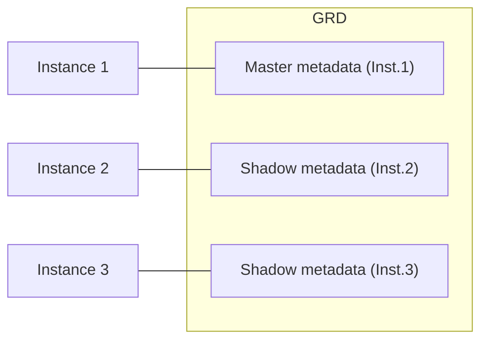

# 📘 Module 05: Global Resource Management & Performance Tuning

> **Section**: 05/14
> **Khóa học**: Oracle Database RAC Administration Course (Ahmed Baraka)
> **Thời gian học ước tính**: 4-5 giờ

---

## 📋 Bài học trong Module

| #   | Bài học                                   | File nguồn                                                 | Loại        |
| --- | ----------------------------------------- | ---------------------------------------------------------- | ----------- |
| 1   | Global Resource Management in Oracle RAC  | `Section 05/Global Resource Management in Oracle RAC.pdf`  | Lý thuyết   |
| 2   | Monitoring and Tuning Oracle RAC Database | `Section 05/Monitoring and Tuning Oracle RAC Database.pdf` | Lý thuyết   |
| 3   | Practice 7: Monitoring and Tuning         | `Section 05/Practice 7 ...pdf` + `Section 05/scripts/`     | 🔧 Thực hành |

---

## 🎯 Mục tiêu Module

- Hiểu **Global Concurrency Control** và **Global Resource Directory (GRD)**.
- Phân biệt **mastering instance** và **shadowing instance**, cơ chế **remastering**.
- Đi qua các **scenario Cache Fusion** cho một block và các **buffer states** (SCUR, XCUR, CR, PI).
- Nhận diện **Global Cache** và **Global Enqueue** wait events.
- Xử lý các vấn đề RAC thường gặp (sequence contention, HW enqueue, TX enqueue) và dùng **AWR/ASH/ADDM**.

---

## 📋 Nội dung chính

### 1. Global Resource Management in Oracle RAC

> 📄 Nguồn: `Section 05/Global Resource Management in Oracle RAC.pdf`

#### 1.1 Từ Single Instance đến Global Concurrency Control

| Cơ chế concurrency  | Single Instance   | Oracle RAC (Global)       |
| ------------------- | ----------------- | ------------------------- |
| Memory structure    | latches / mutexes | —                         |
| Library & row cache | —                 | **global locks**          |
| Resource (enqueue)  | enqueue           | **global enqueues** (GES) |
| Buffer cache        | buffer pins       | **cache fusion** (GCS)    |

Trong RAC, kiểm soát đồng thời được **nâng lên phạm vi toàn cluster**.

#### 1.2 Global Resource Directory (GRD)

- Một đối tượng nằm dưới global concurrency control gọi là **resource**.
- **Metadata** của resource được giữ trong **GRD**.
- GRD **phân tán** giữa **tất cả instance** đang active (mỗi database/ASM environment).
- GRD dùng bộ nhớ từ **shared pool**; nó lưu **instance nào đang giữ resource nào**.

#### 1.3 Mastering & Shadowing Instance

Đây là ý tưởng cốt lõi cần hiểu đúng:



- Khi một entity được **truy cập lần đầu**, một resource được cấp trong GRD gọi là **master metadata**; instance chứa nó là **resource master**.
- Khi instance khác cần cùng entity: nó gửi yêu cầu tới **mastering instance**; instance master gửi image qua **interconnect** và cấp **shadow metadata** ở instance yêu cầu (**shadowing instance**), đồng thời **cập nhật master metadata**.
- **Master metadata** giữ thông tin lock của entity **ở mọi instance**; **shadow metadata** chỉ giữ thông tin lock **ở instance hiện tại**.
- Mỗi instance có thể là master cho **một phần** các entity.

#### 1.4 Remastering (chuyển quyền master)

| Loại                                  | Khi nào xảy ra                                                                  |
| ------------------------------------- | ------------------------------------------------------------------------------- |
| **Instance-level (lazy remastering)** | Mastering instance shutdown nhẹ nhàng, hoặc có instance mới start               |
| **File affinity**                     | Yêu cầu truy cập block của một **datafile** đến chủ yếu từ instance khác master |
| **Object affinity**                   | Yêu cầu truy cập block của một **object** đến chủ yếu từ instance khác master   |

#### 1.5 Global Cache Management — các scenario cho một block

Các kịch bản: **Read from Disk, Read-Read, Read-Write, Write-Write, Write-Read, Write to Disk**. Vai chính là process **LMS** (chuyển block/grant qua interconnect).

**Ví dụ "Read from Disk"** (foreground ở Instance 2, master ở Instance 1):

1. Foreground → LMS cục bộ (Inst.2) → LMS gửi qua interconnect tới LMS của **master (Inst.1)**.
2. LMS Inst.1 cập nhật master metadata và phát **"grant"** cho Inst.2.
3. Inst.2 tạo **shadow metadata**, đặt buffer state = **SCUR**.
4. Foreground được báo để **đọc block từ disk** vào buffer cache của Inst.2.

**Buffer States (tra trong `V$BH.STATUS`):**

| State                        | Ý nghĩa                                                            |
| ---------------------------- | ------------------------------------------------------------------ |
| **SCUR** (Shared Current)    | Image trong buffer **khớp với disk**                               |
| **XCUR** (Exclusive Current) | Block **sắp/đã được cập nhật**                                     |
| **CR** (Consistent Read)     | Image nhất quán với một thời điểm **trong quá khứ**                |
| **PI** (Past Image)          | Từng là XCUR nhưng **đã ship** sang instance khác qua cache fusion |

> 💡 Trong Read-Write: khi Inst.3 muốn update block đang SCUR ở Inst.2, Inst.2 hạ trạng thái xuống **CR** rồi ship image; Inst.3 nhận **XCUR**, tăng SCN, cập nhật. Trong Write-Write: instance đang giữ XCUR ship image sang instance mới nhưng **giữ lại PI** cho tới khi block được ghi xuống disk.

---

### 2. Monitoring and Tuning Oracle RAC Database

> 📄 Nguồn: `Section 05/Monitoring and Tuning Oracle RAC Database.pdf`

#### 2.1 Nguyên tắc

- **Tune như single-instance trước.** Bottleneck của single-instance sẽ **trầm trọng hơn** trong RAC.
- Vùng đặc thù RAC: **interconnect traffic**.
- Công cụ: **V$ views** (wait events + system/RAC/instance stats), **AWR/Statspack**, **EM** (Cloud Control/Express).

#### 2.2 Global Cache Wait Events (thuộc "Cluster Wait Class")

| Wait event                                  | Ý nghĩa                                                                      |
| ------------------------------------------- | ---------------------------------------------------------------------------- |
| `gc [current/cr] block 2/3-way`             | Nhận block sau 2-3 network hop, không phải chờ                               |
| `gc [current/cr] block busy`                | Đã nhận nhưng **không gửi ngay**                                             |
| `gc [current/cr] grant 2-way`               | Không có sẵn, không master cục bộ; nhận **grant** ngay (90% < 2ms ⇒ mạng ổn) |
| `gc current grant busy`                     | Grant nhận **có độ trễ**                                                     |
| `gc ... congested`                          | Nhận trễ do **thiếu CPU/memory**                                             |
| `gc ... failure/retry`                      | Không nhận được do **lỗi**                                                   |
| `gc buffer busy`                            | Block đến sớm hơn thời gian pin buffer                                       |
| `gc current/cr request`                     | Placeholder trong khi request đang chạy                                      |
| `gc remaster / gcs drm freeze / gc quiesce` | Đang **remastering**                                                         |

#### 2.3 Global Enqueue Wait Events

Enqueue không phải riêng RAC nhưng trong RAC có thao tác **global lock**. Các loại thường gặp:

| Type   | Ý nghĩa                                             |
| ------ | --------------------------------------------------- |
| **TX** | Transaction enqueue — chống update đồng thời        |
| **TM** | Table/partition — bảo vệ định nghĩa bảng khi DML    |
| **HW** | High-water mark — đồng bộ khi cấp block mới         |
| **SQ** | Sequence — serialize khi tăng sequence              |
| **US** | Undo segment (AUM)                                  |
| **TA** | Dùng cho transaction recovery khi instance recovery |

> Truy vấn `V$ENQUEUE_STATISTICS` để biết enqueue nào ảnh hưởng service time nhiều nhất.

#### 2.4 Session & System Statistics

`V$SYSSTAT`, `V$SESSTAT` (+`V$STATNAME`), và đặc biệt **`V$INSTANCE_CACHE_TRANSFER`** (block chuyển giữa các instance qua interconnect).

#### 2.5 Mẹo tuning RAC (phía application)

- Giảm **full-table scan dài** trong OLTP.
- **Bật và tăng cache của sequence.**
- Dùng **partitioning** để phân tán workload.
- Tránh parse thừa; loại **index không chọn lọc**; giám sát/ cấu hình **interconnect**; giảm locking.

**Sequence trong RAC:** insert nhiều gây **leaf block contention** ⇒ nhiều block current/CR chuyển giữa node. Giải pháp: tăng cache sequence, hoặc mỗi instance dùng dải riêng.

```sql
CREATE SEQUENCE seq_rac_test CACHE 1000;
```

**High-watermark (HW) contention:** nhiều instance insert dồn dập vào cùng segment tại HWM ⇒ triệu chứng `enq: HW - contention` + `gc current grant`. Khắc phục: **extent size lớn, đồng nhất** hoặc dùng **partition**.

#### 2.6 AWR, ASH, ADDM trong RAC

| Công cụ  | Đặc điểm trong RAC                                                                                                                                                                                                    |
| -------- | --------------------------------------------------------------------------------------------------------------------------------------------------------------------------------------------------------------------- |
| **AWR**  | Thu thập mỗi giờ; lưu **theo từng instance** (không phải cả cluster); report ở mức instance hoặc database; có section Cluster; **cần license** (không có thì dùng Statspack)                                          |
| **ASH**  | Dựa trên `V$ACTIVE_SESSION_HISTORY` (snapshot mỗi giây); chạy `ashrpt.sql`                                                                                                                                            |
| **ADDM** | Phân tích AWR tự động; có 3 mức: **Database ADDM** (cả cluster), **Local** (1 instance), **Partial** (tập instance); phát hiện instance congestion, object contention, **lost blocks**, sự cố/độ trễ **interconnect** |

---

### 3. Practice 7: Monitoring and Tuning Oracle RAC Database

> 📄 Nguồn: `Section 05/Practice 7 ...pdf` — Scripts: `Section 05/scripts/`

**A. Giám sát cluster & bộ nhớ GRD**

```bash
crsctl check crs
crs_stat -t
srvctl status nodeapps -n srv1
srvctl status database -d rac
srvctl status asm
```

```sql
-- bộ nhớ GRD (ges/gcs) trong shared pool
SELECT NAME, ROUND(BYTES/1024/1024,2) SIZE_MB
FROM V$SGASTAT
WHERE ROUND(BYTES/1024/1024,2)<>0 AND (name LIKE 'ges %' OR name LIKE 'gcs %')
ORDER BY 2;
-- xu hướng GRD 3 ngày qua từ DBA_HIST_SGASTAT (tăng/giảm đột ngột ⇒ điều tra)
```

**B. Dùng EM Express để tune session chậm**

Kịch bản: user OLTP bình thường, nhưng một **report** chạy rất lâu dù trả ít dữ liệu.

1. Gán module/action để nhận diện session: `DBMS_APPLICATION_INFO.SET_MODULE('REPORTING','Customer Report')`.
2. EM Express → Performance Hub → Activity → Wait Class drop → **Top Dimensions → Action** → chọn `Customer Report` → click Top SQL ID.
3. **Tune SQL** → ADDM đề xuất (ví dụ **tạo index**, cải thiện > 99%) → **View Details** (so explain plan) → **Implement**.
4. Đo lại thời gian trước/sau ⇒ cải thiện rõ rệt.

**C. Case study Sequence** — so sánh 3 cách sinh khóa chính (dùng `showstats<n>.sql` xem top wait events):

- **Case 1**: dùng bảng đếm (`SN`) → chậm, nhiều wait.
- **Case 2**: dùng **sequence** (không cache) → nhanh hơn ~85%, mất bớt wait event.
- **Case 3**: sequence **CACHE 1000** → nhanh nhất. *Đánh đổi*: số sinh ra **không tuần tự** giữa các instance — application phải chấp nhận.

**D. Case study `enq: TX`** — dùng **AWR** để phân tích:

```sql
EXEC DBMS_WORKLOAD_REPOSITORY.CREATE_SNAPSHOT;              -- tạo snapshot thủ công
-- tạo baseline "NORMAL WORKLOAD" cho khoảng workload bình thường
@?/rdbms/admin/awrgdrpt.sql   -- AWR Compare Period Report (RAC; single-instance dùng awrddrpt.sql)
```

Trong report → **Wait Stats → Enqueue Activity**: so `TX-Transaction` giữa 2 kỳ; kỳ có sự cố tăng vọt ⇒ enqueue lock. Rồi truy `DBA_HIST_ACTIVE_SESS_HISTORY` (lọc `EVENT LIKE 'enq: TX%'`) để tìm **SQL_ID** thủ phạm (thường là UPDATE giữ transaction mở lâu trước khi commit).

> 📊 3 bảng RAC-specific trong AWR nên theo dõi định kỳ: **Global Cache Load Profile**, **Global Cache and Enqueue Services – Workload Characteristics** (thời gian xử lý Current/CR = pin/build + send + flush), **Global Cache and Enqueue Services – Messaging Statistics**.

---

## 🧠 Tóm tắt để nhớ lâu

- **GRD** = "sổ đăng ký" resource, phân tán trên mọi instance, dùng shared pool.
- **Master metadata** (ở resource master) biết lock ở **mọi** instance; **shadow metadata** chỉ biết lock **cục bộ**. **Remastering** có 3 mức: instance-level (lazy), file-affinity, object-affinity.
- Cache Fusion vận hành qua **LMS** + interconnect; nhớ 4 buffer state **SCUR / XCUR / CR / PI** (`V$BH.STATUS`).
- Wait event RAC thuộc **Cluster Wait Class** — `gc ...` (global cache) và `enq: ...` (global enqueue).
- Vấn đề kinh điển: **sequence contention** (⇒ CACHE), **HW enqueue** (⇒ extent lớn/partition), **TX enqueue** (⇒ commit sớm).
- Trong RAC, **AWR lưu theo từng instance**; **ADDM** có mức Database/Local/Partial và phát hiện sự cố **interconnect / lost blocks**.

---

## 🛠️ Sau khi học xong, hãy tự làm

1. Vẽ luồng "Read from Disk" và "Read-Write" theo master/shadow + buffer state.
2. Giải thích khác nhau giữa **GCS** và **GES**, giữa **master** và **shadow metadata**.
3. Chạy query đo bộ nhớ GRD (`V$SGASTAT`) và theo dõi xu hướng.
4. Tái hiện case sequence: so `NOCACHE` vs `CACHE 1000` bằng `showstats`.
5. Tạo AWR baseline + Compare Period Report, tìm SQL gây `enq: TX`.

---

## ⏭️ Module tiếp theo

**Module 06: Services, Load Balancing & Application Continuity** — dynamic services, LBA/TAF, FAN/FCF, Application Continuity & Transaction Guard.


---

!!! info "Nguồn gốc"
    `The-Oracle-Database-RAC-Administration-Course/modules/module_05/module_05_guide.md`
