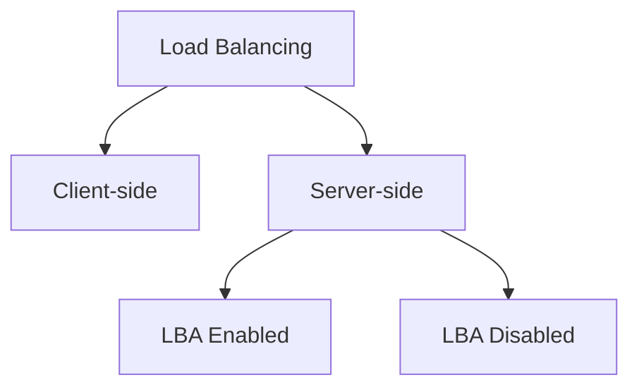
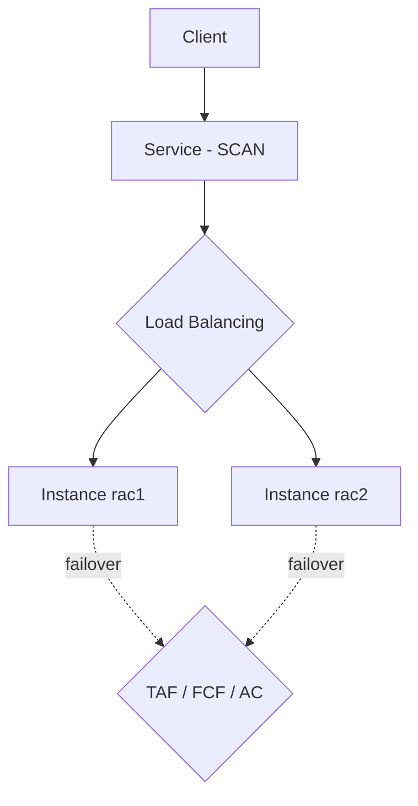

# 📘 Module 06: Services, Load Balancing & Application Continuity

> **Section**: 06/14
> **Khóa học**: Oracle Database RAC Administration Course (Ahmed Baraka)
> **Thời gian học ước tính**: 5-6 giờ ⭐ (Module lớn nhất)

---

## 📋 Bài học trong Module

| #   | Bài học                                        | File nguồn                                                      | Loại        |
| --- | ---------------------------------------------- | --------------------------------------------------------------- | ----------- |
| 1   | Managing Dynamic Database Services             | `Section 06/Managing Dynamic Database Services.pdf`             | Lý thuyết   |
| 2   | Implementing Connection Load Balancing and TAF | `Section 06/Implementing Connection Load Balancing and TAF.pdf` | Lý thuyết   |
| 3   | Using Application Continuity                   | `Section 06/Using Application Continuity.pdf`                   | Lý thuyết   |
| 4   | Practice 8: Managing Services in Oracle RAC    | `Section 06/Practice 8 ...pdf`                                  | 🔧 Thực hành |
| 5   | Practice 9: Connection Load Balancing and TAF  | `Section 06/Practice 9 ...pdf`                                  | 🔧 Thực hành |
| 6   | Practice 10: Using Application Continuity      | `Section 06/Practice 10 ...pdf`                                 | 🔧 Thực hành |

---

## 🎯 Mục tiêu Module

- Tạo/quản lý **dynamic database services** bằng `srvctl`.
- Cấu hình **client-side** và **server-side** connect-time load balancing (có/không **LBA**).
- Cấu hình **TAF** BASIC và PRECONNECT (client-side & server-side).
- Hiểu **FAN** và **FCF**.
- Cấu hình **Application Continuity (AC)** và **Transaction Guard (TG)**; nắm giới hạn của AC.

---

## 📋 Nội dung chính

### 1. Managing Dynamic Database Services

> 📄 Nguồn: `Section 06/Managing Dynamic Database Services.pdf`

#### 1.1 Vì sao dùng service?

Client **nên kết nối tới RAC qua service** (không nối trực tiếp vào instance). Service được định nghĩa theo **application/workload/module** và mang lại:

- Tích hợp **Resource Manager** (kiểm soát phân bổ tài nguyên).
- **Load balancing** (điều phối session tới các instance).
- Tích hợp chặt với **Clusterware** (tự tạo resource profile, quản lý dependency, failover, relocation).
- Số liệu performance theo **service / module / action** (AWR, OEM).

**Service mặc định & nội bộ:**

- `DB_UNIQUE_NAME`/`DB_NAME` (và `PDB_NAME` nếu CDB).
- `SYS$USERS` (session không gắn service ứng dụng), `SYS$BACKGROUND` (background process).

> ⚠️ Trong RAC, tạo service bằng **`srvctl`** hoặc EM — **không** dùng `DBMS_SERVICE`.

#### 1.2 Thuộc tính service

Service name · management policy (AUTOMATIC/MANUAL) · **instance preference / server pool** · connection load balancing goal (`clbgoal`) · load balancing advisory goal (`rlbgoal`) · **TAF settings** · database role.

#### 1.3 Lệnh quản lý service

```bash
# tạo: rac1 là preferred, rac2 là available
srvctl add service -db rac -service hrsrv -preferred rac1 -available rac2
srvctl start service  -db rac -s hrsrv
srvctl stop  service  -db rac -s hrsrv
srvctl status service -db rac -s hrsrv
srvctl config service -db rac -service hrsrv

srvctl enable  service -db rac -service hrsrv [-instance rac1]
srvctl disable service -db rac -service hrsrv [-instance rac1]

# đổi available thành preferred
srvctl modify   service -db rac -s hrsrv -instance rac2 -preferred
# relocate service sang instance khác
srvctl relocate service -db rac -service hrsrv -oldinst rac1 -newinst rac2 [-force]
```

**Client-side kết nối tới service (`tnsnames.ora`):**

```text
SOESRV =
 (DESCRIPTION =
  (ADDRESS = (PROTOCOL = TCP)(HOST = srv-scan)(PORT = 1521))
  (CONNECT_DATA = (SERVER = DEDICATED)(SERVICE_NAME = hrsrv)))
```

#### 1.4 Parallel operations & thống kê theo service

- RAC có thể chạy 1 câu SQL **song song trên nhiều instance** ⇒ tải interconnect nặng. Kiểm soát bằng `PARALLEL_FORCE_LOCAL`; hoặc dùng service để giới hạn số instance tham gia.
- **Statistics Aggregation** theo Service/Module/Action (bền vững qua restart):

```sql
EXEC DBMS_MONITOR.SERV_MOD_ACT_STAT_ENABLE(SERVICE_NAME=>'HRSRV',
      MODULE_NAME=>'PAYROLL', ACTION_NAME=>NULL);
-- verify: DBA_ENABLED_AGGREGATIONS
```

- Views: `V$SERVICE_STATS`, `V$SERVICE_EVENT`, `V$SERVICE_WAIT_CLASS`, `V$SERVICEMETRIC(_HISTORY)`, `V$SERV_MOD_ACT_STATS`.
- **Tracing Aggregation**: `DBMS_MONITOR.SERV_MOD_ACT_TRACE_ENABLE(...)` → gộp trace bằng **`trcsess`**.

---

### 2. Implementing Connection Load Balancing and TAF

> 📄 Nguồn: `Section 06/Implementing Connection Load Balancing and TAF.pdf`

#### 2.1 Bức tranh tổng thể



#### 2.2 Client-side connect-time load balancing

- Bật bằng `LOAD_BALANCE=ON` trong `tnsnames.ora`; thường liệt kê **VIP** của các node.
- Client **chọn ngẫu nhiên** một address rồi nối tới listener của node đó — **bất kể** tải thực tế và bất kể cấu hình server-side. Dùng SCAN ở đây là **không liên quan**.

```text
HRSRV=
 (DESCRIPTION =
  (ADDRESS_LIST =
   (LOAD_BALANCE=ON)
   (ADDRESS=(PROTOCOL=TCP)(HOST=rac1vip)(PORT=1521))
   (ADDRESS=(PROTOCOL=TCP)(HOST=rac2vip)(PORT=1521)))
  (CONNECT_DATA=(SERVICE_NAME=HRSRV)))
```

#### 2.3 Server-side + Load Balancing Advisory (LBA)

- LBA gửi việc tới instance dựa trên **chất lượng dịch vụ**, nhận ra sức mạnh máy khác nhau.
- Bật LBA = đặt **`rlbgoal`** (run-time goal):
  - `SERVICE_TIME` — phân phối theo **response time** (thường đi với `clbgoal SHORT`).
  - `THROUGHPUT` — phân phối theo **throughput** (thường đi với `clbgoal LONG`).
- Nếu `rlbgoal` = NONE ⇒ **LBA tắt**, connection được chia **gần như đều**.

```bash
srvctl modify service -db rac -service orders -rlbgoal SERVICE_TIME -clbgoal SHORT
srvctl modify service -db rac -service batchj -rlbgoal THROUGHPUT   -clbgoal LONG
```

- Hỗ trợ: JDBC UCP, OCI session pool, WebLogic Active GridLink, ODP.NET pools...

#### 2.4 Transparent Application Failover (TAF)

- Tính năng của **OCI driver** (dùng được với thick JDBC). Khi connection lỗi → failover sang instance còn sống: **transaction đang mở bị rollback**, nhưng có thể **tiếp tục câu SELECT**.
- Hai method: **BASIC** (mở connection mới khi failover) và **PRECONNECT** (tạo sẵn shadow connection).
- Cấu hình được ở **client-side** và **server-side**.

**TAF BASIC — client-side** (`tnsnames.ora`, `FAILOVER=ON` + `FAILOVER_MODE`):

| Tham số   | Ý nghĩa                  |
| --------- | ------------------------ |
| `TYPE`    | SESSION / SELECT / NONE  |
| `METHOD`  | BASIC / PRECONNECT       |
| `RETRIES` | số lần thử reconnect     |
| `DELAY`   | số giây chờ giữa các lần |

```text
ctaf =
 (DESCRIPTION=(FAILOVER=ON)(LOAD_BALANCE=ON)
  (ADDRESS=(PROTOCOL=TCP)(HOST=rac1-vip)(PORT=1521))
  (ADDRESS=(PROTOCOL=TCP)(HOST=rac2-vip)(PORT=1521))
  (CONNECT_DATA=(SERVICE_NAME=hrsrv)
   (FAILOVER_MODE=(TYPE=SELECT)(METHOD=BASIC)(RETRIES=10)(DELAY=10))))
```

**TAF BASIC — server-side** (thuộc tính của service):

```bash
srvctl add service -db racdb -service hrsrv -preferred rac1 -available rac2,rac3 \
   -failovermethod BASIC -failovertype SELECT -failoverretry 10 -failoverdelay 5
```

**TAF PRECONNECT**: dùng cặp descriptor với `BACKUP=` trỏ chéo và `METHOD=PRECONNECT`. Server-side dùng `-tafpolicy PRECONNECT` → sinh **shadow service** `<service>_preconnect`. ⚠️ Bản thân `-tafpolicy` **không** bật failover — phải set `FAILOVER_TYPE`; và **không dùng được** trong policy-managed RAC.

**Xác minh TAF:**

```sql
SELECT MACHINE, FAILOVER_METHOD, FAILOVER_TYPE, FAILED_OVER, SERVICE_NAME, COUNT(*)
FROM GV$SESSION GROUP BY MACHINE, FAILOVER_METHOD, FAILOVER_TYPE, FAILED_OVER, SERVICE_NAME;
SELECT NAME, FAILOVER_METHOD, FAILOVER_TYPE FROM DBA_SERVICES;
```

#### 2.5 FAN & FCF

- **FAN (Fast Application Notification):** cơ chế Oracle **thông báo** trạng thái service/instance (UP/DOWN). Nhiều pool hỗ trợ FAN **không cần sửa code** (JDBC UCP, ODP.NET pool, OCI session pool, WebLogic Active GridLink). Được dùng bởi **FCF, AC, Transaction Guard**. Bật: `srvctl modify service -db rac -s hrsrv -notification TRUE`.
- **FCF (Fast Connection Failover):** tính năng failover bật trong **connection pool**, dùng **ONS**. Planned outage: connection đang dùng **không bị ngắt**, chỉ đóng sau khi xong việc; unplanned outage: tự loại connection tới instance chết; nhận biết **node mới**. **Được khuyến nghị hơn TAF.**

---

### 3. Using Application Continuity

> 📄 Nguồn: `Section 06/Using Application Continuity.pdf`

#### 3.1 Vấn đề trước khi có AC

Khi database (RAC hoặc single-instance) outage: user **không biết** commit cuối thành công hay chưa, **session state mất**. Sửa ứng dụng để tự xử lý thì **đắt và phức tạp**.

#### 3.2 AC làm gì?

**Application Continuity** che giấu lỗi database khỏi user: **dựng lại session** (state + transaction đang mở) rồi:

- Nếu transaction đã thành công và không cần chạy lại → trả về **trạng thái thành công**.
- Nếu transaction thất bại → **re-execute (replay)**.
- Nếu replay thất bại → trả về lỗi.

Ra mắt từ **12.1**, làm việc với **Java**; hỗ trợ RAC, Data Guard, Active Data Guard, WebLogic. Client: JDBC Thin **replay driver**, UCP, WebLogic.

**AC tốt hơn TAF vì:** trạng thái transaction **được biết chắc chắn**, có thể **replay DML**, và **session state không mất**.

#### 3.3 Transaction Guard (TG)

Trả về **outcome** (commit thành công hay không) của transaction cuối sau **recoverable error** → user biết chuyện gì đã xảy ra. TG được **AC sử dụng**. API: JDBC Thin, C/C++, ODP.NET.

#### 3.4 Thuật ngữ & giới hạn quan trọng

- **Mutable object**: hàm không tất định (ví dụ `sequence.NextVal`, `SYSDATE`) — cần xử lý riêng khi replay.
- **Session state consistency**: **Dynamic** (nên dùng) vs Static.
- **AC bị vô hiệu** nếu: kết nối bằng **default service**, ứng dụng **XA**, dùng class deprecated (LOB/ARRAY/STRUCT). Một phần request bị tắt AC nếu chạy `ALTER SYSTEM/DATABASE`, hoặc ADG với DB link read/write. **Không** hỗ trợ Logical Standby / GoldenGate.
- Một số action **không nên replay** (gọi `disableReplay`): autonomous transaction, `DBMS_ALERT`, `DBMS_FILE_TRANSFER`, `DBMS_PIPE`, `UTL_FILE/HTTP/MAIL/SMTP/TCP/URL`.

#### 3.5 Tạo service cho AC và cho TG

```bash
# Application Continuity: bắt buộc failovertype=TRANSACTION + commit_outcome=TRUE
srvctl add service -db racdb -service app2 \
  -failovertype TRANSACTION -commit_outcome TRUE \
  -replay_init_time 1800 -failoverretry 30 -failoverdelay 10 -retention 86400 \
  -notification TRUE -rlbgoal SERVICE_TIME -clbgoal SHORT

# Transaction Guard: bắt buộc commit_outcome=TRUE
srvctl add service -db racdb -service app3 -commit_outcome TRUE \
  -retention 86400 -failoverretry 30 -failoverdelay 10 \
  -notification TRUE -rlbgoal SERVICE_TIME -clbgoal SHORT
GRANT EXECUTE ON DBMS_APP_CONT TO <user>;   -- để user đọc được transaction status
```

---

### 4-6. Practices

#### Practice 8: Managing Services

```bash
srvctl add service -db rac -service soesrv -preferred rac1 -available rac2
srvctl start service -db rac -s soesrv
srvctl status service -db rac -s soesrv           # đang chạy ở rac1
# crash rac1 → clusterware chuyển soesrv sang rac2 và tự restart rac1
pkill -9 -f ora_pmon_rac1
srvctl relocate service -db rac -service soesrv -oldinst rac2 -newinst rac1
```

Bật thống kê theo module/action rồi xem `GV$SERV_MOD_ACT_STATS`:

```sql
EXEC DBMS_MONITOR.SERV_MOD_ACT_STAT_ENABLE('soesrv','Browse Products',DBMS_MONITOR.ALL_ACTIONS);
```

#### Practice 9: Load Balancing & TAF

Thử nghiệm **crash instance bằng `pkill -9 -f ora_pmon_rac1`** rồi quan sát `GV$SESSION`:

- **Client-side LB** (`LOAD_BALANCE=ON`, dùng VIP): session phân phối **ngẫu nhiên**; khi 1 node chết, mọi kết nối vẫn vào node còn sống, không lỗi.
- **Server-side, LBA tắt** (`GOAL=NONE` trong `DBA_SERVICES`): chia **gần đều** bất kể tải.
- **Server-side, LBA bật** (`-rlbgoal service_time -clbgoal short`): tạo tải CPU nặng lên 1 node → LBA đẩy kết nối sang **node ít tải hơn**.
- **TAF (BASIC/PRECONNECT, client/server)**: chạy SELECT dài rồi crash node → client **khựng vài giây** rồi tiếp tục trả rows; `FAILED_OVER=YES`. Với PRECONNECT có **2 session** (primary + shadow backup).

#### Practice 10: Application Continuity

Chạy 2 kịch bản trên cùng ứng dụng Java (`actest.jar`) khác nhau ở data source:

- `runnoreplay` (OracleDataSource) → crash node đang nối ⇒ ứng dụng **báo lỗi**.
- `runreplay` (OracleDataSourceImpl - replay) qua service AC ⇒ crash node ⇒ ứng dụng **tiếp tục bình thường**, session tự **migrate** sang node còn lại.

```bash
srvctl add service -db rac -service acsrv -preferred rac1 -available rac2 \
  -failovertype TRANSACTION -commit_outcome TRUE -failoverretry 30 -failoverdelay 10 \
  -retention 86400 -replay_init_time 1800 -notification TRUE
```

---

## 🧠 Sơ đồ ghi nhớ nhanh



---

## 🧠 Tóm tắt để nhớ lâu

- Ứng dụng nên kết nối qua **dynamic service** (`srvctl add service`, có preferred/available) — **không** dùng `DBMS_SERVICE`.
- **Client-side LB**: chọn ngẫu nhiên theo VIP, bất kể tải. **Server-side LBA** (`rlbgoal`): đẩy về node ít tải theo SERVICE_TIME/THROUGHPUT.
- **TAF**: BASIC vs PRECONNECT; rollback transaction, có thể tiếp tục SELECT; xác minh qua `GV$SESSION.FAILED_OVER`.
- **FAN** thông báo UP/DOWN; **FCF** (pool + ONS) được **khuyến nghị hơn TAF**.
- **AC** dựng lại session và **replay transaction** (bắt buộc `failovertype=TRANSACTION` + `commit_outcome=TRUE`); tốt hơn TAF nhưng có nhiều **giới hạn** (default service, XA, một số PL/SQL...).
- **Transaction Guard** cho biết **commit outcome** chắc chắn và được AC dùng.

---

## 🛠️ Sau khi học xong, hãy tự làm

1. Tạo service `soesrv` (preferred rac1, available rac2), crash rac1 và quan sát relocation + auto-restart.
2. So sánh phân phối kết nối: client-side LB vs server-side LBA (tải nặng 1 node).
3. Cấu hình TAF BASIC (client & server) và PRECONNECT; kiểm tra `FAILED_OVER`.
4. Tạo service AC (`failovertype=TRANSACTION`, `commit_outcome=TRUE`) và chạy demo replay vs noreplay.
5. Liệt kê các trường hợp **AC bị vô hiệu** và giải thích khác biệt AC vs TAF vs TG.

---

## ⏭️ Module tiếp theo

**Module 07: Patching & Upgrading Oracle RAC** — áp PSU và upgrade RAC từ 12c R1 lên 12c R2.


---

!!! info "Nguồn gốc"
    `The-Oracle-Database-RAC-Administration-Course/modules/module_06/module_06_guide.md`
