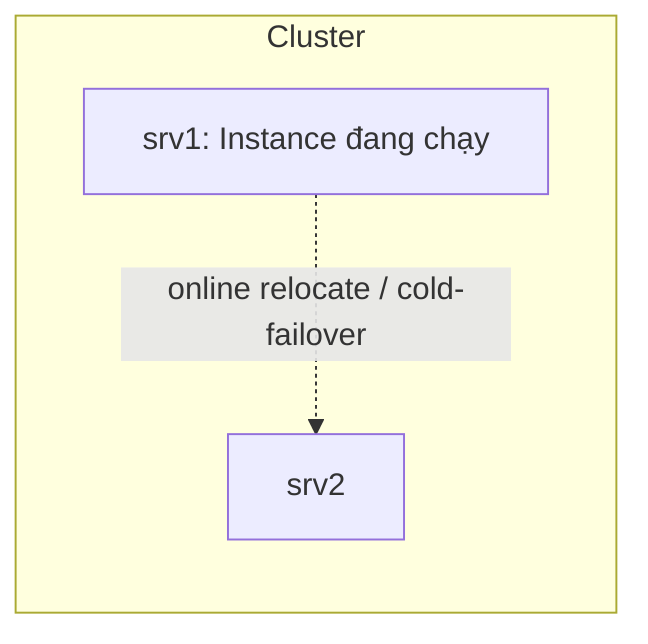

# 📘 Module 08: Oracle RAC One Node

> **Section**: 08/14
> **Khóa học**: Oracle Database RAC Administration Course (Ahmed Baraka)
> **Thời gian học ước tính**: 2-3 giờ

---

## 📋 Bài học trong Module

| #   | Bài học                                       | File nguồn                           | Loại        |
| --- | --------------------------------------------- | ------------------------------------ | ----------- |
| 1   | Oracle RAC One Node                           | `Section 08/Oracle RAC One Node.pdf` | Lý thuyết   |
| 2   | Practice 13: Creating a RAC One Node Database | `Section 08/Practice 13 ...pdf`      | 🔧 Thực hành |

---

## 🎯 Mục tiêu Module

- Mô tả **kiến trúc** Oracle RAC One Node.
- **Tạo** một RAC One Node database (DBCA).
- **Online relocation** một instance RAC One Node.
- **Convert** giữa RAC One Node ↔ RAC, và Single Instance → RAC One Node.

---

## 📋 Nội dung chính

### 1. Oracle RAC One Node là gì?

> 📄 Nguồn: `Section 08/Oracle RAC One Node.pdf`

Là **một single instance của một database RAC-enabled**, chỉ chạy trên **một node** trong cluster tại một thời điểm.

**Đặc điểm:**

- Cấu hình **active-passive**: **cold-failover**.
- **Relocation** dễ dàng sang node active khác.
- **Nâng cấp lên RAC** đầy đủ khi cần.

**Yêu cầu:**

- Cùng thiết lập phần cứng & phần mềm như RAC database.
- License **riêng** so với Database EE, nhưng **rẻ hơn** RAC.



### 2. Tạo RAC One Node database

- Tạo bằng **DBCA**, hoặc **convert** từ single-instance / RAC.
- Bắt buộc cấu hình **ít nhất một dynamic service**.
- Nếu chưa đăng ký trong clusterware:

```bash
srvctl add database -dbtype RACONENODE [-server server_list] [-instance instance_name] [-timeout timeout]
```

**Kiểm tra** (chú ý `Type: RACOneNode`, `Online relocation timeout`, `Candidate servers`):

```bash
srvctl config database -db rac1n
```

### 3. Online Relocation

- Instance active **relocate online** từ node này sang node khác.
- Thời gian relocation tùy chỉnh **tối đa 12 giờ**; có thể relocate qua các home ở batch level khác nhau.

```bash
srvctl relocate database -db db_unique_name [-node target_node] [-timeout timeout] [-stopoption NORMAL] [-verbose]
srvctl relocate database -db db_unique_name --abort [-revert] [-verbose]
```

**Ví dụ** relocate `rac1n` sang `srv2`, timeout 15 phút:

```bash
srvctl relocate database -db rac1n -node srv2 -timeout 15 -verbose
#  → tạm thời có 2 instance; instance mới start; services relocated;
#    chờ tối đa 15 phút cho instance cũ dừng → cấu hình về 1 instance
```

Trong lúc relocation: `srvctl status database` báo **Online relocation: ACTIVE** + Source/Destination instance.

> ⚠️ **Relocation & client**: dùng **Application Continuity + FAN** hoặc **TAF** để giảm tác động. Nếu không dùng, transaction được phép hoàn tất trong **timeout**; vượt timeout → client nhận **ORA-3113** (end-of-file on communication channel); nếu instance cũ shutdown lâu hơn timeout → bị **abort**.

### 4. Convert giữa các loại

**RAC One Node → RAC:**

```bash
srvctl stop database -db <db_unq_name>
srvctl convert database -db <db_unq_name> -dbtype RAC
srvctl start database -db <db_unq_name>
srvctl add instance  -db <db_unq_name> -instance <inst_name> -node <node_2>
srvctl start instance -db <db_unq_name> -instance <inst_name>
```

**Single Instance → RAC One Node:** dùng **DBCA** (tự động hóa); yêu cầu đạt RAC hardware/OS requirements + shared storage (ASM hoặc OCFS).

**RAC → RAC One Node:**

- Admin-managed: đặt **preferred instance** của các service về **một node**.
- Convert **PRECONNECT TAF policy** (nếu có) sang **BASIC hoặc NONE** trước khi convert.
- Policy-managed: mọi service dùng **cùng server pool**.
- Chỉ **một instance** đang chạy.

```bash
srvctl convert database -db <db_unique_name> -dbtype RACONENODE [-instance <inst_name> -timeout <timeout>]
```

---

### 5. Practice 13 — tóm tắt

> 📄 Nguồn: `Section 08/Practice 13 ...pdf`

1. **Tạo RAC One Node** bằng DBCA (drop `rac` trước; tạo `oradb`, SID `oradb`, service `oradbsrv`, non-CDB, `+DATA/{DB_UNIQUE_NAME}`, `+FRA`). Kiểm tra `srvctl config/status database -db oradb`.
2. **Relocate online** `oradb` từ srv1 → srv2, theo dõi qua cửa sổ monitoring, rồi relocate về:

   ```bash
   srvctl relocate database -db oradb -node srv2 -w 15 -v
   srvctl status database -db oradb
   ```

3. **Convert sang RAC** và thêm instance thứ 2 **online**:

   ```bash
   srvctl stop database -db oradb
   srvctl convert database -db oradb -dbtype RAC
   srvctl start database -db oradb
   srvctl add instance -d oradb -i oradb_2 -n srv2
   srvctl start instance -d oradb -i oradb_2
   ```

> 💡 Nếu FRA báo `Free_MB = 0` (lỗi lạ), dùng `asmcmd`: `umount fra` → `mount fra` → `chkdg --repair fra`.

---

## 🧠 Tóm tắt để nhớ lâu

- RAC One Node = **một instance của RAC database** chạy trên một node — **active-passive cold-failover**, license **rẻ hơn RAC**.
- **Online relocation** (tối đa 12h) chuyển instance sang node khác gần như không gián đoạn nếu có **AC/FAN/TAF**; nếu không, quá timeout → **ORA-3113**.
- Convert linh hoạt: **RAC One Node ↔ RAC** bằng `srvctl convert database -dbtype ...`; Single Instance → RAC One Node bằng **DBCA**.

---

## 🛠️ Sau khi học xong, hãy tự làm

1. Tạo RAC One Node, xác nhận `Type: RACOneNode` và `Candidate servers`.
2. Relocate online sang node khác và theo dõi trạng thái ACTIVE.
3. Convert RAC One Node → RAC, thêm instance thứ 2 online.
4. Liệt kê yêu cầu khi convert RAC → RAC One Node (preferred instance, TAF policy).

---

## ⏭️ Module tiếp theo

**Module 09: Multitenant Architecture and RAC** — CDB/PDB trên môi trường RAC.


---

!!! info "Nguồn gốc"
    `The-Oracle-Database-RAC-Administration-Course/modules/module_08/module_08_guide.md`
