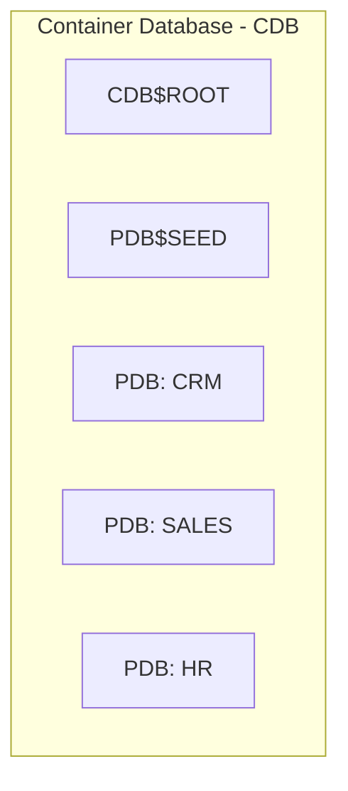

# 📘 Module 09: Multitenant Architecture and RAC

> **Section**: 09/14
> **Khóa học**: Oracle Database RAC Administration Course (Ahmed Baraka)
> **Thời gian học ước tính**: 2-3 giờ

---

## 📋 Bài học trong Module

| #   | Bài học                                          | File nguồn                                        | Loại        |
| --- | ------------------------------------------------ | ------------------------------------------------- | ----------- |
| 1   | Multitenant Architecture and RAC                 | `Section 09/Multitenant Architecture and RAC.pdf` | Lý thuyết   |
| 2   | Practice 14: Creating a Multitenant RAC Database | `Section 09/Practice 14 ...pdf`                   | 🔧 Thực hành |

---

## 🎯 Mục tiêu Module

- Mô tả **kiến trúc Multitenant** (CDB/PDB) và ưu điểm.
- Phân biệt **common user** và **local user**.
- **Kết nối / startup / shutdown** CDB và PDB (đặc biệt trong RAC).
- Hiểu **data dictionary views** ở mức CDB, **clone** và **drop** PDB.

---

## 📋 Nội dung chính

### 1. Multitenant Architecture là gì?

> 📄 Nguồn: `Section 09/Multitenant Architecture and RAC.pdf`

Hợp nhất **một hoặc nhiều database** vào **một Container Database (CDB)** duy nhất. Đối lập với **non-CDB**.



- Số PDB tối đa: **12.1 → 252**, **12.2 → 4096**.
- **Ưu điểm**: giải quyết bài toán consolidation (tận dụng tài nguyên, giảm chi phí DBA), ứng dụng/schema **không cần đổi**, **tenant isolation**, **clone/move** database dễ và hiệu quả.

### 2. Thuật ngữ

| Term                | Định nghĩa                                                                                  |
| ------------------- | ------------------------------------------------------------------------------------------- |
| **CDB**             | Container database chứa 0 hoặc nhiều PDB                                                    |
| **non-CDB**         | Database không dùng multitenant (mọi DB trước 12c)                                          |
| **PDB**             | Tập schema + object di động, với client Oracle Net **trông như một non-CDB**                |
| **Root (CDB$ROOT)** | Bộ datafile + metadata (data dictionary, package, system user) chứa thông tin mọi container |

> 📌 Non-CDB đã **obsolete** — multitenant là hướng phát triển của Oracle.

### 3. Common User vs Local User

|          | Common user                                        | Local user                   |
| -------- | -------------------------------------------------- | ---------------------------- |
| Tạo ở    | **Root**                                           | Container (PDB) cụ thể       |
| Login    | Được vào **các PDB** trong CDB                     | Chỉ vào **container của nó** |
| Dùng cho | Admin cấp CDB (`SYS`, `SYSTEM` là common mặc định) | Data-owner / admin cấp PDB   |

### 4. Kết nối tới CDB và PDB

```sql
CONNECT / as sysdba
CONNECT sys@//hostname:1525/CDB1 as sysdba      -- root container
CONNECT sys@//hostname:1525/PDBHR as sysdba     -- một PDB
CONNECT scott@//hostname/PDBHR
SHOW CON_NAME                                   -- container hiện tại
```

### 5. Startup / Shutdown PDB

```sql
-- tác động container hiện tại
ALTER PLUGGABLE DATABASE OPEN [READ ONLY];
ALTER PLUGGABLE DATABASE CLOSE [IMMEDIATE];
-- từ root, chỉ định container
ALTER PLUGGABLE DATABASE pdb1 OPEN;
ALTER PLUGGABLE DATABASE ALL OPEN;
ALTER PLUGGABLE DATABASE ALL EXCEPT pdb1 OPEN;
STARTUP PLUGGABLE DATABASE pdb1 [OPEN] [READ ONLY] [RESTRICT] [FORCE];
SELECT NAME, OPEN_MODE, RESTRICTED FROM V$PDBS;
```

**Trong RAC — chỉ định instance:**

```sql
ALTER PLUGGABLE DATABASE pdb1 OPEN INSTANCES=('rac1','rac2');
ALTER PLUGGABLE DATABASE pdb1 OPEN INSTANCES=ALL;
ALTER PLUGGABLE DATABASE pdb1 OPEN INSTANCES=ALL EXCEPT ('rac1');
SELECT INST_ID, NAME, OPEN_MODE, RESTRICTED FROM GV$PDBS;   -- xem toàn cluster
```

**Startup/Shutdown CDB:** lệnh truyền thống (`STARTUP`/`SHUTDOWN`) hoặc `srvctl start|stop database -d cdb` nếu đã đăng ký trong clusterware/Oracle Restart.

### 6. Data Dictionary Views cấp CDB

| View     | Ý nghĩa                                                                                                 |
| -------- | ------------------------------------------------------------------------------------------------------- |
| `USER_*` | Object thuộc user hiện tại                                                                              |
| `ALL_*`  | Object user hiện tại truy cập được                                                                      |
| `DBA_*`  | Mọi object **trong container hiện tại** (root hoặc pdb)                                                 |
| `CDB_*`  | Mọi object trong **toàn CDB** (phân biệt bằng `CON_ID`) — vd `CDB_PDBS`, `CDB_TABLESPACES`, `CDB_USERS` |
| `V$*`    | SGA truy cập bởi mọi container (`CON_ID`)                                                               |

### 7. Clone và Drop PDB

```sql
-- clone online
CREATE PLUGGABLE DATABASE pdb2 FROM pdb1;
ALTER PLUGGABLE DATABASE pdb2 OPEN INSTANCES=ALL;
-- RAC: đăng ký service cho PDB mới vào clusterware
```

```bash
srvctl add service -db cdbrac -pdb pdb2 -s pdb2srv -preferred cdbrac1 -available cdbrac2
srvctl start service -db cdbrac -s pdb2srv
```

```sql
-- drop
srvctl stop service -db cdbrac -s pdb2srv ; srvctl remove service -db cdbrac -s pdb2srv
ALTER PLUGGABLE DATABASE pdb2 CLOSE INSTANCES=ALL;
DROP PLUGGABLE DATABASE pdb2 INCLUDING DATAFILES;
```

---

### 8. Practice 14 — điểm cốt lõi

> 📄 Nguồn: `Section 09/Practice 14 ...pdf`

- Tạo **CDB RAC** `mtdb` bằng DBCA (Create as Container Database, Local Undo, 1 PDB `pdb1`, bật Archiving). Cả `mtdb` và `pdb1` đều **tự đăng ký trong listener** trên cả 2 node.
- Kết nối CDB (`//srv1/mtdb.localdomain` → thực chất là **root**) vs PDB (`//srv1/pdb1.localdomain` → trông như non-CDB); `SELECT NAME, CDB, CON_ID FROM V$DATABASE;`.
- Open/close PDB theo instance qua `GV$PDBS`; mỗi instance có **4 redo group** (tổng 16) do **root** quản lý — **không** tạo redo cho riêng PDB. Trong CDB, tên tablespace **không** duy nhất, phân biệt bằng `CON_ID`.
- **Clone** `pdb2 FROM pdb1` bằng một câu lệnh (online). ⚠️ PDB **không tự start sau restart CDB** nếu **service của nó chưa đăng ký trong clusterware** → tạo `pdb2srv` bằng `srvctl add service -pdb pdb2`.
- **Drop** `pdb2` (xóa service trước, close INSTANCES=ALL, DROP ... INCLUDING DATAFILES) trong khi các PDB khác vẫn online.

---

## 🧠 Tóm tắt để nhớ lâu

- **CDB** chứa nhiều **PDB**; PDB với client trông như **non-CDB**; `CDB$ROOT` giữ metadata chung.
- **Common user** (tạo ở root, vào nhiều PDB) vs **local user** (chỉ trong container của nó).
- Trong RAC dùng `INSTANCES=(...)`/`ALL`/`ALL EXCEPT` để open/close PDB; xem toàn cluster bằng **`GV$PDBS`**.
- **Redo & undo** thuộc CDB/instance, **không** riêng cho PDB; tablespace phân biệt bằng `CON_ID`.
- Để PDB **auto-start theo cluster**, phải tạo **service cho PDB** trong clusterware (`srvctl add service -pdb ...`).
- Clone PDB online bằng **một câu lệnh**; drop kèm `INCLUDING DATAFILES`.

---

## 🛠️ Sau khi học xong, hãy tự làm

1. Tạo CDB RAC với 1 PDB; kiểm tra đăng ký listener trên cả 2 node.
2. Kết nối vào root vs PDB, so `SHOW CON_NAME`.
3. Open/close PDB theo từng instance và quan sát `GV$PDBS`.
4. Clone `pdb2 FROM pdb1`, tạo service clusterware, rồi drop sạch.

---

## ⏭️ Module tiếp theo

**Module 10: Policy-Managed Oracle RAC Databases** — server pools, server categorization, cluster configuration policies.


---

!!! info "Nguồn gốc"
    `The-Oracle-Database-RAC-Administration-Course/modules/module_09/module_09_guide.md`
