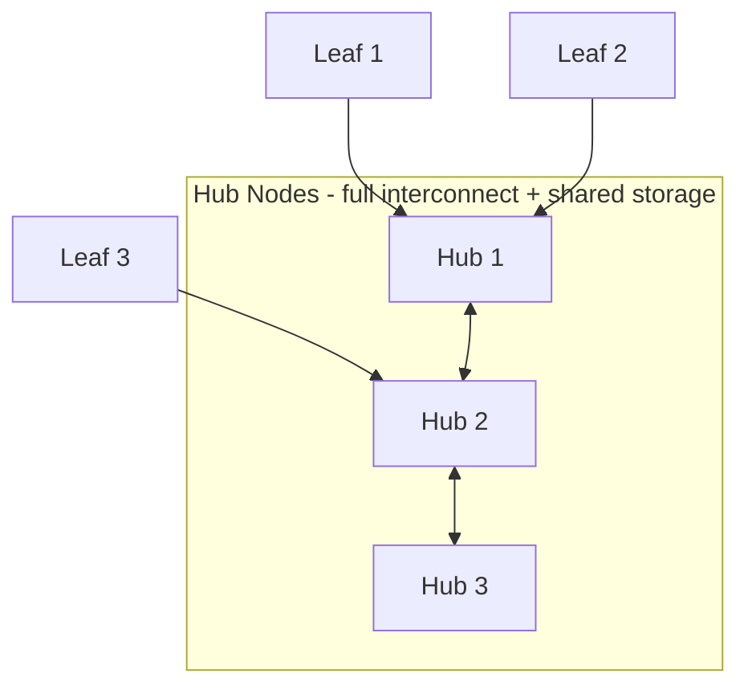

# 📘 Module 11: Oracle Flex Clusters

> **Section**: 11/14
> **Khóa học**: Oracle Database RAC Administration Course (Ahmed Baraka)
> **Thời gian học ước tính**: 2-3 giờ

---

## 📋 Bài học trong Module

| #   | Bài học              | File nguồn                            | Loại      |
| --- | -------------------- | ------------------------------------- | --------- |
| 1   | Oracle Flex Clusters | `Section 11/Oracle Flex Clusters.pdf` | Lý thuyết |

> ℹ️ Section 11 là **lý thuyết thuần**, không có practice.

---

## 🎯 Mục tiêu Module

- Hiểu **lợi ích** và **kiến trúc** Oracle Flex Cluster.
- Phân biệt **Hub node** và **Leaf node**.
- **Convert** standard cluster → Flex Cluster và **quản lý** Flex Cluster.
- Mô tả **Oracle Flex ASM**.

---

## 📋 Nội dung chính

> 📄 Nguồn: `Section 11/Oracle Flex Clusters.pdf`

### 1. Vấn đề trước Flex Cluster

Số đường interconnect tăng theo công thức **N × (N-1) / 2**. Với **100 node → 4950** đường ⇒ không mở rộng tốt khi số node lớn.

### 2. Kiến trúc Flex Cluster



**Khái niệm cốt lõi:**

- **Leaf node** kết nối vào cluster **thông qua một Hub node**.
- **Heartbeat** của leaf diễn ra **giữa leaf và hub gắn với nó** (không phải all-to-all).
- **Giảm số đường interconnect**: 16-node RAC thường cần **120** đường; với **4 hub + 12 leaf** chỉ còn **6 (giữa hub) + 12 (leaf→hub) = 18** đường.
- Cho **khả năng mở rộng cao** khi số node lớn; **yêu cầu Flex ASM**.

**Failover:**

- **Hub fail** → các leaf của nó fail (trừ khi được thiết kế failover sang hub khác).
- **Leaf fail** → service trên nó failover sang **leaf khác gắn cùng hub**.

**Cấu hình được khi:** tạo cluster mới, hoặc convert từ standard mode. **GNS bắt buộc** (Standard: GNS VIP + subdomain delegation trên DNS; Static: GNS VIP + mọi tên/địa chỉ tĩnh đăng ký trên DNS).

### 3. Tạo Flex Cluster

Khi **cài Grid Infrastructure**: chọn Flex Cluster → cấu hình **GNS** → định nghĩa **hub và leaf nodes**.

### 4. Convert Standard → Flex Cluster

```bash
# 1) Đảm bảo GNS đã cấu hình
srvctl status gns
srvctl add gns -vip <VIP_address> -domain <domain_name>   # nếu chưa có
# 2) Bật Flex ASM bằng ASMCA
# 3) (root) chuyển sang Flex mode
crsctl set cluster mode flex
# 4) Restart Clusterware stack
crsctl stop crs
crsctl start crs -wait
```

### 5. Thông tin & quản lý Flex Cluster

```bash
crsctl get cluster mode status          # Cluster is running in "flex" mode
crsctl get node role status -all        # hub / leaf của từng node
crsctl set node role [-node node_name] {hub | leaf}
crsctl get node role config
crsctl get node role status -node srv2
crsctl get cluster hubsize              # số hub tối đa
```

### 6. Oracle Flex ASM (ra mắt từ 12c)

|              | Standard ASM (duy nhất trên 11g) | Flex ASM                                                 |
| ------------ | -------------------------------- | -------------------------------------------------------- |
| ASM instance | Phải chạy trên **mọi** node RAC  | **Không phải** node nào cũng có ASM instance             |
| Tài nguyên   | ASM tiêu tốn tài nguyên node     | Ít node chạy ASM hơn                                     |
| Khi ASM fail | **Database instance cũng fail**  | DB instance không có ASM cục bộ dùng ASM qua **network** |

```text
Node1   Node2   Node3   Node4
rac1    rac2    rac3    rac4
+ASM1   +ASM2   +ASM3    (—)
─────────────────────────────
ASM clients: rac1, rac2, rac3   |   Flex ASM client: rac4
```

**Flex ASM ↔ Flex Cluster:**

- Flex Cluster **yêu cầu** Flex ASM.
- Nếu bật Flex Cluster khi cài GI → Flex ASM **tự bật**.
- Convert standard → Flex Cluster: phải **cấu hình Flex ASM trước**.
- Khi Flex ASM bật: **không phải Hub node nào cũng có ASM instance**.
- **Flex ASM có thể chạy trên standard cluster** (độc lập).

---

## 🧠 Tóm tắt để nhớ lâu

- Flex Cluster giải bài toán **số đường interconnect** (N(N-1)/2) khi số node lớn: **Leaf** nối cluster **qua Hub**, heartbeat leaf↔hub.
- **Hub fail** → leaf của nó fail; **Leaf fail** → failover sang leaf khác cùng hub.
- **GNS bắt buộc**; convert bằng `crsctl set cluster mode flex` (sau khi có GNS + Flex ASM), rồi restart CRS.
- Quản lý role: `crsctl set/get node role`, `crsctl get cluster mode status`, `hubsize`.
- **Flex ASM**: không phải node nào cũng chạy ASM instance; node không có ASM dùng ASM qua network → tránh việc ASM fail kéo sập DB instance. **Flex Cluster cần Flex ASM**.

---

## 🛠️ Sau khi học xong, hãy tự làm

1. Giải thích Flex Cluster giảm đường interconnect thế nào (ví dụ 16 node).
2. So sánh hậu quả khi Hub fail vs Leaf fail.
3. Liệt kê các bước convert standard → Flex Cluster.
4. So sánh Standard ASM và Flex ASM, đặc biệt khi ASM instance fail.

---

## ⏭️ Module tiếp theo

**Module 12: Deleting/Adding a RAC Node** — thêm/xóa node khỏi cluster.


---

!!! info "Nguồn gốc"
    `The-Oracle-Database-RAC-Administration-Course/modules/module_11/module_11_guide.md`
