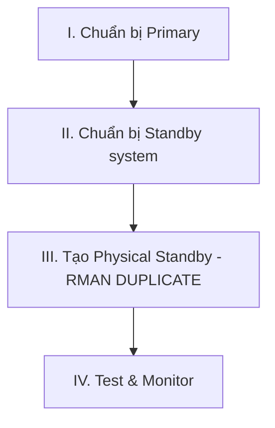

# 📘 Module 13: RAC with Data Guard — Physical Standby RAC Database

> **Section**: 13/14
> **Khóa học**: Oracle Database RAC Administration Course (Ahmed Baraka)
> **Thời gian học ước tính**: 3-4 giờ

---

## 📋 Bài học trong Module

| #   | Bài học                                                                    | File nguồn                                              | Loại                               |
| --- | -------------------------------------------------------------------------- | ------------------------------------------------------- | ---------------------------------- |
| 1   | Creating an Oracle 12c R2 Physical Standby RAC Database from a Primary RAC | `Section 13/62_Creating-...Physical-Standby-RAC-...pdf` | 📘 Tutorial (lý thuyết + thực hành) |

> ℹ️ Section 13 là một **tutorial** trọn vẹn (không tách lý thuyết/practice). Tài liệu hỗ trợ: `Section 13/tns_files`.

---

## 🎯 Mục tiêu Module

- Cấu hình **Data Guard** giữa **hai RAC database** (primary ↔ physical standby) trên Oracle 12c R2.
- Nắm các **cân nhắc đặc thù của Data Guard trong RAC**.
- Đi hết quy trình: chuẩn bị primary → chuẩn bị standby → tạo standby bằng RMAN DUPLICATE → start Redo Apply → kiểm tra/monitor.

---

## 📋 Nội dung chính

> 📄 Nguồn: `Section 13/62_Creating-an-Oracle-12c-R2-Physical-Standby-RAC-Database-from-a-Primary-RAC-database.pdf`

### 1. Môi trường & thông số

- **4 máy ảo**: 2 node cho **primary** (`srv1`, `srv2`, cluster đã có RAC database), 2 node cho **standby** (`srva`, `srvb`, chỉ có GI + DB software + ASM, **chưa** có database).
- **DB_NAME giống nhau**, nhưng **`DB_UNIQUE_NAME` khác nhau**: primary = `rac`, standby = `stdrac`.
- Cấu hình Data Guard: **Protection mode = Maximum Performance**, Fast-Start Failover = Disabled, quản lý bằng **SQL*Plus**, loại **Physical Standby**.

### 2. Cân nhắc Data Guard trong RAC (khác single-instance)

- `DUPLICATE ... FOR STANDBY FROM ACTIVE DATABASE` tạo ra **standby single-instance** ⇒ phải **tự** set các tham số RAC (`INSTANCE_NUMBER`, `INSTANCE_NAME`), enable instance thứ 2, và **thêm database vào OCR** như một resource mới.
- **`INSTANCE_NUMBER`/`INSTANCE_NAME`** phải chỉnh tay cho **instance standby thứ 2**.
- Primary **hoặc** standby có thể là single-instance non-cluster (tutorial này dùng cả hai đều RAC).
- **Standby Redo Log (SRL)** phải nằm ở nơi **mọi instance standby truy cập được** (khuyến nghị **FRA trong ASM**); mọi instance archive SRL về **cùng vị trí**.
- Nếu **không** dùng OMF thì phải set `LOG_ARCHIVE_FORMAT` có **`%t`/`%T`** (thread) để phân biệt archive theo instance.

### 3. Bốn giai đoạn



### 4. Giai đoạn I — Chuẩn bị Primary (`rac`)

```sql
-- ARCHIVELOG
ALTER SYSTEM SET LOG_ARCHIVE_DEST_1='LOCATION=USE_DB_RECOVERY_FILE_DEST' SCOPE=BOTH;
-- (srvctl stop/start database -o mount) ALTER DATABASE ARCHIVELOG;
-- Forced logging
ALTER DATABASE FORCE LOGGING;
-- Standby Redo Log: số lượng = (max redo logfiles + 1) * số thread  → vd (4+1)*2 = 10
ALTER DATABASE ADD STANDBY LOGFILE THREAD 1 '+FRA' SIZE 50M;   -- lặp cho thread 1 & 2
-- Tham số Data Guard
ALTER SYSTEM SET LOG_ARCHIVE_CONFIG='DG_CONFIG=(rac,stdrac)' SCOPE=BOTH SID='*';
ALTER SYSTEM SET LOG_ARCHIVE_DEST_2='SERVICE=stdrac ASYNC
   VALID_FOR=(ONLINE_LOGFILES,PRIMARY_ROLE) DB_UNIQUE_NAME=stdrac' SCOPE=BOTH SID='*';
ALTER SYSTEM SET FAL_SERVER='stdrac' SCOPE=BOTH SID='*';        -- FAL = fetch archive log
ALTER SYSTEM SET STANDBY_FILE_MANAGEMENT='AUTO' SCOPE=BOTH SID='*';
ALTER SYSTEM SET LOG_ARCHIVE_MAX_PROCESSES=8 SCOPE=BOTH SID='*';
-- Flashback (khuyến nghị) + giữ control file records
ALTER DATABASE FLASHBACK ON;
ALTER SYSTEM SET CONTROL_FILE_RECORD_KEEP_TIME=30 SCOPE=BOTH SID='*';
```

Cấu hình `tnsnames.ora` (mục `RAC` và `STDRAC`) trên **mọi node**; ở standby dùng **`(UR=A)`** cho descriptor STDRAC.

### 5. Giai đoạn II — Chuẩn bị Standby system (`srva`, `srvb`)

- Tạo thư mục (ASM: `mkdir RAC`, `STDRAC` trong DATA; OS: `admin/stdrac/adump`, `cdump`).
- Tạo pfile tối thiểu `init<SID>.ora` chỉ chứa `DB_NAME=rac` (RMAN sẽ dựng SPFILE đầy đủ).
- **Copy password file** từ primary (`asmcmd pwget/pwcopy` → `scp` sang `srva`/`srvb`).
- Tạo **static listener entry** cho instance standby (`SID_LIST_LISTENER` với `GLOBAL_DBNAME=stdrac.localdomain`, `SID_NAME=stdrac1`).

### 6. Giai đoạn III — Tạo Physical Standby bằng RMAN

```bash
# srva: start instance NOMOUNT bằng pfile
export ORACLE_SID=stdrac1
sqlplus / as sysdba
  STARTUP NOMOUNT pfile='.../dbs/initstdrac1.ora'
```

```sql
-- RMAN (chạy từ standby: kéo dữ liệu từ primary)
CONNECT TARGET sys/oracle@rac;
CONNECT AUXILIARY sys/oracle@stdrac;
run {
  allocate channel prmy1 type disk; allocate channel prmy2 type disk;
  allocate auxiliary channel stby1 type disk;
  DUPLICATE TARGET DATABASE FOR STANDBY FROM ACTIVE DATABASE
  SPFILE
    set 'db_unique_name'='stdrac'
    set db_create_online_log_dest_1='+FRA' set db_recovery_file_dest='+FRA'
    ...
  nofilenamecheck;
}
```

Sau DUPLICATE:

```sql
-- set tham số standby
ALTER SYSTEM SET FAL_SERVER=rac SCOPE=BOTH SID='*';
ALTER SYSTEM SET FAL_CLIENT=stdrac SCOPE=BOTH SID='*';
ALTER SYSTEM SET LOG_ARCHIVE_DEST_2='SERVICE=rac ASYNC DB_UNIQUE_NAME=rac
   VALID_FOR=(ONLINE_LOGFILE,PRIMARY_ROLE)' SCOPE=BOTH SID='*';
```

```bash
# thêm standby vào OCR
srvctl add database -d stdrac -o $ORACLE_HOME -role physical_standby -startoption mount -diskgroup DATA,FRA
srvctl add instance -d stdrac -i stdrac1 -n srva.localdomain
srvctl add instance -d stdrac -i stdrac2 -n srvb.localdomain
```

```sql
-- chỉnh INSTANCE_NUMBER/NAME cho từng instance rồi start instance 2
ALTER SYSTEM SET INSTANCE_NUMBER=2 SCOPE=SPFILE SID='stdrac2';
ALTER SYSTEM SET INSTANCE_NAME='stdrac2' SCOPE=SPFILE SID='stdrac2';
-- start Redo Apply
ALTER DATABASE RECOVER MANAGED STANDBY DATABASE DISCONNECT;
```

> 💡 Nhớ chuyển **SPFILE sang ASM** và cập nhật OCR (`srvctl modify database -d stdrac -p +DATA/.../spfilestdrac.ora`). Gỡ các member SRL bị multiplex thừa trên DATA.

### 7. Giai đoạn IV — Test & Monitor

```sql
-- vai trò & bảo vệ
SELECT INST_ID, DATABASE_ROLE, DB_UNIQUE_NAME, OPEN_MODE, PROTECTION_MODE FROM GV$DATABASE;
-- transport lag & apply lag (transport lag = dữ liệu sẽ mất khi thảm họa)
SELECT NAME, VALUE, UNIT FROM V$DATAGUARD_STATS WHERE NAME IN ('transport lag','apply lag');
```

**Post-creation**: cả 2 hệ set `CONFIGURE ARCHIVELOG DELETION POLICY TO APPLIED ON ALL STANDBY;`; bật Flashback trên standby.

**Test chức năng**: tạo `CREATE TABLESPACE TEST;` trên primary → kiểm tra xuất hiện trên standby.

**Next steps thực tế**: cấu hình **Data Guard Broker**, cân nhắc đổi protection mode, cơ chế purge archive log trên standby.

---

## 🧠 Tóm tắt để nhớ lâu

- Data Guard RAC↔RAC: **DB_NAME giống**, **DB_UNIQUE_NAME khác** (`rac`/`stdrac`).
- Chuẩn bị primary: **ARCHIVELOG + FORCE LOGGING + SRL** (số = (max redo+1)×threads) + tham số `LOG_ARCHIVE_CONFIG/DEST_2`, `FAL_SERVER`, `STANDBY_FILE_MANAGEMENT=AUTO`.
- Tạo standby bằng **RMAN `DUPLICATE ... FOR STANDBY FROM ACTIVE DATABASE`** → ra **single-instance** ⇒ phải **thêm vào OCR + chỉnh INSTANCE_NAME/NUMBER + enable instance 2** thủ công.
- Start apply bằng **`ALTER DATABASE RECOVER MANAGED STANDBY DATABASE DISCONNECT;`**; SRL để trong **FRA/ASM** cho mọi instance truy cập.
- Monitor bằng **`V$DATAGUARD_STATS`** (transport/apply lag).

---

## 🛠️ Sau khi học xong, hãy tự làm

1. Vẽ kiến trúc 4 node primary/standby, ghi rõ DB_NAME vs DB_UNIQUE_NAME.
2. Tính số SRL cần tạo với công thức (max redo+1)×threads.
3. Liệt kê các bước "RAC-specific" phải làm thủ công sau RMAN DUPLICATE.
4. Test failover-readiness: tạo tablespace ở primary, kiểm tra ở standby; đọc transport/apply lag.

---

## ⏭️ Module tiếp theo

**Module 14: Oracle 19c RAC** — dựng lab và tạo RAC database 19c trên Linux 7.


---

!!! info "Nguồn gốc"
    `The-Oracle-Database-RAC-Administration-Course/modules/module_13/module_13_guide.md`
