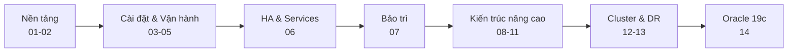

# 📚 Oracle Database RAC Administration — Mục lục khóa học

> Bộ tài liệu học tiếng Việt biên soạn **bám sát** khóa *The Oracle Database RAC Administration Course* của **Ahmed Baraka** (Oracle 12c → 19c).
> Mỗi module gắn với một **Section** và các file PDF gốc để dễ tra cứu.

📊 Tiến độ chi tiết: [progress.md](progress.md) — **14/14 module đã hoàn thành**.

---

## 🗺️ Lộ trình học

---

## 📋 Danh sách Module

### 🟢 Giai đoạn 1 — Nền tảng

| Module                                                       | Chủ đề                                                               | Section | Bài |
| ------------------------------------------------------------ | -------------------------------------------------------------------- | ------- | --- |
| [01 — Introducing the Course](module-01/module-01-guide.md)  | Giới thiệu khóa học, mục tiêu, curriculum                            | 01      | 1   |
| [02 — Overview & Architecture](module-02/module-02-guide.md) | Lợi ích/nhược điểm RAC, GI/Clusterware, SCAN, **Connectivity Cycle** | 02      | 2   |

### 🔵 Giai đoạn 2 — Cài đặt & Vận hành

| Module                                                             | Chủ đề                                                    | Section | Bài |
| ------------------------------------------------------------------ | --------------------------------------------------------- | ------- | --- |
| [03 — Installing Oracle RAC](module-03/module-03-guide.md)         | GI → ASM → Database, DBCA; Practice 01-02                 | 03      | 3   |
| [04 — Basic Admin & Backup](module-04/module-04-guide.md)          | srvctl/crsctl, tham số, undo, RMAN; Practice 03-06        | 04      | 6   |
| [05 — Global Resource Mgmt & Tuning](module-05/module-05-guide.md) | GRD, Cache Fusion, wait events, AWR/ASH/ADDM; Practice 07 | 05      | 3   |

### 🟣 Giai đoạn 3 — HA & Services

| Module                                                             | Chủ đề                                                                     | Section | Bài |
| ------------------------------------------------------------------ | -------------------------------------------------------------------------- | ------- | --- |
| [06 — Services, Load Balancing & AC](module-06/module-06-guide.md) | Dynamic services, LBA/TAF, FAN/FCF, Application Continuity; Practice 08-10 | 06      | 6   |

### 🟠 Giai đoạn 4 — Bảo trì

| Module                                                                                                            | Chủ đề                                               | Section | Bài |
| ----------------------------------------------------------------------------------------------------------------- | ---------------------------------------------------- | ------- | --- |
| [07 — Patching & Upgrading RAC](module-07/module-07-guide.md)                                                     | Patch types, OPatch/opatchauto, DBUA; Practice 11-12 | 07      | 4   |
| ↳ [Chi tiết Patching](module-07/patching-oracle-rac.md) · [Chi tiết Upgrading](module-07/upgrading-oracle-rac.md) |                                                      |         |     |

### 🔴 Giai đoạn 5 — Kiến trúc nâng cao

| Module                                                    | Chủ đề                                                   | Section | Bài |
| --------------------------------------------------------- | -------------------------------------------------------- | ------- | --- |
| [08 — Oracle RAC One Node](module-08/module-08-guide.md)  | Active-passive, online relocation, convert; Practice 13  | 08      | 2   |
| [09 — Multitenant & RAC](module-09/module-09-guide.md)    | CDB/PDB, GV$PDBS, clone/drop PDB; Practice 14            | 09      | 2   |
| [10 — Policy-Managed RAC](module-10/module-10-guide.md)   | Server pools, categorization, policy set; Practice 15-16 | 10      | 4   |
| [11 — Oracle Flex Clusters](module-11/module-11-guide.md) | Hub/Leaf nodes, Flex ASM                                 | 11      | 1   |

### ⚫ Giai đoạn 6 — Cluster & Disaster Recovery

| Module                                                         | Chủ đề                                            | Section | Bài |
| -------------------------------------------------------------- | ------------------------------------------------- | ------- | --- |
| [12 — Deleting/Adding RAC Nodes](module-12/module-12-guide.md) | Xóa (4 bước) / Thêm (3 bước) node; Practice 17-18 | 12      | 4   |
| [13 — RAC with Data Guard](module-13/module-13-guide.md)       | Physical Standby RAC, RMAN DUPLICATE              | 13      | 1   |

### 🟡 Giai đoạn 7 — Oracle 19c

| Module                                              | Chủ đề                                                 | Section | Bài |
| --------------------------------------------------- | ------------------------------------------------------ | ------- | --- |
| [14 — Oracle 19c RAC](module-14/module-14-guide.md) | Lab 19c/Linux 7, image-based install; Practice 19a-19b | 14      | 2   |

---

## 🎯 Môi trường lab tham chiếu (dùng xuyên suốt)

| Thành phần             | Giá trị                                                  |
| ---------------------- | -------------------------------------------------------- |
| Nodes                  | `srv1` / `srv2` (12c), thêm `srva`/`srvb` cho Data Guard |
| Public IP              | 192.168.56.71 / .72                                      |
| Private (interconnect) | 192.168.10.1 / .2                                        |
| VIP                    | 192.168.56.81 / .82                                      |
| SCAN                   | `srv-scan` → 192.168.56.91/92/93                         |
| Database               | `rac` (instances `rac1`/`rac2`)                          |
| ASM Diskgroups         | **CRS/OCR** (10GB), **DATA** (15GB), **FRA** (15GB)      |
| Users                  | `grid` (Grid Infrastructure), `oracle` (Database)        |

---

## 🧭 Cách học hiệu quả

1. Đọc **lý thuyết** trong mỗi module → nắm khái niệm & lệnh cốt lõi.
2. Mở **PDF Section** tương ứng (đường dẫn ghi ở đầu mỗi module) và **video** của khóa nếu có.
3. Làm **Practice** trên lab 2 node của bạn.
4. Dùng mục *"Sau khi học xong, hãy tự làm"* ở cuối mỗi module để tự kiểm tra.

---

## 📖 Toàn bộ curriculum

**41 bài học** = 19 Practices + 22 bài lý thuyết, trải trên 14 Section (xem [progress.md](progress.md)).

---

!!! info "Nguồn gốc"
    `The-Oracle-Database-RAC-Administration-Course/modules/README.md`
