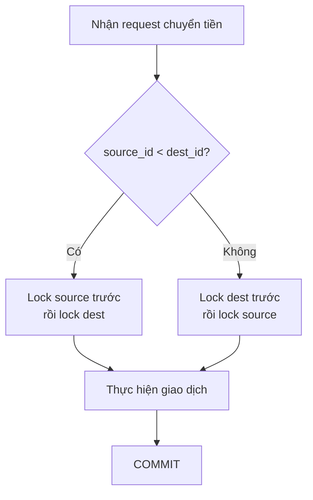
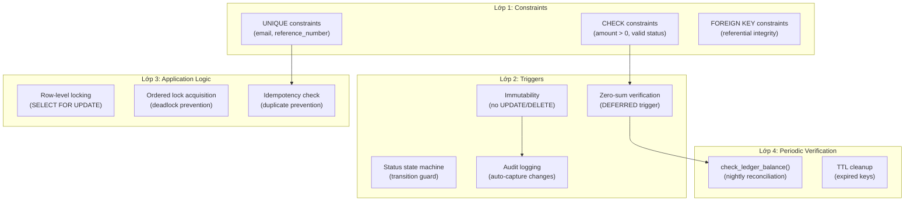

# Đảm bảo Toàn vẹn Dữ liệu — VietPay Wallet Platform

> **Tài liệu kỹ thuật** cho đội ngũ DBA và Backend Engineer  
> **Phiên bản:** 1.0 — 2026-06-23  
> **Database:** PostgreSQL 15+

---

## Mục lục

1. [Cơ chế Double-Entry Ledger](#1-cơ-chế-double-entry-ledger)
2. [Idempotency — Ngăn chặn giao dịch trùng lặp](#2-idempotency--ngăn-chặn-giao-dịch-trùng-lặp)
3. [Chiến lược Indexing](#3-chiến-lược-indexing)
4. [Kiểm soát Concurrency](#4-kiểm-soát-concurrency)
5. [Audit Trail & Compliance](#5-audit-trail--compliance)

---

## 1. Cơ chế Double-Entry Ledger

### 1.1 Nguyên tắc cơ bản

Mọi biến động tài chính trong hệ thống VietPay đều tuân theo nguyên tắc **kế toán kép (double-entry bookkeeping)**:

> **Mỗi giao dịch (transaction) tạo ra ít nhất 2 bút toán (ledger entries) — một DEBIT và một CREDIT — sao cho tổng đại số luôn bằng 0.**

```
Ví dụ: Chuyển 500.000 VND từ Wallet A → Wallet B

┌───────────────┬───────────┬────────────────┐
│ wallet_id     │ entry_type│ amount         │
├───────────────┼───────────┼────────────────┤
│ Wallet A      │ DEBIT     │ 500,000.0000   │
│ Wallet B      │ CREDIT    │ 500,000.0000   │
└───────────────┴───────────┴────────────────┘

Kiểm tra: DEBIT(+500,000) + CREDIT(-500,000) = 0  ✅
```

### 1.2 Enforcement tại tầng Database

Hệ thống sử dụng **3 lớp bảo vệ** để đảm bảo ledger luôn cân bằng:

#### Lớp 1: CHECK Constraint trên `ledger_entries`

```sql
CONSTRAINT ck_ledger_amount_positive CHECK (amount > 0)
CONSTRAINT ck_ledger_entry_type CHECK (entry_type IN ('DEBIT', 'CREDIT'))
```

- `amount` luôn dương — hướng ghi nợ/có được xác định bởi `entry_type`.
- Ngăn chặn nhập liệu sai ngay tại constraint level (không cần application logic).

#### Lớp 2: CONSTRAINT TRIGGER — Zero-sum verification

```sql
CREATE CONSTRAINT TRIGGER trg_ledger_zero_sum
    AFTER INSERT ON ledger_entries
    DEFERRABLE INITIALLY DEFERRED
    FOR EACH ROW
    EXECUTE FUNCTION fn_check_ledger_zero_sum();
```

**Cơ chế hoạt động:**

1. Trigger được đánh dấu `DEFERRABLE INITIALLY DEFERRED` — nghĩa là nó **không kiểm tra ngay khi INSERT**, mà đợi đến khi **COMMIT**.
2. Tại thời điểm COMMIT, function `fn_check_ledger_zero_sum()` tính tổng:
   ```
   SUM(CASE WHEN entry_type = 'DEBIT' THEN amount ELSE -amount END)
   ```
3. Nếu tổng ≠ 0 → **RAISE EXCEPTION** → Transaction bị ROLLBACK → Dữ liệu không bị thay đổi.

**Tại sao DEFERRABLE?**
- Vì ta INSERT 2 bút toán trong cùng một SQL transaction. Nếu trigger kiểm tra ngay sau entry đầu tiên, nó sẽ thấy tổng ≠ 0 và reject.
- `DEFERRED` cho phép INSERT tất cả entries trước, rồi verify toàn bộ khi COMMIT.

#### Lớp 3: Reconciliation Function — `check_ledger_balance()`

```sql
SELECT * FROM check_ledger_balance();
```

- So sánh `wallets.balance` với tổng ledger entries cho từng wallet.
- Trả về danh sách wallet có **discrepancy** (chênh lệch).
- **Kết quả rỗng = hệ thống hoàn toàn nhất quán.**
- Nên chạy định kỳ qua `pg_cron` (đề xuất: mỗi đêm lúc 2:00 AM).

### 1.3 Immutability — Bất biến

```sql
CREATE TRIGGER trg_ledger_no_update
    BEFORE UPDATE OR DELETE ON ledger_entries
    FOR EACH ROW
    EXECUTE FUNCTION fn_ledger_immutable();
```

- Bút toán **không bao giờ** bị sửa hoặc xóa.
- Nếu có sai sót → tạo **bút toán đảo ngược** (reversal entry), không sửa bút toán gốc.
- Đây là yêu cầu bắt buộc của **PCI-DSS** và **quy định Ngân hàng Nhà nước Việt Nam**.

---

## 2. Idempotency — Ngăn chặn Giao dịch Trùng lặp

### 2.1 Vấn đề

Trong môi trường distributed, client có thể gửi cùng một request nhiều lần do:
- **Network timeout** → client retry
- **User double-click** / double-tap
- **Load balancer retry**
- **Mobile app background refresh**

Nếu không có cơ chế idempotency, một giao dịch chuyển tiền có thể bị thực thi 2 lần → **mất tiền**.

### 2.2 Giải pháp: Idempotency Key

```mermaid
sequenceDiagram
    participant C as Client
    participant S as API Server
    participant DB as PostgreSQL

    C->>S: POST /transfer {key: "abc-123", ...}
    S->>DB: SELECT * FROM fn_check_idempotency('account_id', 'abc-123', 'hash')
    DB-->>S: is_duplicate = FALSE

    Note over S,DB: Lần gọi đầu tiên — xử lý bình thường

    S->>DB: INSERT INTO idempotency_keys (...)
    S->>DB: BEGIN; INSERT transactions; INSERT ledger_entries; UPDATE wallets; COMMIT;
    S->>DB: UPDATE idempotency_keys SET response_status=200, response_body=...
    S-->>C: 200 OK {transaction_id: "..."}

    Note over C,S: Client gặp timeout, retry...

    C->>S: POST /transfer {key: "abc-123", ...}
    S->>DB: SELECT * FROM fn_check_idempotency('account_id', 'abc-123', 'hash')
    DB-->>S: is_duplicate = TRUE, is_conflict = FALSE

    Note over S: Trả về cached response, KHÔNG thực thi lại

    S-->>C: 200 OK {transaction_id: "..."} (same response)
```

### 2.3 Các lớp bảo vệ

| Lớp | Cơ chế | Mục đích |
|-----|--------|----------|
| **UNIQUE constraint** | `(account_id, idempotency_key)` | Ngăn 2 request cùng key tạo 2 record |
| **Request hash** | SHA-256 của request body | Phát hiện key reuse với payload khác (→ HTTP 422) |
| **TTL expiration** | `expires_at DEFAULT now() + 48h` | Tự dọn dẹp key cũ, giới hạn kích thước bảng |
| **In-flight lock** | `locked_at` column | Ngăn race condition khi 2 request cùng key đến đồng thời |

### 2.4 TTL Cleanup

```sql
-- Chạy hàng đêm lúc 3:00 AM
SELECT cron.schedule('cleanup-idempotency', '0 3 * * *',
    $$SELECT fn_cleanup_expired_idempotency_keys(5000)$$);
```

- Xóa theo batch (mặc định 5000 row/lần) để tránh lock escalation.
- Sử dụng `FOR UPDATE SKIP LOCKED` để không block concurrent operations.
- `pg_sleep(0.1)` giữa các batch để yield cho transaction khác.

---

## 3. Chiến lược Indexing

### 3.1 Tổng quan Index

Mỗi index được thiết kế dựa trên **query pattern thực tế** từ application layer:

#### Table: `accounts`

| Index | Columns | Type | Lý do |
|-------|---------|------|-------|
| `uq_accounts_email` | `lower(email)` | UNIQUE, B-tree | Login lookup, case-insensitive uniqueness |
| `uq_accounts_phone` | `phone_number` | UNIQUE PARTIAL | Phone lookup (chỉ index non-NULL) |
| `idx_accounts_status` | `status` | PARTIAL | Dashboard filter (loại trừ CLOSED — chiếm ~30% nhưng ít query) |
| `idx_accounts_created_at` | `created_at` | B-tree | Reporting theo thời gian đăng ký |

#### Table: `wallets`

| Index | Columns | Type | Lý do |
|-------|---------|------|-------|
| `uq_wallets_account_currency` | `(account_id, currency)` | UNIQUE | Business rule: 1 wallet/currency/account |
| `idx_wallets_account_id` | `account_id` | B-tree | FK lookup acceleration (JOIN performance) |
| `idx_wallets_currency` | `currency` | B-tree | Aggregate reporting theo loại tiền |
| `idx_wallets_status_active` | `status` WHERE `ACTIVE` | PARTIAL | 95%+ queries chỉ quan tâm ví đang active |

#### Table: `transactions`

| Index | Columns | Type | Lý do |
|-------|---------|------|-------|
| `uq_txn_reference_number` | `reference_number` | UNIQUE | Customer-facing lookup |
| `idx_txn_source_wallet` | `(source_wallet_id, created_at DESC)` | PARTIAL | Lịch sử giao dịch đi |
| `idx_txn_destination_wallet` | `(destination_wallet_id, created_at DESC)` | PARTIAL | Lịch sử giao dịch đến |
| `idx_txn_status` | `(status, created_at DESC)` | COMPOSITE | Operations dashboard |
| `idx_txn_settlement_batch` | `settlement_batch_id` | PARTIAL | Batch settlement processing |
| `idx_txn_type_status` | `(type, status)` | COMPOSITE | Aggregated reporting |
| `idx_txn_metadata` | `metadata` | GIN (jsonb_path_ops) | Flexible metadata queries |

#### Table: `ledger_entries`

| Index | Columns | Type | Lý do |
|-------|---------|------|-------|
| `idx_ledger_transaction_id` | `transaction_id` | B-tree | Zero-sum verification, FK join |
| `idx_ledger_wallet_id_created` | `(wallet_id, created_at DESC)` | COMPOSITE | Wallet statement generation |
| `idx_ledger_wallet_type_amount` | `(wallet_id, entry_type)` INCLUDE `(amount, balance_after)` | COVERING | Index-only scan cho reconciliation |

### 3.2 Nguyên tắc thiết kế Index

1. **Partial Index** — Chỉ index subset cần thiết:
   - `WHERE status <> 'CLOSED'` trên accounts → giảm ~30% kích thước index
   - `WHERE source_wallet_id IS NOT NULL` → bỏ qua DEPOSIT transactions

2. **Covering Index (INCLUDE)** — Tránh heap access:
   - `idx_ledger_wallet_type_amount` INCLUDE `(amount, balance_after)`
   - PostgreSQL có thể trả lời query hoàn toàn từ index → **Index-Only Scan**

3. **Composite Index** — Column order matters:
   - `(status, created_at DESC)` — filter trước, sort sau
   - Đặt column có selectivity cao hơn trước

4. **GIN Index** — Cho JSONB queries:
   - `jsonb_path_ops` nhỏ hơn default GIN operator class ~30%
   - Hỗ trợ `@>` operator cho containment queries

---

## 4. Kiểm soát Concurrency

### 4.1 Chiến lược Row-Level Locking

Trong fintech, **race condition = mất tiền**. VietPay sử dụng các chiến lược sau:

#### 4.1.1 Pessimistic Locking cho Wallet Balance Update

```sql
-- Khi thực hiện chuyển tiền:
BEGIN;
    -- Lock cả 2 ví theo thứ tự ID để tránh deadlock
    SELECT id, balance, available_balance
      FROM wallets
     WHERE id IN ($source_wallet_id, $dest_wallet_id)
     ORDER BY id          -- ← QUAN TRỌNG: consistent ordering
     FOR UPDATE;          -- ← Row-level exclusive lock

    -- Kiểm tra số dư
    -- INSERT ledger entries
    -- UPDATE wallet balances
COMMIT;
```

**Tại sao `ORDER BY id`?**
- Nếu Transaction A lock Wallet-1 rồi Wallet-2, và Transaction B lock Wallet-2 rồi Wallet-1 → **DEADLOCK**.
- Bằng cách luôn lock theo thứ tự `id` tăng dần, ta loại bỏ hoàn toàn deadlock.

#### 4.1.2 Advisory Locks cho Business Operations

```sql
-- Lock a specific account for a critical operation
SELECT pg_advisory_xact_lock(hashtext('account:' || $account_id::text));
```

- Dùng cho các operation phức tạp cần lock logical resource (không phải row).
- `pg_advisory_xact_lock` tự release khi transaction kết thúc.

#### 4.1.3 SKIP LOCKED cho Background Processing

```sql
-- Settlement batch processor
SELECT id FROM transactions
 WHERE status = 'PROCESSING'
   AND settlement_batch_id = $batch_id
 ORDER BY created_at
 FOR UPDATE SKIP LOCKED      -- ← Bỏ qua row đang bị lock bởi worker khác
 LIMIT 100;
```

- Cho phép nhiều worker xử lý song song mà không conflict.
- Worker nhận batch khác nhau → throughput tăng tuyến tính.

### 4.2 Transaction Isolation Levels

| Operation | Isolation Level | Lý do |
|-----------|----------------|-------|
| Balance check + transfer | `SERIALIZABLE` + `SELECT FOR UPDATE` | SSI ngăn write skew; FOR UPDATE đảm bảo deterministic lock ordering |
| Ledger reconciliation | `REPEATABLE READ` | Cần snapshot nhất quán trong suốt quá trình kiểm tra |
| Report generation | `REPEATABLE READ` | Báo cáo phải nhất quán tại một thời điểm |
| Settlement batch | `READ COMMITTED` + `SKIP LOCKED` | Throughput cao, concurrent workers |

> **Lưu ý:** `FOR UPDATE` dưới `SERIALIZABLE` có thể xem là dư thừa cho việc ngăn write skew (SSI đã xử lý). Tuy nhiên, ta vẫn dùng `FOR UPDATE` để **đảm bảo ordered lock acquisition** (tránh deadlock) và làm fallback an toàn.

### 4.3 Deadlock Prevention



**Quy tắc vàng:** Luôn lock resource theo thứ tự cố định (sắp xếp theo UUID / ID).

### 4.4 Optimistic Concurrency cho Non-Critical Updates

```sql
-- Profile update — dùng version column thay vì lock
UPDATE accounts
   SET full_name = $new_name,
       updated_at = now()
 WHERE id = $account_id
   AND updated_at = $expected_updated_at;   -- ← Optimistic check

-- Nếu 0 rows affected → có người khác đã update → client retry
```

---

## 5. Audit Trail & Compliance

### 5.1 Append-Only Enforcement

```sql
CREATE TRIGGER trg_audit_log_immutable
    BEFORE UPDATE OR DELETE ON audit_log
    FOR EACH ROW
    EXECUTE FUNCTION fn_audit_log_immutable();
```

- Mọi attempt UPDATE/DELETE đều bị **REJECT với exception**.
- Đây là yêu cầu bắt buộc của:
  - **PCI-DSS Requirement 10.5**: Secure audit trails so they cannot be altered.
  - **Thông tư 09/2020/TT-NHNN**: Yêu cầu lưu trữ log không thể sửa đổi.

### 5.2 Session Context Tracking

Application layer phải set session variables trước mỗi operation:

```sql
SET LOCAL app.current_user_id  = 'uuid-of-user';
SET LOCAL app.client_ip        = '192.168.1.100';
SET LOCAL app.user_agent       = 'VietPay-iOS/3.2.1';
```

- `SET LOCAL` chỉ có hiệu lực trong transaction hiện tại → thread-safe.
- Audit trigger tự động đọc và ghi vào audit_log.

### 5.3 Retention Policy

| Loại dữ liệu | Thời gian lưu trữ | Cơ sở pháp lý |
|---------------|-------------------|----------------|
| Audit log | ≥ 5 năm | PCI-DSS 10.7, TT 09/2020 NHNN |
| Transaction data | ≥ 10 năm | Luật Kế toán 2015, Điều 41 |
| Idempotency keys | 48 giờ → auto-delete | Không yêu cầu pháp lý |
| Ledger entries | Vĩnh viễn (cùng vòng đời DB) | Sổ cái kế toán |

---

## Tóm tắt Kiến trúc Bảo vệ



> [!IMPORTANT]
> **Không có lớp bảo vệ nào đứng một mình.** Tất cả 4 lớp hoạt động cùng nhau theo nguyên tắc **defense in depth** (phòng thủ theo chiều sâu). Ngay cả khi application logic có bug, database constraints vẫn ngăn chặn dữ liệu sai.


---

!!! info "Nguồn gốc"
    `vietpay/design-notes/integrity-guarantees.md`
