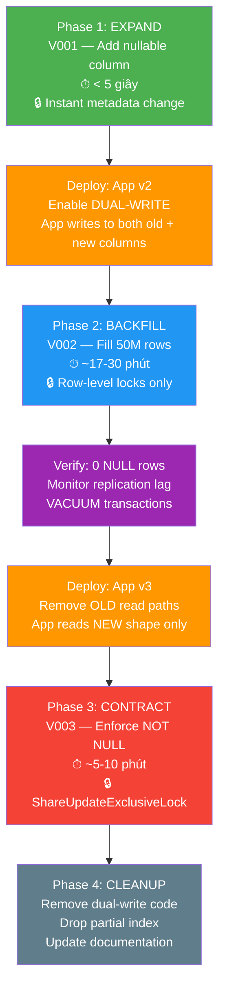
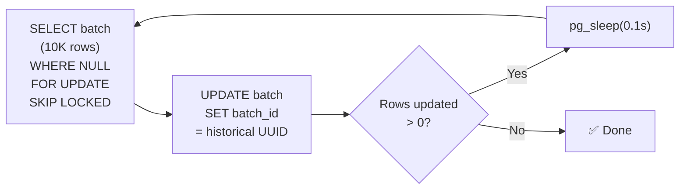
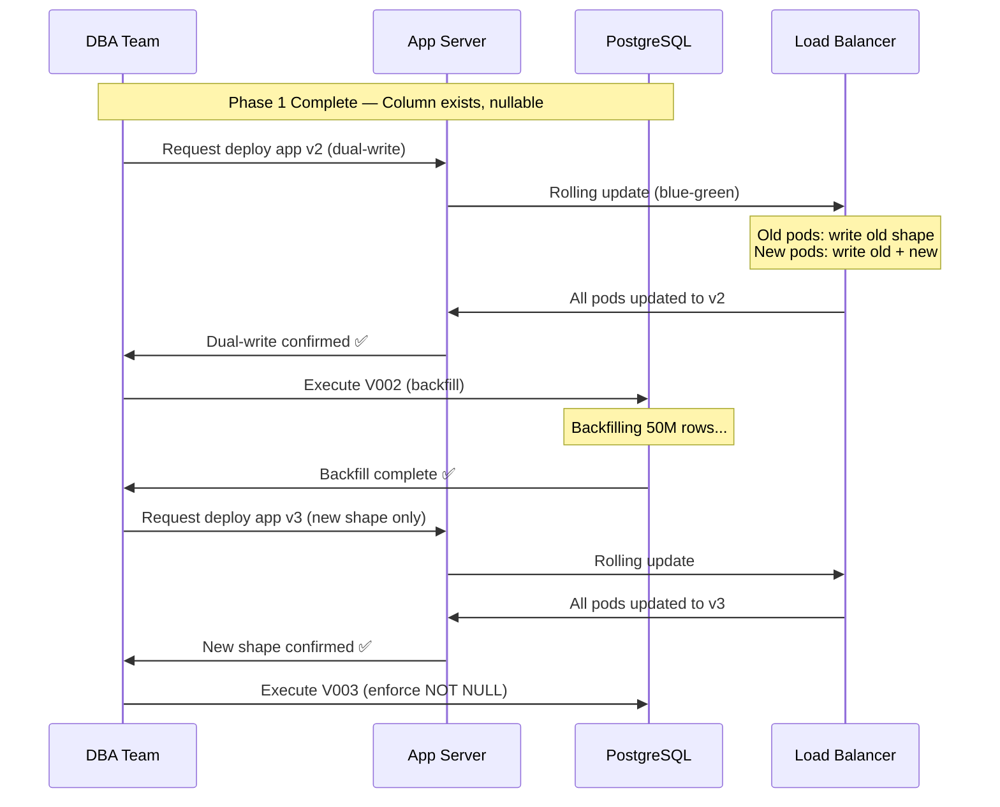
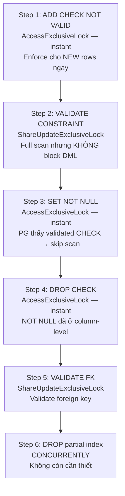
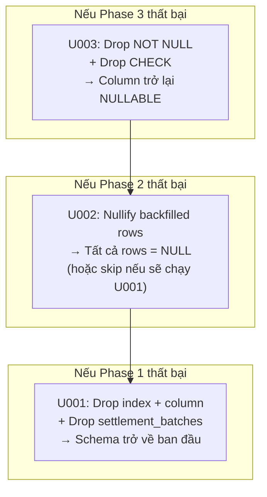
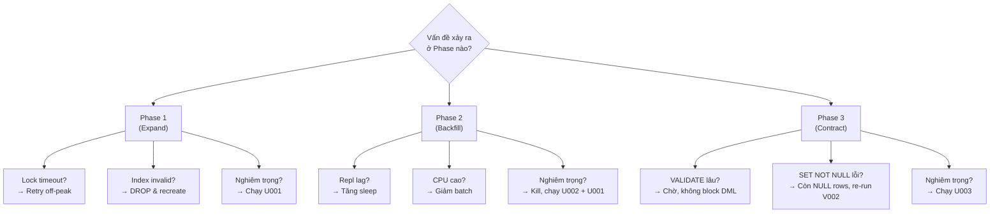

# Chiến Lược Migration: Thêm Cột `settlement_batch_id` vào Bảng `transactions`

> **Dự án:** VietPay — Hệ thống thanh toán  
> **Bảng mục tiêu:** `transactions` (50M rows, ~2M rows/tháng)  
> **Thay đổi:** Thêm cột `settlement_batch_id UUID NOT NULL`  
> **Pattern:** Expand-Contract (Zero-Downtime Migration)  
> **Database:** PostgreSQL 15+  
> **Ngày tạo:** 2026-06-23  
> **Tác giả:** DBA Team — VietPay

---

## Mục Lục

1. [Tổng Quan](#1-tổng-quan)
2. [Sơ Đồ Các Phase](#2-sơ-đồ-các-phase)
3. [Phase 1 — Expand](#3-phase-1--expand)
4. [Phase 2 — Backfill](#4-phase-2--backfill)
5. [Phase 3 — Dual-Write Window](#5-phase-3--dual-write-window)
6. [Phase 4 — Constraint Promotion](#6-phase-4--constraint-promotion)
7. [Phase 5 — Cleanup](#7-phase-5--cleanup)
8. [Kế Hoạch Rollback](#8-kế-hoạch-rollback)
9. [Monitoring Trong Quá Trình Migration](#9-monitoring-trong-quá-trình-migration)
10. [Đánh Giá Rủi Ro](#10-đánh-giá-rủi-ro)
11. [Ước Tính Timeline](#11-ước-tính-timeline)

---

## 1. Tổng Quan

### Expand-Contract Pattern là gì?

Expand-Contract (còn gọi là Parallel Change) là pattern migration cho phép thay đổi schema database **mà không cần downtime**. Ý tưởng cốt lõi:

> [!IMPORTANT]
> **Nguyên tắc vàng:** Schema mới phải tương thích ngược (backward-compatible) với code cũ tại MỌI thời điểm trong quá trình migration.

| Giai đoạn | Mô tả | Schema | App Code |
|-----------|--------|--------|----------|
| **Expand** | Thêm cột mới (nullable) | Old + New | Old |
| **Migrate** | Backfill dữ liệu cũ | Old + New | Dual-write |
| **Contract** | Enforce constraint | New | New |

### Tại sao không dùng `ALTER TABLE ADD COLUMN ... NOT NULL DEFAULT`?

Trong PostgreSQL 11+, `ADD COLUMN ... DEFAULT` là metadata-only (không rewrite table). Tuy nhiên:

- **`NOT NULL` + `DEFAULT` cho UUID:** PG cần verify rằng tất cả existing rows thỏa mãn NOT NULL. Với 50M rows, điều này yêu cầu **full table scan** dưới **AccessExclusiveLock** — block toàn bộ read/write trong vài phút.
- **Giá trị DEFAULT cho UUID:** Không có giá trị mặc định hợp lý cho `settlement_batch_id`. Mỗi transaction phải thuộc về một batch cụ thể.
- **Không thể rollback:** Nếu có lỗi, không có cách an toàn để revert.

**Expand-Contract giải quyết tất cả vấn đề trên** bằng cách chia migration thành nhiều bước nhỏ, mỗi bước đều an toàn và có thể rollback.

---

## 2. Sơ Đồ Các Phase



### Tổng quan Lock Types qua các Phase

```mermaid
gantt
    title Lock Timeline — Tác Động Lên Production
    dateFormat X
    axisFormat %s

    section Phase 1
    ADD COLUMN (AccessExclusive - instant)     :crit, 0, 1
    CREATE INDEX CONCURRENTLY (ShareUpdateExcl) :active, 1, 600

    section Phase 2
    Batch UPDATE (RowExclusive per batch)       :active, 700, 2500

    section Phase 3
    ADD CHECK NOT VALID (AccessExclusive - instant) :crit, 2600, 2601
    VALIDATE CHECK (ShareUpdateExclusive)           :active, 2601, 2900
    SET NOT NULL (AccessExclusive - instant)         :crit, 2900, 2901
```



---

## 3. Phase 1 — Expand

### File: `migrations/V001__add_settlement_batch_id_expand.sql`

### Các bước thực hiện

| Bước | SQL | Lock | Thời gian | Block DML? |
|------|-----|------|-----------|------------|
| 1 | `CREATE TABLE IF NOT EXISTS settlement_batches` | AccessExclusiveLock trên pg_class | Instant | ❌ (bảng mới) |
| 2 | `ALTER TABLE transactions ADD COLUMN settlement_batch_id UUID` | AccessExclusiveLock | Instant (metadata-only) | ⚡ microseconds |
| 3 | `ADD CONSTRAINT ... FOREIGN KEY ... NOT VALID` | AccessExclusiveLock | Instant | ⚡ microseconds |
| 4 | `CREATE INDEX CONCURRENTLY idx_transactions_settlement_batch_id` | ShareUpdateExclusiveLock | 5-15 phút | ❌ |
| 5 | `CREATE INDEX CONCURRENTLY idx_transactions_settlement_batch_id_null` | ShareUpdateExclusiveLock | 2-5 phút | ❌ |

### Tại sao `ADD COLUMN` là instant?

```
PostgreSQL 11+ optimization:
┌──────────────────────────────────────────────────────────┐
│  Khi thêm cột NULLABLE không có DEFAULT:                 │
│  - PG chỉ cập nhật system catalog (pg_attribute)         │
│  - KHÔNG rewrite table                                   │
│  - KHÔNG scan rows                                       │
│  - Existing rows "thấy" NULL qua metadata                │
│  - Thời gian: O(1), không phụ thuộc vào số rows          │
└──────────────────────────────────────────────────────────┘
```

### Tại sao dùng `FOREIGN KEY NOT VALID`?

- **NOT VALID** có nghĩa PG sẽ enforce FK cho **NEW** inserts/updates ngay lập tức
- Nhưng PG **KHÔNG** scan existing rows để validate (vì tất cả đều NULL → tự động hợp lệ)
- Chúng ta sẽ VALIDATE FK sau khi backfill xong (trong V003)

### App behavior trong Phase 1

> [!NOTE]
> **Không cần deploy app mới cho Phase 1.** App hiện tại tiếp tục hoạt động bình thường. Cột mới bị bỏ qua bởi tất cả các query.

```
App Code (v1 — OLD shape):
  SELECT id, reference_number, amount, ... FROM transactions;  -- ✅ Works, ignores new column
  INSERT INTO transactions (id, amount, ...) VALUES (...);      -- ✅ Works, settlement_batch_id = NULL
```

### Các vấn đề cần lưu ý

> [!WARNING]
> **CREATE INDEX CONCURRENTLY có thể thất bại.** Nếu thất bại giữa chừng, sẽ để lại một **invalid index**. Kiểm tra:
> ```sql
> SELECT indexrelid::regclass, indisvalid FROM pg_index WHERE NOT indisvalid;
> ```
> Nếu tìm thấy invalid index, drop và re-create.

---

## 4. Phase 2 — Backfill

### File: `migrations/V002__backfill_settlement_batch_id.sql`

### Chiến lược Batch Processing



### Thông số cấu hình

| Tham số | Giá trị | Giải thích |
|---------|---------|------------|
| `v_batch_size` | 10,000 | Số rows mỗi batch. Giảm nếu replication lag tăng. |
| `v_sleep_seconds` | 0.1 | Giây nghỉ giữa các batch. Tăng nếu CPU > 80%. |
| `v_advisory_lock_id` | 2024062301 | ID duy nhất, ngăn chạy backfill song song. |
| Historical batch UUID | `00000000-...001` | UUID cố định cho tất cả rows lịch sử. |

### Tại sao dùng `FOR UPDATE SKIP LOCKED`?

```
Scenario: App đang INSERT/UPDATE transaction X
          Backfill đang cố UPDATE transaction X

  ❌ Không có SKIP LOCKED:
     Backfill CHỜN → Deadlock potential → Timeout → Batch fail

  ✅ Với SKIP LOCKED:
     Backfill BỎ QUA transaction X → Xử lý ở batch sau → Không deadlock
```

### Ước tính Performance Impact

| Metric | Giá trị ước tính | Ghi chú |
|--------|-------------------|---------|
| **Tổng batch** | ~5,000 | 50M / 10K |
| **Thời gian/batch** | ~50-200ms | Tùy thuộc I/O |
| **Sleep/batch** | 100ms | Configurable |
| **Tổng thời gian** | ~17-30 phút | Với sleep |
| **WAL generated** | ~2-4 GB | Chỉ 1 UUID column/row |
| **CPU impact** | < 10% | Với sleep giữa batches |
| **Replication lag** | < 1s | Monitor liên tục |

### Concurrent Insert Handling

> [!IMPORTANT]
> **Trước khi chạy V002, PHẢI deploy app v2 (dual-write).** App v2:
> - `INSERT` mới PHẢI bao gồm `settlement_batch_id`
> - `SELECT` PHẢI handle cả NULL (old rows) và non-NULL (new rows)
> - Nếu không deploy app v2 trước, rows mới sẽ có `settlement_batch_id = NULL`

```
Timeline:
  T0: V001 chạy xong (column exists, nullable)
  T1: Deploy app v2 (dual-write) ← BẮT BUỘC trước V002
  T2: Chạy V002 (backfill existing rows)
  T3: V002 hoàn thành (0 NULL rows)
```

---

## 5. Phase 3 — Dual-Write Window

### Dual-Write là gì?

Trong giai đoạn này, app phải **đọc và ghi cả hai schema shape** đồng thời:

```
App v2 (Dual-Write):

  INSERT INTO transactions (
    id, reference_number, amount, ...,
    settlement_batch_id  ← NEW: Luôn cung cấp giá trị
  ) VALUES (...);

  SELECT id, reference_number, amount, ...,
    COALESCE(settlement_batch_id, NULL) as settlement_batch_id  ← Handle NULL
  FROM transactions;
```

### Chiến lược Deploy App v2



### Lưu ý quan trọng về Blue-Green Deploy

> [!CAUTION]
> Trong quá trình rolling update từ app v1 → v2:
> - Một số pod chạy v1 (không ghi `settlement_batch_id`)
> - Một số pod chạy v2 (ghi `settlement_batch_id`)
> - Điều này **HOÀN TOÀN AN TOÀN** vì cột vẫn NULLABLE
> - Rows từ pod v1 sẽ có `settlement_batch_id = NULL` → backfill xử lý sau

### Kiểm tra trước khi rời Dual-Write Window

```sql
-- Chạy query này SAU khi V002 xong và TRƯỚC khi deploy app v3:
SELECT count(*) AS null_rows
FROM transactions
WHERE settlement_batch_id IS NULL;
-- Kết quả PHẢI = 0

-- Kiểm tra rows gần đây (concurrent inserts):
SELECT count(*) AS recent_null_rows
FROM transactions
WHERE settlement_batch_id IS NULL
  AND created_at > now() - interval '1 hour';
-- Kết quả NÊN = 0 (nếu > 0, có pod v1 còn sót)
```

---

## 6. Phase 4 — Constraint Promotion

### File: `migrations/V003__promote_not_null_constraint.sql`

### Kỹ thuật: NOT VALID + VALIDATE (PG 12+)

Đây là kỹ thuật cốt lõi cho zero-downtime NOT NULL enforcement:



### Phân tích Lock chi tiết

| Step | Lệnh SQL | Lock Type | Block DML? | Thời gian |
|------|----------|-----------|------------|-----------|
| 1 | `ADD CONSTRAINT CHECK ... NOT VALID` | AccessExclusiveLock | ⚡ microseconds | Instant |
| 2 | `VALIDATE CONSTRAINT` | **ShareUpdateExclusiveLock** | ❌ **Không** | 2-5 phút |
| 3 | `ALTER COLUMN SET NOT NULL` | AccessExclusiveLock | ⚡ microseconds | Instant (PG 12+) |
| 4 | `DROP CONSTRAINT (CHECK)` | AccessExclusiveLock | ⚡ microseconds | Instant |
| 5 | `VALIDATE CONSTRAINT (FK)` | **ShareUpdateExclusiveLock** | ❌ **Không** | 2-5 phút |
| 6 | `DROP INDEX CONCURRENTLY` | ShareUpdateExclusiveLock | ❌ **Không** | Vài giây |

### Tại sao `SET NOT NULL` là instant với PG 12+?

```
PostgreSQL 12+ optimization:
┌─────────────────────────────────────────────────────────────┐
│  Khi chạy ALTER TABLE ... SET NOT NULL, PG kiểm tra:        │
│                                                              │
│  1. Có CHECK (col IS NOT NULL) đã VALIDATED không?           │
│     → CÓ: Skip full table scan, chỉ cập nhật metadata       │
│     → KHÔNG: Full table scan dưới AccessExclusiveLock 😱     │
│                                                              │
│  Vì vậy, workflow của chúng ta:                              │
│    ADD CHECK NOT VALID → VALIDATE → SET NOT NULL (instant)   │
│                                                              │
│  Reference: pg_constraint.convalidated = true                │
└─────────────────────────────────────────────────────────────┘
```

### ShareUpdateExclusiveLock vs AccessExclusiveLock

| | ShareUpdateExclusiveLock | AccessExclusiveLock |
|---|---|---|
| **SELECT** | ✅ Cho phép | ❌ Block |
| **INSERT** | ✅ Cho phép | ❌ Block |
| **UPDATE** | ✅ Cho phép | ❌ Block |
| **DELETE** | ✅ Cho phép | ❌ Block |
| **VACUUM** | ❌ Block | ❌ Block |
| **Dùng ở đâu** | VALIDATE, CONCURRENTLY | ADD COLUMN, SET NOT NULL |
| **Tác động Production** | Không đáng kể | Phải instant, nếu không → downtime |

---

## 7. Phase 5 — Cleanup

### Sau khi V003 thành công

Các việc cần làm sau khi migration hoàn tất:

- [ ] **App code cleanup:** Xóa tất cả dual-write logic, COALESCE fallbacks
- [ ] **Remove feature flags:** Tắt và xóa các feature flags liên quan
- [ ] **VACUUM:** Chạy `VACUUM (VERBOSE) transactions` để thu hồi dead tuples từ backfill
- [ ] **ANALYZE:** Chạy `ANALYZE transactions` để cập nhật statistics cho query planner
- [ ] **Documentation:** Cập nhật ERD, data dictionary, API docs
- [ ] **Monitoring:** Xóa các alert tạm thời, thêm alert cho NOT NULL violations
- [ ] **Flyway:** Đánh dấu migration đã hoàn tất trong schema_history

```sql
-- Post-migration maintenance
VACUUM (VERBOSE) transactions;
ANALYZE transactions;

-- Verify final schema
\d transactions
-- settlement_batch_id | uuid | not null
```

---

## 8. Kế Hoạch Rollback

### Nguyên tắc Rollback

> [!CAUTION]
> **Rollback PHẢI được thực hiện theo thứ tự ngược lại:**  
> U003 → U002 → U001  
> Nếu chỉ cần rollback Phase 3, chỉ chạy U003.

### Rollback cho từng Phase



| Phase | Rollback File | Khi nào dùng | Thời gian | Cần deploy app? |
|-------|---------------|--------------|-----------|-----------------|
| Phase 3 | `U003__rollback_constraint.sql` | NOT NULL gây lỗi cho app | Instant | ✅ Rollback app → v2 (dual-write) |
| Phase 2 | `U002__rollback_backfill.sql` | Cần undo backfill data | ~17-30 phút | Không bắt buộc |
| Phase 1 | `U001__rollback_expand.sql` | Abort toàn bộ migration | < 1 phút | ✅ Rollback app → v1 (old shape) |

### Chi tiết từng Rollback

#### U003 — Rollback Constraint

```sql
-- Chạy khi: V003 thất bại hoặc cần revert NOT NULL
-- Pre-condition: App đã rollback về v2 (handles NULL)
ALTER TABLE transactions ALTER COLUMN settlement_batch_id DROP NOT NULL;
ALTER TABLE transactions DROP CONSTRAINT IF EXISTS chk_transactions_settlement_batch_id_not_null;
-- Kết quả: Column là NULLABLE, app v2 (dual-write) hoạt động bình thường
```

#### U002 — Rollback Backfill

```sql
-- Chạy khi: Cần nullify dữ liệu backfill
-- Batch-update SET NULL cho historical rows
-- CHỈ nullify rows với batch_id = '00000000-...001' (historical)
-- KHÔNG ảnh hưởng rows do app v2 tạo
```

#### U001 — Rollback Expand

```sql
-- Chạy khi: Abort toàn bộ migration
-- Pre-condition: App đã rollback về v1
DROP INDEX CONCURRENTLY IF EXISTS idx_transactions_settlement_batch_id_null;
DROP INDEX CONCURRENTLY IF EXISTS idx_transactions_settlement_batch_id;
ALTER TABLE transactions DROP COLUMN IF EXISTS settlement_batch_id;
DROP TABLE IF EXISTS settlement_batches;
-- Kết quả: Schema giống 100% trước migration
```

---

## 9. Monitoring Trong Quá Trình Migration

### Dashboard Metrics

Tạo dashboard Grafana/DataDog với các panels sau:

#### 9.1 Database Metrics

```sql
-- 1. Replication Lag (CRITICAL — monitor liên tục)
SELECT client_addr, 
       state,
       pg_wal_lsn_diff(sent_lsn, replay_lsn) AS replication_lag_bytes,
       pg_wal_lsn_diff(sent_lsn, replay_lsn) / 1024 / 1024 AS replication_lag_mb
FROM pg_stat_replication;
-- ⚠️ Alert nếu > 100MB hoặc > 5 giây

-- 2. Lock Waits (giám sát lock contention)
SELECT pid, usename, state, wait_event_type, wait_event,
       pg_blocking_pids(pid) AS blocked_by,
       query, query_start,
       now() - query_start AS duration
FROM pg_stat_activity
WHERE wait_event_type = 'Lock'
ORDER BY duration DESC;

-- 3. Active Connections
SELECT state, count(*) 
FROM pg_stat_activity 
WHERE datname = current_database()
GROUP BY state;

-- 4. Table Bloat (sau backfill)
SELECT schemaname, relname, 
       n_live_tup, n_dead_tup,
       ROUND(100.0 * n_dead_tup / NULLIF(n_live_tup + n_dead_tup, 0), 2) AS dead_pct,
       last_autovacuum, last_autoanalyze
FROM pg_stat_user_tables 
WHERE relname = 'transactions';

-- 5. WAL Generation Rate
SELECT pg_wal_lsn_diff(pg_current_wal_lsn(), '0/0') / 1024 / 1024 AS total_wal_mb;
-- Sample mỗi 30 giây, tính rate
```

#### 9.2 Application Metrics

| Metric | Alert Threshold | Hành động |
|--------|----------------|-----------|
| API Response Time (p99) | > 2x baseline | Tăng `v_sleep_seconds`, giảm `v_batch_size` |
| Error Rate (5xx) | > 0.1% | Pause migration, check locks |
| Transaction Throughput | < 80% baseline | Pause migration |
| Connection Pool Usage | > 85% | Reduce batch size |

#### 9.3 Backfill Progress Monitoring

```sql
-- Track backfill progress in real-time
SELECT 
    (SELECT count(*) FROM transactions WHERE settlement_batch_id IS NOT NULL) AS filled,
    (SELECT count(*) FROM transactions WHERE settlement_batch_id IS NULL) AS remaining,
    ROUND(
        100.0 * (SELECT count(*) FROM transactions WHERE settlement_batch_id IS NOT NULL) 
        / (SELECT count(*) FROM transactions), 
        2
    ) AS pct_complete;
```

---

## 10. Đánh Giá Rủi Ro

### Risk Matrix

| # | Rủi ro | Xác suất | Tác động | Mitigation |
|---|--------|----------|----------|------------|
| 1 | **Replication lag spike** trong backfill | Trung bình | Cao | Giảm batch_size, tăng sleep. Monitor pg_stat_replication. |
| 2 | **Lock timeout** khi ADD COLUMN | Thấp | Trung bình | `SET lock_timeout = '5s'`. Retry ở off-peak. |
| 3 | **Invalid index** sau CREATE INDEX CONCURRENTLY thất bại | Thấp | Thấp | Kiểm tra `pg_index.indisvalid`. Drop & recreate. |
| 4 | **App v1 pods** vẫn running khi V002 chạy | Trung bình | Thấp | Idempotent backfill sẽ pick up NULL rows ở batch sau. |
| 5 | **Disk space** không đủ cho WAL | Thấp | Cao | Pre-check: cần ~4-8GB WAL headroom. Monitor `pg_wal_lsn_diff`. |
| 6 | **Autovacuum blocked** bởi long-running backfill transaction | Trung bình | Trung bình | Dùng shell-script approach (mỗi batch = 1 transaction) cho large tables. |
| 7 | **FK violation** khi VALIDATE FK | Rất thấp | Trung bình | NOT VALID đã enforce cho new writes. Pre-check trước VALIDATE. |
| 8 | **App deployment failure** (v2 rollback) | Thấp | Cao | Column là NULLABLE → app v1 hoạt động bình thường nếu rollback. |
| 9 | **Network partition** giữa app và DB | Rất thấp | Cao | PG transaction sẽ rollback. Backfill idempotent → re-run an toàn. |
| 10 | **Table bloat** sau backfill 50M rows | Cao | Trung bình | Chạy `VACUUM (VERBOSE) transactions` sau backfill. |

### Contingency Plan



---

## 11. Ước Tính Timeline

### Timeline cho 50M rows

| Giai đoạn | Thời gian thực thi | Thời gian chuẩn bị | Ghi chú |
|-----------|-------------------|--------------------|---------| 
| **Phase 1: Expand** | < 15 phút | 1 ngày | Review, test on staging |
| **App v2 Deploy** | 30-60 phút | 2-3 ngày | Develop, test dual-write code |
| **Phase 2: Backfill** | 17-30 phút | 1 ngày | Test batch size on staging |
| **Verify + VACUUM** | 15-30 phút | — | Automated checks |
| **App v3 Deploy** | 30-60 phút | 1-2 ngày | Remove old code paths |
| **Phase 3: Contract** | 5-10 phút | 1 ngày | Review, test on staging |
| **Cleanup** | 30 phút | 1 ngày | Documentation, monitoring |
| **Tổng** | **~2-3 giờ thực thi** | **~7-10 ngày chuẩn bị** | — |

### Recommended Schedule

```
Tuần 1 (Thứ 2-4):
  ├─ Develop app v2 (dual-write)
  ├─ Test trên staging environment
  └─ Review migration scripts

Tuần 1 (Thứ 5):
  ├─ 09:00 — Execute V001 (Phase 1: Expand)
  ├─ 09:15 — Verify indexes, column, FK
  └─ 14:00 — Deploy app v2 (dual-write)

Tuần 1 (Thứ 6):
  ├─ 09:00 — Execute V002 (Phase 2: Backfill)
  ├─ 09:30 — Verify 0 NULL rows
  ├─ 09:45 — VACUUM transactions
  └─ 10:00 — Monitor 24h

Tuần 2 (Thứ 2):
  ├─ 09:00 — Final NULL check
  ├─ 09:05 — Deploy app v3 (new shape only)
  ├─ 10:00 — Execute V003 (Phase 3: Contract)
  ├─ 10:10 — Verify NOT NULL enforced
  └─ 14:00 — Cleanup, documentation
```

> [!TIP]
> **Best practice:** Chạy các migration vào **giờ thấp tải** (09:00-11:00 sáng, không phải cuối tháng khi xử lý lương). Tránh thứ 6 chiều cho Phase 3 (contract) — nếu có vấn đề, sẽ khó xử lý cuối tuần.

### Điều kiện tiên quyết (Pre-flight Checklist)

- [ ] Staging test thành công (cả 3 phases + rollback)
- [ ] Backup database mới nhất (< 1h)
- [ ] Replication lag < 10MB trước khi bắt đầu
- [ ] Disk space > 20GB free (cho WAL)
- [ ] On-call DBA available
- [ ] App team on standby cho deploy
- [ ] Monitoring dashboard ready
- [ ] Rollback scripts tested on staging
- [ ] Communication sent to stakeholders

---

## Phụ Lục

### A. Cấu trúc file

```
migrations/
├── V001__add_settlement_batch_id_expand.sql      # Phase 1: Expand
├── V002__backfill_settlement_batch_id.sql         # Phase 2: Backfill
├── V003__promote_not_null_constraint.sql          # Phase 3: Contract
└── rollback/
    ├── U001__rollback_expand.sql                  # Undo Phase 1
    ├── U002__rollback_backfill.sql                # Undo Phase 2
    └── U003__rollback_constraint.sql              # Undo Phase 3
```

### B. Schema trước và sau Migration

```diff
 CREATE TABLE transactions (
     id                    UUID PRIMARY KEY,
     reference_number      VARCHAR NOT NULL,
     idempotency_key_id    UUID,
     source_wallet_id      UUID,
     destination_wallet_id UUID,
     type                  VARCHAR,
     amount                NUMERIC(19,4),
     currency              VARCHAR(3),
     fee_amount            NUMERIC(19,4),
     status                VARCHAR,
     description           TEXT,
     metadata              JSONB,
     created_at            TIMESTAMPTZ,
     updated_at            TIMESTAMPTZ,
-    settled_at            TIMESTAMPTZ
+    settled_at            TIMESTAMPTZ,
+    settlement_batch_id   UUID NOT NULL
+        REFERENCES settlement_batches(id)
 );
+
+CREATE TABLE settlement_batches (
+    id              UUID PRIMARY KEY DEFAULT gen_random_uuid(),
+    batch_reference VARCHAR(64) NOT NULL UNIQUE,
+    status          VARCHAR(32) NOT NULL DEFAULT 'PENDING',
+    currency        VARCHAR(3) NOT NULL,
+    total_amount    NUMERIC(19,4) NOT NULL DEFAULT 0,
+    total_count     INTEGER NOT NULL DEFAULT 0,
+    settled_at      TIMESTAMPTZ,
+    created_at      TIMESTAMPTZ NOT NULL DEFAULT now(),
+    updated_at      TIMESTAMPTZ NOT NULL DEFAULT now()
+);
```

### C. Tham khảo

- [PostgreSQL ALTER TABLE Documentation](https://www.postgresql.org/docs/current/sql-altertable.html)
- [PG 11: ADD COLUMN instant for nullable columns](https://www.postgresql.org/docs/11/release-11.html)
- [PG 12: SET NOT NULL skips scan with validated CHECK](https://www.postgresql.org/docs/12/release-12.html)
- [Flyway Migration Naming Convention](https://flywaydb.org/documentation/concepts/migrations#naming)
- [Expand-Contract Pattern — Martin Fowler](https://martinfowler.com/bliki/ParallelChange.html)


---

!!! info "Nguồn gốc"
    `vietpay/design-notes/migration-strategy.md`
