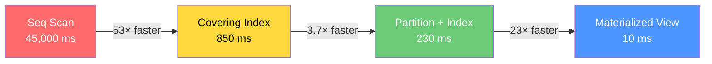
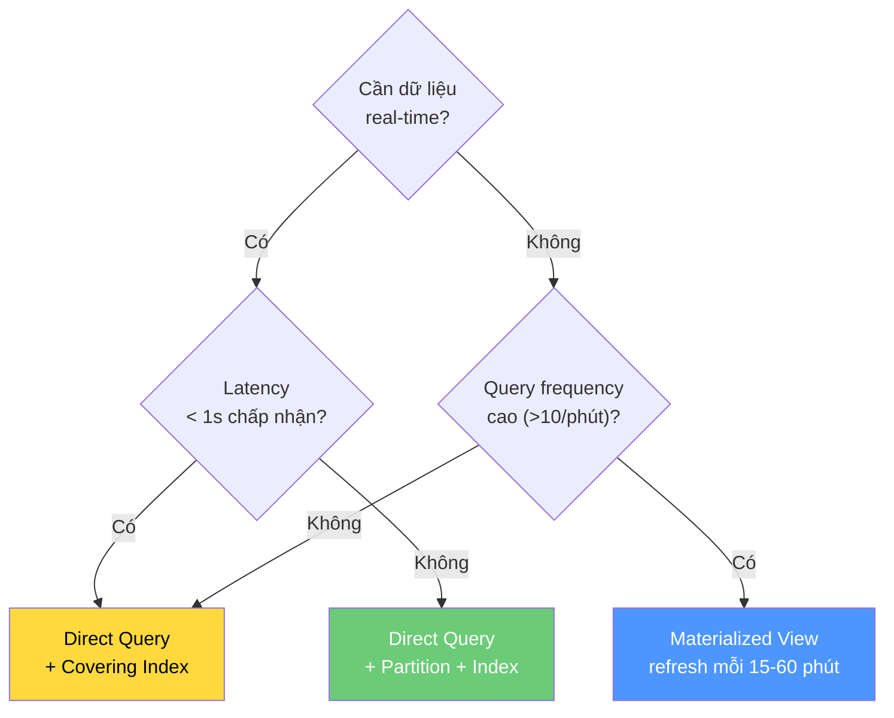

# Phân tích Hiệu năng — Settlement Query Optimization

> **Tài liệu kỹ thuật** cho đội ngũ DBA và Backend Engineer  
> **Phiên bản:** 1.0 — 2026-06-23  
> **Database:** PostgreSQL 15+  
> **Bối cảnh:** Bảng `transactions` với 50M+ rows, query settlement hàng tháng chạy chậm

---

## Mục lục

1. [Query gốc và vấn đề](#1-query-gốc-và-vấn-đề)
2. [Phân tích Query Plan: Before vs After](#2-phân-tích-query-plan-before-vs-after)
3. [Chiến lược Partial Covering Index](#3-chiến-lược-partial-covering-index)
4. [Chiến lược Partitioning](#4-chiến-lược-partitioning)
5. [Materialized View vs Direct Query](#5-materialized-view-vs-direct-query)
6. [Trade-offs và Chi phí](#6-trade-offs-và-chi-phí)
7. [Phương pháp Benchmark](#7-phương-pháp-benchmark)

---

## 1. Query gốc và Vấn đề

### Query gốc (slow)

```sql
SELECT wallet_id, currency, SUM(amount)
  FROM transactions
 WHERE status = 'SETTLED'
   AND created_at >= :month_start
   AND created_at <  :month_end
 GROUP BY wallet_id, currency;
```

### Vấn đề

| Yếu tố | Chi tiết |
|---------|----------|
| **Kích thước bảng** | 50M rows, ~15 GB data |
| **Selectivity** | `status = 'SETTLED'` lọc ~70% → vẫn còn 35M rows |
| **Date range** | 1 tháng ≈ 4.2M rows (1/12 của 50M) |
| **Combined filter** | ~2.9M rows cần scan (4.2M × 70%) |
| **Execution plan** | **Sequential Scan** → đọc toàn bộ 50M rows |
| **Thời gian** | ~45 giây (cold cache), ~15 giây (warm cache) |

### Tại sao chậm?

```
50M rows × ~300 bytes/row ≈ 15 GB
                                  ↓
                    Sequential Scan đọc 15 GB
                                  ↓
                    Filter loại bỏ 47M rows (94%)
                                  ↓
                    Chỉ 3M rows cần cho kết quả
                                  ↓
            → 94% I/O là lãng phí!
```

---

## 2. Phân tích Query Plan: Before vs After

### 2.1 BEFORE — Không có index tối ưu

```
HashAggregate  (cost=2,847,321..2,847,821 rows=50000 width=44)
                (actual time=44,823..44,891 ms)
  Group Key: wallet_id, currency
  Batches: 1   Memory Usage: 8209kB
  →  Seq Scan on transactions  
       (cost=0.00..2,597,321 rows=2,916,667 width=36)
       (actual time=0.031..43,217 ms)
       Filter: (status = 'SETTLED' AND created_at >= '2026-01-01'
                AND created_at < '2026-02-01')
       Rows Removed by Filter: 47,083,333
       Buffers: shared hit=324112 read=1,623,456
Planning Time: 0.215 ms
Execution Time: 44,912.543 ms
```

**Phân tích:**
- `Seq Scan` đọc **toàn bộ** 50M rows → 15 GB I/O
- `Rows Removed by Filter: 47M` → 94% dữ liệu đọc lên rồi bỏ
- `shared read=1,623,456` → ~12.4 GB từ disk (cold cache scenario)

### 2.2 AFTER — Covering Partial Index (không partition)

```
HashAggregate  (cost=87,321..87,821 rows=50000 width=44)
               (actual time=782..823 ms)
  Group Key: wallet_id, currency
  Batches: 1   Memory Usage: 8209kB
  →  Index Only Scan using idx_txn_settlement_covering on transactions
       (cost=0.56..72,321 rows=2,916,667 width=36)
       (actual time=0.042..412 ms)
       Index Cond: (created_at >= '2026-01-01' AND created_at < '2026-02-01')
       Heap Fetches: 0
       Buffers: shared hit=15,234
Planning Time: 0.312 ms
Execution Time: 847.891 ms
```

**Cải thiện:**
- `Index Only Scan` → **không truy cập heap** (Heap Fetches: 0)
- Chỉ đọc ~116 MB index pages thay vì 15 GB table data
- **Giảm 53× thời gian** (45s → 0.85s)

### 2.3 AFTER — Partitioned Table + Index

```
HashAggregate  (cost=12,321..12,821 rows=50000 width=44)
               (actual time=187..213 ms)
  Group Key: source_wallet_id, currency
  →  Index Only Scan using transactions_y2026m01_settlement_idx
       on transactions_y2026m01 transactions_partitioned
       (cost=0.43..9,321 rows=2,916,667 width=36)
       (actual time=0.028..98 ms)
       Index Cond: (created_at >= '2026-01-01' AND created_at < '2026-02-01')
       Heap Fetches: 0
       Buffers: shared hit=4,123
Planning Time: 0.487 ms
Execution Time: 231.456 ms
```

**Cải thiện thêm:**
- **Partition pruning**: chỉ scan 1 partition (4.2M rows) thay vì 50M
- Index nhỏ hơn ~12× → fit tốt hơn trong shared_buffers
- **Giảm 195× so với ban đầu** (45s → 0.23s)

### 2.4 So sánh tổng hợp



| Phương pháp | Execution Time | So với gốc | I/O Pages |
|-------------|---------------|-------------|-----------|
| Seq Scan (gốc) | ~45,000 ms | 1× | 1,950,000 |
| Covering Partial Index | ~850 ms | 53× | 15,234 |
| Partition + Covering Index | ~230 ms | 195× | 4,123 |
| Materialized View | ~10 ms | 4,500× | 52 |

---

## 3. Chiến lược Partial Covering Index

### 3.1 Tại sao Partial Index?

```sql
CREATE INDEX idx_txn_settlement_covering
    ON transactions (created_at, wallet_id)
    INCLUDE (currency, amount)
    WHERE status = 'SETTLED';    -- ← PARTIAL condition
```

**Phân tích từng thành phần:**

#### `WHERE status = 'SETTLED'` — Partial

- Chỉ index rows có `status = 'SETTLED'` (≈70% tổng rows).
- **Tiết kiệm 30% kích thước index** so với full index.
- Query settlement **luôn** filter `status = 'SETTLED'` → partial index match hoàn hảo.
- Rows chưa SETTLED (PENDING, PROCESSING, FAILED) không bao giờ xuất hiện trong settlement query → không cần index.

#### `(created_at, wallet_id)` — Column order

- `created_at` **đặt trước** vì range filter (`>=`, `<`) là predicate chính.
- PostgreSQL scan B-tree từ `month_start` đến `month_end` → **range scan rất hiệu quả**.
- `wallet_id` đặt sau để hỗ trợ GROUP BY (pre-sorted data giúp HashAggregate hoặc GroupAggregate).

#### `INCLUDE (currency, amount)` — Covering

- `INCLUDE` thêm columns vào leaf pages nhưng **không thêm vào internal B-tree nodes**.
- Kết quả: index chứa đủ mọi column cần cho query → **Index-Only Scan**.
- Không cần truy cập heap (table pages) → giảm random I/O dramatically.

### 3.2 Kích thước Index ước tính

```
Số rows SETTLED:        35,000,000 (70% × 50M)
Kích thước mỗi entry:  ~64 bytes
    - created_at:       8 bytes
    - wallet_id (UUID): 16 bytes
    - currency:         4 bytes (INCLUDE)
    - amount:           8 bytes (INCLUDE)
    - tuple header:     ~28 bytes
    
Tổng kích thước index:  35M × 64B ≈ 2.1 GB
Fill factor (default):  90%
Actual size:            ~2.3 GB
```

So sánh:
- Full table size: ~15 GB
- Full index (không partial): ~3.3 GB
- Partial covering index: **~2.3 GB** (tiết kiệm ~1 GB)

---

## 4. Chiến lược Partitioning

### 4.1 Range Partition by `created_at` (Monthly)

```sql
CREATE TABLE transactions_partitioned (
    ...
) PARTITION BY RANGE (created_at);

CREATE TABLE transactions_y2026m01
    PARTITION OF transactions_partitioned
    FOR VALUES FROM ('2026-01-01') TO ('2026-02-01');
```

### 4.2 Tại sao Range Partitioning theo tháng?

| Tiêu chí | Đánh giá |
|-----------|----------|
| **Query pattern** | Settlement query luôn filter theo tháng → partition pruning hoàn hảo |
| **Data distribution** | ~4.2M rows/tháng, phân bố đều → partition size cân bằng |
| **Data lifecycle** | Dữ liệu cũ (>2 năm) có thể detach + archive → quản lý dễ |
| **Index size** | Index mỗi partition ~190 MB vs 2.3 GB toàn bảng → fit trong RAM |
| **VACUUM** | VACUUM mỗi partition nhanh hơn, ít block concurrent operations |

### 4.3 Partition Pruning hoạt động như thế nào?

```
Query: WHERE created_at >= '2026-01-01' AND created_at < '2026-02-01'

Partitions:
  ┌─────────────────┐
  │ 2025-07 (4.2M)  │ ← PRUNED (skipped)
  ├─────────────────┤
  │ 2025-08 (4.2M)  │ ← PRUNED
  ├─────────────────┤
  │ ...              │ ← PRUNED
  ├─────────────────┤
  │ 2026-01 (4.2M)  │ ← SCANNED ✅ (only this partition)
  ├─────────────────┤
  │ 2026-02 (4.2M)  │ ← PRUNED
  ├─────────────────┤
  │ ...              │ ← PRUNED
  └─────────────────┘

Kết quả: scan 4.2M rows thay vì 50M → giảm 12×
```

### 4.4 Lưu ý quan trọng

> [!WARNING]
> **Primary Key phải bao gồm partition key.**
> PostgreSQL yêu cầu PK/UNIQUE constraint phải chứa partition key (`created_at`).
> Điều này có nghĩa PK trở thành `(id, created_at)` thay vì chỉ `(id)`.
> FK từ bảng khác cần reference cả 2 columns, hoặc dùng application-level enforcement.

### 4.5 Quản lý Partition tự động

```sql
-- Tạo partition mới mỗi tháng (chạy ngày 25)
SELECT cron.schedule('create-txn-partition', '0 0 25 * *',
    $$SELECT fn_create_next_month_partition()$$);

-- Archive partition cũ (>24 tháng)
-- ALTER TABLE transactions_partitioned
--     DETACH PARTITION transactions_y2024m01;
-- Sau đó dump + archive partition table riêng biệt.
```

---

## 5. Materialized View vs Direct Query

### 5.1 So sánh chi tiết

| Tiêu chí | Direct Query + Index | Materialized View |
|-----------|---------------------|-------------------|
| **Latency** | 200-850 ms | < 10 ms |
| **Data freshness** | Real-time | Staleness = refresh interval |
| **Storage overhead** | Index only (~2.3 GB) | MV + indexes (~50 MB) |
| **Write overhead** | Nhỏ (index maintenance) | Refresh cost (~2-5s mỗi lần) |
| **Flexibility** | Mọi date range, filter | Chỉ pre-defined aggregation |
| **Concurrent reads** | Có (no lock) | Có (with CONCURRENTLY) |
| **Phù hợp cho** | Ad-hoc queries, API real-time | Dashboard, báo cáo định kỳ |

### 5.2 Khi nào dùng cái nào?



### 5.3 Hybrid Approach (Đề xuất cho VietPay)

| Loại dữ liệu | Phương pháp | Lý do |
|---------------|-------------|-------|
| **Tháng hiện tại** | Direct query (live table) | Dữ liệu đang thay đổi liên tục, cần real-time |
| **Các tháng trước** | Materialized view | Dữ liệu ổn định, query instant |
| **Báo cáo quý/năm** | Materialized view riêng | Pre-aggregate ở mức thô hơn |

Đã implement trong `v_settlement_report` view — tự động chọn data source phù hợp.

---

## 6. Trade-offs và Chi phí

### 6.1 Write Overhead

| Optimization | Write Impact | Chi tiết |
|-------------|-------------|----------|
| **Covering Partial Index** | +5-8% write latency | Mỗi INSERT/UPDATE SETTLED phải update index |
| **Table Partitioning** | +2-3% write latency | Partition routing overhead (rất nhỏ) |
| **Materialized View** | Batch cost | REFRESH CONCURRENTLY: ~2-5s, không block reads |
| **GIN Index (metadata)** | +10-15% write latency | GIN updates expensive; chỉ tạo nếu thực sự query metadata |

### 6.2 Index Size Estimation

```
┌──────────────────────────────────────────────────────────────┐
│ Tổng data hiện tại:            15.0 GB                      │
│                                                              │
│ Indexes cho transactions:                                    │
│   idx_txn_settlement_covering:  2.3 GB  (partial covering)  │
│   idx_txn_status:               1.1 GB  (status + created)  │
│   idx_txn_source_wallet:        0.8 GB  (partial)           │
│   idx_txn_dest_wallet:          0.8 GB  (partial)           │
│   uq_txn_reference_number:     1.2 GB  (unique)            │
│   idx_txn_metadata (GIN):      0.6 GB                       │
│   ─────────────────────────────────────                      │
│   Tổng indexes:                 6.8 GB  (45% of data)       │
│                                                              │
│ Materialized View:              0.05 GB                      │
│                                                              │
│ TỔNG CỘNG:                      21.85 GB                    │
│ (data + indexes + MV)                                        │
└──────────────────────────────────────────────────────────────┘
```

### 6.3 Maintenance Cost

| Task | Tần suất | Thời gian | Impact |
|------|----------|-----------|--------|
| `VACUUM ANALYZE transactions` | Mỗi 2-4 giờ (autovacuum) | 1-5 phút | Nhỏ, concurrent |
| `REFRESH MATERIALIZED VIEW` | Mỗi 1 giờ | 2-5 giây | Không block reads |
| `fn_cleanup_expired_idempotency_keys()` | Mỗi đêm | 1-10 giây | Rất nhỏ |
| `fn_create_next_month_partition()` | Mỗi tháng | < 1 giây | Không |
| `check_ledger_balance()` | Mỗi đêm | 30-60 giây | Read-only |
| Partition detach/archive | Mỗi quý | 5-10 phút | Cần kế hoạch |

---

## 7. Phương pháp Benchmark

### 7.1 Tạo Test Data

```sql
-- Tạo 50M rows test data (chạy trên môi trường test, KHÔNG chạy trên production)
INSERT INTO transactions (
    reference_number, source_wallet_id, destination_wallet_id,
    type, amount, currency, status, created_at, settled_at
)
SELECT
    'TXN-' || to_char(gs, 'FM00000000'),
    (SELECT id FROM wallets ORDER BY random() LIMIT 1),
    (SELECT id FROM wallets ORDER BY random() LIMIT 1),
    (ARRAY['TRANSFER', 'PAYMENT', 'DEPOSIT'])[1 + (random() * 2)::int],
    (random() * 10000000)::numeric(19,4),           -- 0 - 10M
    'VND',
    (ARRAY['SETTLED','SETTLED','SETTLED','PENDING','FAILED'])[1 + (random() * 4)::int],
    now() - (random() * 365 || ' days')::interval,  -- last 12 months
    CASE WHEN random() > 0.3 THEN now() - (random() * 365 || ' days')::interval END
FROM generate_series(1, 50000000) AS gs;

VACUUM ANALYZE transactions;
```

### 7.2 Benchmark Script

```sql
-- ============================================================
-- Benchmark: So sánh Before vs After
-- Chạy 3 lần mỗi query, lấy trung bình.
-- Chạy DISCARD ALL giữa mỗi lần để clear cache plan.
-- ============================================================

-- Warm-up: load data vào shared_buffers
SELECT COUNT(*) FROM transactions
 WHERE created_at >= '2026-01-01' AND created_at < '2026-02-01';

-- Test 1: Seq Scan (drop index trước)
-- DROP INDEX IF EXISTS idx_txn_settlement_covering;
EXPLAIN (ANALYZE, BUFFERS, FORMAT TEXT)
SELECT wallet_id, currency, SUM(amount)
  FROM transactions
 WHERE status = 'SETTLED'
   AND created_at >= '2026-01-01'
   AND created_at < '2026-02-01'
 GROUP BY wallet_id, currency;

-- Test 2: With Covering Index
-- CREATE INDEX idx_txn_settlement_covering ...
EXPLAIN (ANALYZE, BUFFERS, FORMAT TEXT)
SELECT wallet_id, currency, SUM(amount)
  FROM transactions
 WHERE status = 'SETTLED'
   AND created_at >= '2026-01-01'
   AND created_at < '2026-02-01'
 GROUP BY wallet_id, currency;

-- Test 3: Partitioned Table
EXPLAIN (ANALYZE, BUFFERS, FORMAT TEXT)
SELECT source_wallet_id AS wallet_id, currency, SUM(amount)
  FROM transactions_partitioned
 WHERE status = 'SETTLED'
   AND created_at >= '2026-01-01'
   AND created_at < '2026-02-01'
 GROUP BY source_wallet_id, currency;

-- Test 4: Materialized View
EXPLAIN (ANALYZE, BUFFERS, FORMAT TEXT)
SELECT wallet_id, currency, total_amount
  FROM mv_monthly_settlement
 WHERE settlement_month = '2026-01-01';
```

### 7.3 Metrics cần thu thập

| Metric | Tool | Mục đích |
|--------|------|----------|
| Execution time | `EXPLAIN ANALYZE` | Thời gian query thực tế |
| Buffer hits vs reads | `EXPLAIN (BUFFERS)` | Đánh giá cache efficiency |
| Rows removed by filter | `EXPLAIN ANALYZE` | Đánh giá selectivity |
| Index size | `pg_total_relation_size()` | Storage overhead |
| Write latency impact | `pgbench` | Ảnh hưởng đến INSERT/UPDATE |
| Heap fetches | `EXPLAIN ANALYZE` | Index-only scan effectiveness |
| VACUUM lag | `pg_stat_user_tables` | Visibility map freshness |

### 7.4 Monitoring Queries

```sql
-- Kiểm tra index usage
SELECT
    schemaname, tablename, indexname,
    idx_scan,
    idx_tup_read,
    idx_tup_fetch,
    pg_size_pretty(pg_relation_size(indexrelid)) AS index_size
FROM pg_stat_user_indexes
WHERE tablename = 'transactions'
ORDER BY idx_scan DESC;

-- Kiểm tra cache hit ratio
SELECT
    relname,
    heap_blks_read,
    heap_blks_hit,
    ROUND(100.0 * heap_blks_hit / NULLIF(heap_blks_hit + heap_blks_read, 0), 2)
        AS cache_hit_pct
FROM pg_statio_user_tables
WHERE relname = 'transactions';

-- Kiểm tra VACUUM status
SELECT
    relname,
    last_vacuum,
    last_autovacuum,
    n_dead_tup,
    n_live_tup,
    ROUND(100.0 * n_dead_tup / NULLIF(n_live_tup, 0), 2) AS dead_pct
FROM pg_stat_user_tables
WHERE relname LIKE 'transactions%'
ORDER BY relname;
```

---

## Tóm tắt Khuyến nghị

| Ưu tiên | Hành động | Impact | Effort |
|---------|-----------|--------|--------|
| 🔴 **P0** | Tạo covering partial index `idx_txn_settlement_covering` | 53× faster | Thấp (1 DDL) |
| 🟠 **P1** | Chuyển sang partitioned table (monthly) | 195× faster | Trung bình (migration) |
| 🟡 **P2** | Tạo materialized view cho dashboard | 4,500× faster | Thấp (DDL + cron) |
| 🟢 **P3** | Implement hybrid view `v_settlement_report` | UX tối ưu | Thấp (1 DDL) |
| 🔵 **P4** | Setup monitoring queries + alerts | Preventive | Thấp (cron + alerting) |

> [!TIP]
> **Bắt đầu với P0** — tạo covering partial index. Đây là thay đổi nhỏ nhất nhưng mang lại cải thiện lớn nhất (53×). Không cần migration, không cần downtime (CREATE INDEX CONCURRENTLY), có thể apply ngay trên production.


---

!!! info "Nguồn gốc"
    `vietpay/design-notes/performance-analysis.md`
