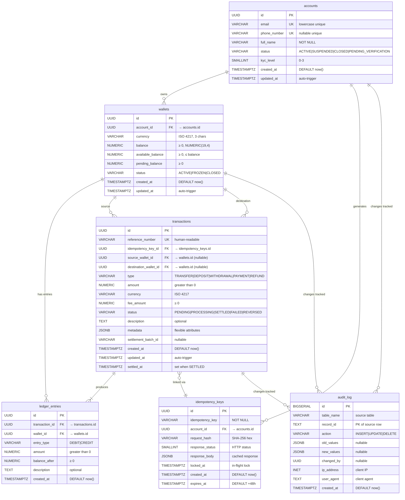
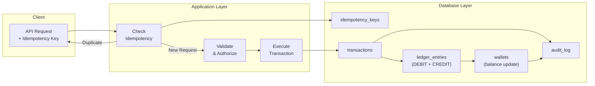

# VietPay — Entity-Relationship Diagram

> **Domain:** Digital Wallet & Payments Platform  
> **Database:** PostgreSQL 15+  
> **Last Updated:** 2026-06-23

## Core Data Model

## Relationship Summary

| Relationship | Cardinality | Description |
|---|---|---|
| `accounts` → `wallets` | 1 : N | Mỗi tài khoản có nhiều ví (mỗi loại tiền tệ một ví) |
| `accounts` → `idempotency_keys` | 1 : N | Mỗi tài khoản tạo nhiều idempotency key |
| `wallets` → `ledger_entries` | 1 : N | Mỗi ví có nhiều bút toán sổ cái |
| `wallets` → `transactions` (source) | 1 : N | Ví nguồn cho nhiều giao dịch |
| `wallets` → `transactions` (dest) | 1 : N | Ví đích cho nhiều giao dịch |
| `transactions` → `ledger_entries` | 1 : 2+ | Mỗi giao dịch tạo ≥ 2 bút toán (DEBIT + CREDIT) |
| `idempotency_keys` → `transactions` | 1 : 0..1 | Mỗi key liên kết tối đa 1 giao dịch |
| Core tables → `audit_log` | 1 : N | Mỗi thay đổi được ghi lại trong audit log |

## Data Flow Overview

## Key Design Decisions

| Decision | Rationale |
|---|---|
| UUID primary keys | Không thể đoán được, an toàn cho API công khai, merge dễ dàng giữa các DB |
| Three-balance model (balance / available / pending) | Hỗ trợ authorization holds, pending settlements |
| Double-entry ledger | Đảm bảo toàn vẹn tài chính: tổng DEBIT luôn = tổng CREDIT |
| Append-only ledger & audit | Tuân thủ PCI-DSS, quy định NHNN Việt Nam |
| Idempotency with TTL | Ngăn chặn giao dịch trùng lặp, tự dọn dẹp key hết hạn |
| Status state machine trigger | Chỉ cho phép chuyển trạng thái hợp lệ, ngăn chặn data corruption |

---

!!! info "Nguồn gốc"
    `vietpay/docs/er-diagram.md`
